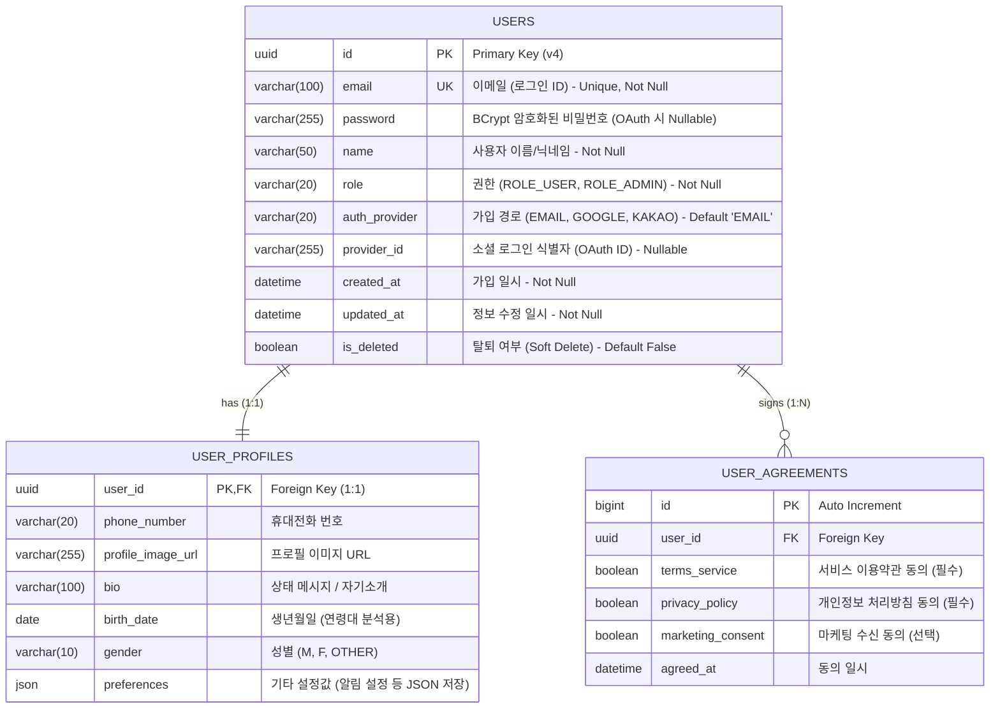

요청하신 **이메일 기반 회원가입 및 확장성을 고려한 ERD**입니다.

`issue-03-auth-user.md`에 명시된 **UUID PK** 요구사항을 반영하였으며, 추후 소셜 로그인(OAuth2) 및 프로필 정보 확장을 위해 테이블을 **인증(Auth)**, **프로필(Profile)**, **약관(Agreement)** 영역으로 분리하여 설계했습니다.

### 📊 ERD (Entity Relationship Diagram)

### 🛠️ 설계 상세 및 확장성 전략

1.  **USERS 테이블 (Authentication)**
    *   **UUID PK**: 보안성 및 분산 환경(MSA) 확장을 고려하여 정수형 ID 대신 UUID v4를 사용합니다.
    *   **Scalability (Social Login)**: `auth_provider`와 `provider_id` 컬럼을 미리 추가하여, 추후 카카오/구글 로그인 도입 시 스키마 변경 없이 데이터를 수용할 수 있습니다. (이메일 가입자는 `auth_provider='EMAIL'`, `provider_id=NULL`)
    *   **Password**: 소셜 로그인 사용자의 경우 비밀번호가 필요 없으므로 Nullable을 허용하거나, 비즈니스 로직에서 별도로 처리합니다.

2.  **USER_PROFILES 테이블 (Extension)**
    *   **관심사의 분리**: 인증 정보(로그인에 필수)와 비즈니스 프로필 정보(자주 조회되거나 변경됨)를 분리했습니다.
    *   가입 시점에는 `USERS` 데이터만 생성하고, 온보딩 과정에서 `USER_PROFILES`를 채우는 방식으로 유연하게 운영 가능합니다.

3.  **USER_AGREEMENTS 테이블 (Legal/Audit)**
    *   약관 동의 여부는 법적 분쟁 시 중요한 데이터이므로 별도 테이블로 관리합니다.
    *   약관이 개정될 경우 사용자가 언제 어떤 버전에 동의했는지 추적하기 용이합니다. (1:N 관계 허용 가능성 고려)