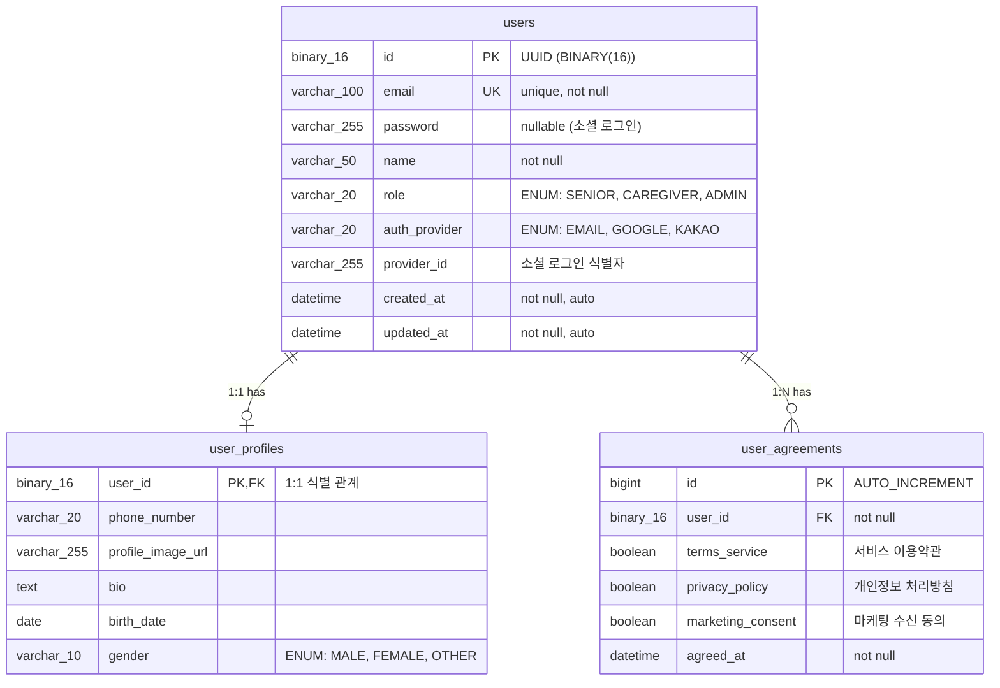
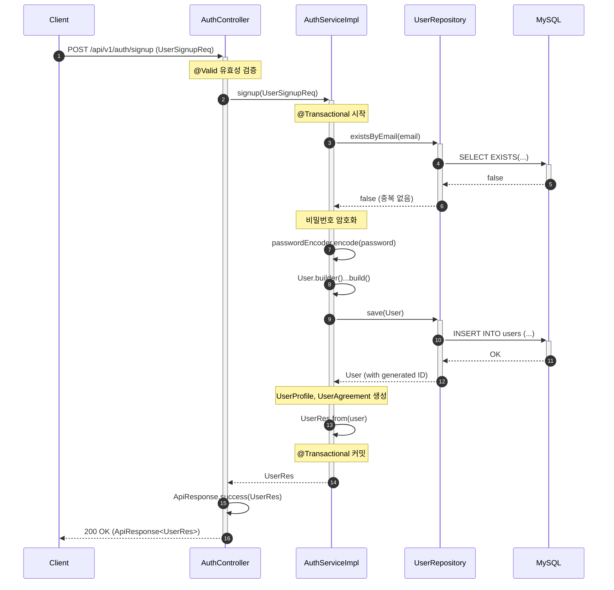

# [BE] Issue-01: Spring Boot 프로젝트 초기 설정 및 환경 구축

## 1. 개요
**SRS 1.5 Assumptions & Constraints** (C-TEC-002, C-TEC-003)에 따라 백엔드 개발 환경을 구축합니다.

## 2. 작업 워크플로우 (설계 및 구현)

| 단계 | 입력(Input) | 도구(Tool) | 출력(Output) |
| --- | --- | --- | --- |
| **Plan** | 기술 스택 요구사항(Java 17, Spring Boot 3.x) | Cursor | build.gradle, 패키지 구조 설계 |
| **Data Schema Design** | DB 연결 정보 | IntelliJ/DBeaver | Local MySQL/H2 연결 설정 |
| **Implementation** | 설정 파일 | Cursor | application.yml, Global Config Code |
| **Review** | 실행 로그 | IDE Console | 서버 정상 부트스트랩 확인 |

## 3. 상세 요구사항 (To-Do)

- [ ] **Project Initialization**
    - Java 17, Spring Boot 3.4.x 기반 프로젝트 생성
    - 의존성 추가: Web, JPA, Security, Validation, Lombok, MySQL Driver, H2(Test용)
- [ ] **Database Configuration**
    - `application.yml` 설정 (Profile 분리: local, dev)
    - MySQL 9.x 연동 설정 (Unicode/UTF-8mb4 지원)
    - JPA Hibernate 설정 (`ddl-auto: validate` or `update` for local)
- [ ] **Standard Package Structure**
    - Layered Architecture 기반 패키지 구조화 (`domain`, `application`, `infrastructure`, `interfaces`)
    - 공통 Response/Error Handling 클래스 작성 (`ApiResponse`, `GlobalExceptionHandler`)
- [ ] **Git & CI Basic**
    - `.gitignore` 설정 (IntelliJ, Java, Gradle, OS Files)

---

## 4. 3-Tier Architecture 구현 가이드

### 4.1 데이터 흐름 개요

Spring Boot 백엔드는 **데이터(Repository) → 로직(Service) → 인터페이스(Controller)** 순서로 구현합니다.

```
┌─────────────────────────────────────────────────────────────────────────┐
│                         Client (Web/Mobile)                             │
└────────────────────────────────┬────────────────────────────────────────┘
                                 │ HTTP Request (JSON)
                                 ▼
┌─────────────────────────────────────────────────────────────────────────┐
│  [Presentation Layer]  Controller (@RestController)                     │
│  ├─ Request 유효성 검증 (@Valid)                                        │
│  ├─ DTO ↔ Entity 변환 위임                                              │
│  └─ HTTP 응답 생성 (ApiResponse)                                        │
└────────────────────────────────┬────────────────────────────────────────┘
                                 │ DTO (Request/Response)
                                 ▼
┌─────────────────────────────────────────────────────────────────────────┐
│  [Business Layer]  Service (@Service, @Transactional)                   │
│  ├─ 비즈니스 로직 수행                                                   │
│  ├─ 트랜잭션 경계 관리                                                   │
│  └─ Entity ↔ DTO 변환                                                   │
└────────────────────────────────┬────────────────────────────────────────┘
                                 │ Entity (Domain Object)
                                 ▼
┌─────────────────────────────────────────────────────────────────────────┐
│  [Persistence Layer]  Repository (@Repository, JpaRepository)           │
│  ├─ 데이터 CRUD 작업                                                    │
│  ├─ Query Method / JPQL / QueryDSL                                     │
│  └─ Entity ↔ Database 매핑                                              │
└────────────────────────────────┬────────────────────────────────────────┘
                                 │ JDBC / SQL
                                 ▼
┌─────────────────────────────────────────────────────────────────────────┐
│                         Database (MySQL 9.x)                            │
└─────────────────────────────────────────────────────────────────────────┘
```

### 4.2 구현 순서 원칙

| 순서 | 계층 | 주요 작업 | 이유 |
|------|------|----------|------|
| **1** | **Entity/Repository** | JPA Entity, Repository 인터페이스 정의 | 데이터 구조가 먼저 확정되어야 로직 설계 가능 |
| **2** | **Service** | 비즈니스 로직, 트랜잭션 관리 | Repository를 주입받아 데이터 조작 로직 구현 |
| **3** | **Controller** | REST API 엔드포인트, 요청/응답 처리 | Service를 주입받아 HTTP 인터페이스 제공 |

---

## 5. ERD (Entity Relationship Diagram)

> **데이터베이스 관점**: 데이터가 어떻게 저장될 것인가?

### 5.1 Core Domain ERD (MVP 단계)



### 5.2 Extended Domain ERD (Post-MVP 확장)

```mermaid
erDiagram
    %% =====================================================
    %% CORE ENTITIES (from MVP)
    %% =====================================================
    users {
        binary_16 id PK
        varchar_100 email UK
        varchar_255 password
        varchar_50 name
        varchar_20 role
        datetime created_at
    }
    
    %% =====================================================
    %% ONBOARDING DOMAIN
    %% =====================================================
    onboarding_sessions {
        binary_16 id PK
        binary_16 user_id FK
        varchar_20 status "in_progress, completed, failed"
        int step_index "현재 단계 (0-based)"
        datetime started_at
        datetime completed_at
        int eta_seconds "예상 잔여 시간"
    }
    
    %% =====================================================
    %% HEALTH REPORT DOMAIN
    %% =====================================================
    health_reports {
        binary_16 id PK
        binary_16 user_id FK
        date period_start
        date period_end
        json metrics "활동/심박/혈압/체중"
        json context "기기/결측 태그"
        datetime generated_at
    }
    
    %% =====================================================
    %% ACTION COACHING DOMAIN
    %% =====================================================
    action_cards {
        binary_16 id PK
        binary_16 user_id FK
        date target_date
        varchar_100 title
        text description
        varchar_20 status "pending, completed, skipped"
        datetime created_at
        datetime completed_at
    }
    
    %% =====================================================
    %% FAMILY BOARD DOMAIN
    %% =====================================================
    family_boards {
        binary_16 id PK
        binary_16 senior_id FK "시니어 사용자"
        datetime created_at
    }
    
    family_board_members {
        bigint id PK
        binary_16 board_id FK
        binary_16 member_id FK
        varchar_20 role "viewer, editor, admin"
        datetime invited_at
        datetime accepted_at
    }
    
    %% =====================================================
    %% DEVICE & PORTAL INTEGRATION
    %% =====================================================
    device_links {
        binary_16 id PK
        binary_16 user_id FK
        varchar_50 vendor "samsung, apple, etc"
        varchar_30 device_type "watch, bp_monitor"
        varchar_255 access_token "암호화 저장"
        varchar_20 status "active, revoked, expired"
        datetime created_at
        datetime updated_at
    }
    
    portal_connections {
        binary_16 id PK
        binary_16 user_id FK
        varchar_100 portal_id "병원/검진 포털 식별자"
        varchar_30 status "active, pending, failed"
        datetime last_sync_at
        varchar_50 error_code
        datetime created_at
    }
    
    %% =====================================================
    %% AUDIT & CONSENT
    %% =====================================================
    consent_records {
        binary_16 id PK
        binary_16 user_id FK
        varchar_30 subject_type "device, portal, family_board"
        binary_16 subject_id
        json consent_scope
        datetime created_at
        datetime revoked_at
    }
    
    audit_logs {
        binary_16 id PK
        binary_16 user_id FK
        binary_16 actor_id FK
        varchar_50 action_type "LOGIN, VIEW_REPORT, etc"
        varchar_50 resource_type "REPORT, FAMILY_BOARD"
        binary_16 resource_id
        json metadata "IP, 위치, 디바이스 정보"
        datetime created_at
    }
    
    %% =====================================================
    %% RELATIONSHIPS
    %% =====================================================
    users ||--o{ onboarding_sessions : "has"
    users ||--o{ health_reports : "owns"
    users ||--o{ action_cards : "receives"
    users ||--o{ device_links : "links"
    users ||--o{ portal_connections : "connects"
    users ||--o{ consent_records : "grants"
    users ||--o{ audit_logs : "generates"
    
    family_boards ||--o{ family_board_members : "has"
    users ||--o| family_boards : "creates (as senior)"
    users ||--o{ family_board_members : "joins (as member)"
```



### 5.3 테이블 설계 원칙

| 원칙 | 설명 | 적용 예시 |
|------|------|----------|
| **UUID PK** | 분산 시스템 확장성, 보안성 향상 | `users.id`, `health_reports.id` |
| **Soft Delete 지양** | MVP에서는 Hard Delete, 필요시 Audit Log로 추적 | `audit_logs` 테이블 활용 |
| **Timestamp Auditing** | 모든 테이블에 `created_at`, `updated_at` 자동 기록 | `BaseTimeEntity` 상속 |
| **ENUM as STRING** | DB에 문자열로 저장하여 순서 변경 안전성 확보 | `@Enumerated(EnumType.STRING)` |
| **JSON Column** | 복잡한 구조/가변 데이터는 JSON으로 유연하게 저장 | `metrics`, `context`, `metadata` |

---

## 6. CLD (Class/Component Logic Diagram)

> **백엔드 서버 관점**: 데이터가 어떻게 가공될 것인가?

### 6.1 전체 아키텍처 다이어그램

```mermaid
classDiagram
    %% =========================================================
    %% LAYER SEPARATION (Layered Architecture)
    %% =========================================================
    
    %% ---------------------------------------------------------
    %% 1. Presentation Layer (interfaces)
    %% ---------------------------------------------------------
    class AuthController {
        <<@RestController>>
        <<@RequestMapping /api/v1/auth>>
        -AuthService authService
        +signup(@Valid UserSignupReq) ResponseEntity~ApiResponse~
        +login(@Valid LoginReq) ResponseEntity~ApiResponse~
        +logout() ResponseEntity~ApiResponse~
    }
    
    class UserController {
        <<@RestController>>
        <<@RequestMapping /api/v1/users>>
        -UserService userService
        +getProfile(@AuthUser UUID userId) ResponseEntity~ApiResponse~
        +updateProfile(UUID userId, @Valid ProfileUpdateReq) ResponseEntity~ApiResponse~
    }
    
    %% ---------------------------------------------------------
    %% 2. Application Layer (application/service)
    %% ---------------------------------------------------------
    class AuthService {
        <<interface>>
        +signup(UserSignupReq req) UserRes
        +login(LoginReq req) TokenRes
        +logout(UUID userId) void
    }
    
    class AuthServiceImpl {
        <<@Service>>
        <<@Transactional>>
        -UserRepository userRepository
        -UserProfileRepository profileRepository
        -UserAgreementRepository agreementRepository
        -PasswordEncoder passwordEncoder
        -JwtTokenProvider tokenProvider
        +signup(UserSignupReq req) UserRes
        +login(LoginReq req) TokenRes
        +logout(UUID userId) void
        -validateDuplicateEmail(String email) void
        -createUserProfile(User user) void
        -recordAgreements(User user, UserAgreements agreements) void
    }
    
    class UserService {
        <<interface>>
        +getProfile(UUID userId) UserProfileRes
        +updateProfile(UUID userId, ProfileUpdateReq req) UserProfileRes
    }
    
    class UserServiceImpl {
        <<@Service>>
        <<@Transactional>>
        -UserRepository userRepository
        -UserProfileRepository profileRepository
        +getProfile(UUID userId) UserProfileRes
        +updateProfile(UUID userId, ProfileUpdateReq req) UserProfileRes
    }
    
    %% ---------------------------------------------------------
    %% 3. Domain Layer (domain/entity)
    %% ---------------------------------------------------------
    class BaseTimeEntity {
        <<@MappedSuperclass>>
        <<Abstract>>
        #LocalDateTime createdAt
        #LocalDateTime updatedAt
    }
    
    class User {
        <<@Entity>>
        -UUID id
        -String email
        -String password
        -String name
        -Role role
        -AuthProvider authProvider
        -String providerId
        -UserProfile userProfile
        +static builder() UserBuilder
    }
    
    class UserProfile {
        <<@Entity>>
        -UUID userId
        -User user
        -String phoneNumber
        -String profileImageUrl
        -String bio
        -LocalDate birthDate
        -Gender gender
    }
    
    class UserAgreement {
        <<@Entity>>
        -Long id
        -User user
        -boolean termsService
        -boolean privacyPolicy
        -boolean marketingConsent
        -LocalDateTime agreedAt
    }
    
    %% ---------------------------------------------------------
    %% 4. Infrastructure Layer (infrastructure/repository)
    %% ---------------------------------------------------------
    class UserRepository {
        <<@Repository>>
        <<extends JpaRepository UUID>>
        +existsByEmail(String email) boolean
        +findByEmail(String email) Optional~User~
    }
    
    class UserProfileRepository {
        <<@Repository>>
        <<extends JpaRepository UUID>>
        +findByUserId(UUID userId) Optional~UserProfile~
    }
    
    class UserAgreementRepository {
        <<@Repository>>
        <<extends JpaRepository Long>>
        +findAllByUserId(UUID userId) List~UserAgreement~
    }
    
    %% ---------------------------------------------------------
    %% 5. DTOs (Data Transfer Objects)
    %% ---------------------------------------------------------
    class UserSignupReq {
        <<Request DTO>>
        -String email
        -String password
        -String name
        -UserAgreementsDto agreements
        +toEntity(String encodedPassword) User
    }
    
    class UserRes {
        <<Response DTO>>
        -UUID userId
        -String email
        -String name
        -LocalDateTime joinedAt
        +static from(User user) UserRes
    }
    
    class LoginReq {
        <<Request DTO>>
        -String email
        -String password
    }
    
    class TokenRes {
        <<Response DTO>>
        -String accessToken
        -String refreshToken
        -long expiresIn
    }
    
    class ApiResponse~T~ {
        <<Generic Response Wrapper>>
        -boolean success
        -String message
        -T data
        -List~ErrorDetail~ errors
        +static success(T data) ApiResponse
        +static error(String message) ApiResponse
    }
    
    %% ---------------------------------------------------------
    %% 6. Common/Utils
    %% ---------------------------------------------------------
    class GlobalExceptionHandler {
        <<@RestControllerAdvice>>
        +handleValidationException(MethodArgumentNotValidException) ApiResponse
        +handleBusinessException(BusinessException) ApiResponse
        +handleException(Exception) ApiResponse
    }
    
    class JwtTokenProvider {
        <<@Component>>
        -String secretKey
        -long accessTokenValidity
        +createAccessToken(UUID userId, Role role) String
        +validateToken(String token) boolean
        +getUserId(String token) UUID
    }
    
    %% =========================================================
    %% RELATIONSHIPS (의존 관계)
    %% =========================================================
    
    %% Controller → Service
    AuthController --> AuthService : uses
    UserController --> UserService : uses
    
    %% Service Implementation
    AuthServiceImpl ..|> AuthService : implements
    UserServiceImpl ..|> UserService : implements
    
    %% Service → Repository
    AuthServiceImpl --> UserRepository : uses
    AuthServiceImpl --> UserProfileRepository : uses
    AuthServiceImpl --> UserAgreementRepository : uses
    UserServiceImpl --> UserRepository : uses
    UserServiceImpl --> UserProfileRepository : uses
    
    %% Entity Inheritance
    User --|> BaseTimeEntity : extends
    UserProfile --|> BaseTimeEntity : extends
    UserAgreement --|> BaseTimeEntity : extends
    
    %% Entity Relationships
    User "1" -- "0..1" UserProfile : owns
    User "1" -- "0..*" UserAgreement : has
    
    %% Repository → Entity
    UserRepository ..> User : manages
    UserProfileRepository ..> UserProfile : manages
    UserAgreementRepository ..> UserAgreement : manages
    
    %% DTO Usage
    AuthController ..> UserSignupReq : receives
    AuthController ..> ApiResponse : returns
    AuthServiceImpl ..> UserRes : creates
```



### 6.2 계층별 책임 및 규칙

| 계층 | 패키지 | 주요 컴포넌트 | 책임 | 규칙 |
|------|--------|--------------|------|------|
| **Presentation** | `interfaces.api` | Controller, DTO | HTTP 요청/응답 처리, 유효성 검증 | Entity 직접 노출 금지, DTO 사용 필수 |
| **Application** | `application.service` | Service Interface/Impl | 비즈니스 로직, 트랜잭션 관리 | @Transactional 적용, 인터페이스 분리 |
| **Domain** | `domain.*.entity` | Entity, Value Object | 도메인 모델, 비즈니스 규칙 | Setter 지양, Builder 패턴 사용 |
| **Infrastructure** | `infrastructure.repository` | Repository | 데이터 접근, 영속성 관리 | JpaRepository 상속, 쿼리 메서드 |

### 6.3 요청 처리 시퀀스 다이어그램



---

## 7. ORM 예제코드 (Object Relational Mapping)

> **연결적 관점**: 서버가 데이터베이스를 어떻게 조회하는가?

### 7.1 Base Entity (공통 Auditing)

```java
package com.pollosseum.domain.common;

import jakarta.persistence.Column;
import jakarta.persistence.EntityListeners;
import jakarta.persistence.MappedSuperclass;
import lombok.Getter;
import org.springframework.data.annotation.CreatedDate;
import org.springframework.data.annotation.LastModifiedDate;
import org.springframework.data.jpa.domain.support.AuditingEntityListener;

import java.time.LocalDateTime;

/**
 * 모든 Entity의 공통 조상 클래스
 * - JPA Auditing을 통해 생성/수정 시각 자동 기록
 * - @EnableJpaAuditing 설정 필요
 */
@Getter
@MappedSuperclass
@EntityListeners(AuditingEntityListener.class)
public abstract class BaseTimeEntity {

    @CreatedDate
    @Column(name = "created_at", nullable = false, updatable = false)
    private LocalDateTime createdAt;

    @LastModifiedDate
    @Column(name = "updated_at", nullable = false)
    private LocalDateTime updatedAt;
}
```

### 7.2 Enum 정의

```java
// Role.java - 사용자 역할
package com.pollosseum.domain.user.entity;

public enum Role {
    SENIOR,     // 시니어 (액티브 시니어)
    CAREGIVER,  // 보호자/가족
    ADMIN       // 관리자
}

// AuthProvider.java - 인증 제공자
package com.pollosseum.domain.user.entity;

public enum AuthProvider {
    EMAIL,      // 이메일 가입
    GOOGLE,     // 구글 소셜 로그인
    KAKAO       // 카카오 소셜 로그인
}

// Gender.java - 성별
package com.pollosseum.domain.user.entity;

public enum Gender {
    MALE,
    FEMALE,
    OTHER
}
```

### 7.3 User Entity (핵심 도메인)

```java
package com.pollosseum.domain.user.entity;

import com.pollosseum.domain.common.BaseTimeEntity;
import jakarta.persistence.*;
import lombok.*;

import java.util.UUID;

/**
 * 사용자 Entity - 인증 및 사용자 정보의 핵심
 * 
 * @Table users
 * @PK id (UUID, BINARY(16))
 */
@Entity
@Table(name = "users", 
    indexes = {
        @Index(name = "idx_users_email", columnList = "email")
    }
)
@Getter
@NoArgsConstructor(access = AccessLevel.PROTECTED) // JPA 프록시 생성용
public class User extends BaseTimeEntity {

    @Id
    @GeneratedValue(strategy = GenerationType.UUID)
    @Column(columnDefinition = "BINARY(16)")
    private UUID id;

    @Column(nullable = false, unique = true, length = 100)
    private String email;

    @Column(length = 255) // 소셜 로그인 시 null 허용
    private String password;

    @Column(nullable = false, length = 50)
    private String name;

    @Enumerated(EnumType.STRING)
    @Column(nullable = false, length = 20)
    private Role role;

    @Enumerated(EnumType.STRING)
    @Column(name = "auth_provider", nullable = false, length = 20)
    private AuthProvider authProvider;

    @Column(name = "provider_id", length = 255)
    private String providerId;

    // 1:1 양방향 매핑 (선택적)
    @OneToOne(mappedBy = "user", cascade = CascadeType.ALL, fetch = FetchType.LAZY)
    private UserProfile userProfile;

    // ========================================
    // 생성자 (Builder 패턴)
    // ========================================
    @Builder
    public User(String email, String password, String name, 
                Role role, AuthProvider authProvider, String providerId) {
        this.email = email;
        this.password = password;
        this.name = name;
        this.role = role;
        this.authProvider = authProvider;
        this.providerId = providerId;
    }

    // ========================================
    // 비즈니스 메서드 (도메인 로직)
    // ========================================
    
    /**
     * 이메일 가입 사용자 생성 팩토리 메서드
     */
    public static User createEmailUser(String email, String encodedPassword, 
                                        String name, Role role) {
        return User.builder()
                .email(email)
                .password(encodedPassword)
                .name(name)
                .role(role)
                .authProvider(AuthProvider.EMAIL)
                .build();
    }

    /**
     * 소셜 로그인 사용자 생성 팩토리 메서드
     */
    public static User createSocialUser(String email, String name, Role role,
                                         AuthProvider provider, String providerId) {
        return User.builder()
                .email(email)
                .name(name)
                .role(role)
                .authProvider(provider)
                .providerId(providerId)
                .build();
    }

    /**
     * 비밀번호 변경 (도메인 이벤트 발생 가능)
     */
    public void changePassword(String newEncodedPassword) {
        this.password = newEncodedPassword;
    }

    /**
     * 프로필 연결
     */
    public void linkProfile(UserProfile profile) {
        this.userProfile = profile;
    }
}
```

### 7.4 UserProfile Entity (1:1 식별 관계)

```java
package com.pollosseum.domain.user.entity;

import com.pollosseum.domain.common.BaseTimeEntity;
import jakarta.persistence.*;
import lombok.*;

import java.time.LocalDate;
import java.util.UUID;

/**
 * 사용자 프로필 Entity
 * - User와 1:1 식별 관계 (@MapsId)
 * - User의 PK를 그대로 PK로 사용하여 조인 성능 최적화
 */
@Entity
@Table(name = "user_profiles")
@Getter
@NoArgsConstructor(access = AccessLevel.PROTECTED)
public class UserProfile extends BaseTimeEntity {

    @Id
    @Column(name = "user_id", columnDefinition = "BINARY(16)")
    private UUID userId;

    @MapsId // User의 PK를 이 테이블의 PK로 공유
    @OneToOne(fetch = FetchType.LAZY)
    @JoinColumn(name = "user_id")
    private User user;

    @Column(name = "phone_number", length = 20)
    private String phoneNumber;

    @Column(name = "profile_image_url", length = 255)
    private String profileImageUrl;

    @Column(columnDefinition = "TEXT")
    private String bio;

    @Column(name = "birth_date")
    private LocalDate birthDate;

    @Enumerated(EnumType.STRING)
    @Column(length = 10)
    private Gender gender;

    // ========================================
    // 생성자 (Builder 패턴)
    // ========================================
    @Builder
    public UserProfile(User user, String phoneNumber, String profileImageUrl,
                       String bio, LocalDate birthDate, Gender gender) {
        this.user = user;
        this.userId = user.getId();
        this.phoneNumber = phoneNumber;
        this.profileImageUrl = profileImageUrl;
        this.bio = bio;
        this.birthDate = birthDate;
        this.gender = gender;
    }

    // ========================================
    // 비즈니스 메서드
    // ========================================
    
    /**
     * 프로필 정보 업데이트
     */
    public void update(String phoneNumber, String profileImageUrl, 
                       String bio, LocalDate birthDate, Gender gender) {
        if (phoneNumber != null) this.phoneNumber = phoneNumber;
        if (profileImageUrl != null) this.profileImageUrl = profileImageUrl;
        if (bio != null) this.bio = bio;
        if (birthDate != null) this.birthDate = birthDate;
        if (gender != null) this.gender = gender;
    }
}
```

### 7.5 UserAgreement Entity (1:N 관계)

```java
package com.pollosseum.domain.user.entity;

import com.pollosseum.domain.common.BaseTimeEntity;
import jakarta.persistence.*;
import lombok.*;

import java.time.LocalDateTime;

/**
 * 사용자 약관 동의 기록 Entity
 * - 약관 동의 이력 추적 (법적 요구사항)
 * - 동의 철회 시 새 레코드 생성 (이력 보존)
 */
@Entity
@Table(name = "user_agreements",
    indexes = {
        @Index(name = "idx_user_agreements_user_id", columnList = "user_id")
    }
)
@Getter
@NoArgsConstructor(access = AccessLevel.PROTECTED)
public class UserAgreement extends BaseTimeEntity {

    @Id
    @GeneratedValue(strategy = GenerationType.IDENTITY)
    private Long id;

    @ManyToOne(fetch = FetchType.LAZY)
    @JoinColumn(name = "user_id", nullable = false)
    private User user;

    @Column(name = "terms_service", nullable = false)
    private boolean termsService; // 서비스 이용약관 (필수)

    @Column(name = "privacy_policy", nullable = false)
    private boolean privacyPolicy; // 개인정보 처리방침 (필수)

    @Column(name = "marketing_consent", nullable = false)
    private boolean marketingConsent; // 마케팅 수신 동의 (선택)

    @Column(name = "agreed_at", nullable = false)
    private LocalDateTime agreedAt;

    // ========================================
    // 생성자 (Builder 패턴)
    // ========================================
    @Builder
    public UserAgreement(User user, boolean termsService, 
                         boolean privacyPolicy, boolean marketingConsent) {
        this.user = user;
        this.termsService = termsService;
        this.privacyPolicy = privacyPolicy;
        this.marketingConsent = marketingConsent;
        this.agreedAt = LocalDateTime.now();
    }

    // ========================================
    // 팩토리 메서드
    // ========================================
    
    /**
     * 회원가입 시 약관 동의 기록 생성
     */
    public static UserAgreement createForSignup(User user, boolean termsService,
                                                 boolean privacyPolicy, 
                                                 boolean marketingConsent) {
        // 필수 약관 검증
        if (!termsService || !privacyPolicy) {
            throw new IllegalArgumentException("필수 약관에 동의해야 합니다.");
        }
        
        return UserAgreement.builder()
                .user(user)
                .termsService(termsService)
                .privacyPolicy(privacyPolicy)
                .marketingConsent(marketingConsent)
                .build();
    }
}
```

### 7.6 Repository 인터페이스

```java
// ========================================
// UserRepository.java
// ========================================
package com.pollosseum.infrastructure.repository;

import com.pollosseum.domain.user.entity.User;
import org.springframework.data.jpa.repository.JpaRepository;
import org.springframework.data.jpa.repository.Query;
import org.springframework.data.repository.query.Param;
import org.springframework.stereotype.Repository;

import java.util.Optional;
import java.util.UUID;

/**
 * User Entity Repository
 * - Spring Data JPA 기반 CRUD 자동 생성
 * - 커스텀 쿼리 메서드 정의
 */
@Repository
public interface UserRepository extends JpaRepository<User, UUID> {

    /**
     * 이메일 중복 검사
     * - Generated Query: SELECT EXISTS(SELECT 1 FROM users WHERE email = ?)
     */
    boolean existsByEmail(String email);

    /**
     * 이메일로 사용자 조회 (로그인용)
     */
    Optional<User> findByEmail(String email);

    /**
     * 소셜 로그인 사용자 조회
     */
    @Query("SELECT u FROM User u WHERE u.authProvider = :provider AND u.providerId = :providerId")
    Optional<User> findBySocialProvider(@Param("provider") String provider, 
                                        @Param("providerId") String providerId);

    /**
     * 사용자 + 프로필 한번에 조회 (N+1 방지)
     */
    @Query("SELECT u FROM User u LEFT JOIN FETCH u.userProfile WHERE u.id = :userId")
    Optional<User> findByIdWithProfile(@Param("userId") UUID userId);
}

// ========================================
// UserProfileRepository.java
// ========================================
package com.pollosseum.infrastructure.repository;

import com.pollosseum.domain.user.entity.UserProfile;
import org.springframework.data.jpa.repository.JpaRepository;
import org.springframework.stereotype.Repository;

import java.util.Optional;
import java.util.UUID;

@Repository
public interface UserProfileRepository extends JpaRepository<UserProfile, UUID> {

    /**
     * 사용자 ID로 프로필 조회
     */
    Optional<UserProfile> findByUserId(UUID userId);
}

// ========================================
// UserAgreementRepository.java
// ========================================
package com.pollosseum.infrastructure.repository;

import com.pollosseum.domain.user.entity.UserAgreement;
import org.springframework.data.jpa.repository.JpaRepository;
import org.springframework.data.jpa.repository.Query;
import org.springframework.data.repository.query.Param;
import org.springframework.stereotype.Repository;

import java.util.List;
import java.util.Optional;
import java.util.UUID;

@Repository
public interface UserAgreementRepository extends JpaRepository<UserAgreement, Long> {

    /**
     * 사용자의 모든 약관 동의 이력 조회 (시간순 정렬)
     */
    List<UserAgreement> findAllByUserIdOrderByAgreedAtDesc(UUID userId);

    /**
     * 사용자의 최신 약관 동의 기록 조회
     */
    @Query("SELECT ua FROM UserAgreement ua WHERE ua.user.id = :userId ORDER BY ua.agreedAt DESC LIMIT 1")
    Optional<UserAgreement> findLatestByUserId(@Param("userId") UUID userId);
}
```

### 7.7 Data Access 활용 예제 (Service Layer)

```java
package com.pollosseum.application.service;

import com.pollosseum.domain.user.entity.*;
import com.pollosseum.infrastructure.repository.*;
import com.pollosseum.interfaces.api.dto.*;
import lombok.RequiredArgsConstructor;
import org.springframework.security.crypto.password.PasswordEncoder;
import org.springframework.stereotype.Service;
import org.springframework.transaction.annotation.Transactional;

import java.util.UUID;

/**
 * 인증 서비스 구현체
 * - Repository를 통한 데이터 접근 예제
 * - @Transactional로 트랜잭션 경계 관리
 */
@Service
@RequiredArgsConstructor
@Transactional(readOnly = true) // 기본 읽기 전용, 쓰기 메서드에만 @Transactional
public class AuthServiceImpl implements AuthService {

    private final UserRepository userRepository;
    private final UserProfileRepository userProfileRepository;
    private final UserAgreementRepository userAgreementRepository;
    private final PasswordEncoder passwordEncoder;

    /**
     * 회원가입 처리
     * 
     * 데이터 흐름:
     * 1. 이메일 중복 검사 (Repository → DB)
     * 2. 비밀번호 암호화 (Service 내부)
     * 3. User Entity 생성 및 저장 (Service → Repository → DB)
     * 4. UserProfile 생성 및 저장
     * 5. UserAgreement 생성 및 저장
     * 6. Response DTO 변환 후 반환
     */
    @Override
    @Transactional // 쓰기 트랜잭션
    public UserRes signup(UserSignupReq request) {
        
        // 1. 이메일 중복 검사
        if (userRepository.existsByEmail(request.getEmail())) {
            throw new DuplicateEmailException("이미 가입된 이메일입니다.");
        }

        // 2. 비밀번호 암호화
        String encodedPassword = passwordEncoder.encode(request.getPassword());

        // 3. User Entity 생성 및 저장
        User user = User.createEmailUser(
            request.getEmail(),
            encodedPassword,
            request.getName(),
            Role.SENIOR // 기본 역할
        );
        User savedUser = userRepository.save(user);

        // 4. UserProfile 생성 (빈 프로필)
        UserProfile profile = UserProfile.builder()
            .user(savedUser)
            .build();
        userProfileRepository.save(profile);
        savedUser.linkProfile(profile);

        // 5. 약관 동의 기록
        UserAgreement agreement = UserAgreement.createForSignup(
            savedUser,
            request.getAgreements().isTermsService(),
            request.getAgreements().isPrivacyPolicy(),
            request.getAgreements().isMarketingConsent()
        );
        userAgreementRepository.save(agreement);

        // 6. Response DTO 변환
        return UserRes.from(savedUser);
    }

    /**
     * 사용자 프로필 조회
     * - Fetch Join으로 N+1 문제 방지
     */
    @Override
    public UserProfileRes getProfile(UUID userId) {
        User user = userRepository.findByIdWithProfile(userId)
            .orElseThrow(() -> new UserNotFoundException("사용자를 찾을 수 없습니다."));
        
        return UserProfileRes.from(user, user.getUserProfile());
    }
}
```

### 7.8 JPA 설정 (application.yml)

```yaml
# application.yml
spring:
  profiles:
    active: local

---
# Local Profile
spring:
  config:
    activate:
      on-profile: local

  datasource:
    url: jdbc:mysql://localhost:3306/pollosseum_dev?useSSL=false&serverTimezone=Asia/Seoul&characterEncoding=UTF-8
    username: ${DB_USERNAME:root}
    password: ${DB_PASSWORD:password}
    driver-class-name: com.mysql.cj.jdbc.Driver
    
    hikari:
      maximum-pool-size: 10
      minimum-idle: 5
      connection-timeout: 30000

  jpa:
    hibernate:
      ddl-auto: update  # Local: update, Production: validate
    properties:
      hibernate:
        format_sql: true
        show_sql: true
        default_batch_fetch_size: 100
        dialect: org.hibernate.dialect.MySQLDialect
    open-in-view: false  # OSIV 비활성화 (성능 최적화)

  # JPA Auditing 활성화를 위한 설정은 @EnableJpaAuditing 어노테이션 사용

---
# Dev Profile  
spring:
  config:
    activate:
      on-profile: dev

  datasource:
    url: jdbc:mysql://${DB_HOST}:3306/${DB_NAME}?useSSL=true&serverTimezone=Asia/Seoul
    username: ${DB_USERNAME}
    password: ${DB_PASSWORD}

  jpa:
    hibernate:
      ddl-auto: validate  # 운영 환경: 스키마 검증만
    properties:
      hibernate:
        show_sql: false
```

### 7.9 JPA Auditing 설정

```java
package com.pollosseum.infrastructure.config;

import org.springframework.context.annotation.Configuration;
import org.springframework.data.jpa.repository.config.EnableJpaAuditing;

/**
 * JPA Auditing 설정
 * - BaseTimeEntity의 @CreatedDate, @LastModifiedDate 자동 주입 활성화
 */
@Configuration
@EnableJpaAuditing
public class JpaAuditingConfig {
}
```

---

## 8. 패키지 구조

```
src/main/java/com/pollosseum/
├── PollossemumApplication.java          # Spring Boot Main
│
├── domain/                               # 도메인 계층
│   ├── common/
│   │   └── BaseTimeEntity.java          # 공통 Auditing Entity
│   │
│   └── user/
│       └── entity/
│           ├── User.java
│           ├── UserProfile.java
│           ├── UserAgreement.java
│           ├── Role.java
│           ├── AuthProvider.java
│           └── Gender.java
│
├── application/                          # 애플리케이션 계층
│   └── service/
│       ├── AuthService.java             # Interface
│       ├── AuthServiceImpl.java         # Implementation
│       ├── UserService.java
│       └── UserServiceImpl.java
│
├── infrastructure/                       # 인프라스트럭처 계층
│   ├── repository/
│   │   ├── UserRepository.java
│   │   ├── UserProfileRepository.java
│   │   └── UserAgreementRepository.java
│   │
│   └── config/
│       ├── JpaAuditingConfig.java
│       └── SecurityConfig.java
│
└── interfaces/                           # 인터페이스 계층
    ├── api/
    │   ├── AuthController.java
    │   └── UserController.java
    │
    ├── dto/
    │   ├── request/
    │   │   ├── UserSignupReq.java
    │   │   ├── LoginReq.java
    │   │   └── ProfileUpdateReq.java
    │   │
    │   └── response/
    │       ├── UserRes.java
    │       ├── UserProfileRes.java
    │       ├── TokenRes.java
    │       └── ApiResponse.java
    │
    └── common/
        ├── GlobalExceptionHandler.java
        └── ErrorCode.java
```

---

## 9. 구현 체크포인트

### 9.1 Entity 설계 체크리스트

- [ ] `@NoArgsConstructor(access = AccessLevel.PROTECTED)` - JPA 스펙 준수, 무분별한 객체 생성 방지
- [ ] `@Builder` - 생성자 대신 빌더 패턴으로 가독성 향상
- [ ] `@Enumerated(EnumType.STRING)` - Enum 순서 변경 시 데이터 정합성 보호
- [ ] `@MapsId` (1:1 관계) - 식별 관계로 조인 성능 최적화
- [ ] `@Index` - 조회 빈도 높은 컬럼에 인덱스 추가

### 9.2 Repository 설계 체크리스트

- [ ] Query Method 네이밍 규칙 준수 (`findBy*`, `existsBy*`, `countBy*`)
- [ ] `@Query` JPQL - 복잡한 조회 로직
- [ ] Fetch Join - N+1 문제 방지
- [ ] Pagination 지원 (`Pageable`, `Page<T>`)

### 9.3 Service 설계 체크리스트

- [ ] Interface/Implementation 분리 - 결합도 감소
- [ ] `@Transactional(readOnly = true)` 기본, 쓰기 메서드만 `@Transactional`
- [ ] DTO ↔ Entity 변환 로직 캡슐화
- [ ] 비즈니스 예외 처리 (`BusinessException` 계층)

---

## 10. 참고 자료

- SRS 1.5 Assumptions & Constraints
- `studio/300-java-spring-cursor-rules.mdc`
- `studio/Tasks/github-issue/issue-03-api-plan-Entity.md`
- `studio/Tasks/github-issue/issue-03-api-plan-CLD.md`
