# [BE] Issue-02: 통합 데이터 모델링 (ERD) 설계

## 1. 개요
**SRS 6.2 Entity & Data Model**을 기반으로 전체 시스템의 데이터 모델(ERD)을 설계하고 JPA Entity로 매핑할 준비를 합니다.

## 2. 작업 워크플로우 (설계 및 구현)

| 단계 | 입력(Input) | 도구(Tool) | 출력(Output) |
| --- | --- | --- | --- |
| **Plan** | SRS 6.2 Data Model | Cursor | 도메인별 엔티티 목록 정리 |
| **Data Schema Design** | 엔티티 목록 | Mermaid.js | **전체 ERD (시각화)** |
| **Interaction Design** | Mermaid 코드 | Cursor | **Base Entity 클래스 설계** |
| **Review** | ERD 다이어그램 | Team Review | 데이터 정합성 검증 |

## 3. 상세 요구사항 (To-Do)

- [ ] **Mermaid ERD 작성**
    - SRS 6.2.1 ~ 6.2.9 참조하여 Mermaid 문법으로 ERD 작성
    - 포함 도메인: User, Profile, Onboarding, Report, Action, FamilyBoard, Consent, AuditLog, DeviceLink
    - 관계(Relation) 정의 (1:1, 1:N, N:M)
- [ ] **논리적 설계 검증**
    - 정규화 위배 사항 점검
    - 성능 고려한 인덱스 키 후보 선정
    - JSON 타입 컬럼(`metrics`, `context`, `metadata`) 정의
- [ ] **Audit(감사) 필드 설계**
    - `BaseTimeEntity` (createdAt, updatedAt) 설계
    - `BaseUserEntity` (createdBy, updatedBy) 설계 (Optional)

---

## 4. 3-Tier Architecture 데이터 계층 설계

### 4.1 데이터 모델링 원칙

```
┌─────────────────────────────────────────────────────────────────────────┐
│                     데이터 모델링 3단계 접근법                            │
├─────────────────────────────────────────────────────────────────────────┤
│  1. 개념적 모델링 (Conceptual)                                          │
│     └─ 비즈니스 도메인 식별: User, Report, Action, FamilyBoard...      │
│                                                                         │
│  2. 논리적 모델링 (Logical)                                             │
│     └─ 테이블, 컬럼, 관계, 제약조건 정의 (ERD)                          │
│                                                                         │
│  3. 물리적 모델링 (Physical)                                            │
│     └─ 인덱스, 파티션, 데이터 타입 최적화 (MySQL DDL)                   │
└─────────────────────────────────────────────────────────────────────────┘
```

### 4.2 도메인별 엔티티 목록

| 도메인 | 엔티티 | 설명 | SRS 참조 |
|--------|--------|------|----------|
| **User** | `users` | 사용자 기본 정보 (인증 핵심) | 6.2.1 |
| **User** | `user_profiles` | 사용자 확장 프로필 (1:1) | 6.2.1 |
| **User** | `user_agreements` | 약관 동의 이력 (1:N) | 6.2.6 |
| **Onboarding** | `onboarding_sessions` | 온보딩 상태 관리 | 6.2.2 |
| **Report** | `health_reports` | 1장 요약 리포트 | 6.2.3 |
| **Action** | `action_cards` | 일일 행동 카드 | 6.2.4 |
| **FamilyBoard** | `family_boards` | 가족 보드 | 6.2.5 |
| **FamilyBoard** | `family_board_members` | 보드 멤버/역할 | 6.2.5 |
| **Integration** | `device_links` | 디바이스 연동 정보 | 6.2.8 |
| **Integration** | `portal_connections` | 병원 포털 연동 | 6.2.9 |
| **Audit** | `consent_records` | 동의 기록 | 6.2.6 |
| **Audit** | `audit_logs` | 감사 로그 | 6.2.7 |

---

## 5. ERD (Entity Relationship Diagram)

> **전체 시스템 데이터베이스 관점**: 모든 도메인의 데이터 구조 및 관계

### 5.1 전체 시스템 ERD (Integrated View)

```mermaid
erDiagram
    %% =====================================================
    %% 1. USER DOMAIN (인증/회원)
    %% =====================================================
    users {
        binary_16 id PK "UUID"
        varchar_100 email UK "unique, not null"
        varchar_255 password "nullable (소셜 로그인)"
        varchar_50 name "not null"
        varchar_20 role "SENIOR, CAREGIVER, ADMIN"
        varchar_20 auth_provider "EMAIL, GOOGLE, KAKAO"
        varchar_255 provider_id "소셜 식별자"
        datetime created_at "not null"
        datetime updated_at "not null"
    }

    user_profiles {
        binary_16 user_id PK,FK "1:1 식별관계"
        varchar_20 phone_number
        varchar_255 profile_image_url
        text bio
        date birth_date
        varchar_10 gender "MALE, FEMALE, OTHER"
        datetime created_at
        datetime updated_at
    }

    user_agreements {
        bigint id PK "AUTO_INCREMENT"
        binary_16 user_id FK
        boolean terms_service "필수"
        boolean privacy_policy "필수"
        boolean marketing_consent "선택"
        datetime agreed_at
    }

    %% =====================================================
    %% 2. ONBOARDING DOMAIN (온보딩)
    %% =====================================================
    onboarding_sessions {
        binary_16 id PK "UUID"
        binary_16 user_id FK
        varchar_20 status "IN_PROGRESS, COMPLETED, FAILED"
        int step_index "0-based 단계"
        int total_steps "전체 단계 수"
        json step_data "단계별 입력 데이터"
        int eta_seconds "예상 잔여 시간"
        datetime started_at
        datetime completed_at
        datetime created_at
        datetime updated_at
    }

    %% =====================================================
    %% 3. REPORT DOMAIN (건강 리포트)
    %% =====================================================
    health_reports {
        binary_16 id PK "UUID"
        binary_16 user_id FK
        date period_start "리포트 기간 시작"
        date period_end "리포트 기간 종료"
        json metrics "활동/심박/혈압/체중"
        json context "기기/결측 태그"
        varchar_20 status "DRAFT, GENERATED, VIEWED"
        varchar_255 pdf_url "PDF 저장 경로"
        datetime generated_at
        datetime created_at
        datetime updated_at
    }

    %% =====================================================
    %% 4. ACTION DOMAIN (행동 카드)
    %% =====================================================
    action_cards {
        binary_16 id PK "UUID"
        binary_16 user_id FK
        date target_date "대상 날짜"
        varchar_50 category "EXERCISE, MEDICATION, LIFESTYLE"
        varchar_100 title
        text description
        varchar_20 status "PENDING, COMPLETED, SKIPPED"
        int priority "1-3 우선순위"
        datetime completed_at
        datetime created_at
        datetime updated_at
    }

    %% =====================================================
    %% 5. FAMILY BOARD DOMAIN (가족 보드)
    %% =====================================================
    family_boards {
        binary_16 id PK "UUID"
        binary_16 senior_id FK "시니어 사용자"
        varchar_100 name "보드 이름"
        datetime last_activity_at "마지막 활동"
        datetime created_at
        datetime updated_at
    }

    family_board_members {
        bigint id PK "AUTO_INCREMENT"
        binary_16 board_id FK
        binary_16 member_id FK "참여 사용자"
        varchar_20 role "VIEWER, EDITOR, ADMIN"
        varchar_100 invite_code "초대 코드"
        datetime invited_at
        datetime accepted_at
        datetime created_at
        datetime updated_at
    }

    %% =====================================================
    %% 6. INTEGRATION DOMAIN (외부 연동)
    %% =====================================================
    device_links {
        binary_16 id PK "UUID"
        binary_16 user_id FK
        varchar_50 vendor "samsung, apple, fitbit"
        varchar_30 device_type "watch, bp_monitor, scale"
        varchar_255 access_token "암호화 저장"
        varchar_255 refresh_token "암호화 저장"
        datetime token_expires_at
        varchar_20 status "ACTIVE, REVOKED, EXPIRED"
        datetime last_sync_at
        datetime created_at
        datetime updated_at
    }

    portal_connections {
        binary_16 id PK "UUID"
        binary_16 user_id FK
        varchar_100 portal_id "병원/검진 포털 ID"
        varchar_100 portal_name "포털 이름"
        varchar_30 status "ACTIVE, PENDING, FAILED, UNSUPPORTED"
        varchar_50 error_code
        datetime last_sync_at
        datetime created_at
        datetime updated_at
    }

    %% =====================================================
    %% 7. CONSENT & AUDIT DOMAIN (동의/감사)
    %% =====================================================
    consent_records {
        binary_16 id PK "UUID"
        binary_16 user_id FK
        varchar_30 subject_type "DEVICE, PORTAL, FAMILY_BOARD"
        binary_16 subject_id "대상 엔티티 ID"
        json consent_scope "동의 범위 상세"
        datetime created_at
        datetime revoked_at
    }

    audit_logs {
        binary_16 id PK "UUID"
        binary_16 user_id FK "대상 사용자"
        binary_16 actor_id FK "행위자"
        varchar_50 action_type "LOGIN, VIEW_REPORT, UPDATE_PROFILE"
        varchar_50 resource_type "USER, REPORT, FAMILY_BOARD"
        binary_16 resource_id
        json metadata "IP, 위치, 디바이스 정보"
        varchar_20 result "SUCCESS, FAILURE"
        datetime created_at
    }

    %% =====================================================
    %% RELATIONSHIPS (관계 정의)
    %% =====================================================
    
    %% User Domain
    users ||--o| user_profiles : "1:1 has"
    users ||--o{ user_agreements : "1:N has"
    
    %% Onboarding
    users ||--o{ onboarding_sessions : "1:N creates"
    
    %% Report
    users ||--o{ health_reports : "1:N owns"
    
    %% Action
    users ||--o{ action_cards : "1:N receives"
    
    %% Family Board
    users ||--o| family_boards : "1:1 creates (as senior)"
    family_boards ||--o{ family_board_members : "1:N has"
    users ||--o{ family_board_members : "1:N joins"
    
    %% Integration
    users ||--o{ device_links : "1:N links"
    users ||--o{ portal_connections : "1:N connects"
    
    %% Consent & Audit
    users ||--o{ consent_records : "1:N grants"
    users ||--o{ audit_logs : "1:N generates"
```



### 5.2 도메인별 ERD (Domain-Specific)

#### 5.2.1 User Domain ERD


#### 5.2.2 Family Board Domain ERD


### 5.3 테이블 설계 원칙

| 원칙 | 설명 | 적용 예시 |
|------|------|----------|
| **UUID Primary Key** | 분산 환경 확장성, URL 노출 시 보안성 | `users.id`, `health_reports.id` |
| **BINARY(16) 저장** | UUID를 바이너리로 저장하여 공간/성능 최적화 | `@Column(columnDefinition = "BINARY(16)")` |
| **ENUM as STRING** | 순서 변경에도 안전한 문자열 저장 | `@Enumerated(EnumType.STRING)` |
| **JSON Column** | 가변 구조 데이터 유연하게 저장 | `metrics`, `context`, `metadata` |
| **Soft Delete 지양** | MVP에서는 Hard Delete + Audit Log로 추적 | `audit_logs` 테이블 |
| **Timestamp Auditing** | 모든 테이블 `created_at`, `updated_at` 자동 | `BaseTimeEntity` 상속 |
| **Index Strategy** | 검색/조인 빈번 컬럼에 인덱스 | `email`, `user_id`, `target_date` |

### 5.4 인덱스 설계

```sql
-- User Domain Indexes
CREATE INDEX idx_users_email ON users(email);
CREATE INDEX idx_users_auth_provider ON users(auth_provider, provider_id);

-- Onboarding Indexes
CREATE INDEX idx_onboarding_user_status ON onboarding_sessions(user_id, status);

-- Report Indexes
CREATE INDEX idx_reports_user_period ON health_reports(user_id, period_start, period_end);

-- Action Card Indexes
CREATE INDEX idx_actions_user_date ON action_cards(user_id, target_date);
CREATE INDEX idx_actions_date_status ON action_cards(target_date, status);

-- Family Board Indexes
CREATE INDEX idx_board_members_board ON family_board_members(board_id);
CREATE INDEX idx_board_members_member ON family_board_members(member_id);
CREATE UNIQUE INDEX idx_board_invite_code ON family_board_members(invite_code);

-- Integration Indexes
CREATE INDEX idx_device_user_vendor ON device_links(user_id, vendor);
CREATE INDEX idx_portal_user ON portal_connections(user_id);

-- Audit Indexes
CREATE INDEX idx_audit_user_action ON audit_logs(user_id, action_type);
CREATE INDEX idx_audit_created ON audit_logs(created_at);
```

---

## 6. CLD (Class/Component Logic Diagram)

> **ORM 계층 관점**: Entity 클래스 간의 관계 및 상속 구조

### 6.1 Entity 상속 구조


### 6.2 Enum 정의 목록


---

## 7. ORM 예제코드 (Base Entity 설계)

> **JPA 공통 엔티티**: 모든 도메인 엔티티의 기반 클래스

### 7.1 BaseTimeEntity (Auditing 기본)

```java
package com.pollosseum.domain.common;

import jakarta.persistence.Column;
import jakarta.persistence.EntityListeners;
import jakarta.persistence.MappedSuperclass;
import lombok.Getter;
import org.springframework.data.annotation.CreatedDate;
import org.springframework.data.annotation.LastModifiedDate;
import org.springframework.data.jpa.domain.support.AuditingEntityListener;

import java.time.LocalDateTime;

/**
 * 모든 Entity의 공통 조상 클래스
 * - JPA Auditing을 통해 생성/수정 시각 자동 기록
 * 
 * 사용법: 모든 Entity에서 extends BaseTimeEntity
 * 설정 필요: @EnableJpaAuditing in Configuration
 */
@Getter
@MappedSuperclass
@EntityListeners(AuditingEntityListener.class)
public abstract class BaseTimeEntity {

    @CreatedDate
    @Column(name = "created_at", nullable = false, updatable = false)
    private LocalDateTime createdAt;

    @LastModifiedDate
    @Column(name = "updated_at", nullable = false)
    private LocalDateTime updatedAt;
}
```

### 7.2 BaseUserAuditEntity (사용자 감사 확장)

```java
package com.pollosseum.domain.common;

import jakarta.persistence.Column;
import jakarta.persistence.EntityListeners;
import jakarta.persistence.MappedSuperclass;
import lombok.Getter;
import org.springframework.data.annotation.CreatedBy;
import org.springframework.data.annotation.LastModifiedBy;
import org.springframework.data.jpa.domain.support.AuditingEntityListener;

import java.util.UUID;

/**
 * 사용자 추적이 필요한 Entity의 조상 클래스
 * - 생성자/수정자 ID 자동 기록
 * 
 * 사용법: extends BaseUserAuditEntity
 * 설정 필요: AuditorAware<UUID> Bean 등록
 */
@Getter
@MappedSuperclass
@EntityListeners(AuditingEntityListener.class)
public abstract class BaseUserAuditEntity extends BaseTimeEntity {

    @CreatedBy
    @Column(name = "created_by", updatable = false, columnDefinition = "BINARY(16)")
    private UUID createdBy;

    @LastModifiedBy
    @Column(name = "updated_by", columnDefinition = "BINARY(16)")
    private UUID updatedBy;
}
```

### 7.3 AuditorAware 구현 (사용자 감사 지원)

```java
package com.pollosseum.infrastructure.config;

import org.springframework.data.domain.AuditorAware;
import org.springframework.security.core.Authentication;
import org.springframework.security.core.context.SecurityContextHolder;
import org.springframework.stereotype.Component;

import java.util.Optional;
import java.util.UUID;

/**
 * JPA Auditing에서 현재 사용자 ID를 제공
 * - @CreatedBy, @LastModifiedBy 자동 주입
 */
@Component
public class SecurityAuditorAware implements AuditorAware<UUID> {

    @Override
    public Optional<UUID> getCurrentAuditor() {
        Authentication authentication = SecurityContextHolder.getContext().getAuthentication();
        
        if (authentication == null || !authentication.isAuthenticated()) {
            return Optional.empty();
        }
        
        // CustomUserDetails에서 userId 추출 (Security 구현에 따라 조정)
        Object principal = authentication.getPrincipal();
        if (principal instanceof CustomUserDetails userDetails) {
            return Optional.of(userDetails.getUserId());
        }
        
        return Optional.empty();
    }
}
```

### 7.4 JPA Auditing 설정

```java
package com.pollosseum.infrastructure.config;

import org.springframework.context.annotation.Configuration;
import org.springframework.data.jpa.repository.config.EnableJpaAuditing;

/**
 * JPA Auditing 활성화 설정
 * - @CreatedDate, @LastModifiedDate 자동 주입
 * - @CreatedBy, @LastModifiedBy 자동 주입 (AuditorAware 필요)
 */
@Configuration
@EnableJpaAuditing
public class JpaAuditingConfig {
}
```

### 7.5 공통 Enum 정의

```java
// =====================================================
// Role.java - 사용자 역할
// =====================================================
package com.pollosseum.domain.user.entity;

public enum Role {
    SENIOR,     // 시니어 (액티브 시니어)
    CAREGIVER,  // 보호자/가족
    ADMIN       // 관리자
}

// =====================================================
// AuthProvider.java - 인증 제공자
// =====================================================
package com.pollosseum.domain.user.entity;

public enum AuthProvider {
    EMAIL,      // 이메일 가입
    GOOGLE,     // 구글 소셜 로그인
    KAKAO       // 카카오 소셜 로그인
}

// =====================================================
// Gender.java - 성별
// =====================================================
package com.pollosseum.domain.user.entity;

public enum Gender {
    MALE,
    FEMALE,
    OTHER
}

// =====================================================
// OnboardingStatus.java - 온보딩 상태
// =====================================================
package com.pollosseum.domain.onboarding.entity;

public enum OnboardingStatus {
    IN_PROGRESS,  // 진행 중
    COMPLETED,    // 완료
    FAILED,       // 실패
    EXPIRED       // 만료 (세션 타임아웃)
}

// =====================================================
// ReportStatus.java - 리포트 상태
// =====================================================
package com.pollosseum.domain.report.entity;

public enum ReportStatus {
    DRAFT,      // 초안 (생성 중)
    GENERATED,  // 생성 완료
    VIEWED,     // 열람됨
    EXPIRED     // 만료
}

// =====================================================
// ActionCategory.java - 행동 카드 카테고리
// =====================================================
package com.pollosseum.domain.action.entity;

public enum ActionCategory {
    EXERCISE,     // 운동
    MEDICATION,   // 복약
    LIFESTYLE,    // 생활습관
    CHECKUP       // 검진/측정
}

// =====================================================
// ActionStatus.java - 행동 카드 상태
// =====================================================
package com.pollosseum.domain.action.entity;

public enum ActionStatus {
    PENDING,    // 대기 (미완료)
    COMPLETED,  // 완료
    SKIPPED     // 건너뜀
}

// =====================================================
// BoardRole.java - 가족 보드 역할
// =====================================================
package com.pollosseum.domain.family.entity;

public enum BoardRole {
    VIEWER,   // 조회만 가능
    EDITOR,   // 수정 가능
    ADMIN     // 관리자 (초대/삭제 가능)
}

// =====================================================
// DeviceStatus.java - 디바이스 연동 상태
// =====================================================
package com.pollosseum.domain.integration.entity;

public enum DeviceStatus {
    ACTIVE,   // 활성
    REVOKED,  // 연동 해제
    EXPIRED,  // 토큰 만료
    ERROR     // 오류
}

// =====================================================
// PortalStatus.java - 포털 연동 상태
// =====================================================
package com.pollosseum.domain.integration.entity;

public enum PortalStatus {
    ACTIVE,       // 활성
    PENDING,      // 대기 (인증 중)
    FAILED,       // 실패
    UNSUPPORTED   // 미지원 지역
}

// =====================================================
// ConsentSubjectType.java - 동의 대상 타입
// =====================================================
package com.pollosseum.domain.consent.entity;

public enum ConsentSubjectType {
    DEVICE,       // 디바이스 연동 동의
    PORTAL,       // 병원 포털 연동 동의
    FAMILY_BOARD  // 가족 보드 접근 동의
}
```

### 7.6 JSON 컬럼 Converter (Optional)

```java
package com.pollosseum.infrastructure.converter;

import com.fasterxml.jackson.core.JsonProcessingException;
import com.fasterxml.jackson.databind.ObjectMapper;
import jakarta.persistence.AttributeConverter;
import jakarta.persistence.Converter;
import lombok.RequiredArgsConstructor;
import lombok.extern.slf4j.Slf4j;

import java.util.Map;

/**
 * JSON 컬럼을 Map으로 변환하는 JPA Converter
 * - metrics, context, metadata 등 가변 구조 데이터 처리
 */
@Slf4j
@Converter
@RequiredArgsConstructor
public class JsonMapConverter implements AttributeConverter<Map<String, Object>, String> {

    private final ObjectMapper objectMapper;

    @Override
    public String convertToDatabaseColumn(Map<String, Object> attribute) {
        if (attribute == null) {
            return null;
        }
        try {
            return objectMapper.writeValueAsString(attribute);
        } catch (JsonProcessingException e) {
            log.error("JSON 변환 실패", e);
            throw new IllegalArgumentException("JSON 변환 실패", e);
        }
    }

    @Override
    @SuppressWarnings("unchecked")
    public Map<String, Object> convertToEntityAttribute(String dbData) {
        if (dbData == null || dbData.isEmpty()) {
            return null;
        }
        try {
            return objectMapper.readValue(dbData, Map.class);
        } catch (JsonProcessingException e) {
            log.error("JSON 파싱 실패", e);
            throw new IllegalArgumentException("JSON 파싱 실패", e);
        }
    }
}
```

---

## 8. 패키지 구조 (Data Layer)

```
src/main/java/com/pollosseum/
├── domain/
│   ├── common/
│   │   ├── BaseTimeEntity.java        # 공통 Auditing
│   │   └── BaseUserAuditEntity.java   # 사용자 감사 (Optional)
│   │
│   ├── user/
│   │   └── entity/
│   │       ├── User.java
│   │       ├── UserProfile.java
│   │       ├── UserAgreement.java
│   │       ├── Role.java
│   │       ├── AuthProvider.java
│   │       └── Gender.java
│   │
│   ├── onboarding/
│   │   └── entity/
│   │       ├── OnboardingSession.java
│   │       └── OnboardingStatus.java
│   │
│   ├── report/
│   │   └── entity/
│   │       ├── HealthReport.java
│   │       └── ReportStatus.java
│   │
│   ├── action/
│   │   └── entity/
│   │       ├── ActionCard.java
│   │       ├── ActionCategory.java
│   │       └── ActionStatus.java
│   │
│   ├── family/
│   │   └── entity/
│   │       ├── FamilyBoard.java
│   │       ├── FamilyBoardMember.java
│   │       └── BoardRole.java
│   │
│   ├── integration/
│   │   └── entity/
│   │       ├── DeviceLink.java
│   │       ├── DeviceStatus.java
│   │       ├── PortalConnection.java
│   │       └── PortalStatus.java
│   │
│   └── consent/
│       └── entity/
│           ├── ConsentRecord.java
│           ├── ConsentSubjectType.java
│           └── AuditLog.java
│
└── infrastructure/
    ├── config/
    │   ├── JpaAuditingConfig.java
    │   └── SecurityAuditorAware.java
    │
    └── converter/
        └── JsonMapConverter.java
```

---

## 9. 구현 체크포인트

### 9.1 ERD 설계 체크리스트

- [ ] 모든 테이블에 Primary Key 정의
- [ ] Foreign Key 관계 명시 및 CASCADE 정책 검토
- [ ] 유니크 제약조건 필요 컬럼 식별 (email, invite_code)
- [ ] 인덱스 필요 컬럼 식별 (검색/조인 빈번)
- [ ] JSON 컬럼 구조 사전 정의 (metrics, context, metadata)

### 9.2 Base Entity 체크리스트

- [ ] `@MappedSuperclass` 어노테이션 적용
- [ ] `@EntityListeners(AuditingEntityListener.class)` 적용
- [ ] `@CreatedDate`, `@LastModifiedDate` 필드 정의
- [ ] `@EnableJpaAuditing` 설정 클래스 생성
- [ ] AuditorAware 구현 (Optional: createdBy/updatedBy 필요 시)

### 9.3 Enum 설계 체크리스트

- [ ] `@Enumerated(EnumType.STRING)` 사용 (ORDINAL 지양)
- [ ] DB 컬럼 길이 충분히 확보 (`length = 20~30`)
- [ ] Enum 값 변경 시 기존 데이터 마이그레이션 계획

---

## 10. Traceability (요구사항 추적성)

### 10.1 관련 요구사항 매핑

#### Functional Requirements
- **REQ-FUNC-001~019**: 모든 기능 요구사항의 데이터 모델 기반
  - 데이터 모델 설계는 모든 REQ-FUNC의 전제 조건
  - 각 도메인별 Entity 설계가 해당 기능의 데이터 구조를 정의

#### Non-Functional Requirements (직접 연결)
- **REQ-NF-004** (가용성): 월 가용성 ≥ 99.5%, 백엔드 오류율 < 0.5%
  - 데이터베이스 스키마 설계 및 인덱스 최적화가 가용성에 직접 영향
- **REQ-NF-017** (확장성): 10만 MAU까지 수평 확장 가능
  - 데이터 모델의 정규화 및 파티셔닝 전략이 확장성의 기반
- **REQ-NF-018** (유지보수성): 모듈 단위 독립 배포 가능
  - 도메인별 Entity 분리가 모듈화의 기반

#### Non-Functional Requirements (간접 연결)
- **REQ-NF-001** (성능): 앱 초기 로드 p95 ≤ 1.5초
  - 인덱스 설계 및 쿼리 최적화가 성능에 간접 영향
- **REQ-NF-002** (리포트 성능): 리포트 생성 p95 ≤ 3초
  - HealthDataDaily 테이블 구조 및 집계 쿼리 최적화가 리포트 성능의 기반
- **REQ-NF-005** (동기화): 가족 보드 동기화 지연 p95 ≤ 60초
  - FamilyBoard 관련 테이블 구조가 동기화 성능의 기반
- **REQ-NF-006** (보안): 감사 로그 100% 기록
  - AuditLog Entity 설계가 보안 요구사항의 기반
- **REQ-NF-009** (비용): 사용자당 월 인프라 비용 ≤ $0.25
  - 데이터 모델 최적화가 스토리지 비용에 간접 영향

#### Story Mapping
- **모든 Story (Story 1~4)**: 데이터 모델 설계는 모든 Story의 기반
  - Story 1 (리포트): HealthReport, HealthDataDaily Entity
  - Story 2 (행동 카드): ActionCard Entity
  - Story 3 (가족 보드): FamilyBoard, AccessRole Entity
  - Story 4 (온보딩): OnboardingSession, DeviceLink, PortalConnection Entity

### 10.2 Test Cases (예상)

- **TC-DB-01**: 모든 Entity의 기본 CRUD 동작 확인
- **TC-DB-02**: 관계(1:1, 1:N, N:M) 매핑 정확성 검증
- **TC-DB-03**: 인덱스가 쿼리 성능에 미치는 영향 측정
- **TC-DB-04**: JSON 컬럼(metrics, context, metadata) 저장/조회 확인
- **TC-DB-05**: BaseTimeEntity의 자동 타임스탬프 기록 확인
- **TC-DB-06**: 데이터 정규화 위배 사항 점검

---

## 11. 참고 자료

- SRS 6.2 Entity & Data Model
- SRS 4.2 Non-Functional Requirements (REQ-NF-004, 017, 018)
- SRS 5. Traceability Matrix (모든 Story)
- `studio/docs/SRS/SRS_V0.3.md`
- `studio/Tasks/BE_issue/issue-01-be-setup.md` (패키지 구조 참조)
