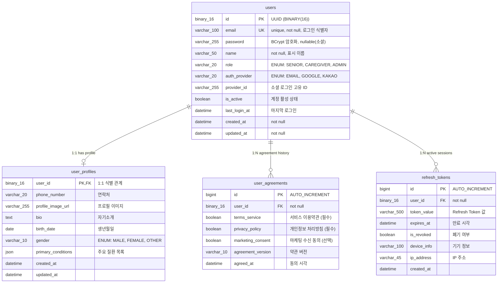
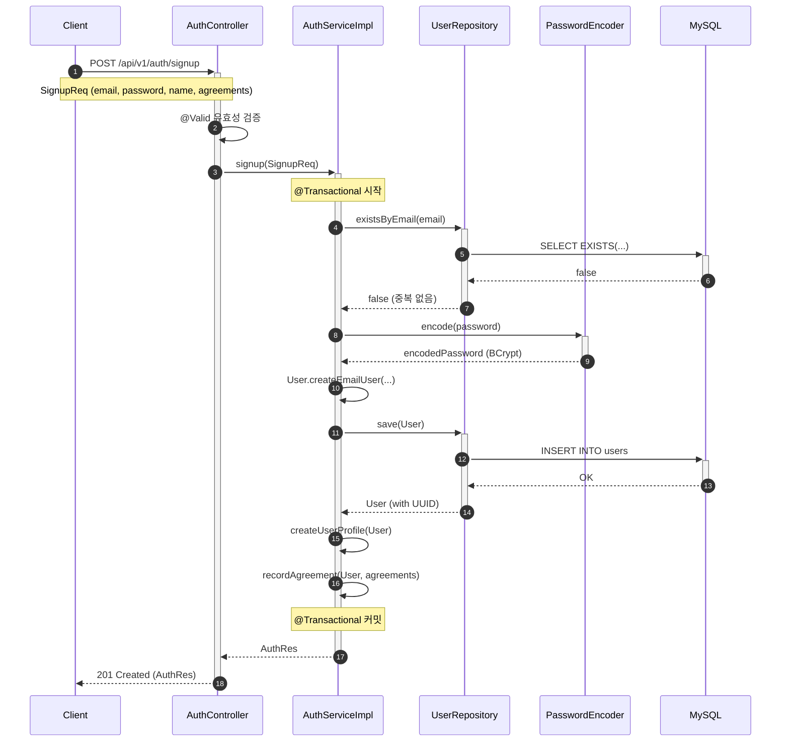
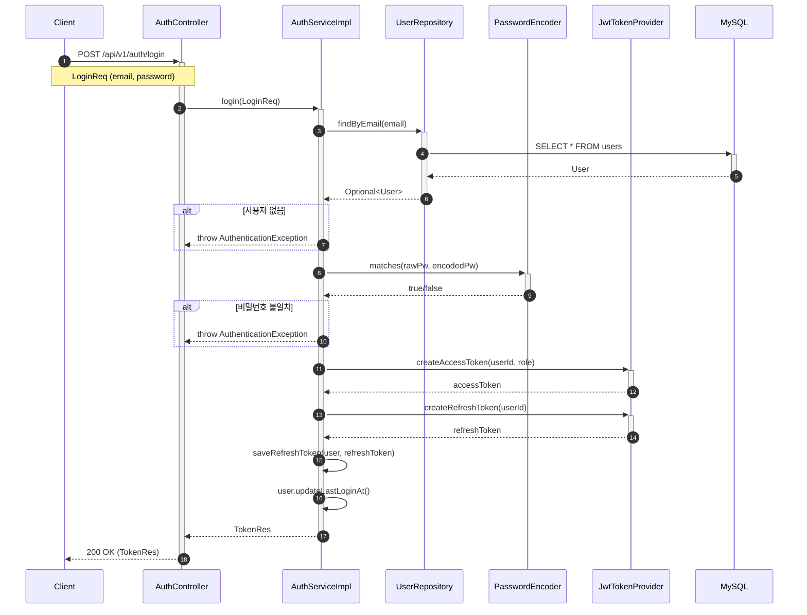
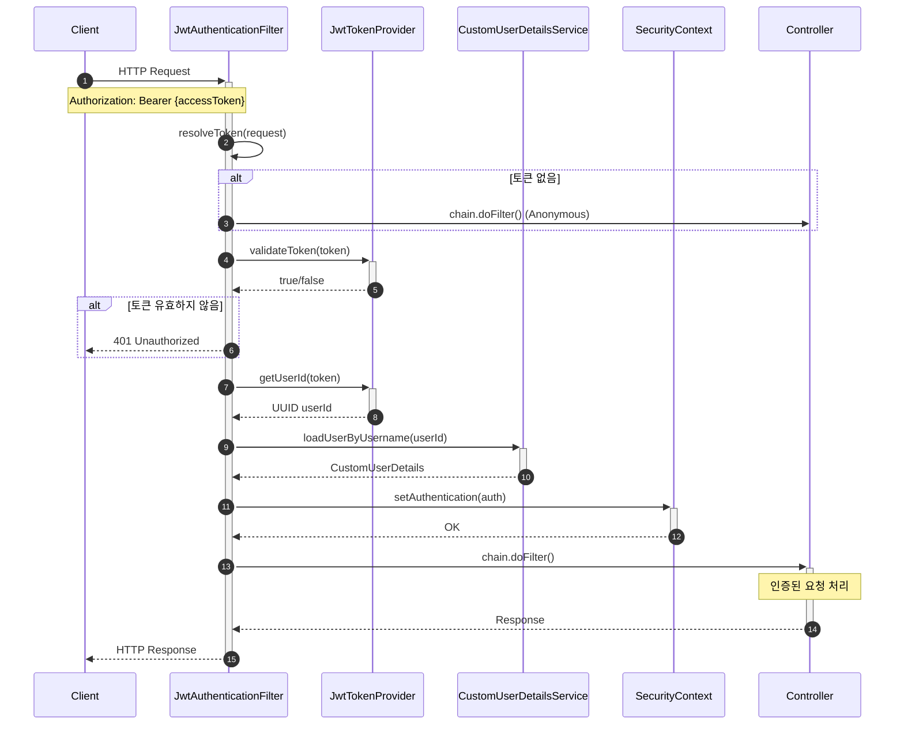

# [BE] Issue-03: 사용자 인증(Auth) 및 회원 도메인 구현

## 1. 개요
**SRS 4.1 REQ-FUNC-001, 002** 및 보안 요구사항에 따라 사용자 가입, 로그인, JWT 인증, 역할(Role) 관리를 구현합니다.

## 2. 작업 워크플로우 (설계 및 구현)

| 단계 | 입력(Input) | 도구(Tool) | 출력(Output) |
| --- | --- | --- | --- |
| **Plan** | REQ-FUNC-001~002 | Cursor | API 명세서 (Swagger/Markdown) |
| **Data Schema Design** | User, Profile Table | Mermaid.js | ERD Update (필요 시) |
| **Interaction Design** | Auth Flow | Cursor | **Member/Auth JPA Entity & Security Config** |
| **Review** | 구현 코드 | GitHub PR | Security Filter Chain 동작 확인 |

## 3. 상세 요구사항 (To-Do)

- [ ] **Domain: User & Profile**
    - `User` Entity 구현 (UUID PK, Role Enum)
    - `Profile` 정보(나이, 질환 등) 처리 로직
- [ ] **Security Configuration**
    - Spring Security 6.x 설정
    - Password Encoder (BCrypt)
    - CORS 설정 (Frontend 연동 고려)
- [ ] **Authentication (JWT)**
    - JWT Token Provider (Access/Refresh Token) 생성
    - OAuth2 Login (Google/Kakao 등 - Mock or Real) 또는 간편 가입 API
    - `/api/auth/login`, `/api/auth/refresh` 구현
- [ ] **Authorization**
    - Role 기반 접근 제어 (`SENIOR`, `CAREGIVER`, `ADMIN`)
    - Custom Annotation (`@CurrentUserId`) 구현

---

## 4. 3-Tier Architecture 데이터 흐름

### 4.1 인증 플로우 개요

```
┌─────────────────────────────────────────────────────────────────────────┐
│                         인증(Auth) 데이터 흐름                           │
├─────────────────────────────────────────────────────────────────────────┤
│                                                                         │
│  [회원가입] Client → Controller → Service → Repository → DB             │
│             ↓           ↓           ↓           ↓                       │
│           JSON      Validation  Password    User Entity                 │
│           (DTO)     + Mapping    Encode     + Profile                   │
│                                                                         │
│  [로그인]   Client → Controller → Service → Repository → DB             │
│             ↓           ↓           ↓           ↓                       │
│           JSON      Credentials  JWT Token   User Load                  │
│                     Verify       Generate    by Email                   │
│                                                                         │
│  [인가]    Client → Security Filter → Controller → Service              │
│             ↓           ↓                ↓           ↓                  │
│           JWT       Token Parse      @PreAuth    Business               │
│           Header    + Validate       Role Check  Logic                  │
│                                                                         │
└─────────────────────────────────────────────────────────────────────────┘
```

### 4.2 구현 순서 (Repository → Service → Controller)

| 순서 | 계층 | 주요 작업 |
|------|------|----------|
| **1** | **Entity/Repository** | User, UserProfile, UserAgreement Entity + Repository |
| **2** | **Security** | SecurityConfig, JwtTokenProvider, PasswordEncoder |
| **3** | **Service** | AuthService (회원가입/로그인/토큰갱신) |
| **4** | **Controller** | AuthController (REST API 엔드포인트) |

---

## 5. ERD (Entity Relationship Diagram)

> **Auth 도메인 데이터베이스 관점**: 사용자 인증 관련 테이블 구조

### 5.1 Auth Domain ERD



### 5.2 테이블 상세 설계

#### users 테이블

| 컬럼 | 타입 | 제약조건 | 설명 |
|------|------|----------|------|
| `id` | BINARY(16) | PK | UUID를 바이너리로 저장 |
| `email` | VARCHAR(100) | UNIQUE, NOT NULL | 로그인 식별자 |
| `password` | VARCHAR(255) | NULL 허용 | BCrypt 암호화 (소셜 로그인 시 NULL) |
| `name` | VARCHAR(50) | NOT NULL | 사용자 표시 이름 |
| `role` | VARCHAR(20) | NOT NULL | SENIOR, CAREGIVER, ADMIN |
| `auth_provider` | VARCHAR(20) | NOT NULL | EMAIL, GOOGLE, KAKAO |
| `provider_id` | VARCHAR(255) | NULL 허용 | 소셜 로그인 고유 ID |
| `is_active` | BOOLEAN | DEFAULT TRUE | 계정 활성화 상태 |
| `last_login_at` | DATETIME | NULL 허용 | 마지막 로그인 시각 |

#### 인덱스 설계

```sql
-- Primary Index
ALTER TABLE users ADD PRIMARY KEY (id);

-- Unique Index
CREATE UNIQUE INDEX idx_users_email ON users(email);

-- Search Index
CREATE INDEX idx_users_auth_provider ON users(auth_provider, provider_id);
CREATE INDEX idx_users_role ON users(role);
CREATE INDEX idx_users_active ON users(is_active);

-- Refresh Token Index
CREATE INDEX idx_refresh_tokens_user ON refresh_tokens(user_id);
CREATE INDEX idx_refresh_tokens_value ON refresh_tokens(token_value);
CREATE INDEX idx_refresh_tokens_expires ON refresh_tokens(expires_at);
```

---

## 6. CLD (Class/Component Logic Diagram)

> **Auth 도메인 백엔드 서버 관점**: 인증 로직 및 컴포넌트 구조

### 6.1 Auth 도메인 클래스 다이어그램

```mermaid
classDiagram
    %% =========================================================
    %% 1. PRESENTATION LAYER (Controller)
    %% =========================================================
    
    class AuthController {
        <<@RestController>>
        <<@RequestMapping /api/v1/auth>>
        -AuthService authService
        +signup(@Valid SignupReq) ResponseEntity~ApiResponse~
        +login(@Valid LoginReq) ResponseEntity~ApiResponse~
        +refresh(@Valid RefreshReq) ResponseEntity~ApiResponse~
        +logout(@AuthUser UUID userId) ResponseEntity~ApiResponse~
        +me(@AuthUser UUID userId) ResponseEntity~ApiResponse~
    }

    %% =========================================================
    %% 2. APPLICATION LAYER (Service)
    %% =========================================================
    
    class AuthService {
        <<interface>>
        +signup(SignupReq req) AuthRes
        +login(LoginReq req) TokenRes
        +refresh(String refreshToken) TokenRes
        +logout(UUID userId) void
        +getCurrentUser(UUID userId) UserRes
    }

    class AuthServiceImpl {
        <<@Service>>
        <<@Transactional>>
        -UserRepository userRepository
        -UserProfileRepository profileRepository
        -UserAgreementRepository agreementRepository
        -RefreshTokenRepository refreshTokenRepository
        -PasswordEncoder passwordEncoder
        -JwtTokenProvider jwtTokenProvider
        +signup(SignupReq req) AuthRes
        +login(LoginReq req) TokenRes
        +refresh(String refreshToken) TokenRes
        +logout(UUID userId) void
        +getCurrentUser(UUID userId) UserRes
        -validateDuplicateEmail(String email) void
        -createUserProfile(User user) UserProfile
        -recordAgreement(User user, AgreementsDto dto) void
    }

    %% =========================================================
    %% 3. DOMAIN LAYER (Entity)
    %% =========================================================
    
    class User {
        <<@Entity>>
        -UUID id
        -String email
        -String password
        -String name
        -Role role
        -AuthProvider authProvider
        -String providerId
        -boolean isActive
        -LocalDateTime lastLoginAt
        -UserProfile userProfile
        +static createEmailUser() User
        +static createSocialUser() User
        +updateLastLoginAt() void
        +deactivate() void
    }

    class UserProfile {
        <<@Entity>>
        -UUID userId
        -User user
        -String phoneNumber
        -String profileImageUrl
        -String bio
        -LocalDate birthDate
        -Gender gender
        -String primaryConditions
        +update() void
    }

    class UserAgreement {
        <<@Entity>>
        -Long id
        -User user
        -boolean termsService
        -boolean privacyPolicy
        -boolean marketingConsent
        -String agreementVersion
        -LocalDateTime agreedAt
        +static createForSignup() UserAgreement
    }

    class RefreshToken {
        <<@Entity>>
        -Long id
        -User user
        -String tokenValue
        -LocalDateTime expiresAt
        -boolean isRevoked
        -String deviceInfo
        -String ipAddress
        +isExpired() boolean
        +revoke() void
    }

    %% =========================================================
    %% 4. INFRASTRUCTURE LAYER (Repository)
    %% =========================================================
    
    class UserRepository {
        <<@Repository>>
        +existsByEmail(String email) boolean
        +findByEmail(String email) Optional~User~
        +findByAuthProviderAndProviderId() Optional~User~
        +findByIdWithProfile(UUID id) Optional~User~
    }

    class UserProfileRepository {
        <<@Repository>>
        +findByUserId(UUID userId) Optional~UserProfile~
    }

    class UserAgreementRepository {
        <<@Repository>>
        +findAllByUserIdOrderByAgreedAtDesc() List~UserAgreement~
        +findLatestByUserId(UUID userId) Optional~UserAgreement~
    }

    class RefreshTokenRepository {
        <<@Repository>>
        +findByTokenValue(String token) Optional~RefreshToken~
        +findAllByUserId(UUID userId) List~RefreshToken~
        +deleteAllByUserId(UUID userId) void
    }

    %% =========================================================
    %% 5. SECURITY COMPONENTS
    %% =========================================================
    
    class JwtTokenProvider {
        <<@Component>>
        -String secretKey
        -long accessTokenValidity
        -long refreshTokenValidity
        +createAccessToken(UUID userId, Role role) String
        +createRefreshToken(UUID userId) String
        +validateToken(String token) boolean
        +getUserId(String token) UUID
        +getRole(String token) Role
        +getExpiration(String token) Date
    }

    class JwtAuthenticationFilter {
        <<@Component>>
        <<extends OncePerRequestFilter>>
        -JwtTokenProvider jwtTokenProvider
        -UserDetailsService userDetailsService
        #doFilterInternal() void
        -resolveToken(HttpServletRequest) String
    }

    class CustomUserDetails {
        <<implements UserDetails>>
        -UUID userId
        -String email
        -String password
        -Role role
        -boolean isActive
        +getAuthorities() Collection~GrantedAuthority~
        +isEnabled() boolean
    }

    class CustomUserDetailsService {
        <<@Service>>
        <<implements UserDetailsService>>
        -UserRepository userRepository
        +loadUserByUsername(String email) UserDetails
    }

    %% =========================================================
    %% 6. DTOs
    %% =========================================================
    
    class SignupReq {
        <<Request DTO>>
        -String email
        -String password
        -String name
        -AgreementsDto agreements
    }

    class LoginReq {
        <<Request DTO>>
        -String email
        -String password
    }

    class RefreshReq {
        <<Request DTO>>
        -String refreshToken
    }

    class TokenRes {
        <<Response DTO>>
        -String accessToken
        -String refreshToken
        -long expiresIn
        -String tokenType
    }

    class AuthRes {
        <<Response DTO>>
        -UUID userId
        -String email
        -String name
        -Role role
        -TokenRes tokens
    }

    class UserRes {
        <<Response DTO>>
        -UUID userId
        -String email
        -String name
        -Role role
        -UserProfileRes profile
        +static from(User) UserRes
    }

    %% =========================================================
    %% RELATIONSHIPS
    %% =========================================================
    
    AuthController --> AuthService : uses
    AuthServiceImpl ..|> AuthService : implements
    AuthServiceImpl --> UserRepository : uses
    AuthServiceImpl --> UserProfileRepository : uses
    AuthServiceImpl --> UserAgreementRepository : uses
    AuthServiceImpl --> RefreshTokenRepository : uses
    AuthServiceImpl --> JwtTokenProvider : uses
    AuthServiceImpl --> PasswordEncoder : uses
    
    JwtAuthenticationFilter --> JwtTokenProvider : uses
    JwtAuthenticationFilter --> CustomUserDetailsService : uses
    CustomUserDetailsService --> UserRepository : uses
    
    UserRepository ..> User : manages
    UserProfileRepository ..> UserProfile : manages
    UserAgreementRepository ..> UserAgreement : manages
    RefreshTokenRepository ..> RefreshToken : manages
    
    User "1" -- "0..1" UserProfile : has
    User "1" -- "0..*" UserAgreement : has
    User "1" -- "0..*" RefreshToken : has
    
    AuthController ..> SignupReq : receives
    AuthController ..> LoginReq : receives
    AuthController ..> TokenRes : returns
    AuthController ..> AuthRes : returns
    AuthServiceImpl ..> UserRes : creates
```



### 6.2 인증 시퀀스 다이어그램

#### 6.2.1 회원가입 플로우



#### 6.2.2 로그인 플로우



#### 6.2.3 토큰 검증 플로우 (Security Filter)



---

## 7. ORM 예제코드 (Auth Domain)

> **인증 도메인 연결 관점**: Entity, Repository, Service 구현

### 7.1 User Entity

```java
package com.pollosseum.domain.user.entity;

import com.pollosseum.domain.common.BaseTimeEntity;
import jakarta.persistence.*;
import lombok.*;

import java.time.LocalDateTime;
import java.util.UUID;

/**
 * 사용자 Entity - 인증의 핵심
 * 
 * @Table users
 * @PK id (UUID, BINARY(16))
 */
@Entity
@Table(name = "users",
    indexes = {
        @Index(name = "idx_users_email", columnList = "email"),
        @Index(name = "idx_users_auth_provider", columnList = "auth_provider, provider_id"),
        @Index(name = "idx_users_role", columnList = "role")
    }
)
@Getter
@NoArgsConstructor(access = AccessLevel.PROTECTED)
public class User extends BaseTimeEntity {

    @Id
    @GeneratedValue(strategy = GenerationType.UUID)
    @Column(columnDefinition = "BINARY(16)")
    private UUID id;

    @Column(nullable = false, unique = true, length = 100)
    private String email;

    @Column(length = 255)
    private String password;

    @Column(nullable = false, length = 50)
    private String name;

    @Enumerated(EnumType.STRING)
    @Column(nullable = false, length = 20)
    private Role role;

    @Enumerated(EnumType.STRING)
    @Column(name = "auth_provider", nullable = false, length = 20)
    private AuthProvider authProvider;

    @Column(name = "provider_id", length = 255)
    private String providerId;

    @Column(name = "is_active", nullable = false)
    private boolean isActive = true;

    @Column(name = "last_login_at")
    private LocalDateTime lastLoginAt;

    @OneToOne(mappedBy = "user", cascade = CascadeType.ALL, fetch = FetchType.LAZY)
    private UserProfile userProfile;

    // ========================================
    // Builder
    // ========================================
    @Builder
    private User(String email, String password, String name, Role role,
                 AuthProvider authProvider, String providerId) {
        this.email = email;
        this.password = password;
        this.name = name;
        this.role = role;
        this.authProvider = authProvider;
        this.providerId = providerId;
        this.isActive = true;
    }

    // ========================================
    // Factory Methods
    // ========================================
    
    /**
     * 이메일 가입 사용자 생성
     */
    public static User createEmailUser(String email, String encodedPassword,
                                        String name, Role role) {
        return User.builder()
                .email(email)
                .password(encodedPassword)
                .name(name)
                .role(role)
                .authProvider(AuthProvider.EMAIL)
                .build();
    }

    /**
     * 소셜 로그인 사용자 생성
     */
    public static User createSocialUser(String email, String name, Role role,
                                         AuthProvider provider, String providerId) {
        return User.builder()
                .email(email)
                .name(name)
                .role(role)
                .authProvider(provider)
                .providerId(providerId)
                .build();
    }

    // ========================================
    // Business Methods
    // ========================================
    
    /**
     * 마지막 로그인 시각 갱신
     */
    public void updateLastLoginAt() {
        this.lastLoginAt = LocalDateTime.now();
    }

    /**
     * 비밀번호 변경
     */
    public void changePassword(String newEncodedPassword) {
        this.password = newEncodedPassword;
    }

    /**
     * 계정 비활성화
     */
    public void deactivate() {
        this.isActive = false;
    }

    /**
     * 계정 활성화
     */
    public void activate() {
        this.isActive = true;
    }

    /**
     * 프로필 연결
     */
    public void linkProfile(UserProfile profile) {
        this.userProfile = profile;
    }
}
```

### 7.2 RefreshToken Entity

```java
package com.pollosseum.domain.user.entity;

import com.pollosseum.domain.common.BaseTimeEntity;
import jakarta.persistence.*;
import lombok.*;

import java.time.LocalDateTime;

/**
 * Refresh Token Entity
 * - JWT Refresh Token 관리
 * - 다중 디바이스 로그인 지원
 */
@Entity
@Table(name = "refresh_tokens",
    indexes = {
        @Index(name = "idx_refresh_tokens_user", columnList = "user_id"),
        @Index(name = "idx_refresh_tokens_value", columnList = "token_value"),
        @Index(name = "idx_refresh_tokens_expires", columnList = "expires_at")
    }
)
@Getter
@NoArgsConstructor(access = AccessLevel.PROTECTED)
public class RefreshToken extends BaseTimeEntity {

    @Id
    @GeneratedValue(strategy = GenerationType.IDENTITY)
    private Long id;

    @ManyToOne(fetch = FetchType.LAZY)
    @JoinColumn(name = "user_id", nullable = false)
    private User user;

    @Column(name = "token_value", nullable = false, length = 500)
    private String tokenValue;

    @Column(name = "expires_at", nullable = false)
    private LocalDateTime expiresAt;

    @Column(name = "is_revoked", nullable = false)
    private boolean isRevoked = false;

    @Column(name = "device_info", length = 100)
    private String deviceInfo;

    @Column(name = "ip_address", length = 45)
    private String ipAddress;

    // ========================================
    // Builder
    // ========================================
    @Builder
    private RefreshToken(User user, String tokenValue, LocalDateTime expiresAt,
                         String deviceInfo, String ipAddress) {
        this.user = user;
        this.tokenValue = tokenValue;
        this.expiresAt = expiresAt;
        this.deviceInfo = deviceInfo;
        this.ipAddress = ipAddress;
        this.isRevoked = false;
    }

    // ========================================
    // Factory Method
    // ========================================
    public static RefreshToken create(User user, String tokenValue,
                                       long validityInSeconds,
                                       String deviceInfo, String ipAddress) {
        return RefreshToken.builder()
                .user(user)
                .tokenValue(tokenValue)
                .expiresAt(LocalDateTime.now().plusSeconds(validityInSeconds))
                .deviceInfo(deviceInfo)
                .ipAddress(ipAddress)
                .build();
    }

    // ========================================
    // Business Methods
    // ========================================
    
    /**
     * 토큰 만료 여부 확인
     */
    public boolean isExpired() {
        return LocalDateTime.now().isAfter(expiresAt);
    }

    /**
     * 토큰 유효성 확인 (만료 + 폐기 여부)
     */
    public boolean isValid() {
        return !isRevoked && !isExpired();
    }

    /**
     * 토큰 폐기
     */
    public void revoke() {
        this.isRevoked = true;
    }
}
```

### 7.3 Repository 인터페이스

```java
// ========================================
// UserRepository.java
// ========================================
package com.pollosseum.infrastructure.repository;

import com.pollosseum.domain.user.entity.AuthProvider;
import com.pollosseum.domain.user.entity.User;
import org.springframework.data.jpa.repository.JpaRepository;
import org.springframework.data.jpa.repository.Query;
import org.springframework.data.repository.query.Param;
import org.springframework.stereotype.Repository;

import java.util.Optional;
import java.util.UUID;

@Repository
public interface UserRepository extends JpaRepository<User, UUID> {

    /**
     * 이메일 중복 검사
     */
    boolean existsByEmail(String email);

    /**
     * 이메일로 사용자 조회 (로그인용)
     */
    Optional<User> findByEmail(String email);

    /**
     * 활성 사용자만 이메일로 조회
     */
    Optional<User> findByEmailAndIsActiveTrue(String email);

    /**
     * 소셜 로그인 사용자 조회
     */
    Optional<User> findByAuthProviderAndProviderId(AuthProvider authProvider, String providerId);

    /**
     * 사용자 + 프로필 한번에 조회 (Fetch Join)
     */
    @Query("SELECT u FROM User u LEFT JOIN FETCH u.userProfile WHERE u.id = :userId")
    Optional<User> findByIdWithProfile(@Param("userId") UUID userId);
}

// ========================================
// RefreshTokenRepository.java
// ========================================
package com.pollosseum.infrastructure.repository;

import com.pollosseum.domain.user.entity.RefreshToken;
import org.springframework.data.jpa.repository.JpaRepository;
import org.springframework.data.jpa.repository.Modifying;
import org.springframework.data.jpa.repository.Query;
import org.springframework.data.repository.query.Param;
import org.springframework.stereotype.Repository;

import java.time.LocalDateTime;
import java.util.List;
import java.util.Optional;
import java.util.UUID;

@Repository
public interface RefreshTokenRepository extends JpaRepository<RefreshToken, Long> {

    /**
     * 토큰 값으로 조회
     */
    Optional<RefreshToken> findByTokenValue(String tokenValue);

    /**
     * 유효한 토큰만 조회
     */
    @Query("SELECT rt FROM RefreshToken rt WHERE rt.tokenValue = :token " +
           "AND rt.isRevoked = false AND rt.expiresAt > :now")
    Optional<RefreshToken> findValidToken(@Param("token") String token,
                                          @Param("now") LocalDateTime now);

    /**
     * 사용자의 모든 토큰 조회
     */
    List<RefreshToken> findAllByUserId(UUID userId);

    /**
     * 사용자의 모든 토큰 삭제 (로그아웃 시)
     */
    @Modifying
    @Query("DELETE FROM RefreshToken rt WHERE rt.user.id = :userId")
    void deleteAllByUserId(@Param("userId") UUID userId);

    /**
     * 만료된 토큰 일괄 삭제 (스케줄러용)
     */
    @Modifying
    @Query("DELETE FROM RefreshToken rt WHERE rt.expiresAt < :now OR rt.isRevoked = true")
    int deleteExpiredTokens(@Param("now") LocalDateTime now);
}
```

### 7.4 JWT Token Provider

```java
package com.pollosseum.infrastructure.security;

import com.pollosseum.domain.user.entity.Role;
import io.jsonwebtoken.*;
import io.jsonwebtoken.security.Keys;
import jakarta.annotation.PostConstruct;
import lombok.RequiredArgsConstructor;
import lombok.extern.slf4j.Slf4j;
import org.springframework.beans.factory.annotation.Value;
import org.springframework.stereotype.Component;

import javax.crypto.SecretKey;
import java.nio.charset.StandardCharsets;
import java.util.Date;
import java.util.UUID;

/**
 * JWT 토큰 생성 및 검증
 */
@Slf4j
@Component
@RequiredArgsConstructor
public class JwtTokenProvider {

    @Value("${jwt.secret}")
    private String secretKeyString;

    @Value("${jwt.access-token-validity-in-seconds:3600}")
    private long accessTokenValidityInSeconds;

    @Value("${jwt.refresh-token-validity-in-seconds:604800}")
    private long refreshTokenValidityInSeconds;

    private SecretKey secretKey;

    @PostConstruct
    protected void init() {
        this.secretKey = Keys.hmacShaKeyFor(secretKeyString.getBytes(StandardCharsets.UTF_8));
    }

    /**
     * Access Token 생성
     */
    public String createAccessToken(UUID userId, Role role) {
        Date now = new Date();
        Date validity = new Date(now.getTime() + accessTokenValidityInSeconds * 1000);

        return Jwts.builder()
                .subject(userId.toString())
                .claim("role", role.name())
                .claim("type", "access")
                .issuedAt(now)
                .expiration(validity)
                .signWith(secretKey)
                .compact();
    }

    /**
     * Refresh Token 생성
     */
    public String createRefreshToken(UUID userId) {
        Date now = new Date();
        Date validity = new Date(now.getTime() + refreshTokenValidityInSeconds * 1000);

        return Jwts.builder()
                .subject(userId.toString())
                .claim("type", "refresh")
                .issuedAt(now)
                .expiration(validity)
                .signWith(secretKey)
                .compact();
    }

    /**
     * 토큰 유효성 검증
     */
    public boolean validateToken(String token) {
        try {
            Jwts.parser()
                    .verifyWith(secretKey)
                    .build()
                    .parseSignedClaims(token);
            return true;
        } catch (JwtException | IllegalArgumentException e) {
            log.warn("Invalid JWT token: {}", e.getMessage());
            return false;
        }
    }

    /**
     * 토큰에서 사용자 ID 추출
     */
    public UUID getUserId(String token) {
        Claims claims = getClaims(token);
        return UUID.fromString(claims.getSubject());
    }

    /**
     * 토큰에서 역할 추출
     */
    public Role getRole(String token) {
        Claims claims = getClaims(token);
        return Role.valueOf(claims.get("role", String.class));
    }

    /**
     * 토큰 만료 시간 조회
     */
    public Date getExpiration(String token) {
        return getClaims(token).getExpiration();
    }

    /**
     * Refresh Token 유효 기간 (초)
     */
    public long getRefreshTokenValidityInSeconds() {
        return refreshTokenValidityInSeconds;
    }

    private Claims getClaims(String token) {
        return Jwts.parser()
                .verifyWith(secretKey)
                .build()
                .parseSignedClaims(token)
                .getPayload();
    }
}
```

### 7.5 Security Configuration

```java
package com.pollosseum.infrastructure.config;

import com.pollosseum.infrastructure.security.JwtAuthenticationFilter;
import lombok.RequiredArgsConstructor;
import org.springframework.context.annotation.Bean;
import org.springframework.context.annotation.Configuration;
import org.springframework.security.authentication.AuthenticationManager;
import org.springframework.security.config.annotation.authentication.configuration.AuthenticationConfiguration;
import org.springframework.security.config.annotation.method.configuration.EnableMethodSecurity;
import org.springframework.security.config.annotation.web.builders.HttpSecurity;
import org.springframework.security.config.annotation.web.configuration.EnableWebSecurity;
import org.springframework.security.config.annotation.web.configurers.AbstractHttpConfigurer;
import org.springframework.security.config.http.SessionCreationPolicy;
import org.springframework.security.crypto.bcrypt.BCryptPasswordEncoder;
import org.springframework.security.crypto.password.PasswordEncoder;
import org.springframework.security.web.SecurityFilterChain;
import org.springframework.security.web.authentication.UsernamePasswordAuthenticationFilter;
import org.springframework.web.cors.CorsConfiguration;
import org.springframework.web.cors.CorsConfigurationSource;
import org.springframework.web.cors.UrlBasedCorsConfigurationSource;

import java.util.List;

/**
 * Spring Security 설정
 */
@Configuration
@EnableWebSecurity
@EnableMethodSecurity(prePostEnabled = true)
@RequiredArgsConstructor
public class SecurityConfig {

    private final JwtAuthenticationFilter jwtAuthenticationFilter;

    @Bean
    public SecurityFilterChain securityFilterChain(HttpSecurity http) throws Exception {
        return http
                // CSRF 비활성화 (JWT 사용)
                .csrf(AbstractHttpConfigurer::disable)
                
                // CORS 설정
                .cors(cors -> cors.configurationSource(corsConfigurationSource()))
                
                // 세션 미사용 (JWT Stateless)
                .sessionManagement(session -> 
                    session.sessionCreationPolicy(SessionCreationPolicy.STATELESS))
                
                // URL별 접근 권한 설정
                .authorizeHttpRequests(auth -> auth
                    // 인증 없이 접근 가능
                    .requestMatchers("/api/v1/auth/**").permitAll()
                    .requestMatchers("/api/health").permitAll()
                    .requestMatchers("/swagger-ui/**", "/v3/api-docs/**").permitAll()
                    
                    // 관리자만 접근 가능
                    .requestMatchers("/api/admin/**").hasRole("ADMIN")
                    
                    // 그 외 모든 요청은 인증 필요
                    .anyRequest().authenticated()
                )
                
                // JWT 필터 추가
                .addFilterBefore(jwtAuthenticationFilter, 
                    UsernamePasswordAuthenticationFilter.class)
                
                .build();
    }

    @Bean
    public PasswordEncoder passwordEncoder() {
        return new BCryptPasswordEncoder();
    }

    @Bean
    public AuthenticationManager authenticationManager(
            AuthenticationConfiguration authConfig) throws Exception {
        return authConfig.getAuthenticationManager();
    }

    @Bean
    public CorsConfigurationSource corsConfigurationSource() {
        CorsConfiguration configuration = new CorsConfiguration();
        configuration.setAllowedOrigins(List.of(
            "http://localhost:3000",   // React Dev Server
            "http://localhost:5173"    // Vite Dev Server
        ));
        configuration.setAllowedMethods(List.of("GET", "POST", "PUT", "DELETE", "PATCH", "OPTIONS"));
        configuration.setAllowedHeaders(List.of("*"));
        configuration.setAllowCredentials(true);
        configuration.setMaxAge(3600L);

        UrlBasedCorsConfigurationSource source = new UrlBasedCorsConfigurationSource();
        source.registerCorsConfiguration("/**", configuration);
        return source;
    }
}
```

### 7.6 AuthService 구현

```java
package com.pollosseum.application.service;

import com.pollosseum.domain.user.entity.*;
import com.pollosseum.infrastructure.repository.*;
import com.pollosseum.infrastructure.security.JwtTokenProvider;
import com.pollosseum.interfaces.api.dto.request.*;
import com.pollosseum.interfaces.api.dto.response.*;
import lombok.RequiredArgsConstructor;
import org.springframework.security.crypto.password.PasswordEncoder;
import org.springframework.stereotype.Service;
import org.springframework.transaction.annotation.Transactional;

import java.time.LocalDateTime;
import java.util.UUID;

/**
 * 인증 서비스 구현체
 */
@Service
@RequiredArgsConstructor
@Transactional(readOnly = true)
public class AuthServiceImpl implements AuthService {

    private final UserRepository userRepository;
    private final UserProfileRepository userProfileRepository;
    private final UserAgreementRepository userAgreementRepository;
    private final RefreshTokenRepository refreshTokenRepository;
    private final PasswordEncoder passwordEncoder;
    private final JwtTokenProvider jwtTokenProvider;

    /**
     * 회원가입
     */
    @Override
    @Transactional
    public AuthRes signup(SignupReq request) {
        // 1. 이메일 중복 검사
        validateDuplicateEmail(request.getEmail());

        // 2. 비밀번호 암호화
        String encodedPassword = passwordEncoder.encode(request.getPassword());

        // 3. User 생성 및 저장
        User user = User.createEmailUser(
            request.getEmail(),
            encodedPassword,
            request.getName(),
            Role.SENIOR
        );
        User savedUser = userRepository.save(user);

        // 4. UserProfile 생성
        UserProfile profile = UserProfile.builder()
            .user(savedUser)
            .build();
        userProfileRepository.save(profile);
        savedUser.linkProfile(profile);

        // 5. 약관 동의 기록
        recordAgreement(savedUser, request.getAgreements());

        // 6. 토큰 생성
        TokenRes tokens = generateTokens(savedUser, null, null);

        return AuthRes.builder()
            .userId(savedUser.getId())
            .email(savedUser.getEmail())
            .name(savedUser.getName())
            .role(savedUser.getRole())
            .tokens(tokens)
            .build();
    }

    /**
     * 로그인
     */
    @Override
    @Transactional
    public TokenRes login(LoginReq request, String deviceInfo, String ipAddress) {
        // 1. 사용자 조회
        User user = userRepository.findByEmailAndIsActiveTrue(request.getEmail())
            .orElseThrow(() -> new AuthenticationException("이메일 또는 비밀번호가 올바르지 않습니다."));

        // 2. 비밀번호 검증
        if (!passwordEncoder.matches(request.getPassword(), user.getPassword())) {
            throw new AuthenticationException("이메일 또는 비밀번호가 올바르지 않습니다.");
        }

        // 3. 마지막 로그인 시간 갱신
        user.updateLastLoginAt();

        // 4. 토큰 생성 및 반환
        return generateTokens(user, deviceInfo, ipAddress);
    }

    /**
     * 토큰 갱신
     */
    @Override
    @Transactional
    public TokenRes refresh(String refreshToken, String deviceInfo, String ipAddress) {
        // 1. Refresh Token 검증
        RefreshToken storedToken = refreshTokenRepository
            .findValidToken(refreshToken, LocalDateTime.now())
            .orElseThrow(() -> new AuthenticationException("유효하지 않은 Refresh Token입니다."));

        // 2. 기존 토큰 폐기
        storedToken.revoke();

        // 3. 새 토큰 생성
        User user = storedToken.getUser();
        return generateTokens(user, deviceInfo, ipAddress);
    }

    /**
     * 로그아웃 (모든 토큰 폐기)
     */
    @Override
    @Transactional
    public void logout(UUID userId) {
        refreshTokenRepository.deleteAllByUserId(userId);
    }

    /**
     * 현재 사용자 정보 조회
     */
    @Override
    public UserRes getCurrentUser(UUID userId) {
        User user = userRepository.findByIdWithProfile(userId)
            .orElseThrow(() -> new UserNotFoundException("사용자를 찾을 수 없습니다."));
        return UserRes.from(user);
    }

    // ========================================
    // Private Methods
    // ========================================

    private void validateDuplicateEmail(String email) {
        if (userRepository.existsByEmail(email)) {
            throw new DuplicateEmailException("이미 가입된 이메일입니다.");
        }
    }

    private void recordAgreement(User user, AgreementsDto dto) {
        UserAgreement agreement = UserAgreement.createForSignup(
            user,
            dto.isTermsService(),
            dto.isPrivacyPolicy(),
            dto.isMarketingConsent()
        );
        userAgreementRepository.save(agreement);
    }

    private TokenRes generateTokens(User user, String deviceInfo, String ipAddress) {
        String accessToken = jwtTokenProvider.createAccessToken(user.getId(), user.getRole());
        String refreshToken = jwtTokenProvider.createRefreshToken(user.getId());

        // Refresh Token 저장
        RefreshToken tokenEntity = RefreshToken.create(
            user,
            refreshToken,
            jwtTokenProvider.getRefreshTokenValidityInSeconds(),
            deviceInfo,
            ipAddress
        );
        refreshTokenRepository.save(tokenEntity);

        return TokenRes.builder()
            .accessToken(accessToken)
            .refreshToken(refreshToken)
            .expiresIn(3600L) // Access Token 유효 시간 (초)
            .tokenType("Bearer")
            .build();
    }
}
```

### 7.7 AuthController

```java
package com.pollosseum.interfaces.api;

import com.pollosseum.application.service.AuthService;
import com.pollosseum.interfaces.api.dto.request.*;
import com.pollosseum.interfaces.api.dto.response.*;
import com.pollosseum.interfaces.common.ApiResponse;
import com.pollosseum.interfaces.common.CurrentUserId;
import jakarta.servlet.http.HttpServletRequest;
import jakarta.validation.Valid;
import lombok.RequiredArgsConstructor;
import org.springframework.http.HttpStatus;
import org.springframework.http.ResponseEntity;
import org.springframework.web.bind.annotation.*;

import java.util.UUID;

/**
 * 인증 API Controller
 */
@RestController
@RequestMapping("/api/v1/auth")
@RequiredArgsConstructor
public class AuthController {

    private final AuthService authService;

    /**
     * 회원가입
     * POST /api/v1/auth/signup
     */
    @PostMapping("/signup")
    public ResponseEntity<ApiResponse<AuthRes>> signup(
            @Valid @RequestBody SignupReq request) {
        
        AuthRes response = authService.signup(request);
        return ResponseEntity
            .status(HttpStatus.CREATED)
            .body(ApiResponse.success("회원가입이 완료되었습니다.", response));
    }

    /**
     * 로그인
     * POST /api/v1/auth/login
     */
    @PostMapping("/login")
    public ResponseEntity<ApiResponse<TokenRes>> login(
            @Valid @RequestBody LoginReq request,
            HttpServletRequest httpRequest) {
        
        String deviceInfo = httpRequest.getHeader("User-Agent");
        String ipAddress = getClientIp(httpRequest);
        
        TokenRes response = authService.login(request, deviceInfo, ipAddress);
        return ResponseEntity.ok(ApiResponse.success("로그인 성공", response));
    }

    /**
     * 토큰 갱신
     * POST /api/v1/auth/refresh
     */
    @PostMapping("/refresh")
    public ResponseEntity<ApiResponse<TokenRes>> refresh(
            @Valid @RequestBody RefreshReq request,
            HttpServletRequest httpRequest) {
        
        String deviceInfo = httpRequest.getHeader("User-Agent");
        String ipAddress = getClientIp(httpRequest);
        
        TokenRes response = authService.refresh(
            request.getRefreshToken(), deviceInfo, ipAddress);
        return ResponseEntity.ok(ApiResponse.success("토큰 갱신 성공", response));
    }

    /**
     * 로그아웃
     * POST /api/v1/auth/logout
     */
    @PostMapping("/logout")
    public ResponseEntity<ApiResponse<Void>> logout(@CurrentUserId UUID userId) {
        authService.logout(userId);
        return ResponseEntity.ok(ApiResponse.success("로그아웃 완료", null));
    }

    /**
     * 현재 사용자 정보 조회
     * GET /api/v1/auth/me
     */
    @GetMapping("/me")
    public ResponseEntity<ApiResponse<UserRes>> me(@CurrentUserId UUID userId) {
        UserRes response = authService.getCurrentUser(userId);
        return ResponseEntity.ok(ApiResponse.success(response));
    }

    // ========================================
    // Private Methods
    // ========================================

    private String getClientIp(HttpServletRequest request) {
        String ip = request.getHeader("X-Forwarded-For");
        if (ip == null || ip.isEmpty()) {
            ip = request.getRemoteAddr();
        }
        return ip;
    }
}
```

---

## 8. 패키지 구조

```
src/main/java/com/pollosseum/
├── domain/
│   └── user/
│       └── entity/
│           ├── User.java
│           ├── UserProfile.java
│           ├── UserAgreement.java
│           ├── RefreshToken.java
│           ├── Role.java
│           ├── AuthProvider.java
│           └── Gender.java
│
├── application/
│   └── service/
│       ├── AuthService.java
│       └── AuthServiceImpl.java
│
├── infrastructure/
│   ├── repository/
│   │   ├── UserRepository.java
│   │   ├── UserProfileRepository.java
│   │   ├── UserAgreementRepository.java
│   │   └── RefreshTokenRepository.java
│   │
│   ├── security/
│   │   ├── JwtTokenProvider.java
│   │   ├── JwtAuthenticationFilter.java
│   │   ├── CustomUserDetails.java
│   │   └── CustomUserDetailsService.java
│   │
│   └── config/
│       └── SecurityConfig.java
│
└── interfaces/
    ├── api/
    │   └── AuthController.java
    │
    ├── dto/
    │   ├── request/
    │   │   ├── SignupReq.java
    │   │   ├── LoginReq.java
    │   │   └── RefreshReq.java
    │   │
    │   └── response/
    │       ├── AuthRes.java
    │       ├── TokenRes.java
    │       └── UserRes.java
    │
    └── common/
        ├── CurrentUserId.java (Custom Annotation)
        └── CurrentUserIdResolver.java
```

---

## 9. API 명세 요약

| Method | Endpoint | 설명 | Auth |
|--------|----------|------|------|
| `POST` | `/api/v1/auth/signup` | 회원가입 | × |
| `POST` | `/api/v1/auth/login` | 로그인 | × |
| `POST` | `/api/v1/auth/refresh` | 토큰 갱신 | × |
| `POST` | `/api/v1/auth/logout` | 로그아웃 | ○ |
| `GET` | `/api/v1/auth/me` | 내 정보 조회 | ○ |

---

## 10. 구현 체크포인트

### 10.1 Entity 체크리스트

- [ ] User Entity - UUID PK, Email UNIQUE, BCrypt Password
- [ ] UserProfile Entity - 1:1 @MapsId 관계
- [ ] UserAgreement Entity - 약관 동의 이력 관리
- [ ] RefreshToken Entity - 다중 디바이스 토큰 관리

### 10.2 Security 체크리스트

- [ ] JwtTokenProvider - Access/Refresh Token 생성/검증
- [ ] JwtAuthenticationFilter - 토큰 파싱 및 인증 객체 설정
- [ ] SecurityConfig - Filter Chain, CORS, URL 권한 설정
- [ ] PasswordEncoder - BCryptPasswordEncoder Bean

### 10.3 Service 체크리스트

- [ ] 회원가입 - 이메일 중복 검사, 비밀번호 암호화
- [ ] 로그인 - 자격 증명 검증, 토큰 발급
- [ ] 토큰 갱신 - Refresh Token 검증 및 재발급
- [ ] 로그아웃 - 모든 Refresh Token 폐기

---

## 10. Traceability (요구사항 추적성)

### 10.1 관련 요구사항 매핑

#### Functional Requirements
- **REQ-FUNC-001**: 계정 생성 및 기본 프로필 등록
  - User, UserProfile Entity 구현으로 요구사항 충족
- **REQ-FUNC-002**: 온보딩 인증 단계
  - 소셜 로그인, 휴대폰 본인인증, JWT 토큰 발급으로 요구사항 충족

#### Non-Functional Requirements (직접 연결)
- **REQ-NF-006** (보안): TLS1.2+, AES-256 암호화, 감사 로그 100%
  - Spring Security 설정, PasswordEncoder(BCrypt), AuditLog Entity로 요구사항 충족
- **REQ-NF-007** (인증 보안): 위험 기반 2FA
  - JWT 토큰 기반 인증 인프라 구축, 향후 2FA 확장 가능한 구조

#### Non-Functional Requirements (간접 연결)
- **REQ-NF-001** (성능): 앱 초기 로드 p95 ≤ 1.5초
  - JWT Stateless 인증으로 세션 부하 감소, 성능 향상에 기여
- **REQ-NF-003** (온보딩 성능): 온보딩 p50 ≤ 180초
  - 인증 단계의 빠른 처리로 온보딩 시간 단축에 기여
- **REQ-NF-008** (접근성): 스크린리더 라벨, 포커스 트랩 방지
  - API 응답 구조 및 에러 메시지가 접근성 요구사항의 기반

#### Story Mapping
- **Story 4**: As a New user, I want to complete onboarding in under 3 minutes
  - 인증 단계(REQ-FUNC-002)는 Story 4의 핵심 구성 요소

### 10.2 Test Cases (예상)

- **TC-S4-01**: 소셜 로그인(Google/Kakao) 성공 시 JWT 토큰 발급 확인
- **TC-S4-02**: 이메일 가입 시 비밀번호 BCrypt 암호화 확인
- **TC-S4-03**: 중복 이메일 가입 시도 시 예외 처리 확인
- **TC-S4-04**: JWT 토큰 검증 실패 시 401 응답 확인
- **TC-AUTH-01**: Refresh Token 갱신 로직 검증
- **TC-AUTH-02**: 로그아웃 시 모든 Refresh Token 폐기 확인

---

## 11. 참고 자료

- SRS 4.1.1 (REQ-FUNC-001, 002)
- SRS 4.2 Non-Functional Requirements (REQ-NF-001, 003, 006, 007, 008)
- SRS 5. Traceability Matrix (Story 4)
- SRS 6.2.1 User & Profile
- `studio/300-java-spring-cursor-rules.mdc`
- `studio/Tasks/BE_issue/issue-01-be-setup.md`
