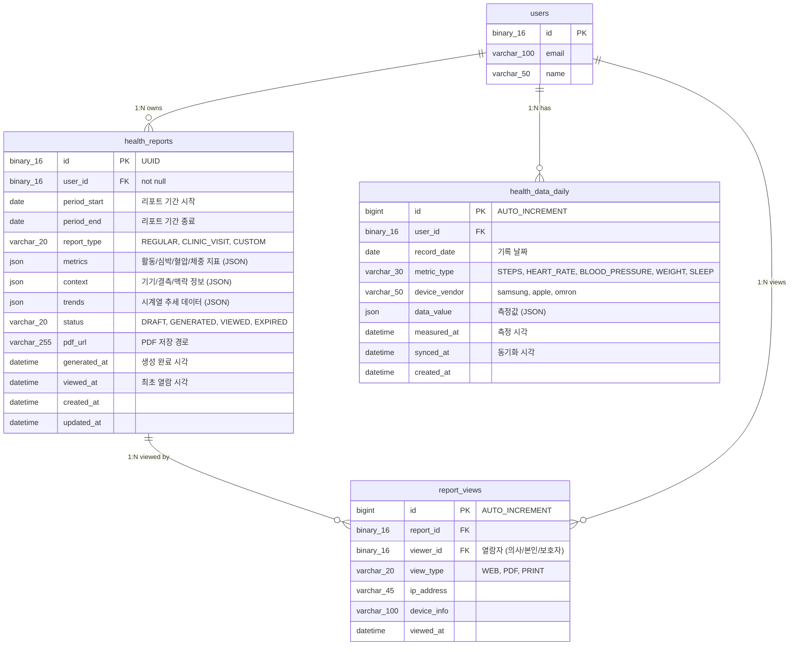
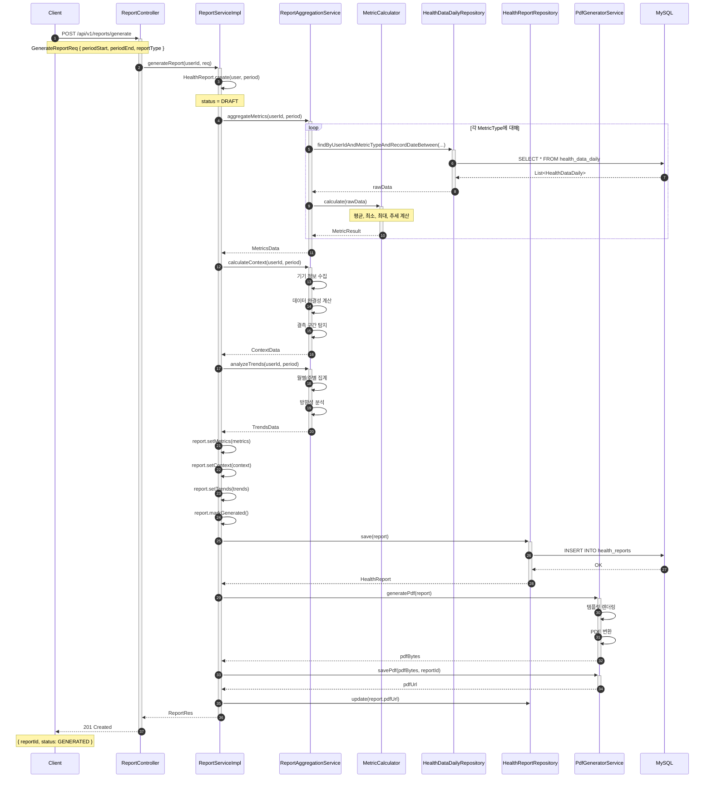

# [BE] Issue-05: 1장 요약 리포트(Health Report) 도메인 구현

## 1. 개요
**SRS REQ-FUNC-007~010**에 따라 건강 데이터를 집계하여 표준화된 리포트를 생성하고 조회하는 기능을 구현합니다.

## 2. 작업 워크플로우 (설계 및 구현)

| 단계 | 입력(Input) | 도구(Tool) | 출력(Output) |
| --- | --- | --- | --- |
| **Plan** | REQ-FUNC-007~010 | Cursor | 리포트 JSON 스키마 정의 |
| **Data Schema Design** | HealthReport | Mermaid.js | JSON Column 구조 설계 |
| **Interaction Design** | Aggregation Logic | Cursor | **Report Service & Entity** |
| **Review** | Mock Data | JUnit | 데이터 집계 정확성 검증 |

## 3. 상세 요구사항 (To-Do)

- [ ] **Domain: HealthReport**
    - `HealthReport` Entity 구현
    - `metrics` (JSON) 구조 정의: 활동, 심박, 혈압, 체중 표준 포맷
    - `context` (JSON) 구조 정의: 측정 기기, 결측 여부 메타데이터
- [ ] **Aggregation Service**
    - (Mock) Device/Portal 데이터 수집 및 집계 로직
    - 리포트 생성 로직 (최근 3~6개월 데이터 기준)
- [ ] **Report API**
    - `/api/reports/generate`: 리포트 생성 요청
    - `/api/reports/{id}`: 리포트 상세 조회
- [ ] **Output Support**
    - PDF 생성 라이브러리(IText, Thymeleaf 등) 연동 검토 및 구현 (Optional for MVP start)

---

## 4. 3-Tier Architecture 데이터 흐름

### 4.1 리포트 생성 플로우 개요

```
┌─────────────────────────────────────────────────────────────────────────┐
│                      1장 의사용 요약 리포트 데이터 흐름                   │
├─────────────────────────────────────────────────────────────────────────┤
│                                                                         │
│  [데이터 수집]                                                          │
│  ├─ DeviceLink → 워치/혈압계 데이터 조회                                │
│  └─ PortalConnection → 검진 결과 데이터 조회                            │
│                                                                         │
│  [데이터 집계] ReportAggregationService                                 │
│  ├─ 기간별 데이터 필터링 (최근 3~6개월)                                 │
│  ├─ 지표별 통계 계산 (평균, 최소, 최대, 추세)                           │
│  └─ 맥락 정보 생성 (기기, 결측, 기간)                                   │
│                                                                         │
│  [리포트 생성] ReportService                                            │
│  ├─ HealthReport Entity 생성                                            │
│  ├─ JSON metrics/context 저장                                           │
│  └─ PDF 생성 (Optional)                                                 │
│                                                                         │
│  [리포트 조회] ReportController                                         │
│  ├─ /api/reports/{id} → JSON 응답                                       │
│  └─ /api/reports/{id}/pdf → PDF 다운로드                                │
│                                                                         │
└─────────────────────────────────────────────────────────────────────────┘
```

### 4.2 리포트 구성 요소

```
┌─────────────────────────────────────────────────────────────────────────┐
│                        1장 의사용 요약 리포트 구조                        │
├─────────────────────────────────────────────────────────────────────────┤
│                                                                         │
│  [헤더 영역]                                                            │
│  ├─ 환자 정보: 이름, 나이, 성별                                         │
│  ├─ 리포트 기간: 2024.09.01 ~ 2024.11.30 (3개월)                       │
│  └─ 생성일: 2024.12.01                                                  │
│                                                                         │
│  [Metrics 영역] - 핵심 건강 지표                                        │
│  ├─ 활동: 일평균 걸음수, 활동 시간, 칼로리                              │
│  ├─ 심박: 평균/최소/최대 심박수, 안정시 심박                            │
│  ├─ 혈압: 평균/최소/최대 수축기/이완기, 맥압                            │
│  ├─ 체중: 평균 체중, BMI, 체중 변화 추세                                │
│  └─ 수면: 평균 수면 시간, 수면 품질 지수                                │
│                                                                         │
│  [Context 영역] - 측정 맥락 정보                                        │
│  ├─ 사용 기기: Samsung Galaxy Watch, Omron 혈압계                       │
│  ├─ 데이터 완결성: 걸음수 95%, 혈압 78%                                 │
│  └─ 결측 태그: 혈압 11/15~11/20 미측정                                  │
│                                                                         │
│  [추세 영역] - 시계열 변화                                              │
│  ├─ 월별 평균 걸음수 추이                                               │
│  └─ 주간 혈압 변동 그래프                                               │
│                                                                         │
└─────────────────────────────────────────────────────────────────────────┘
```

### 4.3 구현 순서 (Repository → Service → Controller)

| 순서 | 계층 | 주요 작업 |
|------|------|----------|
| **1** | **Entity/Repository** | HealthReport Entity + Repository |
| **2** | **Service** | ReportAggregationService, ReportService |
| **3** | **Controller** | ReportController (REST API) |

---

## 5. ERD (Entity Relationship Diagram)

> **리포트 도메인 데이터베이스 관점**: 리포트 및 지표 데이터 구조

### 5.1 Report Domain ERD



### 5.2 JSON 컬럼 스키마 정의

#### metrics JSON 구조

```json
{
  "activity": {
    "dailySteps": {
      "average": 6500,
      "min": 2100,
      "max": 12400,
      "unit": "steps",
      "dataPoints": 85
    },
    "activeMinutes": {
      "average": 42,
      "unit": "minutes"
    },
    "caloriesBurned": {
      "average": 1850,
      "unit": "kcal"
    }
  },
  "heartRate": {
    "restingHR": {
      "average": 68,
      "min": 58,
      "max": 72,
      "unit": "bpm"
    },
    "activeHR": {
      "average": 95,
      "max": 145,
      "unit": "bpm"
    }
  },
  "bloodPressure": {
    "systolic": {
      "average": 128,
      "min": 118,
      "max": 142,
      "unit": "mmHg"
    },
    "diastolic": {
      "average": 82,
      "min": 72,
      "max": 95,
      "unit": "mmHg"
    },
    "pulseRate": {
      "average": 72,
      "unit": "bpm"
    }
  },
  "weight": {
    "current": 72.5,
    "periodStart": 74.2,
    "change": -1.7,
    "bmi": 24.2,
    "unit": "kg"
  },
  "sleep": {
    "averageDuration": 6.8,
    "quality": "FAIR",
    "unit": "hours"
  }
}
```

#### context JSON 구조

```json
{
  "devices": [
    {
      "vendor": "samsung",
      "type": "watch",
      "model": "Galaxy Watch 6",
      "metrics": ["steps", "heartRate", "sleep"]
    },
    {
      "vendor": "omron",
      "type": "bp_monitor",
      "model": "HEM-7156",
      "metrics": ["bloodPressure"]
    }
  ],
  "completeness": {
    "steps": { "rate": 95, "missingDays": 4 },
    "heartRate": { "rate": 92, "missingDays": 7 },
    "bloodPressure": { "rate": 78, "missingDays": 20 },
    "weight": { "rate": 45, "missingDays": 50 }
  },
  "missingPeriods": [
    {
      "metric": "bloodPressure",
      "start": "2024-11-15",
      "end": "2024-11-20",
      "reason": "기기 미연동"
    }
  ],
  "period": {
    "startDate": "2024-09-01",
    "endDate": "2024-11-30",
    "totalDays": 91,
    "activeDays": 85
  }
}
```

#### trends JSON 구조

```json
{
  "monthly": {
    "steps": [
      { "month": "2024-09", "average": 5800 },
      { "month": "2024-10", "average": 6200 },
      { "month": "2024-11", "average": 7500 }
    ],
    "bloodPressure": [
      { "month": "2024-09", "systolic": 132, "diastolic": 85 },
      { "month": "2024-10", "systolic": 128, "diastolic": 82 },
      { "month": "2024-11", "systolic": 125, "diastolic": 80 }
    ]
  },
  "weekly": {
    "steps": [
      { "week": "W44", "average": 7200 },
      { "week": "W45", "average": 7800 },
      { "week": "W46", "average": 7100 },
      { "week": "W47", "average": 7600 }
    ]
  },
  "direction": {
    "steps": "IMPROVING",
    "bloodPressure": "IMPROVING",
    "weight": "STABLE"
  }
}
```

### 5.3 인덱스 설계

```sql
-- Health Reports Indexes
CREATE INDEX idx_reports_user_period ON health_reports(user_id, period_start, period_end);
CREATE INDEX idx_reports_user_status ON health_reports(user_id, status);
CREATE INDEX idx_reports_generated ON health_reports(generated_at);

-- Health Data Daily Indexes
CREATE INDEX idx_health_data_user_date ON health_data_daily(user_id, record_date);
CREATE INDEX idx_health_data_user_metric ON health_data_daily(user_id, metric_type, record_date);

-- Report Views Indexes
CREATE INDEX idx_report_views_report ON report_views(report_id);
CREATE INDEX idx_report_views_viewer ON report_views(viewer_id);
```

---

## 6. CLD (Class/Component Logic Diagram)

> **리포트 도메인 백엔드 서버 관점**: 집계 및 생성 로직 구조

### 6.1 Report 도메인 클래스 다이어그램

```mermaid
classDiagram
    %% =========================================================
    %% 1. PRESENTATION LAYER (Controller)
    %% =========================================================
    
    class ReportController {
        <<@RestController>>
        <<@RequestMapping /api/v1/reports>>
        -ReportService reportService
        +generate(@AuthUser UUID userId, @Valid GenerateReportReq) ResponseEntity~ApiResponse~
        +getReport(@AuthUser UUID userId, UUID reportId) ResponseEntity~ApiResponse~
        +getReportList(@AuthUser UUID userId, Pageable) ResponseEntity~ApiResponse~
        +downloadPdf(@AuthUser UUID userId, UUID reportId) ResponseEntity~Resource~
        +deleteReport(@AuthUser UUID userId, UUID reportId) ResponseEntity~ApiResponse~
    }

    %% =========================================================
    %% 2. APPLICATION LAYER (Service)
    %% =========================================================
    
    class ReportService {
        <<interface>>
        +generateReport(UUID userId, GenerateReportReq req) ReportRes
        +getReport(UUID userId, UUID reportId) ReportDetailRes
        +getReportList(UUID userId, Pageable pageable) Page~ReportSummaryRes~
        +downloadPdf(UUID userId, UUID reportId) byte[]
        +deleteReport(UUID userId, UUID reportId) void
    }

    class ReportServiceImpl {
        <<@Service>>
        <<@Transactional>>
        -HealthReportRepository reportRepository
        -ReportViewRepository viewRepository
        -ReportAggregationService aggregationService
        -PdfGeneratorService pdfService
        +generateReport(UUID userId, GenerateReportReq req) ReportRes
        +getReport(UUID userId, UUID reportId) ReportDetailRes
        +getReportList(UUID userId, Pageable pageable) Page~ReportSummaryRes~
        +downloadPdf(UUID userId, UUID reportId) byte[]
        +deleteReport(UUID userId, UUID reportId) void
        -recordView(report, userId, viewType) void
    }

    class ReportAggregationService {
        <<@Service>>
        -HealthDataDailyRepository dataRepository
        -DeviceLinkRepository deviceRepository
        -MetricCalculatorFactory calculatorFactory
        +aggregateMetrics(UUID userId, period) MetricsData
        +calculateContext(UUID userId, period) ContextData
        +analyzeTrends(UUID userId, period) TrendsData
    }

    class PdfGeneratorService {
        <<@Service>>
        -TemplateEngine templateEngine
        -PdfRenderer pdfRenderer
        +generatePdf(HealthReport report) byte[]
        +savePdf(byte[] pdf, UUID reportId) String
    }

    %% =========================================================
    %% 3. DOMAIN LAYER (Entity)
    %% =========================================================
    
    class HealthReport {
        <<@Entity>>
        -UUID id
        -User user
        -LocalDate periodStart
        -LocalDate periodEnd
        -ReportType reportType
        -String metrics
        -String context
        -String trends
        -ReportStatus status
        -String pdfUrl
        -LocalDateTime generatedAt
        -LocalDateTime viewedAt
        +static create(user, period) HealthReport
        +setMetrics(MetricsData data) void
        +setContext(ContextData data) void
        +setTrends(TrendsData data) void
        +markGenerated() void
        +markViewed() void
    }

    class ReportView {
        <<@Entity>>
        -Long id
        -HealthReport report
        -User viewer
        -ViewType viewType
        -String ipAddress
        -String deviceInfo
        -LocalDateTime viewedAt
        +static create(report, viewer, type) ReportView
    }

    class HealthDataDaily {
        <<@Entity>>
        -Long id
        -User user
        -LocalDate recordDate
        -MetricType metricType
        -String deviceVendor
        -String dataValue
        -LocalDateTime measuredAt
        -LocalDateTime syncedAt
    }

    class ReportType {
        <<enumeration>>
        REGULAR
        CLINIC_VISIT
        CUSTOM
    }

    class ReportStatus {
        <<enumeration>>
        DRAFT
        GENERATED
        VIEWED
        EXPIRED
    }

    class MetricType {
        <<enumeration>>
        STEPS
        HEART_RATE
        BLOOD_PRESSURE
        WEIGHT
        SLEEP
    }

    class ViewType {
        <<enumeration>>
        WEB
        PDF
        PRINT
    }

    %% =========================================================
    %% 4. INFRASTRUCTURE LAYER (Repository)
    %% =========================================================
    
    class HealthReportRepository {
        <<@Repository>>
        +findByUserIdAndId(UUID userId, UUID id) Optional~HealthReport~
        +findAllByUserId(UUID userId, Pageable) Page~HealthReport~
        +findByUserIdAndPeriod(UUID userId, start, end) List~HealthReport~
        +findLatestByUserId(UUID userId) Optional~HealthReport~
    }

    class ReportViewRepository {
        <<@Repository>>
        +findByReportId(UUID reportId) List~ReportView~
        +countByReportId(UUID reportId) int
    }

    class HealthDataDailyRepository {
        <<@Repository>>
        +findByUserIdAndRecordDateBetween(userId, start, end) List~HealthDataDaily~
        +findByUserIdAndMetricTypeAndRecordDateBetween(...) List~HealthDataDaily~
        +aggregateByMetricType(userId, metricType, start, end) AggregateResult
    }

    %% =========================================================
    %% 5. METRIC CALCULATORS (Strategy Pattern)
    %% =========================================================

    class MetricCalculatorFactory {
        <<@Component>>
        -Map~MetricType, MetricCalculator~ calculators
        +getCalculator(MetricType type) MetricCalculator
    }

    class MetricCalculator {
        <<interface>>
        +calculate(List~HealthDataDaily~ data) MetricResult
        +getMetricType() MetricType
    }

    class StepsCalculator {
        <<@Component>>
        +calculate(List~HealthDataDaily~ data) MetricResult
        +getMetricType() MetricType
    }

    class BloodPressureCalculator {
        <<@Component>>
        +calculate(List~HealthDataDaily~ data) MetricResult
        +getMetricType() MetricType
    }

    %% =========================================================
    %% 6. DTOs
    %% =========================================================
    
    class GenerateReportReq {
        <<Request DTO>>
        -LocalDate periodStart
        -LocalDate periodEnd
        -ReportType reportType
    }

    class ReportRes {
        <<Response DTO>>
        -UUID reportId
        -ReportStatus status
        -String message
    }

    class ReportDetailRes {
        <<Response DTO>>
        -UUID reportId
        -LocalDate periodStart
        -LocalDate periodEnd
        -MetricsData metrics
        -ContextData context
        -TrendsData trends
        -String pdfUrl
        -LocalDateTime generatedAt
        +static from(HealthReport) ReportDetailRes
    }

    class MetricsData {
        <<DTO>>
        -ActivityMetrics activity
        -HeartRateMetrics heartRate
        -BloodPressureMetrics bloodPressure
        -WeightMetrics weight
        -SleepMetrics sleep
    }

    class ContextData {
        <<DTO>>
        -List~DeviceInfo~ devices
        -Map~String, CompletenessInfo~ completeness
        -List~MissingPeriod~ missingPeriods
        -PeriodInfo period
    }

    %% =========================================================
    %% RELATIONSHIPS
    %% =========================================================
    
    ReportController --> ReportService : uses
    ReportServiceImpl ..|> ReportService : implements
    ReportServiceImpl --> HealthReportRepository : uses
    ReportServiceImpl --> ReportViewRepository : uses
    ReportServiceImpl --> ReportAggregationService : uses
    ReportServiceImpl --> PdfGeneratorService : uses
    
    ReportAggregationService --> HealthDataDailyRepository : uses
    ReportAggregationService --> MetricCalculatorFactory : uses
    
    MetricCalculatorFactory --> MetricCalculator : creates
    StepsCalculator ..|> MetricCalculator : implements
    BloodPressureCalculator ..|> MetricCalculator : implements
    
    HealthReportRepository ..> HealthReport : manages
    ReportViewRepository ..> ReportView : manages
    HealthDataDailyRepository ..> HealthDataDaily : manages
    
    HealthReport "1" -- "0..*" ReportView : has
    HealthReport --> ReportStatus : uses
    HealthReport --> ReportType : uses
```



### 6.2 리포트 생성 시퀀스 다이어그램



---

## 7. ORM 예제코드 (Report Domain)

> **리포트 도메인 연결 관점**: Entity, Repository, Service 구현

### 7.1 HealthReport Entity

```java
package com.pollosseum.domain.report.entity;

import com.pollosseum.domain.common.BaseTimeEntity;
import com.pollosseum.domain.user.entity.User;
import jakarta.persistence.*;
import lombok.*;
import org.hibernate.annotations.JdbcTypeCode;
import org.hibernate.type.SqlTypes;

import java.time.LocalDate;
import java.time.LocalDateTime;
import java.util.*;

/**
 * 건강 리포트 Entity
 * - 1장 의사용 요약 리포트
 * - JSON 컬럼으로 유연한 지표 저장
 */
@Entity
@Table(name = "health_reports",
    indexes = {
        @Index(name = "idx_reports_user_period", columnList = "user_id, period_start, period_end"),
        @Index(name = "idx_reports_user_status", columnList = "user_id, status"),
        @Index(name = "idx_reports_generated", columnList = "generated_at")
    }
)
@Getter
@NoArgsConstructor(access = AccessLevel.PROTECTED)
public class HealthReport extends BaseTimeEntity {

    @Id
    @GeneratedValue(strategy = GenerationType.UUID)
    @Column(columnDefinition = "BINARY(16)")
    private UUID id;

    @ManyToOne(fetch = FetchType.LAZY)
    @JoinColumn(name = "user_id", nullable = false)
    private User user;

    @Column(name = "period_start", nullable = false)
    private LocalDate periodStart;

    @Column(name = "period_end", nullable = false)
    private LocalDate periodEnd;

    @Enumerated(EnumType.STRING)
    @Column(name = "report_type", nullable = false, length = 20)
    private ReportType reportType;

    @JdbcTypeCode(SqlTypes.JSON)
    @Column(name = "metrics", columnDefinition = "JSON")
    private Map<String, Object> metrics;

    @JdbcTypeCode(SqlTypes.JSON)
    @Column(name = "context", columnDefinition = "JSON")
    private Map<String, Object> context;

    @JdbcTypeCode(SqlTypes.JSON)
    @Column(name = "trends", columnDefinition = "JSON")
    private Map<String, Object> trends;

    @Enumerated(EnumType.STRING)
    @Column(nullable = false, length = 20)
    private ReportStatus status;

    @Column(name = "pdf_url", length = 255)
    private String pdfUrl;

    @Column(name = "generated_at")
    private LocalDateTime generatedAt;

    @Column(name = "viewed_at")
    private LocalDateTime viewedAt;

    @OneToMany(mappedBy = "report", cascade = CascadeType.ALL)
    private List<ReportView> views = new ArrayList<>();

    // ========================================
    // Builder
    // ========================================
    @Builder
    private HealthReport(User user, LocalDate periodStart, LocalDate periodEnd, 
                         ReportType reportType) {
        this.user = user;
        this.periodStart = periodStart;
        this.periodEnd = periodEnd;
        this.reportType = reportType;
        this.status = ReportStatus.DRAFT;
        this.metrics = new HashMap<>();
        this.context = new HashMap<>();
        this.trends = new HashMap<>();
    }

    // ========================================
    // Factory Method
    // ========================================
    public static HealthReport create(User user, LocalDate periodStart, 
                                       LocalDate periodEnd, ReportType reportType) {
        return HealthReport.builder()
                .user(user)
                .periodStart(periodStart)
                .periodEnd(periodEnd)
                .reportType(reportType)
                .build();
    }

    /**
     * 기본 3개월 리포트 생성
     */
    public static HealthReport createThreeMonthReport(User user) {
        LocalDate endDate = LocalDate.now();
        LocalDate startDate = endDate.minusMonths(3);
        
        return create(user, startDate, endDate, ReportType.REGULAR);
    }

    /**
     * 진료 전 리포트 생성
     */
    public static HealthReport createClinicVisitReport(User user, LocalDate visitDate) {
        LocalDate startDate = visitDate.minusMonths(6);
        
        return create(user, startDate, visitDate, ReportType.CLINIC_VISIT);
    }

    // ========================================
    // Business Methods
    // ========================================

    /**
     * 지표 데이터 설정
     */
    public void setMetricsData(Map<String, Object> metricsData) {
        this.metrics = metricsData;
    }

    /**
     * 맥락 데이터 설정
     */
    public void setContextData(Map<String, Object> contextData) {
        this.context = contextData;
    }

    /**
     * 추세 데이터 설정
     */
    public void setTrendsData(Map<String, Object> trendsData) {
        this.trends = trendsData;
    }

    /**
     * 리포트 생성 완료 처리
     */
    public void markGenerated() {
        this.status = ReportStatus.GENERATED;
        this.generatedAt = LocalDateTime.now();
    }

    /**
     * 리포트 열람 처리
     */
    public void markViewed() {
        if (this.viewedAt == null) {
            this.viewedAt = LocalDateTime.now();
        }
        this.status = ReportStatus.VIEWED;
    }

    /**
     * PDF URL 설정
     */
    public void setPdfUrl(String pdfUrl) {
        this.pdfUrl = pdfUrl;
    }

    /**
     * 리포트 기간 (일수)
     */
    public long getPeriodDays() {
        return java.time.temporal.ChronoUnit.DAYS.between(periodStart, periodEnd) + 1;
    }

    /**
     * 리포트 생성 가능 여부 (Draft 상태인 경우만)
     */
    public boolean canGenerate() {
        return status == ReportStatus.DRAFT;
    }

    /**
     * PDF 다운로드 가능 여부
     */
    public boolean hasPdf() {
        return pdfUrl != null && !pdfUrl.isEmpty();
    }
}
```

### 7.2 HealthDataDaily Entity

```java
package com.pollosseum.domain.report.entity;

import com.pollosseum.domain.common.BaseTimeEntity;
import com.pollosseum.domain.user.entity.User;
import jakarta.persistence.*;
import lombok.*;
import org.hibernate.annotations.JdbcTypeCode;
import org.hibernate.type.SqlTypes;

import java.time.LocalDate;
import java.time.LocalDateTime;
import java.util.Map;

/**
 * 일별 건강 데이터 Entity
 * - 디바이스/포털에서 수집된 원본 데이터
 * - 리포트 집계의 소스
 */
@Entity
@Table(name = "health_data_daily",
    indexes = {
        @Index(name = "idx_health_data_user_date", columnList = "user_id, record_date"),
        @Index(name = "idx_health_data_user_metric", columnList = "user_id, metric_type, record_date")
    }
)
@Getter
@NoArgsConstructor(access = AccessLevel.PROTECTED)
public class HealthDataDaily extends BaseTimeEntity {

    @Id
    @GeneratedValue(strategy = GenerationType.IDENTITY)
    private Long id;

    @ManyToOne(fetch = FetchType.LAZY)
    @JoinColumn(name = "user_id", nullable = false)
    private User user;

    @Column(name = "record_date", nullable = false)
    private LocalDate recordDate;

    @Enumerated(EnumType.STRING)
    @Column(name = "metric_type", nullable = false, length = 30)
    private MetricType metricType;

    @Column(name = "device_vendor", length = 50)
    private String deviceVendor;

    @JdbcTypeCode(SqlTypes.JSON)
    @Column(name = "data_value", columnDefinition = "JSON", nullable = false)
    private Map<String, Object> dataValue;

    @Column(name = "measured_at")
    private LocalDateTime measuredAt;

    @Column(name = "synced_at")
    private LocalDateTime syncedAt;

    // ========================================
    // Builder
    // ========================================
    @Builder
    private HealthDataDaily(User user, LocalDate recordDate, MetricType metricType,
                            String deviceVendor, Map<String, Object> dataValue,
                            LocalDateTime measuredAt) {
        this.user = user;
        this.recordDate = recordDate;
        this.metricType = metricType;
        this.deviceVendor = deviceVendor;
        this.dataValue = dataValue;
        this.measuredAt = measuredAt;
        this.syncedAt = LocalDateTime.now();
    }

    // ========================================
    // Factory Methods
    // ========================================
    
    /**
     * 걸음수 데이터 생성
     */
    public static HealthDataDaily createStepsData(User user, LocalDate date, 
                                                   int steps, String vendor) {
        return HealthDataDaily.builder()
                .user(user)
                .recordDate(date)
                .metricType(MetricType.STEPS)
                .deviceVendor(vendor)
                .dataValue(Map.of("steps", steps))
                .measuredAt(date.atStartOfDay())
                .build();
    }

    /**
     * 혈압 데이터 생성
     */
    public static HealthDataDaily createBloodPressureData(User user, LocalDate date,
                                                           int systolic, int diastolic,
                                                           int pulse, String vendor) {
        return HealthDataDaily.builder()
                .user(user)
                .recordDate(date)
                .metricType(MetricType.BLOOD_PRESSURE)
                .deviceVendor(vendor)
                .dataValue(Map.of(
                        "systolic", systolic,
                        "diastolic", diastolic,
                        "pulse", pulse
                ))
                .measuredAt(date.atStartOfDay())
                .build();
    }

    /**
     * 심박수 데이터 생성
     */
    public static HealthDataDaily createHeartRateData(User user, LocalDate date,
                                                       int resting, int average, 
                                                       int max, String vendor) {
        return HealthDataDaily.builder()
                .user(user)
                .recordDate(date)
                .metricType(MetricType.HEART_RATE)
                .deviceVendor(vendor)
                .dataValue(Map.of(
                        "resting", resting,
                        "average", average,
                        "max", max
                ))
                .measuredAt(date.atStartOfDay())
                .build();
    }

    // ========================================
    // Getter Helpers
    // ========================================

    /**
     * 숫자 값 추출
     */
    public Integer getIntValue(String key) {
        Object value = dataValue.get(key);
        if (value instanceof Number) {
            return ((Number) value).intValue();
        }
        return null;
    }

    /**
     * 실수 값 추출
     */
    public Double getDoubleValue(String key) {
        Object value = dataValue.get(key);
        if (value instanceof Number) {
            return ((Number) value).doubleValue();
        }
        return null;
    }
}
```

### 7.3 Enum 정의

```java
// ReportType.java
package com.pollosseum.domain.report.entity;

public enum ReportType {
    REGULAR,      // 정기 리포트 (3개월)
    CLINIC_VISIT, // 진료 전 리포트 (6개월)
    CUSTOM        // 사용자 지정 기간
}

// ReportStatus.java
package com.pollosseum.domain.report.entity;

public enum ReportStatus {
    DRAFT,     // 초안 (생성 중)
    GENERATED, // 생성 완료
    VIEWED,    // 열람됨
    EXPIRED    // 만료
}

// MetricType.java
package com.pollosseum.domain.report.entity;

public enum MetricType {
    STEPS,          // 걸음수
    HEART_RATE,     // 심박수
    BLOOD_PRESSURE, // 혈압
    WEIGHT,         // 체중
    SLEEP           // 수면
}

// ViewType.java
package com.pollosseum.domain.report.entity;

public enum ViewType {
    WEB,   // 웹 브라우저
    PDF,   // PDF 다운로드
    PRINT  // 인쇄
}
```

### 7.4 Repository 인터페이스

```java
// ========================================
// HealthReportRepository.java
// ========================================
package com.pollosseum.infrastructure.repository;

import com.pollosseum.domain.report.entity.HealthReport;
import com.pollosseum.domain.report.entity.ReportStatus;
import org.springframework.data.domain.Page;
import org.springframework.data.domain.Pageable;
import org.springframework.data.jpa.repository.JpaRepository;
import org.springframework.data.jpa.repository.Query;
import org.springframework.data.repository.query.Param;
import org.springframework.stereotype.Repository;

import java.time.LocalDate;
import java.util.List;
import java.util.Optional;
import java.util.UUID;

@Repository
public interface HealthReportRepository extends JpaRepository<HealthReport, UUID> {

    /**
     * 사용자의 특정 리포트 조회
     */
    Optional<HealthReport> findByUserIdAndId(UUID userId, UUID id);

    /**
     * 사용자의 리포트 목록 조회 (페이징)
     */
    Page<HealthReport> findAllByUserIdOrderByGeneratedAtDesc(UUID userId, Pageable pageable);

    /**
     * 사용자의 특정 기간 리포트 조회
     */
    List<HealthReport> findByUserIdAndPeriodStartGreaterThanEqualAndPeriodEndLessThanEqual(
            UUID userId, LocalDate start, LocalDate end);

    /**
     * 사용자의 최신 리포트 조회
     */
    @Query("SELECT hr FROM HealthReport hr " +
           "WHERE hr.user.id = :userId " +
           "AND hr.status IN ('GENERATED', 'VIEWED') " +
           "ORDER BY hr.generatedAt DESC LIMIT 1")
    Optional<HealthReport> findLatestByUserId(@Param("userId") UUID userId);

    /**
     * 사용자의 특정 상태 리포트 수 조회
     */
    long countByUserIdAndStatus(UUID userId, ReportStatus status);
}

// ========================================
// HealthDataDailyRepository.java
// ========================================
package com.pollosseum.infrastructure.repository;

import com.pollosseum.domain.report.entity.HealthDataDaily;
import com.pollosseum.domain.report.entity.MetricType;
import org.springframework.data.jpa.repository.JpaRepository;
import org.springframework.data.jpa.repository.Query;
import org.springframework.data.repository.query.Param;
import org.springframework.stereotype.Repository;

import java.time.LocalDate;
import java.util.List;
import java.util.UUID;

@Repository
public interface HealthDataDailyRepository extends JpaRepository<HealthDataDaily, Long> {

    /**
     * 사용자의 기간별 전체 데이터 조회
     */
    List<HealthDataDaily> findByUserIdAndRecordDateBetweenOrderByRecordDate(
            UUID userId, LocalDate start, LocalDate end);

    /**
     * 사용자의 기간별 특정 지표 데이터 조회
     */
    List<HealthDataDaily> findByUserIdAndMetricTypeAndRecordDateBetweenOrderByRecordDate(
            UUID userId, MetricType metricType, LocalDate start, LocalDate end);

    /**
     * 데이터 존재 일수 조회 (완결성 계산용)
     */
    @Query("SELECT COUNT(DISTINCT hdd.recordDate) FROM HealthDataDaily hdd " +
           "WHERE hdd.user.id = :userId " +
           "AND hdd.metricType = :metricType " +
           "AND hdd.recordDate BETWEEN :start AND :end")
    long countDistinctDatesByUserIdAndMetricType(
            @Param("userId") UUID userId,
            @Param("metricType") MetricType metricType,
            @Param("start") LocalDate start,
            @Param("end") LocalDate end);

    /**
     * 결측 날짜 조회
     */
    @Query(value = """
        WITH RECURSIVE dates AS (
            SELECT :start AS date
            UNION ALL
            SELECT DATE_ADD(date, INTERVAL 1 DAY)
            FROM dates
            WHERE date < :end
        )
        SELECT d.date
        FROM dates d
        LEFT JOIN health_data_daily hdd 
            ON d.date = hdd.record_date 
            AND hdd.user_id = :userId 
            AND hdd.metric_type = :metricType
        WHERE hdd.id IS NULL
        """, nativeQuery = true)
    List<LocalDate> findMissingDates(
            @Param("userId") byte[] userId,
            @Param("metricType") String metricType,
            @Param("start") LocalDate start,
            @Param("end") LocalDate end);
}
```

### 7.5 ReportService 구현

```java
package com.pollosseum.application.service;

import com.pollosseum.domain.report.entity.*;
import com.pollosseum.domain.user.entity.User;
import com.pollosseum.infrastructure.repository.*;
import com.pollosseum.interfaces.api.dto.request.GenerateReportReq;
import com.pollosseum.interfaces.api.dto.response.*;
import lombok.RequiredArgsConstructor;
import org.springframework.data.domain.Page;
import org.springframework.data.domain.Pageable;
import org.springframework.stereotype.Service;
import org.springframework.transaction.annotation.Transactional;

import java.util.UUID;

/**
 * 리포트 서비스 구현체
 */
@Service
@RequiredArgsConstructor
@Transactional(readOnly = true)
public class ReportServiceImpl implements ReportService {

    private final HealthReportRepository reportRepository;
    private final ReportViewRepository viewRepository;
    private final UserRepository userRepository;
    private final ReportAggregationService aggregationService;
    private final PdfGeneratorService pdfService;

    /**
     * 리포트 생성
     */
    @Override
    @Transactional
    public ReportRes generateReport(UUID userId, GenerateReportReq request) {
        // 1. 사용자 조회
        User user = userRepository.findById(userId)
                .orElseThrow(() -> new UserNotFoundException("사용자를 찾을 수 없습니다."));

        // 2. 리포트 생성
        HealthReport report = HealthReport.create(
                user,
                request.getPeriodStart(),
                request.getPeriodEnd(),
                request.getReportType()
        );

        // 3. 데이터 집계
        var metrics = aggregationService.aggregateMetrics(
                userId, request.getPeriodStart(), request.getPeriodEnd());
        var context = aggregationService.calculateContext(
                userId, request.getPeriodStart(), request.getPeriodEnd());
        var trends = aggregationService.analyzeTrends(
                userId, request.getPeriodStart(), request.getPeriodEnd());

        // 4. 리포트에 데이터 설정
        report.setMetricsData(metrics);
        report.setContextData(context);
        report.setTrendsData(trends);
        report.markGenerated();

        // 5. 저장
        HealthReport savedReport = reportRepository.save(report);

        // 6. PDF 생성 (비동기 처리 권장)
        try {
            byte[] pdfBytes = pdfService.generatePdf(savedReport);
            String pdfUrl = pdfService.savePdf(pdfBytes, savedReport.getId());
            savedReport.setPdfUrl(pdfUrl);
            reportRepository.save(savedReport);
        } catch (Exception e) {
            // PDF 생성 실패는 리포트 생성 실패로 간주하지 않음
            log.warn("PDF 생성 실패: reportId={}", savedReport.getId(), e);
        }

        return ReportRes.builder()
                .reportId(savedReport.getId())
                .status(savedReport.getStatus())
                .message("리포트가 생성되었습니다.")
                .build();
    }

    /**
     * 리포트 상세 조회
     */
    @Override
    @Transactional
    public ReportDetailRes getReport(UUID userId, UUID reportId) {
        HealthReport report = reportRepository.findByUserIdAndId(userId, reportId)
                .orElseThrow(() -> new ReportNotFoundException("리포트를 찾을 수 없습니다."));

        // 열람 기록
        recordView(report, userId, ViewType.WEB);
        report.markViewed();
        reportRepository.save(report);

        return ReportDetailRes.from(report);
    }

    /**
     * 리포트 목록 조회
     */
    @Override
    public Page<ReportSummaryRes> getReportList(UUID userId, Pageable pageable) {
        return reportRepository.findAllByUserIdOrderByGeneratedAtDesc(userId, pageable)
                .map(ReportSummaryRes::from);
    }

    /**
     * PDF 다운로드
     */
    @Override
    @Transactional
    public byte[] downloadPdf(UUID userId, UUID reportId) {
        HealthReport report = reportRepository.findByUserIdAndId(userId, reportId)
                .orElseThrow(() -> new ReportNotFoundException("리포트를 찾을 수 없습니다."));

        if (!report.hasPdf()) {
            // PDF가 없으면 새로 생성
            byte[] pdfBytes = pdfService.generatePdf(report);
            String pdfUrl = pdfService.savePdf(pdfBytes, report.getId());
            report.setPdfUrl(pdfUrl);
            reportRepository.save(report);
            return pdfBytes;
        }

        recordView(report, userId, ViewType.PDF);
        return pdfService.loadPdf(report.getPdfUrl());
    }

    /**
     * 리포트 삭제
     */
    @Override
    @Transactional
    public void deleteReport(UUID userId, UUID reportId) {
        HealthReport report = reportRepository.findByUserIdAndId(userId, reportId)
                .orElseThrow(() -> new ReportNotFoundException("리포트를 찾을 수 없습니다."));

        // PDF 파일 삭제
        if (report.hasPdf()) {
            pdfService.deletePdf(report.getPdfUrl());
        }

        reportRepository.delete(report);
    }

    // ========================================
    // Private Methods
    // ========================================

    private void recordView(HealthReport report, UUID viewerId, ViewType viewType) {
        ReportView view = ReportView.create(report, viewerId, viewType);
        viewRepository.save(view);
    }
}
```

---

## 8. 패키지 구조

```
src/main/java/com/pollosseum/
├── domain/
│   └── report/
│       └── entity/
│           ├── HealthReport.java
│           ├── HealthDataDaily.java
│           ├── ReportView.java
│           ├── ReportType.java
│           ├── ReportStatus.java
│           ├── MetricType.java
│           └── ViewType.java
│
├── application/
│   └── service/
│       ├── ReportService.java
│       ├── ReportServiceImpl.java
│       ├── ReportAggregationService.java
│       └── PdfGeneratorService.java
│
├── infrastructure/
│   └── repository/
│       ├── HealthReportRepository.java
│       ├── HealthDataDailyRepository.java
│       └── ReportViewRepository.java
│
└── interfaces/
    ├── api/
    │   └── ReportController.java
    │
    └── dto/
        ├── request/
        │   └── GenerateReportReq.java
        │
        └── response/
            ├── ReportRes.java
            ├── ReportDetailRes.java
            ├── ReportSummaryRes.java
            └── MetricsData.java
```

---

## 9. API 명세 요약

| Method | Endpoint | 설명 | Auth |
|--------|----------|------|------|
| `POST` | `/api/v1/reports/generate` | 리포트 생성 | ○ |
| `GET` | `/api/v1/reports` | 리포트 목록 조회 | ○ |
| `GET` | `/api/v1/reports/{id}` | 리포트 상세 조회 | ○ |
| `GET` | `/api/v1/reports/{id}/pdf` | PDF 다운로드 | ○ |
| `DELETE` | `/api/v1/reports/{id}` | 리포트 삭제 | ○ |

---

## 10. 구현 체크포인트

### 10.1 Entity 체크리스트

- [ ] HealthReport - UUID PK, JSON 컬럼 (metrics, context, trends)
- [ ] HealthDataDaily - 일별 건강 데이터, MetricType별 저장
- [ ] ReportView - 열람 이력 기록

### 10.2 Service 체크리스트

- [ ] ReportAggregationService - 데이터 집계, 통계 계산
- [ ] ReportService - 리포트 생성/조회/삭제
- [ ] PdfGeneratorService - PDF 생성 및 저장

### 10.3 JSON 스키마 체크리스트

- [ ] metrics - 지표별 평균/최소/최대/단위
- [ ] context - 기기/완결성/결측 정보
- [ ] trends - 월별/주별 추세, 방향성

---

## 11. 참고 자료

- SRS 3.4.2 진료 전 1장 리포트 생성 및 사용
- SRS 6.2.3 HealthReport
- `studio/Tasks/BE_issue/issue-01-be-setup.md`
