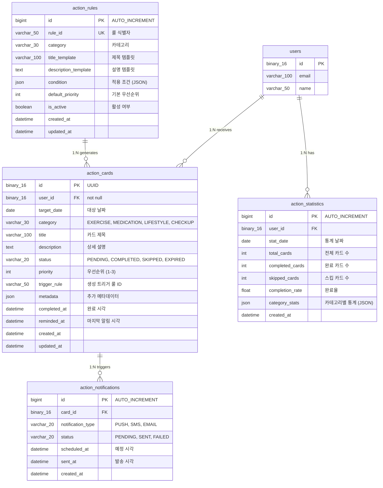
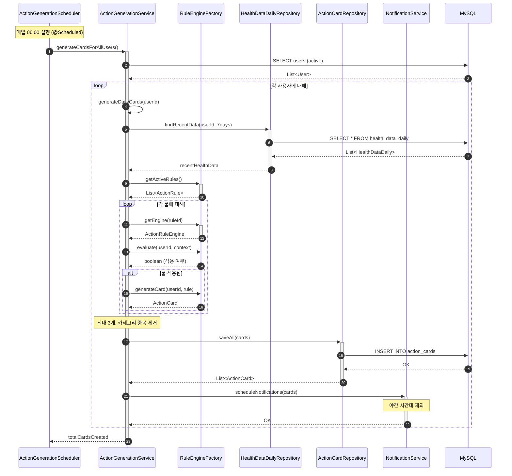
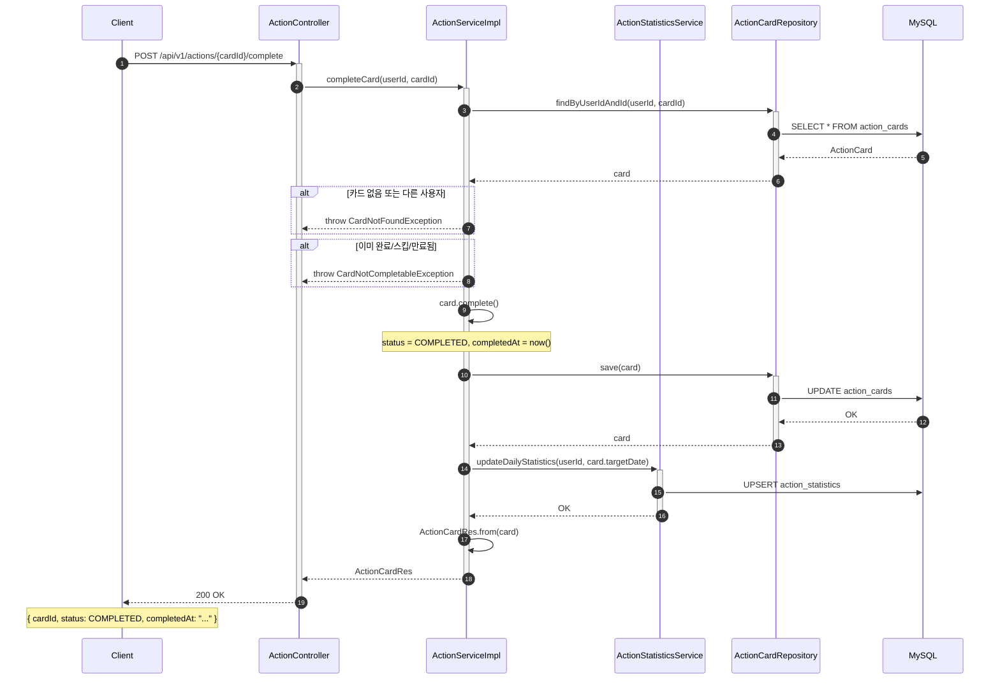

# [BE] Issue-06: 행동 카드(Action Card) 및 코칭 도메인 구현

## 1. 개요
**SRS REQ-FUNC-011~014**에 따라 매일 1~3개의 행동 카드를 생성하고 수행 결과를 추적하는 로직을 구현합니다.

## 2. 작업 워크플로우 (설계 및 구현)

| 단계 | 입력(Input) | 도구(Tool) | 출력(Output) |
| --- | --- | --- | --- |
| **Plan** | REQ-FUNC-011~014 | Cursor | 행동 추천 룰(Rule) 정의 |
| **Data Schema Design** | ActionCard | Mermaid.js | ERD 확인 |
| **Interaction Design** | Scheduler | Cursor | **Action Service & Scheduler** |
| **Review** | Batch Test | IDE Console | 일일 카드 생성 배치 확인 |

## 3. 상세 요구사항 (To-Do)

- [ ] **Domain: ActionCard**
    - `ActionCard` Entity 구현 (Status: PENDING, COMPLETED, SKIPPED)
    - 날짜별, 사용자별 인덱싱 고려
- [ ] **Daily Generation Logic**
    - Spring Scheduler를 이용한 일일 배치 (자정 or 새벽) 구현
    - 간단한 룰 기반(Rule-based) 카드 생성 로직 (예: 어제 걷기 부족 -> 오늘 걷기 카드)
- [ ] **Action API**
    - `/api/actions/today`: 오늘의 카드 목록 조회
    - `/api/actions/{id}/complete`: 수행 완료 처리
- [ ] **Statistics**
    - D1, W1 완료율 계산 로직 (간단한 통계 쿼리)

---

## 4. 3-Tier Architecture 데이터 흐름

### 4.1 행동 카드 플로우 개요

```
┌─────────────────────────────────────────────────────────────────────────┐
│                      행동 카드 코칭 데이터 흐름                          │
├─────────────────────────────────────────────────────────────────────────┤
│                                                                         │
│  [일일 배치] ActionGenerationScheduler (매일 새벽 6시)                  │
│  ├─ 전체 활성 사용자 조회                                               │
│  ├─ 사용자별 최근 건강 데이터 분석                                      │
│  ├─ 룰 기반 행동 카드 1~3개 생성                                        │
│  └─ 푸시 알림 발송 (야간 제외)                                          │
│                                                                         │
│  [카드 조회] ActionController.getTodayCards()                           │
│  ├─ 오늘 날짜 기준 사용자 카드 조회                                     │
│  └─ 우선순위 정렬하여 반환                                              │
│                                                                         │
│  [카드 완료] ActionController.completeCard()                            │
│  ├─ 카드 상태 COMPLETED로 변경                                          │
│  ├─ 완료 시각 기록                                                      │
│  └─ D1/W1 완료율 갱신                                                   │
│                                                                         │
│  [통계 조회] ActionStatisticsService                                    │
│  ├─ D1 완료율 (첫날 완료 비율)                                          │
│  ├─ W1 완료율 (첫 주 3일 이상 완료 비율)                                │
│  └─ 카테고리별 완료 통계                                                │
│                                                                         │
└─────────────────────────────────────────────────────────────────────────┘
```

### 4.2 행동 카드 생성 룰

```
┌─────────────────────────────────────────────────────────────────────────┐
│                         행동 카드 생성 규칙 (Rule-based)                 │
├─────────────────────────────────────────────────────────────────────────┤
│                                                                         │
│  [EXERCISE 카드]                                                        │
│  ├─ IF 어제 걸음수 < 5000 THEN "10분 가볍게 걷기" (우선순위 1)          │
│  ├─ IF 3일 연속 활동시간 < 30분 THEN "계단 오르기 5분" (우선순위 2)     │
│  └─ IF 주간 평균 걸음수 감소 추세 THEN "산책 15분" (우선순위 3)         │
│                                                                         │
│  [MEDICATION 카드]                                                      │
│  ├─ IF 복약 예정 시간 도래 THEN "약 복용 확인" (우선순위 1)             │
│  └─ IF 어제 복약 미완료 THEN "오늘 약 챙기기" (우선순위 1)              │
│                                                                         │
│  [CHECKUP 카드]                                                         │
│  ├─ IF 3일 연속 혈압 미측정 THEN "혈압 측정하기" (우선순위 2)           │
│  └─ IF 7일 연속 체중 미측정 THEN "체중 측정하기" (우선순위 3)           │
│                                                                         │
│  [LIFESTYLE 카드]                                                       │
│  ├─ IF 수면시간 < 6시간 THEN "오늘 일찍 취침하기" (우선순위 2)          │
│  └─ IF 물 섭취량 부족 THEN "물 한 잔 마시기" (우선순위 3)               │
│                                                                         │
│  [제한 조건]                                                            │
│  ├─ 하루 최대 3개 카드                                                  │
│  ├─ 카테고리당 최대 1개 카드                                            │
│  └─ 야간(22시~07시) 알림 자동 침묵                                      │
│                                                                         │
└─────────────────────────────────────────────────────────────────────────┘
```

### 4.3 구현 순서 (Repository → Service → Controller)

| 순서 | 계층 | 주요 작업 |
|------|------|----------|
| **1** | **Entity/Repository** | ActionCard Entity + Repository |
| **2** | **Service** | ActionService, ActionGenerationService, ActionStatisticsService |
| **3** | **Scheduler** | ActionGenerationScheduler (일일 배치) |
| **4** | **Controller** | ActionController (REST API) |

---

## 5. ERD (Entity Relationship Diagram)

> **행동 카드 도메인 데이터베이스 관점**: 카드 및 통계 데이터 구조

### 5.1 Action Domain ERD



### 5.2 테이블 상세 설계

#### action_cards 테이블

| 컬럼 | 타입 | 제약조건 | 설명 |
|------|------|----------|------|
| `id` | BINARY(16) | PK | UUID |
| `user_id` | BINARY(16) | FK, NOT NULL | 대상 사용자 |
| `target_date` | DATE | NOT NULL | 행동 대상 날짜 |
| `category` | VARCHAR(30) | NOT NULL | 카테고리 |
| `title` | VARCHAR(100) | NOT NULL | 카드 제목 |
| `description` | TEXT | NULL | 상세 설명 |
| `status` | VARCHAR(20) | NOT NULL, DEFAULT 'PENDING' | 상태 |
| `priority` | INT | NOT NULL, DEFAULT 2 | 우선순위 (1=높음) |
| `trigger_rule` | VARCHAR(50) | NULL | 생성 룰 ID |
| `metadata` | JSON | NULL | 추가 정보 |
| `completed_at` | DATETIME | NULL | 완료 시각 |

#### metadata JSON 구조 예시

```json
{
  "triggerData": {
    "yesterdaySteps": 3500,
    "targetSteps": 5000,
    "deficit": 1500
  },
  "recommendation": {
    "duration": 10,
    "unit": "minutes",
    "intensity": "light"
  },
  "reminder": {
    "times": ["09:00", "14:00"],
    "quietHours": { "start": "22:00", "end": "07:00" }
  }
}
```

#### 인덱스 설계

```sql
-- Action Cards Indexes
CREATE INDEX idx_actions_user_date ON action_cards(user_id, target_date);
CREATE INDEX idx_actions_date_status ON action_cards(target_date, status);
CREATE INDEX idx_actions_user_status ON action_cards(user_id, status);

-- Action Statistics Indexes
CREATE INDEX idx_stats_user_date ON action_statistics(user_id, stat_date);

-- Action Notifications Indexes
CREATE INDEX idx_notifications_card ON action_notifications(card_id);
CREATE INDEX idx_notifications_scheduled ON action_notifications(scheduled_at, status);
```

---

## 6. CLD (Class/Component Logic Diagram)

> **행동 카드 도메인 백엔드 서버 관점**: 생성 및 추적 로직 구조

### 6.1 Action 도메인 클래스 다이어그램

```mermaid
classDiagram
    %% =========================================================
    %% 1. PRESENTATION LAYER (Controller)
    %% =========================================================
    
    class ActionController {
        <<@RestController>>
        <<@RequestMapping /api/v1/actions>>
        -ActionService actionService
        +getTodayCards(@AuthUser UUID userId) ResponseEntity~ApiResponse~
        +getCardsByDate(@AuthUser UUID userId, LocalDate date) ResponseEntity~ApiResponse~
        +completeCard(@AuthUser UUID userId, UUID cardId) ResponseEntity~ApiResponse~
        +skipCard(@AuthUser UUID userId, UUID cardId) ResponseEntity~ApiResponse~
        +getStatistics(@AuthUser UUID userId, StatsPeriod period) ResponseEntity~ApiResponse~
    }

    %% =========================================================
    %% 2. APPLICATION LAYER (Service)
    %% =========================================================
    
    class ActionService {
        <<interface>>
        +getTodayCards(UUID userId) List~ActionCardRes~
        +getCardsByDate(UUID userId, LocalDate date) List~ActionCardRes~
        +completeCard(UUID userId, UUID cardId) ActionCardRes
        +skipCard(UUID userId, UUID cardId) ActionCardRes
        +getStatistics(UUID userId, StatsPeriod period) ActionStatsRes
    }

    class ActionServiceImpl {
        <<@Service>>
        <<@Transactional>>
        -ActionCardRepository cardRepository
        -ActionStatisticsRepository statsRepository
        -ActionNotificationService notificationService
        +getTodayCards(UUID userId) List~ActionCardRes~
        +getCardsByDate(UUID userId, LocalDate date) List~ActionCardRes~
        +completeCard(UUID userId, UUID cardId) ActionCardRes
        +skipCard(UUID userId, UUID cardId) ActionCardRes
        +getStatistics(UUID userId, StatsPeriod period) ActionStatsRes
        -updateDailyStatistics(UUID userId, LocalDate date) void
    }

    class ActionGenerationService {
        <<@Service>>
        -ActionCardRepository cardRepository
        -ActionRuleRepository ruleRepository
        -HealthDataDailyRepository healthDataRepository
        -RuleEngineFactory ruleEngineFactory
        +generateDailyCards(UUID userId) List~ActionCard~
        +generateCardsForAllUsers() int
        -evaluateRules(UUID userId) List~RuleResult~
        -createCardsFromRules(UUID userId, rules) List~ActionCard~
    }

    class ActionStatisticsService {
        <<@Service>>
        -ActionStatisticsRepository statsRepository
        -ActionCardRepository cardRepository
        +calculateD1CompletionRate(UUID userId) float
        +calculateW1CompletionRate(UUID userId) float
        +calculateCategoryStats(UUID userId, period) Map~String, Stats~
        +updateDailyStatistics(UUID userId, LocalDate date) void
    }

    %% =========================================================
    %% 3. SCHEDULER
    %% =========================================================

    class ActionGenerationScheduler {
        <<@Component>>
        -ActionGenerationService generationService
        -NotificationService notificationService
        +generateDailyCardsForAllUsers() void
        +cleanupExpiredCards() void
    }

    %% =========================================================
    %% 4. DOMAIN LAYER (Entity)
    %% =========================================================
    
    class ActionCard {
        <<@Entity>>
        -UUID id
        -User user
        -LocalDate targetDate
        -ActionCategory category
        -String title
        -String description
        -ActionStatus status
        -int priority
        -String triggerRule
        -String metadata
        -LocalDateTime completedAt
        -LocalDateTime remindedAt
        +static create(user, date, category, title) ActionCard
        +complete() void
        +skip() void
        +expire() void
        +isCompletable() boolean
    }

    class ActionRule {
        <<@Entity>>
        -Long id
        -String ruleId
        -ActionCategory category
        -String titleTemplate
        -String descriptionTemplate
        -String condition
        -int defaultPriority
        -boolean isActive
    }

    class ActionStatistics {
        <<@Entity>>
        -Long id
        -User user
        -LocalDate statDate
        -int totalCards
        -int completedCards
        -int skippedCards
        -float completionRate
        -String categoryStats
    }

    class ActionCategory {
        <<enumeration>>
        EXERCISE
        MEDICATION
        LIFESTYLE
        CHECKUP
    }

    class ActionStatus {
        <<enumeration>>
        PENDING
        COMPLETED
        SKIPPED
        EXPIRED
    }

    %% =========================================================
    %% 5. INFRASTRUCTURE LAYER (Repository)
    %% =========================================================
    
    class ActionCardRepository {
        <<@Repository>>
        +findByUserIdAndTargetDate(userId, date) List~ActionCard~
        +findByUserIdAndTargetDateAndStatus(userId, date, status) List~ActionCard~
        +findByUserIdAndId(userId, id) Optional~ActionCard~
        +countByUserIdAndTargetDateAndStatus(userId, date, status) int
        +findPendingCardsByDate(date) List~ActionCard~
    }

    class ActionRuleRepository {
        <<@Repository>>
        +findAllByIsActiveTrue() List~ActionRule~
        +findByRuleId(ruleId) Optional~ActionRule~
        +findByCategory(category) List~ActionRule~
    }

    class ActionStatisticsRepository {
        <<@Repository>>
        +findByUserIdAndStatDate(userId, date) Optional~ActionStatistics~
        +findByUserIdAndStatDateBetween(userId, start, end) List~ActionStatistics~
        +calculateAverageCompletionRate(userId, start, end) float
    }

    %% =========================================================
    %% 6. RULE ENGINE (Strategy Pattern)
    %% =========================================================

    class RuleEngineFactory {
        <<@Component>>
        -Map~String, ActionRuleEngine~ engines
        +getEngine(String ruleId) ActionRuleEngine
    }

    class ActionRuleEngine {
        <<interface>>
        +evaluate(UUID userId, context) boolean
        +generateCard(UUID userId, ActionRule rule) ActionCard
        +getRuleId() String
    }

    class ExerciseRuleEngine {
        <<@Component>>
        -HealthDataDailyRepository healthDataRepository
        +evaluate(UUID userId, context) boolean
        +generateCard(UUID userId, ActionRule rule) ActionCard
        +getRuleId() String
    }

    class MedicationRuleEngine {
        <<@Component>>
        +evaluate(UUID userId, context) boolean
        +generateCard(UUID userId, ActionRule rule) ActionCard
        +getRuleId() String
    }

    %% =========================================================
    %% 7. DTOs
    %% =========================================================
    
    class ActionCardRes {
        <<Response DTO>>
        -UUID cardId
        -LocalDate targetDate
        -ActionCategory category
        -String title
        -String description
        -ActionStatus status
        -int priority
        -LocalDateTime completedAt
        +static from(ActionCard) ActionCardRes
    }

    class ActionStatsRes {
        <<Response DTO>>
        -float d1CompletionRate
        -float w1CompletionRate
        -float overallCompletionRate
        -Map~ActionCategory, CategoryStats~ categoryStats
        -List~DailyStats~ dailyTrend
    }

    %% =========================================================
    %% RELATIONSHIPS
    %% =========================================================
    
    ActionController --> ActionService : uses
    ActionServiceImpl ..|> ActionService : implements
    ActionServiceImpl --> ActionCardRepository : uses
    ActionServiceImpl --> ActionStatisticsRepository : uses
    ActionServiceImpl --> ActionStatisticsService : uses
    
    ActionGenerationService --> ActionCardRepository : uses
    ActionGenerationService --> ActionRuleRepository : uses
    ActionGenerationService --> RuleEngineFactory : uses
    
    ActionGenerationScheduler --> ActionGenerationService : uses
    
    RuleEngineFactory --> ActionRuleEngine : creates
    ExerciseRuleEngine ..|> ActionRuleEngine : implements
    MedicationRuleEngine ..|> ActionRuleEngine : implements
    
    ActionCardRepository ..> ActionCard : manages
    ActionRuleRepository ..> ActionRule : manages
    ActionStatisticsRepository ..> ActionStatistics : manages
    
    ActionCard --> ActionCategory : uses
    ActionCard --> ActionStatus : uses
```



### 6.2 행동 카드 생성 시퀀스 다이어그램 (일일 배치)



### 6.3 행동 카드 완료 시퀀스 다이어그램



---

## 7. ORM 예제코드 (Action Domain)

> **행동 카드 도메인 연결 관점**: Entity, Repository, Service, Scheduler 구현

### 7.1 ActionCard Entity

```java
package com.pollosseum.domain.action.entity;

import com.pollosseum.domain.common.BaseTimeEntity;
import com.pollosseum.domain.user.entity.User;
import jakarta.persistence.*;
import lombok.*;
import org.hibernate.annotations.JdbcTypeCode;
import org.hibernate.type.SqlTypes;

import java.time.LocalDate;
import java.time.LocalDateTime;
import java.util.Map;
import java.util.UUID;

/**
 * 행동 카드 Entity
 * - 일일 1~3개 행동 코칭 카드
 */
@Entity
@Table(name = "action_cards",
    indexes = {
        @Index(name = "idx_actions_user_date", columnList = "user_id, target_date"),
        @Index(name = "idx_actions_date_status", columnList = "target_date, status"),
        @Index(name = "idx_actions_user_status", columnList = "user_id, status")
    }
)
@Getter
@NoArgsConstructor(access = AccessLevel.PROTECTED)
public class ActionCard extends BaseTimeEntity {

    @Id
    @GeneratedValue(strategy = GenerationType.UUID)
    @Column(columnDefinition = "BINARY(16)")
    private UUID id;

    @ManyToOne(fetch = FetchType.LAZY)
    @JoinColumn(name = "user_id", nullable = false)
    private User user;

    @Column(name = "target_date", nullable = false)
    private LocalDate targetDate;

    @Enumerated(EnumType.STRING)
    @Column(nullable = false, length = 30)
    private ActionCategory category;

    @Column(nullable = false, length = 100)
    private String title;

    @Column(columnDefinition = "TEXT")
    private String description;

    @Enumerated(EnumType.STRING)
    @Column(nullable = false, length = 20)
    private ActionStatus status;

    @Column(nullable = false)
    private int priority;

    @Column(name = "trigger_rule", length = 50)
    private String triggerRule;

    @JdbcTypeCode(SqlTypes.JSON)
    @Column(columnDefinition = "JSON")
    private Map<String, Object> metadata;

    @Column(name = "completed_at")
    private LocalDateTime completedAt;

    @Column(name = "reminded_at")
    private LocalDateTime remindedAt;

    // ========================================
    // Builder
    // ========================================
    @Builder
    private ActionCard(User user, LocalDate targetDate, ActionCategory category,
                       String title, String description, int priority,
                       String triggerRule, Map<String, Object> metadata) {
        this.user = user;
        this.targetDate = targetDate;
        this.category = category;
        this.title = title;
        this.description = description;
        this.status = ActionStatus.PENDING;
        this.priority = priority;
        this.triggerRule = triggerRule;
        this.metadata = metadata;
    }

    // ========================================
    // Factory Methods
    // ========================================

    /**
     * 운동 카드 생성
     */
    public static ActionCard createExerciseCard(User user, LocalDate date, 
                                                 String title, String description,
                                                 int priority, String ruleId) {
        return ActionCard.builder()
                .user(user)
                .targetDate(date)
                .category(ActionCategory.EXERCISE)
                .title(title)
                .description(description)
                .priority(priority)
                .triggerRule(ruleId)
                .build();
    }

    /**
     * 복약 카드 생성
     */
    public static ActionCard createMedicationCard(User user, LocalDate date,
                                                   String title, String description) {
        return ActionCard.builder()
                .user(user)
                .targetDate(date)
                .category(ActionCategory.MEDICATION)
                .title(title)
                .description(description)
                .priority(1) // 복약은 항상 높은 우선순위
                .build();
    }

    /**
     * 측정 카드 생성
     */
    public static ActionCard createCheckupCard(User user, LocalDate date,
                                                String title, String description,
                                                int priority, String ruleId) {
        return ActionCard.builder()
                .user(user)
                .targetDate(date)
                .category(ActionCategory.CHECKUP)
                .title(title)
                .description(description)
                .priority(priority)
                .triggerRule(ruleId)
                .build();
    }

    // ========================================
    // Business Methods
    // ========================================

    /**
     * 카드 완료 처리
     */
    public void complete() {
        if (!isCompletable()) {
            throw new IllegalStateException("완료할 수 없는 상태입니다: " + status);
        }
        this.status = ActionStatus.COMPLETED;
        this.completedAt = LocalDateTime.now();
    }

    /**
     * 카드 스킵 처리
     */
    public void skip() {
        if (!isCompletable()) {
            throw new IllegalStateException("스킵할 수 없는 상태입니다: " + status);
        }
        this.status = ActionStatus.SKIPPED;
    }

    /**
     * 카드 만료 처리
     */
    public void expire() {
        if (status == ActionStatus.PENDING) {
            this.status = ActionStatus.EXPIRED;
        }
    }

    /**
     * 완료/스킵 가능 여부
     */
    public boolean isCompletable() {
        return status == ActionStatus.PENDING;
    }

    /**
     * 알림 시각 갱신
     */
    public void updateRemindedAt() {
        this.remindedAt = LocalDateTime.now();
    }

    /**
     * 메타데이터 설정
     */
    public void setMetadata(Map<String, Object> metadata) {
        this.metadata = metadata;
    }
}
```

### 7.2 ActionRule Entity

```java
package com.pollosseum.domain.action.entity;

import com.pollosseum.domain.common.BaseTimeEntity;
import jakarta.persistence.*;
import lombok.*;
import org.hibernate.annotations.JdbcTypeCode;
import org.hibernate.type.SqlTypes;

import java.util.Map;

/**
 * 행동 카드 생성 규칙 Entity
 */
@Entity
@Table(name = "action_rules",
    indexes = {
        @Index(name = "idx_rules_category", columnList = "category"),
        @Index(name = "idx_rules_active", columnList = "is_active")
    },
    uniqueConstraints = {
        @UniqueConstraint(name = "uk_rules_rule_id", columnNames = "rule_id")
    }
)
@Getter
@NoArgsConstructor(access = AccessLevel.PROTECTED)
public class ActionRule extends BaseTimeEntity {

    @Id
    @GeneratedValue(strategy = GenerationType.IDENTITY)
    private Long id;

    @Column(name = "rule_id", nullable = false, unique = true, length = 50)
    private String ruleId;

    @Enumerated(EnumType.STRING)
    @Column(nullable = false, length = 30)
    private ActionCategory category;

    @Column(name = "title_template", nullable = false, length = 100)
    private String titleTemplate;

    @Column(name = "description_template", columnDefinition = "TEXT")
    private String descriptionTemplate;

    @JdbcTypeCode(SqlTypes.JSON)
    @Column(name = "condition_config", columnDefinition = "JSON")
    private Map<String, Object> conditionConfig;

    @Column(name = "default_priority", nullable = false)
    private int defaultPriority;

    @Column(name = "is_active", nullable = false)
    private boolean isActive;

    // ========================================
    // Builder
    // ========================================
    @Builder
    private ActionRule(String ruleId, ActionCategory category,
                       String titleTemplate, String descriptionTemplate,
                       Map<String, Object> conditionConfig, int defaultPriority) {
        this.ruleId = ruleId;
        this.category = category;
        this.titleTemplate = titleTemplate;
        this.descriptionTemplate = descriptionTemplate;
        this.conditionConfig = conditionConfig;
        this.defaultPriority = defaultPriority;
        this.isActive = true;
    }

    // ========================================
    // Business Methods
    // ========================================

    public void activate() {
        this.isActive = true;
    }

    public void deactivate() {
        this.isActive = false;
    }

    /**
     * 조건 값 조회
     */
    @SuppressWarnings("unchecked")
    public <T> T getConditionValue(String key) {
        if (conditionConfig == null) {
            return null;
        }
        return (T) conditionConfig.get(key);
    }
}
```

### 7.3 ActionStatistics Entity

```java
package com.pollosseum.domain.action.entity;

import com.pollosseum.domain.common.BaseTimeEntity;
import com.pollosseum.domain.user.entity.User;
import jakarta.persistence.*;
import lombok.*;
import org.hibernate.annotations.JdbcTypeCode;
import org.hibernate.type.SqlTypes;

import java.time.LocalDate;
import java.util.Map;

/**
 * 행동 카드 통계 Entity
 * - 일별 완료율 집계
 */
@Entity
@Table(name = "action_statistics",
    indexes = {
        @Index(name = "idx_stats_user_date", columnList = "user_id, stat_date")
    },
    uniqueConstraints = {
        @UniqueConstraint(name = "uk_stats_user_date", columnNames = {"user_id", "stat_date"})
    }
)
@Getter
@NoArgsConstructor(access = AccessLevel.PROTECTED)
public class ActionStatistics extends BaseTimeEntity {

    @Id
    @GeneratedValue(strategy = GenerationType.IDENTITY)
    private Long id;

    @ManyToOne(fetch = FetchType.LAZY)
    @JoinColumn(name = "user_id", nullable = false)
    private User user;

    @Column(name = "stat_date", nullable = false)
    private LocalDate statDate;

    @Column(name = "total_cards", nullable = false)
    private int totalCards;

    @Column(name = "completed_cards", nullable = false)
    private int completedCards;

    @Column(name = "skipped_cards", nullable = false)
    private int skippedCards;

    @Column(name = "completion_rate", nullable = false)
    private float completionRate;

    @JdbcTypeCode(SqlTypes.JSON)
    @Column(name = "category_stats", columnDefinition = "JSON")
    private Map<String, Object> categoryStats;

    // ========================================
    // Builder
    // ========================================
    @Builder
    private ActionStatistics(User user, LocalDate statDate, int totalCards,
                             int completedCards, int skippedCards) {
        this.user = user;
        this.statDate = statDate;
        this.totalCards = totalCards;
        this.completedCards = completedCards;
        this.skippedCards = skippedCards;
        this.completionRate = totalCards > 0 ? (float) completedCards / totalCards : 0f;
    }

    // ========================================
    // Business Methods
    // ========================================

    /**
     * 통계 갱신
     */
    public void update(int totalCards, int completedCards, int skippedCards,
                       Map<String, Object> categoryStats) {
        this.totalCards = totalCards;
        this.completedCards = completedCards;
        this.skippedCards = skippedCards;
        this.completionRate = totalCards > 0 ? (float) completedCards / totalCards : 0f;
        this.categoryStats = categoryStats;
    }
}
```

### 7.4 Enum 정의

```java
// ActionCategory.java
package com.pollosseum.domain.action.entity;

public enum ActionCategory {
    EXERCISE,     // 운동
    MEDICATION,   // 복약
    LIFESTYLE,    // 생활습관
    CHECKUP       // 측정/검진
}

// ActionStatus.java
package com.pollosseum.domain.action.entity;

public enum ActionStatus {
    PENDING,    // 대기 (미완료)
    COMPLETED,  // 완료
    SKIPPED,    // 건너뜀
    EXPIRED     // 만료 (당일 미완료)
}
```

### 7.5 Repository 인터페이스

```java
// ========================================
// ActionCardRepository.java
// ========================================
package com.pollosseum.infrastructure.repository;

import com.pollosseum.domain.action.entity.ActionCard;
import com.pollosseum.domain.action.entity.ActionCategory;
import com.pollosseum.domain.action.entity.ActionStatus;
import org.springframework.data.jpa.repository.JpaRepository;
import org.springframework.data.jpa.repository.Modifying;
import org.springframework.data.jpa.repository.Query;
import org.springframework.data.repository.query.Param;
import org.springframework.stereotype.Repository;

import java.time.LocalDate;
import java.util.List;
import java.util.Optional;
import java.util.UUID;

@Repository
public interface ActionCardRepository extends JpaRepository<ActionCard, UUID> {

    /**
     * 사용자의 특정 날짜 카드 조회 (우선순위 정렬)
     */
    List<ActionCard> findByUserIdAndTargetDateOrderByPriority(UUID userId, LocalDate date);

    /**
     * 사용자의 특정 날짜, 상태 카드 조회
     */
    List<ActionCard> findByUserIdAndTargetDateAndStatus(
            UUID userId, LocalDate date, ActionStatus status);

    /**
     * 사용자의 특정 카드 조회
     */
    Optional<ActionCard> findByUserIdAndId(UUID userId, UUID id);

    /**
     * 사용자의 특정 날짜, 카테고리 카드 존재 여부
     */
    boolean existsByUserIdAndTargetDateAndCategory(
            UUID userId, LocalDate date, ActionCategory category);

    /**
     * 특정 날짜의 대기 카드 조회 (만료 처리용)
     */
    @Query("SELECT ac FROM ActionCard ac WHERE ac.targetDate < :date AND ac.status = 'PENDING'")
    List<ActionCard> findPendingCardsBefore(@Param("date") LocalDate date);

    /**
     * 대기 카드 일괄 만료 처리
     */
    @Modifying
    @Query("UPDATE ActionCard ac SET ac.status = 'EXPIRED' " +
           "WHERE ac.targetDate < :date AND ac.status = 'PENDING'")
    int expireOldPendingCards(@Param("date") LocalDate date);

    /**
     * 기간별 완료 카드 수 조회
     */
    @Query("SELECT COUNT(ac) FROM ActionCard ac " +
           "WHERE ac.user.id = :userId AND ac.targetDate BETWEEN :start AND :end " +
           "AND ac.status = 'COMPLETED'")
    int countCompletedCards(@Param("userId") UUID userId,
                            @Param("start") LocalDate start,
                            @Param("end") LocalDate end);

    /**
     * 기간별 전체 카드 수 조회
     */
    @Query("SELECT COUNT(ac) FROM ActionCard ac " +
           "WHERE ac.user.id = :userId AND ac.targetDate BETWEEN :start AND :end")
    int countTotalCards(@Param("userId") UUID userId,
                        @Param("start") LocalDate start,
                        @Param("end") LocalDate end);
}

// ========================================
// ActionStatisticsRepository.java
// ========================================
package com.pollosseum.infrastructure.repository;

import com.pollosseum.domain.action.entity.ActionStatistics;
import org.springframework.data.jpa.repository.JpaRepository;
import org.springframework.data.jpa.repository.Query;
import org.springframework.data.repository.query.Param;
import org.springframework.stereotype.Repository;

import java.time.LocalDate;
import java.util.List;
import java.util.Optional;
import java.util.UUID;

@Repository
public interface ActionStatisticsRepository extends JpaRepository<ActionStatistics, Long> {

    /**
     * 사용자의 특정 날짜 통계 조회
     */
    Optional<ActionStatistics> findByUserIdAndStatDate(UUID userId, LocalDate date);

    /**
     * 사용자의 기간별 통계 조회
     */
    List<ActionStatistics> findByUserIdAndStatDateBetweenOrderByStatDate(
            UUID userId, LocalDate start, LocalDate end);

    /**
     * 기간별 평균 완료율 조회
     */
    @Query("SELECT AVG(s.completionRate) FROM ActionStatistics s " +
           "WHERE s.user.id = :userId AND s.statDate BETWEEN :start AND :end")
    Float calculateAverageCompletionRate(@Param("userId") UUID userId,
                                         @Param("start") LocalDate start,
                                         @Param("end") LocalDate end);
}
```

### 7.6 ActionGenerationScheduler

```java
package com.pollosseum.infrastructure.scheduler;

import com.pollosseum.application.service.ActionGenerationService;
import com.pollosseum.infrastructure.repository.ActionCardRepository;
import lombok.RequiredArgsConstructor;
import lombok.extern.slf4j.Slf4j;
import org.springframework.scheduling.annotation.Scheduled;
import org.springframework.stereotype.Component;
import org.springframework.transaction.annotation.Transactional;

import java.time.LocalDate;

/**
 * 행동 카드 생성 스케줄러
 * - 매일 새벽 6시 카드 생성
 * - 자정 만료 카드 처리
 */
@Slf4j
@Component
@RequiredArgsConstructor
public class ActionGenerationScheduler {

    private final ActionGenerationService generationService;
    private final ActionCardRepository cardRepository;

    /**
     * 일일 행동 카드 생성 (매일 06:00)
     */
    @Scheduled(cron = "0 0 6 * * *")
    public void generateDailyCards() {
        log.info("일일 행동 카드 생성 배치 시작");
        
        try {
            int totalCards = generationService.generateCardsForAllUsers();
            log.info("일일 행동 카드 생성 완료: 총 {}개 카드 생성", totalCards);
        } catch (Exception e) {
            log.error("일일 행동 카드 생성 실패", e);
        }
    }

    /**
     * 만료 카드 처리 (매일 00:05)
     */
    @Scheduled(cron = "0 5 0 * * *")
    @Transactional
    public void expireOldCards() {
        log.info("만료 카드 처리 배치 시작");
        
        try {
            LocalDate yesterday = LocalDate.now().minusDays(1);
            int expiredCount = cardRepository.expireOldPendingCards(yesterday);
            log.info("만료 카드 처리 완료: {}개 카드 만료 처리", expiredCount);
        } catch (Exception e) {
            log.error("만료 카드 처리 실패", e);
        }
    }
}
```

### 7.7 ActionService 구현

```java
package com.pollosseum.application.service;

import com.pollosseum.domain.action.entity.*;
import com.pollosseum.infrastructure.repository.*;
import com.pollosseum.interfaces.api.dto.response.*;
import lombok.RequiredArgsConstructor;
import org.springframework.stereotype.Service;
import org.springframework.transaction.annotation.Transactional;

import java.time.LocalDate;
import java.util.*;

/**
 * 행동 카드 서비스 구현체
 */
@Service
@RequiredArgsConstructor
@Transactional(readOnly = true)
public class ActionServiceImpl implements ActionService {

    private final ActionCardRepository cardRepository;
    private final ActionStatisticsRepository statsRepository;
    private final ActionStatisticsService statisticsService;

    /**
     * 오늘의 행동 카드 조회
     */
    @Override
    public List<ActionCardRes> getTodayCards(UUID userId) {
        LocalDate today = LocalDate.now();
        return getCardsByDate(userId, today);
    }

    /**
     * 특정 날짜 행동 카드 조회
     */
    @Override
    public List<ActionCardRes> getCardsByDate(UUID userId, LocalDate date) {
        List<ActionCard> cards = cardRepository
                .findByUserIdAndTargetDateOrderByPriority(userId, date);
        
        return cards.stream()
                .map(ActionCardRes::from)
                .toList();
    }

    /**
     * 행동 카드 완료 처리
     */
    @Override
    @Transactional
    public ActionCardRes completeCard(UUID userId, UUID cardId) {
        ActionCard card = cardRepository.findByUserIdAndId(userId, cardId)
                .orElseThrow(() -> new CardNotFoundException("카드를 찾을 수 없습니다."));

        card.complete();
        cardRepository.save(card);

        // 일별 통계 갱신
        statisticsService.updateDailyStatistics(userId, card.getTargetDate());

        return ActionCardRes.from(card);
    }

    /**
     * 행동 카드 스킵 처리
     */
    @Override
    @Transactional
    public ActionCardRes skipCard(UUID userId, UUID cardId) {
        ActionCard card = cardRepository.findByUserIdAndId(userId, cardId)
                .orElseThrow(() -> new CardNotFoundException("카드를 찾을 수 없습니다."));

        card.skip();
        cardRepository.save(card);

        // 일별 통계 갱신
        statisticsService.updateDailyStatistics(userId, card.getTargetDate());

        return ActionCardRes.from(card);
    }

    /**
     * 통계 조회
     */
    @Override
    public ActionStatsRes getStatistics(UUID userId, StatsPeriod period) {
        LocalDate endDate = LocalDate.now();
        LocalDate startDate = switch (period) {
            case DAY -> endDate;
            case WEEK -> endDate.minusWeeks(1);
            case MONTH -> endDate.minusMonths(1);
        };

        float d1Rate = statisticsService.calculateD1CompletionRate(userId);
        float w1Rate = statisticsService.calculateW1CompletionRate(userId);
        Float avgRate = statsRepository.calculateAverageCompletionRate(userId, startDate, endDate);

        List<ActionStatistics> dailyStats = statsRepository
                .findByUserIdAndStatDateBetweenOrderByStatDate(userId, startDate, endDate);

        return ActionStatsRes.builder()
                .d1CompletionRate(d1Rate)
                .w1CompletionRate(w1Rate)
                .overallCompletionRate(avgRate != null ? avgRate : 0f)
                .dailyTrend(dailyStats.stream()
                        .map(DailyStats::from)
                        .toList())
                .build();
    }
}
```

---

## 8. 패키지 구조

```
src/main/java/com/pollosseum/
├── domain/
│   └── action/
│       └── entity/
│           ├── ActionCard.java
│           ├── ActionRule.java
│           ├── ActionStatistics.java
│           ├── ActionCategory.java
│           └── ActionStatus.java
│
├── application/
│   └── service/
│       ├── ActionService.java
│       ├── ActionServiceImpl.java
│       ├── ActionGenerationService.java
│       └── ActionStatisticsService.java
│
├── infrastructure/
│   ├── repository/
│   │   ├── ActionCardRepository.java
│   │   ├── ActionRuleRepository.java
│   │   └── ActionStatisticsRepository.java
│   │
│   └── scheduler/
│       └── ActionGenerationScheduler.java
│
└── interfaces/
    ├── api/
    │   └── ActionController.java
    │
    └── dto/
        └── response/
            ├── ActionCardRes.java
            └── ActionStatsRes.java
```

---

## 9. API 명세 요약

| Method | Endpoint | 설명 | Auth |
|--------|----------|------|------|
| `GET` | `/api/v1/actions/today` | 오늘의 카드 조회 | ○ |
| `GET` | `/api/v1/actions` | 특정 날짜 카드 조회 | ○ |
| `POST` | `/api/v1/actions/{id}/complete` | 카드 완료 처리 | ○ |
| `POST` | `/api/v1/actions/{id}/skip` | 카드 스킵 처리 | ○ |
| `GET` | `/api/v1/actions/statistics` | 완료 통계 조회 | ○ |

---

## 10. 구현 체크포인트

### 10.1 Entity 체크리스트

- [ ] ActionCard - UUID PK, 상태 관리, 우선순위
- [ ] ActionRule - 생성 규칙 정의, 조건 JSON
- [ ] ActionStatistics - 일별 통계, 완료율 계산

### 10.2 Scheduler 체크리스트

- [ ] 일일 카드 생성 (06:00)
- [ ] 만료 카드 처리 (00:05)
- [ ] 알림 발송 스케줄링 (야간 제외)

### 10.3 통계 체크리스트

- [ ] D1 완료율 (첫날 완료 비율)
- [ ] W1 완료율 (첫 주 3일 이상 완료)
- [ ] 카테고리별 완료율

---

## 10. Traceability (요구사항 추적성)

### 10.1 관련 요구사항 매핑

#### Functional Requirements
- **REQ-FUNC-011**: 일일 행동 카드 생성
  - 사용자의 최근 상태에 따라 하루 1~3개의 행동 카드 생성
- **REQ-FUNC-012**: 행동 카드 알림 및 야간 자동 침묵
  - 알림 전송 및 야간(22~07시) 자동 침묵 모드 적용
- **REQ-FUNC-013**: 행동 카드 완료 추적
  - 수락/완료 여부 기록 및 D1/W1 기준 완료율 산출
- **REQ-FUNC-014**: 행동 카드 오류/실패 처리
  - 네트워크 오류 시 재시도 및 오프라인 큐잉으로 데이터 유실 방지

#### Non-Functional Requirements (직접 연결)
- **REQ-NF-001** (성능): 앱 초기 로드 p95 ≤ 1.5초, 전환 p95 ≤ 800ms
  - 행동 카드 조회 API 응답 시간 최적화 필요
- **REQ-NF-005** (동기화): 가족 보드 및 알림 관련 데이터 동기화 지연 p95 ≤ 60초
  - 행동 카드 완료 상태가 가족 보드에 동기화되는 구조
- **REQ-NF-012** (KPI - Onboarding): 온보딩 완료율 35% → 65%+
  - 행동 카드가 온보딩 후 첫 가치로 제공되어 완료율에 기여
- **REQ-NF-015** (KPI - Adherence): 복약 순응도 기준선 대비 +15%p 향상
  - 행동 카드의 복약 관련 카드가 순응도 향상에 기여

#### Non-Functional Requirements (간접 연결)
- **REQ-NF-003** (온보딩 성능): 온보딩 p50 ≤ 180초
  - 온보딩 완료 후 첫 행동 카드 제공이 첫 가치 도달에 기여
- **REQ-NF-008** (접근성): 스크린리더 라벨 누락 0건, 포커스 트랩 0건
  - 행동 카드 UI의 접근성 고려 필요

#### Story Mapping
- **Story 2**: As a Senior, I want only 1–3 actionable nudges per day so that I can reduce fatigue and build consistent habits
  - REQ-FUNC-011~014가 Story 2의 핵심 요구사항
  - REQ-NF-001, 005, 012, 015가 Story 2의 성능 및 KPI 요구사항

### 10.2 Test Cases (예상)

- **TC-S2-01**: 일일 배치로 1~3개 행동 카드 생성 확인
- **TC-S2-02**: 야간 시간(22~07시) 알림 자동 침묵 확인
- **TC-S2-03**: 행동 카드 완료 시 D1/W1 완료율 계산 확인
- **TC-S2-04**: 행동 카드 조회 p95 ≤ 800ms 성능 측정
- **TC-S2-05**: 네트워크 오류 시 오프라인 큐잉 및 재시도 확인
- **TC-S2-06**: 행동 카드 완료율 통계 수집 확인

---

## 11. 참고 자료

- SRS 3.4.2 행동 카드 생성 및 완료 플로우
- SRS 4.1.1 Functional Requirements (REQ-FUNC-011~014)
- SRS 4.2 Non-Functional Requirements (REQ-NF-001, 005, 012, 015)
- SRS 5. Traceability Matrix (Story 2)
- SRS 6.2.4 ActionCard
- `studio/Tasks/BE_issue/issue-01-be-setup.md`
