# [BE] Issue-07: 가족 보드(Family Board) 및 권한 관리 구현

## 1. 개요
**SRS REQ-FUNC-015~018**에 따라 시니어와 보호자 간의 데이터 공유, 역할 위임, 초대 기능을 구현합니다.

## 2. 작업 워크플로우 (설계 및 구현)

| 단계 | 입력(Input) | 도구(Tool) | 출력(Output) |
| --- | --- | --- | --- |
| **Plan** | REQ-FUNC-015~018 | Cursor | 초대/수락 시퀀스 정의 |
| **Data Schema Design** | FamilyBoard, Member | Mermaid.js | N:M 관계 테이블 설계 |
| **Interaction Design** | Permission Check | Cursor | **Board Service & Security Logic** |
| **Review** | Scenario Test | Postman | 초대~수락~접근 테스트 |

## 3. 상세 요구사항 (To-Do)

- [ ] **Domain: FamilyBoard**
    - `FamilyBoard` Entity 및 `AccessRole` (User-Board 매핑) 구현
    - 역할 정의: `VIEWER`, `EDITOR`, `ADMIN`
- [ ] **Invitation Logic**
    - 초대 코드 생성 및 검증 로직
    - `/api/family-board/invite`: 초대 발송
    - `/api/family-board/accept`: 초대 수락 및 역할 부여
- [ ] **Data Synchronization (Basic)**
    - 보드 내 데이터(일정, 알림 등) 변경 시 갱신 로직
    - (MVP) Polling 대응을 위한 `lastUpdatedAt` 타임스탬프 관리

---

## 4. 3-Tier Architecture 데이터 흐름

### 4.1 가족 보드 플로우 개요

```
┌─────────────────────────────────────────────────────────────────────────┐
│                         가족 보드 데이터 흐름                            │
├─────────────────────────────────────────────────────────────────────────┤
│                                                                         │
│  [보드 생성] 시니어 회원가입/온보딩 완료 시                              │
│  ├─ FamilyBoard 자동 생성                                               │
│  └─ 시니어를 ADMIN 역할로 자동 등록                                      │
│                                                                         │
│  [초대 플로우] 3단계 초대→동의→역할부여                                  │
│  ├─ Step 1: 시니어/ADMIN이 초대 코드 생성                               │
│  ├─ Step 2: 보호자가 초대 코드로 가입/수락                               │
│  └─ Step 3: 역할(VIEWER/EDITOR) 부여 및 동의 기록                        │
│                                                                         │
│  [데이터 공유] 보드 내 정보 동기화                                       │
│  ├─ 일정 (복약, 검진 예정 등)                                           │
│  ├─ 알림 (위험 알림, 행동 카드 등)                                       │
│  └─ 건강 데이터 요약 (열람 권한에 따라)                                  │
│                                                                         │
│  [권한 관리]                                                            │
│  ├─ VIEWER: 데이터 열람만 가능                                          │
│  ├─ EDITOR: 일정 수정, 알림 관리 가능                                   │
│  └─ ADMIN: 멤버 초대/제거, 역할 변경 가능                               │
│                                                                         │
└─────────────────────────────────────────────────────────────────────────┘
```

### 4.2 초대 플로우 상태 머신

```
┌─────────────────┐     ┌─────────────────┐     ┌─────────────────┐
│    INVITED      │ ──→ │    ACCEPTED     │ ──→ │     ACTIVE      │
│  (초대 발송됨)  │     │   (수락됨)      │     │  (활성 멤버)    │
└─────────────────┘     └─────────────────┘     └─────────────────┘
         │                      │
         ▼                      ▼
┌─────────────────┐     ┌─────────────────┐
│    EXPIRED      │     │    DECLINED     │
│  (초대 만료)    │     │   (거절됨)      │
└─────────────────┘     └─────────────────┘
         │
         ▼
┌─────────────────┐
│    REMOVED      │ ←── ADMIN에 의한 제거
│   (제거됨)      │
└─────────────────┘
```

### 4.3 역할별 권한 매트릭스

| 기능 | VIEWER | EDITOR | ADMIN |
|------|--------|--------|-------|
| 보드 정보 열람 | ✓ | ✓ | ✓ |
| 건강 데이터 열람 | ✓ | ✓ | ✓ |
| 일정 조회 | ✓ | ✓ | ✓ |
| 일정 생성/수정 | × | ✓ | ✓ |
| 알림 설정 변경 | × | ✓ | ✓ |
| 멤버 초대 | × | × | ✓ |
| 멤버 제거 | × | × | ✓ |
| 역할 변경 | × | × | ✓ |
| 보드 설정 변경 | × | × | ✓ |

### 4.4 구현 순서 (Repository → Service → Controller)

| 순서 | 계층 | 주요 작업 |
|------|------|----------|
| **1** | **Entity/Repository** | FamilyBoard, FamilyBoardMember, BoardInvitation Entity + Repository |
| **2** | **Service** | FamilyBoardService, InvitationService, PermissionService |
| **3** | **Controller** | FamilyBoardController (REST API) |

---

## 5. ERD (Entity Relationship Diagram)

> **가족 보드 도메인 데이터베이스 관점**: 보드, 멤버, 초대 데이터 구조

### 5.1 Family Board Domain ERD


### 5.2 테이블 상세 설계

#### family_board_members 테이블

| 컬럼 | 타입 | 제약조건 | 설명 |
|------|------|----------|------|
| `id` | BIGINT | PK, AUTO_INCREMENT | 멤버십 ID |
| `board_id` | BINARY(16) | FK, NOT NULL | 보드 참조 |
| `member_id` | BINARY(16) | FK, NOT NULL | 사용자 참조 |
| `board_role` | VARCHAR(20) | NOT NULL | VIEWER, EDITOR, ADMIN |
| `member_status` | VARCHAR(20) | NOT NULL | 멤버 상태 |
| `invited_at` | DATETIME | NOT NULL | 초대 시각 |
| `accepted_at` | DATETIME | NULL | 수락 시각 |
| `removed_at` | DATETIME | NULL | 제거 시각 |

#### board_invitations 테이블

| 컬럼 | 타입 | 제약조건 | 설명 |
|------|------|----------|------|
| `id` | BINARY(16) | PK | UUID |
| `board_id` | BINARY(16) | FK, NOT NULL | 보드 참조 |
| `inviter_id` | BINARY(16) | FK, NOT NULL | 초대자 참조 |
| `invite_code` | VARCHAR(100) | UNIQUE, NOT NULL | 초대 코드 |
| `invitee_email` | VARCHAR(100) | NULL | 초대 대상 이메일 |
| `intended_role` | VARCHAR(20) | NOT NULL | 예정 역할 |
| `status` | VARCHAR(20) | NOT NULL | 초대 상태 |
| `expires_at` | DATETIME | NOT NULL | 만료 시각 (기본 7일) |

#### settings JSON 구조

```json
{
  "notifications": {
    "emergencyAlerts": true,
    "medicationReminders": true,
    "activityUpdates": false,
    "quietHours": {
      "enabled": true,
      "start": "22:00",
      "end": "07:00"
    }
  },
  "privacy": {
    "shareHealthData": true,
    "shareLocation": false,
    "shareActivityLog": true
  },
  "display": {
    "theme": "light",
    "language": "ko"
  }
}
```

#### 인덱스 설계

```sql
-- Family Boards Indexes
CREATE INDEX idx_boards_senior ON family_boards(senior_id);

-- Family Board Members Indexes
CREATE INDEX idx_members_board ON family_board_members(board_id);
CREATE INDEX idx_members_member ON family_board_members(member_id);
CREATE UNIQUE INDEX idx_members_board_member ON family_board_members(board_id, member_id);

-- Board Invitations Indexes
CREATE UNIQUE INDEX idx_invitations_code ON board_invitations(invite_code);
CREATE INDEX idx_invitations_board ON board_invitations(board_id);
CREATE INDEX idx_invitations_status_expires ON board_invitations(status, expires_at);

-- Board Events Indexes
CREATE INDEX idx_events_board ON board_events(board_id);
CREATE INDEX idx_events_time ON board_events(event_time, status);

-- Activity Logs Indexes
CREATE INDEX idx_activity_board ON board_activity_logs(board_id);
CREATE INDEX idx_activity_created ON board_activity_logs(created_at);
```

---

## 6. CLD (Class/Component Logic Diagram)

> **가족 보드 도메인 백엔드 서버 관점**: 권한 관리 및 공유 로직 구조

### 6.1 Family Board 도메인 클래스 다이어그램

```mermaid
classDiagram
    %% =========================================================
    %% 1. PRESENTATION LAYER (Controller)
    %% =========================================================
    
    class FamilyBoardController {
        <<@RestController>>
        <<@RequestMapping /api/v1/family-board>>
        -FamilyBoardService boardService
        -InvitationService invitationService
        +getMyBoard(@AuthUser UUID userId) ResponseEntity~ApiResponse~
        +getBoardMembers(@AuthUser UUID userId) ResponseEntity~ApiResponse~
        +inviteMember(@AuthUser UUID userId, @Valid InviteReq) ResponseEntity~ApiResponse~
        +acceptInvitation(@AuthUser UUID userId, @Valid AcceptReq) ResponseEntity~ApiResponse~
        +updateMemberRole(@AuthUser UUID userId, UUID memberId, @Valid RoleUpdateReq) ResponseEntity~ApiResponse~
        +removeMember(@AuthUser UUID userId, UUID memberId) ResponseEntity~ApiResponse~
        +getEvents(@AuthUser UUID userId) ResponseEntity~ApiResponse~
        +createEvent(@AuthUser UUID userId, @Valid EventCreateReq) ResponseEntity~ApiResponse~
    }

    %% =========================================================
    %% 2. APPLICATION LAYER (Service)
    %% =========================================================
    
    class FamilyBoardService {
        <<interface>>
        +getOrCreateBoard(UUID seniorId) FamilyBoardRes
        +getBoardBySenior(UUID seniorId) FamilyBoardRes
        +getBoardByMember(UUID memberId) FamilyBoardRes
        +getBoardMembers(UUID userId) List~MemberRes~
        +updateMemberRole(UUID userId, UUID memberId, BoardRole role) MemberRes
        +removeMember(UUID userId, UUID memberId) void
        +updateBoardSettings(UUID userId, SettingsUpdateReq req) FamilyBoardRes
    }

    class FamilyBoardServiceImpl {
        <<@Service>>
        <<@Transactional>>
        -FamilyBoardRepository boardRepository
        -FamilyBoardMemberRepository memberRepository
        -PermissionService permissionService
        -ActivityLogService activityLogService
        +getOrCreateBoard(UUID seniorId) FamilyBoardRes
        +getBoardBySenior(UUID seniorId) FamilyBoardRes
        +getBoardByMember(UUID memberId) FamilyBoardRes
        +getBoardMembers(UUID userId) List~MemberRes~
        +updateMemberRole(UUID userId, UUID memberId, BoardRole role) MemberRes
        +removeMember(UUID userId, UUID memberId) void
        -createBoardForSenior(User senior) FamilyBoard
    }

    class InvitationService {
        <<@Service>>
        -BoardInvitationRepository invitationRepository
        -FamilyBoardMemberRepository memberRepository
        -PermissionService permissionService
        -NotificationService notificationService
        +createInvitation(UUID userId, InviteReq req) InvitationRes
        +acceptInvitation(UUID userId, String inviteCode) MemberRes
        +declineInvitation(String inviteCode) void
        +getInvitationByCode(String code) InvitationRes
        -generateInviteCode() String
        -validateInvitation(BoardInvitation invitation) void
    }

    class PermissionService {
        <<@Service>>
        -FamilyBoardMemberRepository memberRepository
        +checkPermission(UUID userId, UUID boardId, Permission) boolean
        +requirePermission(UUID userId, UUID boardId, Permission) void
        +getMemberRole(UUID userId, UUID boardId) BoardRole
        +canInvite(UUID userId, UUID boardId) boolean
        +canEditMember(UUID userId, UUID boardId) boolean
    }

    class BoardEventService {
        <<@Service>>
        -BoardEventRepository eventRepository
        -PermissionService permissionService
        +getEvents(UUID userId, LocalDate start, LocalDate end) List~EventRes~
        +createEvent(UUID userId, EventCreateReq req) EventRes
        +updateEvent(UUID userId, UUID eventId, EventUpdateReq req) EventRes
        +deleteEvent(UUID userId, UUID eventId) void
    }

    %% =========================================================
    %% 3. DOMAIN LAYER (Entity)
    %% =========================================================
    
    class FamilyBoard {
        <<@Entity>>
        -UUID id
        -User senior
        -String name
        -String description
        -String settings
        -LocalDateTime lastActivityAt
        +static create(User senior) FamilyBoard
        +updateSettings(settings) void
        +updateLastActivity() void
    }

    class FamilyBoardMember {
        <<@Entity>>
        -Long id
        -FamilyBoard board
        -User member
        -BoardRole boardRole
        -MemberStatus memberStatus
        -LocalDateTime invitedAt
        -LocalDateTime acceptedAt
        -LocalDateTime removedAt
        +static createAdmin(board, user) FamilyBoardMember
        +static createMember(board, user, role) FamilyBoardMember
        +accept() void
        +remove() void
        +changeRole(BoardRole role) void
        +isActive() boolean
    }

    class BoardInvitation {
        <<@Entity>>
        -UUID id
        -FamilyBoard board
        -User inviter
        -String inviteCode
        -String inviteeEmail
        -BoardRole intendedRole
        -InvitationStatus status
        -LocalDateTime expiresAt
        -LocalDateTime acceptedAt
        +static create(board, inviter, email, role) BoardInvitation
        +accept() void
        +decline() void
        +isValid() boolean
        +isExpired() boolean
    }

    class BoardEvent {
        <<@Entity>>
        -Long id
        -FamilyBoard board
        -User createdBy
        -EventType eventType
        -String title
        -String description
        -LocalDateTime eventTime
        -boolean isRecurring
        -String recurrenceRule
        -EventStatus status
    }

    class BoardRole {
        <<enumeration>>
        VIEWER
        EDITOR
        ADMIN
    }

    class MemberStatus {
        <<enumeration>>
        INVITED
        ACCEPTED
        ACTIVE
        REMOVED
    }

    class InvitationStatus {
        <<enumeration>>
        PENDING
        ACCEPTED
        EXPIRED
        DECLINED
    }

    class EventType {
        <<enumeration>>
        SCHEDULE
        MEDICATION
        CHECKUP
        ALERT
    }

    %% =========================================================
    %% 4. INFRASTRUCTURE LAYER (Repository)
    %% =========================================================
    
    class FamilyBoardRepository {
        <<@Repository>>
        +findBySeniorId(UUID seniorId) Optional~FamilyBoard~
        +findByMemberId(UUID memberId) Optional~FamilyBoard~
    }

    class FamilyBoardMemberRepository {
        <<@Repository>>
        +findByBoardIdAndMemberId(UUID boardId, UUID memberId) Optional~FamilyBoardMember~
        +findAllByBoardId(UUID boardId) List~FamilyBoardMember~
        +findAllByMemberId(UUID memberId) List~FamilyBoardMember~
        +findActiveMembersByBoardId(UUID boardId) List~FamilyBoardMember~
        +existsByBoardIdAndMemberId(UUID boardId, UUID memberId) boolean
    }

    class BoardInvitationRepository {
        <<@Repository>>
        +findByInviteCode(String code) Optional~BoardInvitation~
        +findByBoardIdAndStatus(UUID boardId, status) List~BoardInvitation~
        +findExpiredInvitations(LocalDateTime now) List~BoardInvitation~
    }

    class BoardEventRepository {
        <<@Repository>>
        +findByBoardIdAndEventTimeBetween(UUID boardId, start, end) List~BoardEvent~
        +findUpcomingEvents(UUID boardId, LocalDateTime from) List~BoardEvent~
    }

    %% =========================================================
    %% 5. DTOs
    %% =========================================================
    
    class FamilyBoardRes {
        <<Response DTO>>
        -UUID boardId
        -String name
        -String description
        -UserSummaryRes senior
        -int memberCount
        -LocalDateTime lastActivityAt
        +static from(FamilyBoard) FamilyBoardRes
    }

    class MemberRes {
        <<Response DTO>>
        -Long membershipId
        -UserSummaryRes user
        -BoardRole role
        -MemberStatus status
        -LocalDateTime joinedAt
        +static from(FamilyBoardMember) MemberRes
    }

    class InviteReq {
        <<Request DTO>>
        -String inviteeEmail
        -BoardRole intendedRole
    }

    class InvitationRes {
        <<Response DTO>>
        -UUID invitationId
        -String inviteCode
        -String inviteeEmail
        -BoardRole intendedRole
        -InvitationStatus status
        -LocalDateTime expiresAt
    }

    %% =========================================================
    %% RELATIONSHIPS
    %% =========================================================
    
    FamilyBoardController --> FamilyBoardService : uses
    FamilyBoardController --> InvitationService : uses
    FamilyBoardController --> BoardEventService : uses
    
    FamilyBoardServiceImpl ..|> FamilyBoardService : implements
    FamilyBoardServiceImpl --> FamilyBoardRepository : uses
    FamilyBoardServiceImpl --> FamilyBoardMemberRepository : uses
    FamilyBoardServiceImpl --> PermissionService : uses
    
    InvitationService --> BoardInvitationRepository : uses
    InvitationService --> PermissionService : uses
    
    BoardEventService --> BoardEventRepository : uses
    BoardEventService --> PermissionService : uses
    
    PermissionService --> FamilyBoardMemberRepository : uses
    
    FamilyBoardRepository ..> FamilyBoard : manages
    FamilyBoardMemberRepository ..> FamilyBoardMember : manages
    BoardInvitationRepository ..> BoardInvitation : manages
    
    FamilyBoard "1" -- "0..*" FamilyBoardMember : has
    FamilyBoard "1" -- "0..*" BoardInvitation : has
    FamilyBoard "1" -- "0..*" BoardEvent : has
```



### 6.2 초대 플로우 시퀀스 다이어그램


### 6.3 권한 검증 시퀀스 다이어그램


---

## 7. ORM 예제코드 (Family Board Domain)

> **가족 보드 도메인 연결 관점**: Entity, Repository, Service 구현

### 7.1 FamilyBoard Entity

```java
package com.pollosseum.domain.family.entity;

import com.pollosseum.domain.common.BaseTimeEntity;
import com.pollosseum.domain.user.entity.User;
import jakarta.persistence.*;
import lombok.*;
import org.hibernate.annotations.JdbcTypeCode;
import org.hibernate.type.SqlTypes;

import java.time.LocalDateTime;
import java.util.*;

/**
 * 가족 보드 Entity
 * - 시니어와 보호자 간 데이터 공유 공간
 */
@Entity
@Table(name = "family_boards",
    indexes = {
        @Index(name = "idx_boards_senior", columnList = "senior_id")
    }
)
@Getter
@NoArgsConstructor(access = AccessLevel.PROTECTED)
public class FamilyBoard extends BaseTimeEntity {

    @Id
    @GeneratedValue(strategy = GenerationType.UUID)
    @Column(columnDefinition = "BINARY(16)")
    private UUID id;

    @OneToOne(fetch = FetchType.LAZY)
    @JoinColumn(name = "senior_id", nullable = false, unique = true)
    private User senior;

    @Column(nullable = false, length = 100)
    private String name;

    @Column(columnDefinition = "TEXT")
    private String description;

    @JdbcTypeCode(SqlTypes.JSON)
    @Column(columnDefinition = "JSON")
    private Map<String, Object> settings;

    @Column(name = "last_activity_at")
    private LocalDateTime lastActivityAt;

    @OneToMany(mappedBy = "board", cascade = CascadeType.ALL, orphanRemoval = true)
    private List<FamilyBoardMember> members = new ArrayList<>();

    @OneToMany(mappedBy = "board", cascade = CascadeType.ALL, orphanRemoval = true)
    private List<BoardInvitation> invitations = new ArrayList<>();

    // ========================================
    // Builder
    // ========================================
    @Builder
    private FamilyBoard(User senior, String name, String description) {
        this.senior = senior;
        this.name = name;
        this.description = description;
        this.settings = getDefaultSettings();
        this.lastActivityAt = LocalDateTime.now();
    }

    // ========================================
    // Factory Method
    // ========================================
    public static FamilyBoard create(User senior) {
        return FamilyBoard.builder()
                .senior(senior)
                .name(senior.getName() + "님의 가족 보드")
                .description("가족과 함께 건강 정보를 공유하세요")
                .build();
    }

    // ========================================
    // Business Methods
    // ========================================

    /**
     * 설정 업데이트
     */
    public void updateSettings(Map<String, Object> newSettings) {
        this.settings = newSettings;
        updateLastActivity();
    }

    /**
     * 마지막 활동 시간 갱신
     */
    public void updateLastActivity() {
        this.lastActivityAt = LocalDateTime.now();
    }

    /**
     * 보드명 변경
     */
    public void updateName(String name) {
        this.name = name;
        updateLastActivity();
    }

    /**
     * 활성 멤버 수 조회
     */
    public int getActiveMemberCount() {
        return (int) members.stream()
                .filter(FamilyBoardMember::isActive)
                .count();
    }

    // ========================================
    // Private Methods
    // ========================================

    private Map<String, Object> getDefaultSettings() {
        return Map.of(
            "notifications", Map.of(
                "emergencyAlerts", true,
                "medicationReminders", true,
                "activityUpdates", true
            ),
            "privacy", Map.of(
                "shareHealthData", true,
                "shareActivityLog", true
            )
        );
    }
}
```

### 7.2 FamilyBoardMember Entity

```java
package com.pollosseum.domain.family.entity;

import com.pollosseum.domain.common.BaseTimeEntity;
import com.pollosseum.domain.user.entity.User;
import jakarta.persistence.*;
import lombok.*;

import java.time.LocalDateTime;

/**
 * 가족 보드 멤버 Entity
 * - 보드와 사용자 간의 N:M 관계 테이블
 * - 역할 및 상태 관리
 */
@Entity
@Table(name = "family_board_members",
    indexes = {
        @Index(name = "idx_members_board", columnList = "board_id"),
        @Index(name = "idx_members_member", columnList = "member_id")
    },
    uniqueConstraints = {
        @UniqueConstraint(name = "uk_members_board_member", 
                          columnNames = {"board_id", "member_id"})
    }
)
@Getter
@NoArgsConstructor(access = AccessLevel.PROTECTED)
public class FamilyBoardMember extends BaseTimeEntity {

    @Id
    @GeneratedValue(strategy = GenerationType.IDENTITY)
    private Long id;

    @ManyToOne(fetch = FetchType.LAZY)
    @JoinColumn(name = "board_id", nullable = false)
    private FamilyBoard board;

    @ManyToOne(fetch = FetchType.LAZY)
    @JoinColumn(name = "member_id", nullable = false)
    private User member;

    @Enumerated(EnumType.STRING)
    @Column(name = "board_role", nullable = false, length = 20)
    private BoardRole boardRole;

    @Enumerated(EnumType.STRING)
    @Column(name = "member_status", nullable = false, length = 20)
    private MemberStatus memberStatus;

    @Column(name = "invited_at", nullable = false)
    private LocalDateTime invitedAt;

    @Column(name = "accepted_at")
    private LocalDateTime acceptedAt;

    @Column(name = "removed_at")
    private LocalDateTime removedAt;

    // ========================================
    // Builder
    // ========================================
    @Builder
    private FamilyBoardMember(FamilyBoard board, User member, BoardRole boardRole,
                              MemberStatus memberStatus) {
        this.board = board;
        this.member = member;
        this.boardRole = boardRole;
        this.memberStatus = memberStatus;
        this.invitedAt = LocalDateTime.now();
    }

    // ========================================
    // Factory Methods
    // ========================================

    /**
     * 시니어를 ADMIN으로 등록 (보드 생성 시)
     */
    public static FamilyBoardMember createAdmin(FamilyBoard board, User senior) {
        FamilyBoardMember member = FamilyBoardMember.builder()
                .board(board)
                .member(senior)
                .boardRole(BoardRole.ADMIN)
                .memberStatus(MemberStatus.ACTIVE)
                .build();
        member.acceptedAt = member.invitedAt;
        return member;
    }

    /**
     * 초대 수락 시 멤버 생성
     */
    public static FamilyBoardMember createMember(FamilyBoard board, User user, 
                                                  BoardRole role) {
        FamilyBoardMember member = FamilyBoardMember.builder()
                .board(board)
                .member(user)
                .boardRole(role)
                .memberStatus(MemberStatus.ACCEPTED)
                .build();
        member.acceptedAt = LocalDateTime.now();
        member.memberStatus = MemberStatus.ACTIVE;
        return member;
    }

    // ========================================
    // Business Methods
    // ========================================

    /**
     * 초대 수락
     */
    public void accept() {
        if (memberStatus != MemberStatus.INVITED) {
            throw new IllegalStateException("수락할 수 없는 상태입니다: " + memberStatus);
        }
        this.memberStatus = MemberStatus.ACTIVE;
        this.acceptedAt = LocalDateTime.now();
    }

    /**
     * 멤버 제거
     */
    public void remove() {
        this.memberStatus = MemberStatus.REMOVED;
        this.removedAt = LocalDateTime.now();
    }

    /**
     * 역할 변경
     */
    public void changeRole(BoardRole newRole) {
        if (!isActive()) {
            throw new IllegalStateException("활성 멤버만 역할을 변경할 수 있습니다.");
        }
        this.boardRole = newRole;
    }

    /**
     * 활성 멤버 여부
     */
    public boolean isActive() {
        return memberStatus == MemberStatus.ACTIVE;
    }

    /**
     * ADMIN 여부
     */
    public boolean isAdmin() {
        return boardRole == BoardRole.ADMIN && isActive();
    }

    /**
     * 편집 권한 여부
     */
    public boolean canEdit() {
        return (boardRole == BoardRole.ADMIN || boardRole == BoardRole.EDITOR) && isActive();
    }
}
```

### 7.3 BoardInvitation Entity

```java
package com.pollosseum.domain.family.entity;

import com.pollosseum.domain.common.BaseTimeEntity;
import com.pollosseum.domain.user.entity.User;
import jakarta.persistence.*;
import lombok.*;

import java.time.LocalDateTime;
import java.util.UUID;

/**
 * 보드 초대 Entity
 * - 초대 코드 및 상태 관리
 */
@Entity
@Table(name = "board_invitations",
    indexes = {
        @Index(name = "idx_invitations_board", columnList = "board_id"),
        @Index(name = "idx_invitations_status_expires", columnList = "status, expires_at")
    },
    uniqueConstraints = {
        @UniqueConstraint(name = "uk_invitations_code", columnNames = "invite_code")
    }
)
@Getter
@NoArgsConstructor(access = AccessLevel.PROTECTED)
public class BoardInvitation extends BaseTimeEntity {

    private static final int INVITATION_VALIDITY_DAYS = 7;

    @Id
    @GeneratedValue(strategy = GenerationType.UUID)
    @Column(columnDefinition = "BINARY(16)")
    private UUID id;

    @ManyToOne(fetch = FetchType.LAZY)
    @JoinColumn(name = "board_id", nullable = false)
    private FamilyBoard board;

    @ManyToOne(fetch = FetchType.LAZY)
    @JoinColumn(name = "inviter_id", nullable = false)
    private User inviter;

    @Column(name = "invite_code", nullable = false, unique = true, length = 100)
    private String inviteCode;

    @Column(name = "invitee_email", length = 100)
    private String inviteeEmail;

    @Enumerated(EnumType.STRING)
    @Column(name = "intended_role", nullable = false, length = 20)
    private BoardRole intendedRole;

    @Enumerated(EnumType.STRING)
    @Column(nullable = false, length = 20)
    private InvitationStatus status;

    @Column(name = "expires_at", nullable = false)
    private LocalDateTime expiresAt;

    @Column(name = "accepted_at")
    private LocalDateTime acceptedAt;

    // ========================================
    // Builder
    // ========================================
    @Builder
    private BoardInvitation(FamilyBoard board, User inviter, String inviteCode,
                            String inviteeEmail, BoardRole intendedRole) {
        this.board = board;
        this.inviter = inviter;
        this.inviteCode = inviteCode;
        this.inviteeEmail = inviteeEmail;
        this.intendedRole = intendedRole;
        this.status = InvitationStatus.PENDING;
        this.expiresAt = LocalDateTime.now().plusDays(INVITATION_VALIDITY_DAYS);
    }

    // ========================================
    // Factory Method
    // ========================================
    public static BoardInvitation create(FamilyBoard board, User inviter,
                                          String inviteCode, String email,
                                          BoardRole role) {
        return BoardInvitation.builder()
                .board(board)
                .inviter(inviter)
                .inviteCode(inviteCode)
                .inviteeEmail(email)
                .intendedRole(role)
                .build();
    }

    // ========================================
    // Business Methods
    // ========================================

    /**
     * 초대 수락
     */
    public void accept() {
        if (!isValid()) {
            throw new IllegalStateException("유효하지 않은 초대입니다.");
        }
        this.status = InvitationStatus.ACCEPTED;
        this.acceptedAt = LocalDateTime.now();
    }

    /**
     * 초대 거절
     */
    public void decline() {
        if (!isValid()) {
            throw new IllegalStateException("유효하지 않은 초대입니다.");
        }
        this.status = InvitationStatus.DECLINED;
    }

    /**
     * 초대 만료 처리
     */
    public void expire() {
        if (status == InvitationStatus.PENDING) {
            this.status = InvitationStatus.EXPIRED;
        }
    }

    /**
     * 유효한 초대 여부
     */
    public boolean isValid() {
        return status == InvitationStatus.PENDING && !isExpired();
    }

    /**
     * 만료 여부
     */
    public boolean isExpired() {
        return LocalDateTime.now().isAfter(expiresAt);
    }
}
```

### 7.4 Enum 정의

```java
// BoardRole.java
package com.pollosseum.domain.family.entity;

public enum BoardRole {
    VIEWER,   // 조회만 가능
    EDITOR,   // 수정 가능
    ADMIN     // 관리자 (모든 권한)
}

// MemberStatus.java
package com.pollosseum.domain.family.entity;

public enum MemberStatus {
    INVITED,   // 초대됨 (수락 대기)
    ACCEPTED,  // 수락됨
    ACTIVE,    // 활성
    REMOVED    // 제거됨
}

// InvitationStatus.java
package com.pollosseum.domain.family.entity;

public enum InvitationStatus {
    PENDING,   // 대기 중
    ACCEPTED,  // 수락됨
    EXPIRED,   // 만료됨
    DECLINED   // 거절됨
}
```

### 7.5 Repository 인터페이스

```java
// ========================================
// FamilyBoardRepository.java
// ========================================
package com.pollosseum.infrastructure.repository;

import com.pollosseum.domain.family.entity.FamilyBoard;
import org.springframework.data.jpa.repository.JpaRepository;
import org.springframework.data.jpa.repository.Query;
import org.springframework.data.repository.query.Param;
import org.springframework.stereotype.Repository;

import java.util.Optional;
import java.util.UUID;

@Repository
public interface FamilyBoardRepository extends JpaRepository<FamilyBoard, UUID> {

    /**
     * 시니어의 가족 보드 조회
     */
    Optional<FamilyBoard> findBySeniorId(UUID seniorId);

    /**
     * 멤버의 가족 보드 조회
     */
    @Query("SELECT fb FROM FamilyBoard fb " +
           "JOIN fb.members m " +
           "WHERE m.member.id = :memberId AND m.memberStatus = 'ACTIVE'")
    Optional<FamilyBoard> findByActiveMemberId(@Param("memberId") UUID memberId);

    /**
     * 보드 존재 여부 확인
     */
    boolean existsBySeniorId(UUID seniorId);
}

// ========================================
// FamilyBoardMemberRepository.java
// ========================================
package com.pollosseum.infrastructure.repository;

import com.pollosseum.domain.family.entity.FamilyBoardMember;
import com.pollosseum.domain.family.entity.MemberStatus;
import org.springframework.data.jpa.repository.JpaRepository;
import org.springframework.data.jpa.repository.Query;
import org.springframework.data.repository.query.Param;
import org.springframework.stereotype.Repository;

import java.util.List;
import java.util.Optional;
import java.util.UUID;

@Repository
public interface FamilyBoardMemberRepository extends JpaRepository<FamilyBoardMember, Long> {

    /**
     * 보드와 사용자로 멤버십 조회
     */
    Optional<FamilyBoardMember> findByBoardIdAndMemberId(UUID boardId, UUID memberId);

    /**
     * 보드의 모든 멤버 조회
     */
    List<FamilyBoardMember> findAllByBoardIdOrderByInvitedAt(UUID boardId);

    /**
     * 보드의 활성 멤버 조회
     */
    @Query("SELECT m FROM FamilyBoardMember m " +
           "WHERE m.board.id = :boardId AND m.memberStatus = 'ACTIVE' " +
           "ORDER BY m.boardRole, m.invitedAt")
    List<FamilyBoardMember> findActiveMembersByBoardId(@Param("boardId") UUID boardId);

    /**
     * 사용자의 모든 멤버십 조회
     */
    List<FamilyBoardMember> findAllByMemberIdAndMemberStatus(UUID memberId, MemberStatus status);

    /**
     * 멤버십 존재 여부
     */
    boolean existsByBoardIdAndMemberIdAndMemberStatus(UUID boardId, UUID memberId, MemberStatus status);
}

// ========================================
// BoardInvitationRepository.java
// ========================================
package com.pollosseum.infrastructure.repository;

import com.pollosseum.domain.family.entity.BoardInvitation;
import com.pollosseum.domain.family.entity.InvitationStatus;
import org.springframework.data.jpa.repository.JpaRepository;
import org.springframework.data.jpa.repository.Modifying;
import org.springframework.data.jpa.repository.Query;
import org.springframework.data.repository.query.Param;
import org.springframework.stereotype.Repository;

import java.time.LocalDateTime;
import java.util.List;
import java.util.Optional;
import java.util.UUID;

@Repository
public interface BoardInvitationRepository extends JpaRepository<BoardInvitation, UUID> {

    /**
     * 초대 코드로 조회
     */
    Optional<BoardInvitation> findByInviteCode(String inviteCode);

    /**
     * 보드의 대기 중인 초대 목록
     */
    List<BoardInvitation> findByBoardIdAndStatus(UUID boardId, InvitationStatus status);

    /**
     * 만료된 초대 일괄 처리
     */
    @Modifying
    @Query("UPDATE BoardInvitation bi SET bi.status = 'EXPIRED' " +
           "WHERE bi.status = 'PENDING' AND bi.expiresAt < :now")
    int expireOldInvitations(@Param("now") LocalDateTime now);
}
```

### 7.6 FamilyBoardService 구현

```java
package com.pollosseum.application.service;

import com.pollosseum.domain.family.entity.*;
import com.pollosseum.domain.user.entity.User;
import com.pollosseum.infrastructure.repository.*;
import com.pollosseum.interfaces.api.dto.response.*;
import lombok.RequiredArgsConstructor;
import org.springframework.stereotype.Service;
import org.springframework.transaction.annotation.Transactional;

import java.util.List;
import java.util.UUID;

/**
 * 가족 보드 서비스 구현체
 */
@Service
@RequiredArgsConstructor
@Transactional(readOnly = true)
public class FamilyBoardServiceImpl implements FamilyBoardService {

    private final FamilyBoardRepository boardRepository;
    private final FamilyBoardMemberRepository memberRepository;
    private final UserRepository userRepository;
    private final PermissionService permissionService;

    /**
     * 시니어의 가족 보드 조회 또는 생성
     */
    @Override
    @Transactional
    public FamilyBoardRes getOrCreateBoard(UUID seniorId) {
        return boardRepository.findBySeniorId(seniorId)
                .map(FamilyBoardRes::from)
                .orElseGet(() -> createBoardForSenior(seniorId));
    }

    /**
     * 멤버의 가족 보드 조회
     */
    @Override
    public FamilyBoardRes getBoardByMember(UUID memberId) {
        FamilyBoard board = boardRepository.findByActiveMemberId(memberId)
                .orElseThrow(() -> new BoardNotFoundException("참여 중인 가족 보드가 없습니다."));
        return FamilyBoardRes.from(board);
    }

    /**
     * 보드 멤버 목록 조회
     */
    @Override
    public List<MemberRes> getBoardMembers(UUID userId) {
        FamilyBoard board = findBoardByUser(userId);
        
        List<FamilyBoardMember> members = memberRepository
                .findActiveMembersByBoardId(board.getId());
        
        return members.stream()
                .map(MemberRes::from)
                .toList();
    }

    /**
     * 멤버 역할 변경
     */
    @Override
    @Transactional
    public MemberRes updateMemberRole(UUID userId, UUID memberId, BoardRole newRole) {
        FamilyBoard board = findBoardByUser(userId);
        
        // 권한 검증 (ADMIN만 가능)
        permissionService.requirePermission(userId, board.getId(), Permission.MANAGE_MEMBERS);
        
        FamilyBoardMember member = memberRepository
                .findByBoardIdAndMemberId(board.getId(), memberId)
                .orElseThrow(() -> new MemberNotFoundException("멤버를 찾을 수 없습니다."));
        
        // 자기 자신의 ADMIN 역할은 변경 불가
        if (member.getMember().getId().equals(userId) && member.isAdmin()) {
            throw new IllegalOperationException("자신의 ADMIN 역할은 변경할 수 없습니다.");
        }
        
        member.changeRole(newRole);
        memberRepository.save(member);
        
        board.updateLastActivity();
        boardRepository.save(board);
        
        return MemberRes.from(member);
    }

    /**
     * 멤버 제거
     */
    @Override
    @Transactional
    public void removeMember(UUID userId, UUID memberId) {
        FamilyBoard board = findBoardByUser(userId);
        
        // 권한 검증
        permissionService.requirePermission(userId, board.getId(), Permission.MANAGE_MEMBERS);
        
        FamilyBoardMember member = memberRepository
                .findByBoardIdAndMemberId(board.getId(), memberId)
                .orElseThrow(() -> new MemberNotFoundException("멤버를 찾을 수 없습니다."));
        
        // 시니어(보드 소유자)는 제거 불가
        if (board.getSenior().getId().equals(memberId)) {
            throw new IllegalOperationException("보드 소유자는 제거할 수 없습니다.");
        }
        
        member.remove();
        memberRepository.save(member);
        
        board.updateLastActivity();
        boardRepository.save(board);
    }

    // ========================================
    // Private Methods
    // ========================================

    private FamilyBoardRes createBoardForSenior(UUID seniorId) {
        User senior = userRepository.findById(seniorId)
                .orElseThrow(() -> new UserNotFoundException("사용자를 찾을 수 없습니다."));
        
        // 보드 생성
        FamilyBoard board = FamilyBoard.create(senior);
        FamilyBoard savedBoard = boardRepository.save(board);
        
        // 시니어를 ADMIN으로 등록
        FamilyBoardMember adminMember = FamilyBoardMember.createAdmin(savedBoard, senior);
        memberRepository.save(adminMember);
        
        return FamilyBoardRes.from(savedBoard);
    }

    private FamilyBoard findBoardByUser(UUID userId) {
        // 먼저 시니어로 조회
        return boardRepository.findBySeniorId(userId)
                .orElseGet(() -> 
                    // 시니어가 아니면 멤버로 조회
                    boardRepository.findByActiveMemberId(userId)
                            .orElseThrow(() -> new BoardNotFoundException("가족 보드를 찾을 수 없습니다."))
                );
    }
}
```

---

## 8. 패키지 구조

```
src/main/java/com/pollosseum/
├── domain/
│   └── family/
│       └── entity/
│           ├── FamilyBoard.java
│           ├── FamilyBoardMember.java
│           ├── BoardInvitation.java
│           ├── BoardEvent.java
│           ├── BoardRole.java
│           ├── MemberStatus.java
│           ├── InvitationStatus.java
│           └── EventType.java
│
├── application/
│   └── service/
│       ├── FamilyBoardService.java
│       ├── FamilyBoardServiceImpl.java
│       ├── InvitationService.java
│       ├── BoardEventService.java
│       └── PermissionService.java
│
├── infrastructure/
│   └── repository/
│       ├── FamilyBoardRepository.java
│       ├── FamilyBoardMemberRepository.java
│       ├── BoardInvitationRepository.java
│       └── BoardEventRepository.java
│
└── interfaces/
    ├── api/
    │   └── FamilyBoardController.java
    │
    └── dto/
        ├── request/
        │   ├── InviteReq.java
        │   ├── AcceptReq.java
        │   └── RoleUpdateReq.java
        │
        └── response/
            ├── FamilyBoardRes.java
            ├── MemberRes.java
            └── InvitationRes.java
```

---

## 9. API 명세 요약

| Method | Endpoint | 설명 | Auth | 권한 |
|--------|----------|------|------|------|
| `GET` | `/api/v1/family-board` | 내 가족 보드 조회 | ○ | ALL |
| `GET` | `/api/v1/family-board/members` | 멤버 목록 조회 | ○ | ALL |
| `POST` | `/api/v1/family-board/invite` | 멤버 초대 | ○ | ADMIN |
| `POST` | `/api/v1/family-board/accept` | 초대 수락 | ○ | - |
| `PUT` | `/api/v1/family-board/members/{id}/role` | 역할 변경 | ○ | ADMIN |
| `DELETE` | `/api/v1/family-board/members/{id}` | 멤버 제거 | ○ | ADMIN |
| `GET` | `/api/v1/family-board/events` | 이벤트 목록 | ○ | ALL |
| `POST` | `/api/v1/family-board/events` | 이벤트 생성 | ○ | EDITOR+ |

---

## 10. 구현 체크포인트

### 10.1 Entity 체크리스트

- [ ] FamilyBoard - 시니어 1:1 관계, 설정 JSON
- [ ] FamilyBoardMember - 역할/상태 관리, 복합 유니크 키
- [ ] BoardInvitation - 초대 코드, 만료 시간, 상태 전이

### 10.2 권한 체크리스트

- [ ] PermissionService - 역할 기반 권한 검증
- [ ] VIEWER - 읽기 전용
- [ ] EDITOR - 이벤트/알림 수정
- [ ] ADMIN - 멤버 관리

### 10.3 초대 플로우 체크리스트

- [ ] 초대 코드 생성 (8자리 랜덤)
- [ ] 초대 메일 발송
- [ ] 초대 수락/거절 처리
- [ ] 만료 초대 자동 처리

---

## 10. Traceability (요구사항 추적성)

### 10.1 관련 요구사항 매핑

#### Functional Requirements
- **REQ-FUNC-015**: 가족 보드 생성 및 공유
  - 시니어 계정 기준으로 가족 보드 생성 및 다수 보호자 초대
- **REQ-FUNC-016**: 초대→동의→역할부여 3단계 대리 접근 플로우
  - 초대 발송, 초대 수락(동의), 역할(Viewer/Editor/Admin) 부여의 3단계 플로우
- **REQ-FUNC-017**: 가족 보드 일정/약/위험 알림 동기화
  - 모든 구성원에게 60초 이내로 동기화
- **REQ-FUNC-018**: 위험 기반 추가 인증
  - 민감정보 접근 또는 비정상 위치/시간 접근 탐지 시 OTP/바이오 등 추가 인증

#### Non-Functional Requirements (직접 연결)
- **REQ-NF-005** (동기화): 가족 보드 및 알림 관련 데이터 동기화 지연 p95 ≤ 60초
  - 보드 변경 사항이 모든 구성원에게 60초 이내 동기화
- **REQ-NF-006** (보안): 동의/위임/감사 로그 전 항목 기록
  - 초대, 동의, 역할 변경 등 모든 행위를 감사 로그에 기록
- **REQ-NF-007** (인증 보안): 위험 기반 2FA
  - 민감 행위 시 2FA 요구 및 실패 시 접근 차단
- **REQ-NF-013** (KPI - Usage): 가족 대리접근 설정률 20% → 50%+
  - 가족 보드 초대 및 역할 설정 통계 수집 필요

#### Non-Functional Requirements (간접 연결)
- **REQ-NF-001** (성능): 앱 초기 로드 p95 ≤ 1.5초
  - 가족 보드 조회 API 응답 시간 최적화 필요
- **REQ-NF-008** (접근성): 스크린리더 라벨 누락 0건, 포커스 트랩 0건
  - 가족 보드 UI의 접근성 고려 필요

#### Story Mapping
- **Story 3**: As a Caregiver, I want a shared family board with delegated roles so that we can coordinate schedules, meds, risks
  - REQ-FUNC-015~018이 Story 3의 핵심 요구사항
  - REQ-NF-005, 006, 007, 013이 Story 3의 성능, 보안, KPI 요구사항

### 10.2 Test Cases (예상)

- **TC-S3-01**: 가족 보드 생성 및 시니어를 ADMIN으로 자동 등록 확인
- **TC-S3-02**: 초대 코드 생성 및 발송 확인
- **TC-S3-03**: 초대 수락 후 역할 부여 확인
- **TC-S3-04**: 보드 변경 사항이 60초 이내 동기화 확인
- **TC-S3-05**: 민감 행위 시 2FA 요구 및 실패 시 접근 차단 확인
- **TC-S3-06**: 초대 링크 만료 시 재요청 1클릭 확인

---

## 11. 참고 자료

- SRS 3.4.1 핵심 온보딩 플로우 (가족 보드 연관)
- SRS 4.1.1 Functional Requirements (REQ-FUNC-015~018)
- SRS 4.2 Non-Functional Requirements (REQ-NF-005, 006, 007, 013)
- SRS 5. Traceability Matrix (Story 3)
- SRS 6.2.5 FamilyBoard & AccessRole
- `studio/Tasks/BE_issue/issue-01-be-setup.md`
