# [BE] Issue-08: 외부 연동 (Device & Portal) 및 동의 관리

## 📋 요약 (Summary)

| 항목 | 내용 |
|------|------|
| **SRS Story** | Story 4: 3분 온보딩 완료 |
| **SRS Requirements** | REQ-FUNC-003, REQ-FUNC-004, REQ-FUNC-019 |
| **SRS Non-Functional** | REQ-NF-003, REQ-NF-005, REQ-NF-006, REQ-NF-010 |
| **Test Cases** | TC-S4-01 ~ TC-S4-08 (8개) |
| **Acceptance Criteria** | AC1, AC4 |
| **SRS Data Models** | 6.2.6 ConsentRecord, 6.2.8 DeviceLink, 6.2.9 PortalConnection |
| **SRS API Mapping** | `/api/onboarding/devices`, `/api/onboarding/portal` |

---

## 1. 개요
**SRS REQ-FUNC-003, 004** 및 **동의(Consent)** 관리를 위해 외부 시스템과의 인터페이스 및 데이터 연동 구조를 구현합니다. MVP 단계에서는 Mocking 또는 인터페이스 위주로 구현합니다.

**SRS Traceability**:
- **Story 4**: As a New user, I want to complete onboarding in under 3 minutes so that I can reach first value on day one.
- **Requirements**: REQ-FUNC-003 (디바이스 연동), REQ-FUNC-004 (병원 포털 연동), REQ-FUNC-019 (온보딩 예외 처리)
- **Test Cases**: TC-S4-01 ~ TC-S4-08 (SRS 5. Traceability Matrix 참조)
- **Acceptance Criteria**: AC1 (p50 ≤ 180초, 성공률 ≥ 65%), AC4 (미지원 지역 대체 경로)

## 2. 작업 워크플로우 (설계 및 구현)

| 단계 | 입력(Input) | 도구(Tool) | 출력(Output) | SRS 참조 |
| --- | --- | --- | --- | --- |
| **Plan** | REQ-FUNC-003, 004 | Cursor | 외부 시스템 인터페이스 정의 | SRS 4.1.1, Story 4 |
| **Data Schema Design** | DeviceLink, PortalConn | Mermaid.js | 연동 테이블 설계 | SRS 6.2.8, 6.2.9 |
| **Interaction Design** | OAuth/Mock | Cursor | **Integration Service** | SRS 3.4.3 |
| **Implementation** | Entity/Service/Controller | Spring Boot | 통합 구현 | REQ-FUNC-003, 004 |
| **Test** | TC-S4-01 ~ TC-S4-08 | JUnit | 테스트 케이스 검증 | SRS 5. Traceability Matrix |
| **Review** | Integration Test | JUnit | Mock 데이터 연동 확인 | AC1, AC4 |

## 3. 상세 요구사항 (To-Do)

- [ ] **Domain: Consent & Link**
    - `ConsentRecord` Entity 구현 (동의 이력 관리)
    - `DeviceLink`, `PortalConnection` Entity 구현 (토큰 및 상태 관리)
- [ ] **Interface Definition**
    - `DeviceDataProvider` 인터페이스 정의 (getHealthData)
    - `PortalDataProvider` 인터페이스 정의 (getMedicalRecords)
- [ ] **Mock Implementation**
    - 테스트용 Mock Provider 구현 (랜덤 데이터 반환)
- [ ] **Sync API**
    - 연동 상태 조회 및 수동 동기화 트리거 API

---

## 4. 3-Tier Architecture 데이터 흐름

### 4.1 외부 연동 플로우 개요

```
┌─────────────────────────────────────────────────────────────────────────┐
│                         외부 연동 데이터 흐름                            │
├─────────────────────────────────────────────────────────────────────────┤
│                                                                         │
│  [디바이스 연동] DeviceLinkService                                      │
│  ├─ OAuth 인증 플로우 (Samsung/Apple/Fitbit)                           │
│  ├─ Access Token 저장 및 갱신                                           │
│  ├─ 건강 데이터 동기화 (걸음수, 심박, 수면 등)                          │
│  └─ 연동 상태 모니터링                                                  │
│                                                                         │
│  [병원 포털 연동] PortalConnectionService                               │
│  ├─ 포털 계정 연결 (인증서/공동인증서)                                  │
│  ├─ 검진 결과 조회                                                      │
│  ├─ 진료 기록 동기화                                                    │
│  └─ 미지원 지역 대체 경로 (파일 업로드)                                 │
│                                                                         │
│  [동의 관리] ConsentService                                             │
│  ├─ 데이터 수집 동의 기록                                               │
│  ├─ 동의 범위 관리 (어떤 데이터, 어느 기간)                             │
│  ├─ 동의 철회 처리                                                      │
│  └─ 동의 이력 감사 로그                                                 │
│                                                                         │
│  [데이터 동기화] SyncScheduler                                          │
│  ├─ 주기적 데이터 동기화 (1시간/6시간)                                  │
│  ├─ 토큰 갱신 체크                                                      │
│  └─ 연동 오류 알림                                                      │
│                                                                         │
└─────────────────────────────────────────────────────────────────────────┘
```

### 4.2 디바이스 연동 플로우

```
┌─────────────────┐     ┌─────────────────┐     ┌─────────────────┐
│   사용자 앱     │ ──→ │   백엔드 서버   │ ──→ │  디바이스 SDK   │
│  (연동 요청)    │     │ (토큰 저장)     │     │  (OAuth)        │
└─────────────────┘     └─────────────────┘     └─────────────────┘
         │                      │                       │
         │                      ▼                       │
         │              ┌─────────────────┐             │
         │              │   DeviceLink    │             │
         │              │   - accessToken │             │
         │              │   - refreshToken│             │
         │              │   - status      │             │
         │              └─────────────────┘             │
         │                      │                       │
         │                      ▼                       │
         │              ┌─────────────────┐             │
         │              │ ConsentRecord   │             │
         │              │ - subjectType   │             │
         │              │ - consentScope  │             │
         │              └─────────────────┘             │
         │                      │                       │
         ▼                      ▼                       ▼
┌─────────────────────────────────────────────────────────────────┐
│                    HealthDataDaily (동기화된 데이터)             │
└─────────────────────────────────────────────────────────────────┘
```

### 4.3 연동 상태 머신

```
                    ┌─────────────────┐
           ┌──────→ │    PENDING      │ ←── 최초 연동 시작
           │        │  (연결 대기)    │
           │        └────────┬────────┘
           │                 │ OAuth 성공
           │                 ▼
           │        ┌─────────────────┐
           │        │     ACTIVE      │ ←── 정상 연동 상태
           │        │   (연동 중)     │
           │        └────────┬────────┘
           │                 │
           │     ┌───────────┼───────────┐
           │     │           │           │
           │     ▼           ▼           ▼
    ┌──────┴─────────┐ ┌───────────┐ ┌───────────────┐
    │    REVOKED     │ │  EXPIRED  │ │     ERROR     │
    │  (연동 해제)   │ │ (토큰 만료)│ │   (오류)      │
    └────────────────┘ └─────┬─────┘ └───────┬───────┘
                             │               │
                             └───────┬───────┘
                                     ▼
                            ┌─────────────────┐
                            │   재연동 필요    │
                            └─────────────────┘
```

### 4.4 구현 순서 (Repository → Service → Controller)

| 순서 | 계층 | 주요 작업 |
|------|------|----------|
| **1** | **Entity/Repository** | DeviceLink, PortalConnection, ConsentRecord Entity + Repository |
| **2** | **Interface** | DeviceDataProvider, PortalDataProvider 인터페이스 |
| **3** | **Service** | DeviceLinkService, PortalConnectionService, ConsentService |
| **4** | **Mock** | MockDeviceProvider, MockPortalProvider |
| **5** | **Controller** | IntegrationController (REST API) |
| **6** | **Scheduler** | SyncScheduler (주기적 동기화) |

---

## 5. ERD (Entity Relationship Diagram)

> **외부 연동 도메인 데이터베이스 관점**: 연동 및 동의 데이터 구조

### 5.1 Integration Domain ERD

```mermaid
erDiagram
    %% =====================================================
    %% DEVICE INTEGRATION
    %% =====================================================
    
    users {
        binary_16 id PK
        varchar_100 email
        varchar_50 name
    }

    device_links {
        binary_16 id PK "UUID"
        binary_16 user_id FK "not null"
        varchar_50 vendor "samsung, apple, fitbit, withings"
        varchar_50 device_type "watch, bp_monitor, scale, glucose"
        varchar_30 vendor_user_id "벤더측 사용자 ID"
        text access_token "암호화 저장"
        text refresh_token "암호화 저장"
        datetime token_expires_at "토큰 만료 시각"
        varchar_20 status "PENDING, ACTIVE, EXPIRED, REVOKED, ERROR"
        varchar_100 error_message "마지막 오류 메시지"
        datetime last_sync_at "마지막 동기화"
        json sync_config "동기화 설정"
        datetime created_at
        datetime updated_at
    }

    device_sync_logs {
        bigint id PK "AUTO_INCREMENT"
        binary_16 device_link_id FK
        varchar_20 sync_type "SCHEDULED, MANUAL, INITIAL"
        varchar_20 status "SUCCESS, PARTIAL, FAILED"
        int records_synced "동기화된 레코드 수"
        json sync_details "동기화 상세"
        varchar_255 error_message
        datetime started_at
        datetime completed_at
        datetime created_at
    }

    %% =====================================================
    %% PORTAL INTEGRATION
    %% =====================================================

    portal_connections {
        binary_16 id PK "UUID"
        binary_16 user_id FK "not null"
        varchar_50 portal_type "NHIS, HOSPITAL, CLINIC, LAB"
        varchar_100 portal_id "포털 식별자"
        varchar_100 portal_name "포털 이름"
        varchar_255 portal_user_id "포털측 사용자 식별"
        text credentials "암호화된 인증 정보"
        varchar_30 status "PENDING, ACTIVE, FAILED, UNSUPPORTED, REVOKED"
        varchar_100 error_code "오류 코드"
        varchar_255 error_message
        datetime last_sync_at
        datetime created_at
        datetime updated_at
    }

    portal_data_uploads {
        bigint id PK "AUTO_INCREMENT"
        binary_16 user_id FK
        binary_16 portal_connection_id FK "nullable (수동 업로드시)"
        varchar_30 upload_type "PDF, IMAGE, CSV"
        varchar_255 file_url "파일 저장 경로"
        varchar_100 original_filename
        varchar_30 processing_status "PENDING, PROCESSING, COMPLETED, FAILED"
        json extracted_data "추출된 데이터"
        datetime uploaded_at
        datetime processed_at
        datetime created_at
    }

    %% =====================================================
    %% CONSENT MANAGEMENT
    %% =====================================================

    consent_records {
        binary_16 id PK "UUID"
        binary_16 user_id FK "동의 주체"
        varchar_30 subject_type "DEVICE, PORTAL, FAMILY_BOARD, DATA_PROCESSING"
        binary_16 subject_id "대상 엔티티 ID"
        varchar_50 consent_type "DATA_COLLECTION, DATA_SHARING, MARKETING"
        json consent_scope "동의 범위 상세"
        varchar_20 status "ACTIVE, REVOKED, EXPIRED"
        varchar_10 consent_version "동의서 버전"
        datetime consented_at "동의 시각"
        datetime revoked_at "철회 시각"
        varchar_100 revoke_reason "철회 사유"
        datetime created_at
    }

    %% =====================================================
    %% AUDIT LOGS
    %% =====================================================

    integration_audit_logs {
        bigint id PK "AUTO_INCREMENT"
        binary_16 user_id FK
        varchar_30 integration_type "DEVICE, PORTAL"
        binary_16 integration_id FK "DeviceLink or PortalConnection ID"
        varchar_50 action_type "CONNECT, DISCONNECT, SYNC, TOKEN_REFRESH, ERROR"
        varchar_20 result "SUCCESS, FAILURE"
        json details "상세 정보"
        varchar_45 ip_address
        datetime created_at
    }

    %% =====================================================
    %% RELATIONSHIPS
    %% =====================================================
    
    users ||--o{ device_links : "1:N links"
    users ||--o{ portal_connections : "1:N connects"
    users ||--o{ consent_records : "1:N grants"
    users ||--o{ portal_data_uploads : "1:N uploads"
    
    device_links ||--o{ device_sync_logs : "1:N logs"
    device_links ||--o{ consent_records : "target of"
    
    portal_connections ||--o{ portal_data_uploads : "1:N receives"
    portal_connections ||--o{ consent_records : "target of"
```



### 5.2 테이블 상세 설계

#### device_links 테이블

| 컬럼 | 타입 | 제약조건 | 설명 |
|------|------|----------|------|
| `id` | BINARY(16) | PK | UUID |
| `user_id` | BINARY(16) | FK, NOT NULL | 사용자 참조 |
| `vendor` | VARCHAR(50) | NOT NULL | 벤더명 (samsung, apple, fitbit) |
| `device_type` | VARCHAR(50) | NOT NULL | 디바이스 유형 |
| `access_token` | TEXT | NOT NULL | 액세스 토큰 (암호화) |
| `refresh_token` | TEXT | NULL | 리프레시 토큰 (암호화) |
| `token_expires_at` | DATETIME | NOT NULL | 토큰 만료 시각 |
| `status` | VARCHAR(20) | NOT NULL | 연동 상태 |
| `last_sync_at` | DATETIME | NULL | 마지막 동기화 시각 |

#### consent_scope JSON 구조

```json
{
  "dataTypes": ["steps", "heartRate", "sleep", "bloodPressure"],
  "frequency": "realtime",
  "retentionPeriod": "2years",
  "sharingAllowed": {
    "familyBoard": true,
    "healthReport": true,
    "research": false
  },
  "period": {
    "startDate": "2024-01-01",
    "endDate": null
  }
}
```

#### sync_config JSON 구조

```json
{
  "syncFrequency": "hourly",
  "dataTypes": ["steps", "heartRate", "sleep"],
  "syncWindow": {
    "startHour": 6,
    "endHour": 23
  },
  "batchSize": 1000,
  "retryPolicy": {
    "maxRetries": 3,
    "retryDelay": 300
  }
}
```

#### 인덱스 설계

```sql
-- Device Links Indexes
CREATE INDEX idx_device_links_user ON device_links(user_id);
CREATE INDEX idx_device_links_user_vendor ON device_links(user_id, vendor);
CREATE INDEX idx_device_links_status ON device_links(status);
CREATE INDEX idx_device_links_expires ON device_links(token_expires_at);

-- Portal Connections Indexes
CREATE INDEX idx_portal_conn_user ON portal_connections(user_id);
CREATE INDEX idx_portal_conn_user_type ON portal_connections(user_id, portal_type);
CREATE INDEX idx_portal_conn_status ON portal_connections(status);

-- Consent Records Indexes
CREATE INDEX idx_consent_user ON consent_records(user_id);
CREATE INDEX idx_consent_subject ON consent_records(subject_type, subject_id);
CREATE INDEX idx_consent_status ON consent_records(status);

-- Sync Logs Indexes
CREATE INDEX idx_sync_logs_device ON device_sync_logs(device_link_id);
CREATE INDEX idx_sync_logs_created ON device_sync_logs(created_at);

-- Audit Logs Indexes
CREATE INDEX idx_audit_user ON integration_audit_logs(user_id);
CREATE INDEX idx_audit_integration ON integration_audit_logs(integration_type, integration_id);
CREATE INDEX idx_audit_created ON integration_audit_logs(created_at);
```

---

## 6. CLD (Class/Component Logic Diagram)

> **외부 연동 도메인 백엔드 서버 관점**: 연동 및 동의 로직 구조

### 6.1 Integration 도메인 클래스 다이어그램

```mermaid
classDiagram
    %% =========================================================
    %% 1. PRESENTATION LAYER (Controller)
    %% =========================================================
    
    class IntegrationController {
        <<@RestController>>
        <<@RequestMapping /api/v1/integration>>
        -DeviceLinkService deviceService
        -PortalConnectionService portalService
        -ConsentService consentService
        +getDeviceLinks(@AuthUser UUID userId) ResponseEntity~ApiResponse~
        +connectDevice(@AuthUser UUID userId, @Valid DeviceConnectReq) ResponseEntity~ApiResponse~
        +disconnectDevice(@AuthUser UUID userId, UUID deviceId) ResponseEntity~ApiResponse~
        +syncDevice(@AuthUser UUID userId, UUID deviceId) ResponseEntity~ApiResponse~
        +getPortalConnections(@AuthUser UUID userId) ResponseEntity~ApiResponse~
        +connectPortal(@AuthUser UUID userId, @Valid PortalConnectReq) ResponseEntity~ApiResponse~
        +uploadPortalData(@AuthUser UUID userId, MultipartFile) ResponseEntity~ApiResponse~
        +getConsents(@AuthUser UUID userId) ResponseEntity~ApiResponse~
        +revokeConsent(@AuthUser UUID userId, UUID consentId) ResponseEntity~ApiResponse~
    }

    %% =========================================================
    %% 2. APPLICATION LAYER (Service)
    %% =========================================================
    
    class DeviceLinkService {
        <<interface>>
        +getDeviceLinks(UUID userId) List~DeviceLinkRes~
        +connectDevice(UUID userId, DeviceConnectReq req) DeviceLinkRes
        +disconnectDevice(UUID userId, UUID deviceId) void
        +syncDevice(UUID userId, UUID deviceId) SyncResultRes
        +refreshToken(UUID deviceId) void
    }

    class DeviceLinkServiceImpl {
        <<@Service>>
        <<@Transactional>>
        -DeviceLinkRepository deviceRepository
        -DeviceSyncLogRepository syncLogRepository
        -ConsentService consentService
        -DeviceProviderFactory providerFactory
        -TokenEncryptionService encryptionService
        +getDeviceLinks(UUID userId) List~DeviceLinkRes~
        +connectDevice(UUID userId, DeviceConnectReq req) DeviceLinkRes
        +disconnectDevice(UUID userId, UUID deviceId) void
        +syncDevice(UUID userId, UUID deviceId) SyncResultRes
        +refreshToken(UUID deviceId) void
        -saveHealthData(deviceLink, data) void
    }

    class PortalConnectionService {
        <<interface>>
        +getConnections(UUID userId) List~PortalConnectionRes~
        +connectPortal(UUID userId, PortalConnectReq req) PortalConnectionRes
        +disconnectPortal(UUID userId, UUID portalId) void
        +syncPortal(UUID userId, UUID portalId) SyncResultRes
        +uploadData(UUID userId, file) UploadResultRes
    }

    class PortalConnectionServiceImpl {
        <<@Service>>
        -PortalConnectionRepository portalRepository
        -PortalDataUploadRepository uploadRepository
        -ConsentService consentService
        -PortalProviderFactory providerFactory
        -FileStorageService storageService
        -DataExtractionService extractionService
    }

    class ConsentService {
        <<interface>>
        +getConsents(UUID userId) List~ConsentRes~
        +grantConsent(UUID userId, ConsentGrantReq req) ConsentRes
        +revokeConsent(UUID userId, UUID consentId, reason) void
        +checkConsent(UUID userId, subjectType, subjectId) boolean
    }

    class ConsentServiceImpl {
        <<@Service>>
        -ConsentRecordRepository consentRepository
        -AuditLogService auditLogService
        +getConsents(UUID userId) List~ConsentRes~
        +grantConsent(UUID userId, ConsentGrantReq req) ConsentRes
        +revokeConsent(UUID userId, UUID consentId, reason) void
        +checkConsent(UUID userId, subjectType, subjectId) boolean
    }

    %% =========================================================
    %% 3. PROVIDER INTERFACES (Strategy Pattern)
    %% =========================================================

    class DeviceProviderFactory {
        <<@Component>>
        -Map~String, DeviceDataProvider~ providers
        +getProvider(String vendor) DeviceDataProvider
    }

    class DeviceDataProvider {
        <<interface>>
        +authorize(authCode) TokenResponse
        +refreshToken(refreshToken) TokenResponse
        +getHealthData(accessToken, dateRange) List~HealthDataDto~
        +revokeAccess(accessToken) void
        +getVendor() String
    }

    class SamsungHealthProvider {
        <<@Component>>
        -SamsungHealthClient client
        +authorize(authCode) TokenResponse
        +refreshToken(refreshToken) TokenResponse
        +getHealthData(accessToken, dateRange) List~HealthDataDto~
        +revokeAccess(accessToken) void
        +getVendor() String
    }

    class MockDeviceProvider {
        <<@Component>>
        <<@Profile test>>
        +authorize(authCode) TokenResponse
        +getHealthData(accessToken, dateRange) List~HealthDataDto~
        +getVendor() String
    }

    class PortalProviderFactory {
        <<@Component>>
        -Map~String, PortalDataProvider~ providers
        +getProvider(String portalType) PortalDataProvider
    }

    class PortalDataProvider {
        <<interface>>
        +authenticate(credentials) AuthResult
        +getCheckupRecords(token, dateRange) List~CheckupRecordDto~
        +getMedicalRecords(token, dateRange) List~MedicalRecordDto~
        +getPortalType() String
    }

    class MockPortalProvider {
        <<@Component>>
        <<@Profile test>>
        +authenticate(credentials) AuthResult
        +getCheckupRecords(token, dateRange) List~CheckupRecordDto~
        +getPortalType() String
    }

    %% =========================================================
    %% 4. DOMAIN LAYER (Entity)
    %% =========================================================
    
    class DeviceLink {
        <<@Entity>>
        -UUID id
        -User user
        -String vendor
        -String deviceType
        -String vendorUserId
        -String accessToken
        -String refreshToken
        -LocalDateTime tokenExpiresAt
        -DeviceStatus status
        -String errorMessage
        -LocalDateTime lastSyncAt
        -String syncConfig
        +static create(user, vendor, type) DeviceLink
        +setTokens(access, refresh, expiresAt) void
        +markSynced() void
        +markError(message) void
        +revoke() void
        +isTokenExpired() boolean
    }

    class PortalConnection {
        <<@Entity>>
        -UUID id
        -User user
        -String portalType
        -String portalId
        -String portalName
        -String portalUserId
        -String credentials
        -PortalStatus status
        -String errorCode
        -String errorMessage
        -LocalDateTime lastSyncAt
        +static create(user, type, id) PortalConnection
        +markActive() void
        +markFailed(code, message) void
        +revoke() void
    }

    class ConsentRecord {
        <<@Entity>>
        -UUID id
        -User user
        -ConsentSubjectType subjectType
        -UUID subjectId
        -ConsentType consentType
        -String consentScope
        -ConsentStatus status
        -String consentVersion
        -LocalDateTime consentedAt
        -LocalDateTime revokedAt
        -String revokeReason
        +static grant(user, subject, scope) ConsentRecord
        +revoke(reason) void
        +isActive() boolean
    }

    class DeviceStatus {
        <<enumeration>>
        PENDING
        ACTIVE
        EXPIRED
        REVOKED
        ERROR
    }

    class PortalStatus {
        <<enumeration>>
        PENDING
        ACTIVE
        FAILED
        UNSUPPORTED
        REVOKED
    }

    class ConsentSubjectType {
        <<enumeration>>
        DEVICE
        PORTAL
        FAMILY_BOARD
        DATA_PROCESSING
    }

    class ConsentStatus {
        <<enumeration>>
        ACTIVE
        REVOKED
        EXPIRED
    }

    %% =========================================================
    %% 5. INFRASTRUCTURE LAYER (Repository)
    %% =========================================================
    
    class DeviceLinkRepository {
        <<@Repository>>
        +findByUserIdAndId(userId, id) Optional~DeviceLink~
        +findAllByUserId(userId) List~DeviceLink~
        +findByUserIdAndVendor(userId, vendor) Optional~DeviceLink~
        +findActiveDevices(userId) List~DeviceLink~
        +findExpiredTokens(now) List~DeviceLink~
    }

    class PortalConnectionRepository {
        <<@Repository>>
        +findByUserIdAndId(userId, id) Optional~PortalConnection~
        +findAllByUserId(userId) List~PortalConnection~
        +findByUserIdAndPortalType(userId, type) Optional~PortalConnection~
        +findActiveConnections(userId) List~PortalConnection~
    }

    class ConsentRecordRepository {
        <<@Repository>>
        +findByUserId(userId) List~ConsentRecord~
        +findByUserIdAndSubjectTypeAndSubjectId(userId, type, id) Optional~ConsentRecord~
        +findActiveConsent(userId, type, id) Optional~ConsentRecord~
        +existsActiveConsent(userId, type, id) boolean
    }

    %% =========================================================
    %% 6. SCHEDULER
    %% =========================================================

    class SyncScheduler {
        <<@Component>>
        -DeviceLinkService deviceService
        -PortalConnectionService portalService
        +syncAllActiveDevices() void
        +refreshExpiredTokens() void
        +checkConnectionHealth() void
    }

    %% =========================================================
    %% 7. DTOs
    %% =========================================================
    
    class DeviceConnectReq {
        <<Request DTO>>
        -String vendor
        -String deviceType
        -String authCode
        -ConsentScopeDto consentScope
    }

    class DeviceLinkRes {
        <<Response DTO>>
        -UUID deviceId
        -String vendor
        -String deviceType
        -DeviceStatus status
        -LocalDateTime lastSyncAt
        -boolean hasActiveConsent
    }

    class SyncResultRes {
        <<Response DTO>>
        -int recordsSynced
        -LocalDateTime syncedAt
        -String status
        -List~String~ errors
    }

    class ConsentRes {
        <<Response DTO>>
        -UUID consentId
        -ConsentSubjectType subjectType
        -String subjectName
        -ConsentScopeDto scope
        -ConsentStatus status
        -LocalDateTime consentedAt
    }

    %% =========================================================
    %% RELATIONSHIPS
    %% =========================================================
    
    IntegrationController --> DeviceLinkService : uses
    IntegrationController --> PortalConnectionService : uses
    IntegrationController --> ConsentService : uses
    
    DeviceLinkServiceImpl ..|> DeviceLinkService : implements
    DeviceLinkServiceImpl --> DeviceLinkRepository : uses
    DeviceLinkServiceImpl --> DeviceProviderFactory : uses
    DeviceLinkServiceImpl --> ConsentService : uses
    
    PortalConnectionServiceImpl ..|> PortalConnectionService : implements
    PortalConnectionServiceImpl --> PortalConnectionRepository : uses
    PortalConnectionServiceImpl --> PortalProviderFactory : uses
    
    ConsentServiceImpl ..|> ConsentService : implements
    ConsentServiceImpl --> ConsentRecordRepository : uses
    
    DeviceProviderFactory --> DeviceDataProvider : creates
    SamsungHealthProvider ..|> DeviceDataProvider : implements
    MockDeviceProvider ..|> DeviceDataProvider : implements
    
    PortalProviderFactory --> PortalDataProvider : creates
    MockPortalProvider ..|> PortalDataProvider : implements
    
    SyncScheduler --> DeviceLinkService : uses
    SyncScheduler --> PortalConnectionService : uses
```



### 6.2 디바이스 연동 시퀀스 다이어그램

```mermaid
sequenceDiagram
    autonumber
    participant C as Client
    participant Ctrl as IntegrationController
    participant Svc as DeviceLinkServiceImpl
    participant Prov as DeviceDataProvider
    participant Consent as ConsentService
    participant Repo as DeviceLinkRepository
    participant Enc as TokenEncryptionService
    participant SDK as Device SDK (External)

    C->>+Ctrl: POST /api/v1/integration/devices
    Note over C,Ctrl: DeviceConnectReq { vendor, deviceType, authCode, consentScope }
    
    Ctrl->>+Svc: connectDevice(userId, req)
    
    %% 1. 기존 연동 확인
    Svc->>+Repo: findByUserIdAndVendor(userId, vendor)
    Repo-->>-Svc: Optional (existing)
    
    alt 이미 연동됨
        Svc-->>Ctrl: throw DeviceAlreadyLinkedException
    end
    
    %% 2. Provider를 통한 OAuth 토큰 교환
    Svc->>+Prov: authorize(authCode)
    Prov->>+SDK: POST /oauth/token
    SDK-->>-Prov: { accessToken, refreshToken, expiresIn }
    Prov-->>-Svc: TokenResponse
    
    %% 3. 토큰 암호화
    Svc->>+Enc: encrypt(accessToken)
    Enc-->>-Svc: encryptedAccessToken
    Svc->>+Enc: encrypt(refreshToken)
    Enc-->>-Svc: encryptedRefreshToken
    
    %% 4. DeviceLink 생성
    Svc->>Svc: DeviceLink.create(user, vendor, type)
    Svc->>Svc: deviceLink.setTokens(...)
    
    Svc->>+Repo: save(deviceLink)
    Repo-->>-Svc: deviceLink
    
    %% 5. 동의 기록
    Svc->>+Consent: grantConsent(userId, DEVICE, deviceId, scope)
    Consent-->>-Svc: ConsentRecord
    
    %% 6. 초기 데이터 동기화
    Svc->>+Prov: getHealthData(accessToken, last7days)
    Prov->>SDK: GET /user/health-data
    SDK-->>Prov: List<HealthData>
    Prov-->>-Svc: List<HealthDataDto>
    
    Svc->>Svc: saveHealthData(deviceLink, data)
    Svc->>Svc: deviceLink.markSynced()
    
    Svc-->>-Ctrl: DeviceLinkRes
    Ctrl-->>-C: 201 Created
```



### 6.3 동의 철회 시퀀스 다이어그램

```mermaid
sequenceDiagram
    autonumber
    participant C as Client
    participant Ctrl as IntegrationController
    participant Consent as ConsentServiceImpl
    participant Device as DeviceLinkService
    participant Repo as ConsentRecordRepository
    participant Audit as AuditLogService
    participant DB as MySQL

    C->>+Ctrl: DELETE /api/v1/integration/consents/{consentId}
    Note over C,Ctrl: revokeReason (optional)
    
    Ctrl->>+Consent: revokeConsent(userId, consentId, reason)
    
    Consent->>+Repo: findByUserIdAndId(userId, consentId)
    Repo->>DB: SELECT * FROM consent_records
    DB-->>Repo: consent
    Repo-->>-Consent: consent
    
    alt 동의 없음 또는 이미 철회됨
        Consent-->>Ctrl: throw ConsentNotFoundException
    end
    
    Consent->>Consent: consent.revoke(reason)
    
    Consent->>+Repo: save(consent)
    Repo->>DB: UPDATE consent_records SET status = 'REVOKED'
    DB-->>Repo: OK
    Repo-->>-Consent: consent
    
    %% 관련 연동 해제 처리
    alt 디바이스 동의인 경우
        Consent->>+Device: disconnectDevice(userId, subjectId)
        Device-->>-Consent: OK
    end
    
    %% 감사 로그 기록
    Consent->>+Audit: log(CONSENT_REVOKED, details)
    Audit-->>-Consent: OK
    
    Consent-->>-Ctrl: void
    Ctrl-->>-C: 204 No Content
```



---

## 7. ORM 예제코드 (Integration Domain)

> **외부 연동 도메인 연결 관점**: Entity, Repository, Service 구현

### 7.1 DeviceLink Entity

```java
package com.pollosseum.domain.integration.entity;

import com.pollosseum.domain.common.BaseTimeEntity;
import com.pollosseum.domain.user.entity.User;
import jakarta.persistence.*;
import lombok.*;
import org.hibernate.annotations.JdbcTypeCode;
import org.hibernate.type.SqlTypes;

import java.time.LocalDateTime;
import java.util.Map;
import java.util.UUID;

/**
 * 디바이스 연동 Entity
 * - 워치, 혈압계 등 외부 디바이스 OAuth 연동 정보
 * 
 * @see SRS REQ-FUNC-003: 디바이스 연동(워치/혈압계 최소 2종)
 * @see SRS 6.2.8 DeviceLink 데이터 모델
 * @see TC-S4-01, TC-S4-02, TC-S4-03, TC-S4-04 테스트 케이스
 */
@Entity
@Table(name = "device_links",
    indexes = {
        @Index(name = "idx_device_links_user", columnList = "user_id"),
        @Index(name = "idx_device_links_user_vendor", columnList = "user_id, vendor"),
        @Index(name = "idx_device_links_status", columnList = "status"),
        @Index(name = "idx_device_links_expires", columnList = "token_expires_at")
    }
)
@Getter
@NoArgsConstructor(access = AccessLevel.PROTECTED)
public class DeviceLink extends BaseTimeEntity {

    @Id
    @GeneratedValue(strategy = GenerationType.UUID)
    @Column(columnDefinition = "BINARY(16)")
    private UUID id;

    @ManyToOne(fetch = FetchType.LAZY)
    @JoinColumn(name = "user_id", nullable = false)
    private User user;

    @Column(nullable = false, length = 50)
    private String vendor;

    @Column(name = "device_type", nullable = false, length = 50)
    private String deviceType;

    @Column(name = "vendor_user_id", length = 30)
    private String vendorUserId;

    @Column(name = "access_token", columnDefinition = "TEXT", nullable = false)
    private String accessToken;

    @Column(name = "refresh_token", columnDefinition = "TEXT")
    private String refreshToken;

    @Column(name = "token_expires_at", nullable = false)
    private LocalDateTime tokenExpiresAt;

    @Enumerated(EnumType.STRING)
    @Column(nullable = false, length = 20)
    private DeviceStatus status;

    @Column(name = "error_message", length = 100)
    private String errorMessage;

    @Column(name = "last_sync_at")
    private LocalDateTime lastSyncAt;

    @JdbcTypeCode(SqlTypes.JSON)
    @Column(name = "sync_config", columnDefinition = "JSON")
    private Map<String, Object> syncConfig;

    // ========================================
    // Builder
    // ========================================
    @Builder
    private DeviceLink(User user, String vendor, String deviceType, String vendorUserId) {
        this.user = user;
        this.vendor = vendor;
        this.deviceType = deviceType;
        this.vendorUserId = vendorUserId;
        this.status = DeviceStatus.PENDING;
        this.syncConfig = getDefaultSyncConfig();
    }

    // ========================================
    // Factory Method
    // ========================================
    public static DeviceLink create(User user, String vendor, String deviceType) {
        return DeviceLink.builder()
                .user(user)
                .vendor(vendor)
                .deviceType(deviceType)
                .build();
    }

    // ========================================
    // Business Methods
    // ========================================

    /**
     * 토큰 설정 및 활성화
     */
    public void setTokens(String accessToken, String refreshToken, LocalDateTime expiresAt) {
        this.accessToken = accessToken;
        this.refreshToken = refreshToken;
        this.tokenExpiresAt = expiresAt;
        this.status = DeviceStatus.ACTIVE;
        this.errorMessage = null;
    }

    /**
     * 토큰 갱신
     */
    public void refreshTokens(String newAccessToken, String newRefreshToken, LocalDateTime expiresAt) {
        this.accessToken = newAccessToken;
        if (newRefreshToken != null) {
            this.refreshToken = newRefreshToken;
        }
        this.tokenExpiresAt = expiresAt;
        this.status = DeviceStatus.ACTIVE;
        this.errorMessage = null;
    }

    /**
     * 동기화 완료 표시
     */
    public void markSynced() {
        this.lastSyncAt = LocalDateTime.now();
        this.status = DeviceStatus.ACTIVE;
        this.errorMessage = null;
    }

    /**
     * 오류 상태 설정
     */
    public void markError(String message) {
        this.status = DeviceStatus.ERROR;
        this.errorMessage = message;
    }

    /**
     * 토큰 만료 상태 설정
     */
    public void markExpired() {
        this.status = DeviceStatus.EXPIRED;
    }

    /**
     * 연동 해제
     */
    public void revoke() {
        this.status = DeviceStatus.REVOKED;
        this.accessToken = null;
        this.refreshToken = null;
    }

    /**
     * 토큰 만료 여부
     */
    public boolean isTokenExpired() {
        return LocalDateTime.now().isAfter(tokenExpiresAt);
    }

    /**
     * 토큰 갱신 필요 여부 (만료 1시간 전)
     */
    public boolean needsTokenRefresh() {
        return LocalDateTime.now().plusHours(1).isAfter(tokenExpiresAt);
    }

    /**
     * 동기화 가능 여부
     */
    public boolean canSync() {
        return status == DeviceStatus.ACTIVE && !isTokenExpired();
    }

    /**
     * 벤더 사용자 ID 설정
     */
    public void setVendorUserId(String vendorUserId) {
        this.vendorUserId = vendorUserId;
    }

    // ========================================
    // Private Methods
    // ========================================

    private Map<String, Object> getDefaultSyncConfig() {
        return Map.of(
            "syncFrequency", "hourly",
            "dataTypes", java.util.List.of("steps", "heartRate", "sleep"),
            "batchSize", 1000
        );
    }
}
```

### 7.2 ConsentRecord Entity

```java
package com.pollosseum.domain.integration.entity;

import com.pollosseum.domain.common.BaseTimeEntity;
import com.pollosseum.domain.user.entity.User;
import jakarta.persistence.*;
import lombok.*;
import org.hibernate.annotations.JdbcTypeCode;
import org.hibernate.type.SqlTypes;

import java.time.LocalDateTime;
import java.util.Map;
import java.util.UUID;

/**
 * 동의 기록 Entity
 * - 데이터 수집/공유 동의 관리
 * 
 * @see SRS REQ-FUNC-003, 004: 디바이스/포털 연동 시 동의 관리
 * @see SRS REQ-NF-006: 동의/위임/감사 로그 전 항목 기록
 * @see SRS 6.2.6 ConsentRecord 데이터 모델
 * @see TC-S4-02, TC-S4-07 테스트 케이스
 */
@Entity
@Table(name = "consent_records",
    indexes = {
        @Index(name = "idx_consent_user", columnList = "user_id"),
        @Index(name = "idx_consent_subject", columnList = "subject_type, subject_id"),
        @Index(name = "idx_consent_status", columnList = "status")
    }
)
@Getter
@NoArgsConstructor(access = AccessLevel.PROTECTED)
public class ConsentRecord extends BaseTimeEntity {

    @Id
    @GeneratedValue(strategy = GenerationType.UUID)
    @Column(columnDefinition = "BINARY(16)")
    private UUID id;

    @ManyToOne(fetch = FetchType.LAZY)
    @JoinColumn(name = "user_id", nullable = false)
    private User user;

    @Enumerated(EnumType.STRING)
    @Column(name = "subject_type", nullable = false, length = 30)
    private ConsentSubjectType subjectType;

    @Column(name = "subject_id", columnDefinition = "BINARY(16)")
    private UUID subjectId;

    @Enumerated(EnumType.STRING)
    @Column(name = "consent_type", nullable = false, length = 50)
    private ConsentType consentType;

    @JdbcTypeCode(SqlTypes.JSON)
    @Column(name = "consent_scope", columnDefinition = "JSON")
    private Map<String, Object> consentScope;

    @Enumerated(EnumType.STRING)
    @Column(nullable = false, length = 20)
    private ConsentStatus status;

    @Column(name = "consent_version", length = 10)
    private String consentVersion;

    @Column(name = "consented_at", nullable = false)
    private LocalDateTime consentedAt;

    @Column(name = "revoked_at")
    private LocalDateTime revokedAt;

    @Column(name = "revoke_reason", length = 100)
    private String revokeReason;

    // ========================================
    // Builder
    // ========================================
    @Builder
    private ConsentRecord(User user, ConsentSubjectType subjectType, UUID subjectId,
                          ConsentType consentType, Map<String, Object> consentScope,
                          String consentVersion) {
        this.user = user;
        this.subjectType = subjectType;
        this.subjectId = subjectId;
        this.consentType = consentType;
        this.consentScope = consentScope;
        this.consentVersion = consentVersion;
        this.status = ConsentStatus.ACTIVE;
        this.consentedAt = LocalDateTime.now();
    }

    // ========================================
    // Factory Method
    // ========================================

    /**
     * 디바이스 연동 동의 생성
     */
    public static ConsentRecord grantDeviceConsent(User user, UUID deviceId,
                                                    Map<String, Object> scope) {
        return ConsentRecord.builder()
                .user(user)
                .subjectType(ConsentSubjectType.DEVICE)
                .subjectId(deviceId)
                .consentType(ConsentType.DATA_COLLECTION)
                .consentScope(scope)
                .consentVersion("1.0")
                .build();
    }

    /**
     * 포털 연동 동의 생성
     */
    public static ConsentRecord grantPortalConsent(User user, UUID portalId,
                                                    Map<String, Object> scope) {
        return ConsentRecord.builder()
                .user(user)
                .subjectType(ConsentSubjectType.PORTAL)
                .subjectId(portalId)
                .consentType(ConsentType.DATA_COLLECTION)
                .consentScope(scope)
                .consentVersion("1.0")
                .build();
    }

    /**
     * 가족 보드 공유 동의 생성
     */
    public static ConsentRecord grantFamilyBoardConsent(User user, UUID boardId,
                                                         Map<String, Object> scope) {
        return ConsentRecord.builder()
                .user(user)
                .subjectType(ConsentSubjectType.FAMILY_BOARD)
                .subjectId(boardId)
                .consentType(ConsentType.DATA_SHARING)
                .consentScope(scope)
                .consentVersion("1.0")
                .build();
    }

    // ========================================
    // Business Methods
    // ========================================

    /**
     * 동의 철회
     */
    public void revoke(String reason) {
        if (status != ConsentStatus.ACTIVE) {
            throw new IllegalStateException("활성 상태의 동의만 철회할 수 있습니다.");
        }
        this.status = ConsentStatus.REVOKED;
        this.revokedAt = LocalDateTime.now();
        this.revokeReason = reason;
    }

    /**
     * 동의 만료 처리
     */
    public void expire() {
        if (status == ConsentStatus.ACTIVE) {
            this.status = ConsentStatus.EXPIRED;
        }
    }

    /**
     * 활성 동의 여부
     */
    public boolean isActive() {
        return status == ConsentStatus.ACTIVE;
    }

    /**
     * 동의 범위 내 특정 데이터 타입 허용 여부
     */
    @SuppressWarnings("unchecked")
    public boolean allowsDataType(String dataType) {
        if (consentScope == null) return false;
        var dataTypes = (java.util.List<String>) consentScope.get("dataTypes");
        return dataTypes != null && dataTypes.contains(dataType);
    }
}
```

### 7.3 Enum 정의

```java
// DeviceStatus.java
package com.pollosseum.domain.integration.entity;

public enum DeviceStatus {
    PENDING,  // 연결 대기
    ACTIVE,   // 활성 (정상 연동)
    EXPIRED,  // 토큰 만료
    REVOKED,  // 연동 해제됨
    ERROR     // 오류
}

// PortalStatus.java
package com.pollosseum.domain.integration.entity;

public enum PortalStatus {
    PENDING,      // 연결 대기
    ACTIVE,       // 활성
    FAILED,       // 연결 실패
    UNSUPPORTED,  // 미지원 지역/포털
    REVOKED       // 연동 해제됨
}

// ConsentSubjectType.java
package com.pollosseum.domain.integration.entity;

public enum ConsentSubjectType {
    DEVICE,          // 디바이스 연동
    PORTAL,          // 병원 포털 연동
    FAMILY_BOARD,    // 가족 보드 공유
    DATA_PROCESSING  // 데이터 처리 (일반)
}

// ConsentType.java
package com.pollosseum.domain.integration.entity;

public enum ConsentType {
    DATA_COLLECTION, // 데이터 수집 동의
    DATA_SHARING,    // 데이터 공유 동의
    MARKETING        // 마케팅 수신 동의
}

// ConsentStatus.java
package com.pollosseum.domain.integration.entity;

public enum ConsentStatus {
    ACTIVE,   // 활성
    REVOKED,  // 철회됨
    EXPIRED   // 만료됨
}
```

### 7.4 Repository 인터페이스

```java
// ========================================
// DeviceLinkRepository.java
// ========================================
package com.pollosseum.infrastructure.repository;

import com.pollosseum.domain.integration.entity.DeviceLink;
import com.pollosseum.domain.integration.entity.DeviceStatus;
import org.springframework.data.jpa.repository.JpaRepository;
import org.springframework.data.jpa.repository.Query;
import org.springframework.data.repository.query.Param;
import org.springframework.stereotype.Repository;

import java.time.LocalDateTime;
import java.util.List;
import java.util.Optional;
import java.util.UUID;

@Repository
public interface DeviceLinkRepository extends JpaRepository<DeviceLink, UUID> {

    /**
     * 사용자의 특정 디바이스 조회
     */
    Optional<DeviceLink> findByUserIdAndId(UUID userId, UUID id);

    /**
     * 사용자의 모든 디바이스 조회
     */
    List<DeviceLink> findAllByUserId(UUID userId);

    /**
     * 사용자의 특정 벤더 디바이스 조회
     */
    Optional<DeviceLink> findByUserIdAndVendor(UUID userId, String vendor);

    /**
     * 사용자의 활성 디바이스 조회
     */
    @Query("SELECT dl FROM DeviceLink dl WHERE dl.user.id = :userId AND dl.status = 'ACTIVE'")
    List<DeviceLink> findActiveDevices(@Param("userId") UUID userId);

    /**
     * 토큰 갱신이 필요한 디바이스 조회
     */
    @Query("SELECT dl FROM DeviceLink dl WHERE dl.status = 'ACTIVE' " +
           "AND dl.tokenExpiresAt < :threshold")
    List<DeviceLink> findDevicesNeedingTokenRefresh(@Param("threshold") LocalDateTime threshold);

    /**
     * 동기화 대상 디바이스 조회
     */
    @Query("SELECT dl FROM DeviceLink dl WHERE dl.status = 'ACTIVE' " +
           "AND (dl.lastSyncAt IS NULL OR dl.lastSyncAt < :since)")
    List<DeviceLink> findDevicesNeedingSync(@Param("since") LocalDateTime since);
}

// ========================================
// ConsentRecordRepository.java
// ========================================
package com.pollosseum.infrastructure.repository;

import com.pollosseum.domain.integration.entity.ConsentRecord;
import com.pollosseum.domain.integration.entity.ConsentSubjectType;
import com.pollosseum.domain.integration.entity.ConsentStatus;
import org.springframework.data.jpa.repository.JpaRepository;
import org.springframework.data.jpa.repository.Query;
import org.springframework.data.repository.query.Param;
import org.springframework.stereotype.Repository;

import java.util.List;
import java.util.Optional;
import java.util.UUID;

@Repository
public interface ConsentRecordRepository extends JpaRepository<ConsentRecord, UUID> {

    /**
     * 사용자의 모든 동의 기록 조회
     */
    List<ConsentRecord> findByUserIdOrderByConsentedAtDesc(UUID userId);

    /**
     * 사용자의 특정 대상에 대한 동의 조회
     */
    Optional<ConsentRecord> findByUserIdAndSubjectTypeAndSubjectId(
            UUID userId, ConsentSubjectType subjectType, UUID subjectId);

    /**
     * 사용자의 활성 동의 조회
     */
    @Query("SELECT cr FROM ConsentRecord cr " +
           "WHERE cr.user.id = :userId " +
           "AND cr.subjectType = :subjectType " +
           "AND cr.subjectId = :subjectId " +
           "AND cr.status = 'ACTIVE'")
    Optional<ConsentRecord> findActiveConsent(
            @Param("userId") UUID userId,
            @Param("subjectType") ConsentSubjectType subjectType,
            @Param("subjectId") UUID subjectId);

    /**
     * 활성 동의 존재 여부
     */
    @Query("SELECT COUNT(cr) > 0 FROM ConsentRecord cr " +
           "WHERE cr.user.id = :userId " +
           "AND cr.subjectType = :subjectType " +
           "AND cr.subjectId = :subjectId " +
           "AND cr.status = 'ACTIVE'")
    boolean existsActiveConsent(
            @Param("userId") UUID userId,
            @Param("subjectType") ConsentSubjectType subjectType,
            @Param("subjectId") UUID subjectId);

    /**
     * 사용자의 활성 동의 목록
     */
    List<ConsentRecord> findByUserIdAndStatus(UUID userId, ConsentStatus status);
}
```

### 7.5 DeviceDataProvider 인터페이스

```java
package com.pollosseum.infrastructure.integration;

import java.time.LocalDate;
import java.util.List;

/**
 * 디바이스 데이터 제공자 인터페이스
 * - 각 벤더별 구현체가 이 인터페이스를 구현
 */
public interface DeviceDataProvider {

    /**
     * OAuth 인증 코드로 토큰 교환
     */
    TokenResponse authorize(String authCode, String redirectUri);

    /**
     * 토큰 갱신
     */
    TokenResponse refreshToken(String refreshToken);

    /**
     * 건강 데이터 조회
     */
    List<HealthDataDto> getHealthData(String accessToken, LocalDate startDate, LocalDate endDate);

    /**
     * 연동 해제
     */
    void revokeAccess(String accessToken);

    /**
     * 벤더 식별자
     */
    String getVendor();

    /**
     * 지원하는 데이터 타입
     */
    List<String> getSupportedDataTypes();
}

// TokenResponse.java
public record TokenResponse(
    String accessToken,
    String refreshToken,
    long expiresIn,
    String tokenType
) {}

// HealthDataDto.java
public record HealthDataDto(
    LocalDate recordDate,
    String metricType,
    Map<String, Object> dataValue,
    LocalDateTime measuredAt
) {}
```

### 7.6 MockDeviceProvider 구현

```java
package com.pollosseum.infrastructure.integration.mock;

import com.pollosseum.infrastructure.integration.*;
import org.springframework.context.annotation.Profile;
import org.springframework.stereotype.Component;

import java.time.LocalDate;
import java.time.LocalDateTime;
import java.util.*;
import java.util.concurrent.ThreadLocalRandom;

/**
 * 테스트용 Mock 디바이스 데이터 제공자
 */
@Component
@Profile({"local", "test"})
public class MockDeviceProvider implements DeviceDataProvider {

    private static final String VENDOR = "mock";

    @Override
    public TokenResponse authorize(String authCode, String redirectUri) {
        return new TokenResponse(
            "mock_access_token_" + UUID.randomUUID(),
            "mock_refresh_token_" + UUID.randomUUID(),
            3600L,
            "Bearer"
        );
    }

    @Override
    public TokenResponse refreshToken(String refreshToken) {
        return new TokenResponse(
            "mock_access_token_" + UUID.randomUUID(),
            refreshToken,
            3600L,
            "Bearer"
        );
    }

    @Override
    public List<HealthDataDto> getHealthData(String accessToken, 
                                              LocalDate startDate, 
                                              LocalDate endDate) {
        List<HealthDataDto> data = new ArrayList<>();
        
        LocalDate current = startDate;
        while (!current.isAfter(endDate)) {
            // 걸음수 데이터
            data.add(new HealthDataDto(
                current,
                "STEPS",
                Map.of("steps", randomInt(3000, 12000)),
                current.atStartOfDay()
            ));
            
            // 심박수 데이터
            data.add(new HealthDataDto(
                current,
                "HEART_RATE",
                Map.of(
                    "resting", randomInt(55, 75),
                    "average", randomInt(65, 85),
                    "max", randomInt(100, 150)
                ),
                current.atStartOfDay()
            ));
            
            // 수면 데이터
            data.add(new HealthDataDto(
                current,
                "SLEEP",
                Map.of(
                    "duration", randomDouble(5.0, 9.0),
                    "quality", randomInt(60, 95)
                ),
                current.atStartOfDay()
            ));
            
            current = current.plusDays(1);
        }
        
        return data;
    }

    @Override
    public void revokeAccess(String accessToken) {
        // Mock: 아무 작업 없음
    }

    @Override
    public String getVendor() {
        return VENDOR;
    }

    @Override
    public List<String> getSupportedDataTypes() {
        return List.of("STEPS", "HEART_RATE", "SLEEP");
    }

    // ========================================
    // Private Methods
    // ========================================

    private int randomInt(int min, int max) {
        return ThreadLocalRandom.current().nextInt(min, max + 1);
    }

    private double randomDouble(double min, double max) {
        return Math.round(ThreadLocalRandom.current().nextDouble(min, max) * 10) / 10.0;
    }
}
```

### 7.7 SyncScheduler

```java
package com.pollosseum.infrastructure.scheduler;

import com.pollosseum.application.service.DeviceLinkService;
import com.pollosseum.domain.integration.entity.DeviceLink;
import com.pollosseum.infrastructure.repository.DeviceLinkRepository;
import lombok.RequiredArgsConstructor;
import lombok.extern.slf4j.Slf4j;
import org.springframework.scheduling.annotation.Scheduled;
import org.springframework.stereotype.Component;

import java.time.LocalDateTime;
import java.util.List;

/**
 * 데이터 동기화 스케줄러
 * 
 * @see SRS REQ-FUNC-003: 디바이스 연동 및 데이터 동기화
 * @see SRS REQ-NF-005: 동기화 지연 p95 ≤ 60초
 * @see SRS 3.4.3 병원 포털/디바이스 연동 상태 동기화
 * @see TC-S4-04 테스트 케이스
 */
@Slf4j
@Component
@RequiredArgsConstructor
public class SyncScheduler {

    private final DeviceLinkRepository deviceRepository;
    private final DeviceLinkService deviceService;

    /**
     * 활성 디바이스 데이터 동기화 (매 시간)
     */
    @Scheduled(cron = "0 0 * * * *")
    public void syncActiveDevices() {
        log.info("디바이스 데이터 동기화 시작");
        
        try {
            LocalDateTime oneHourAgo = LocalDateTime.now().minusHours(1);
            List<DeviceLink> devices = deviceRepository.findDevicesNeedingSync(oneHourAgo);
            
            int successCount = 0;
            int failCount = 0;
            
            for (DeviceLink device : devices) {
                try {
                    deviceService.syncDevice(device.getUser().getId(), device.getId());
                    successCount++;
                } catch (Exception e) {
                    log.error("디바이스 동기화 실패: deviceId={}", device.getId(), e);
                    failCount++;
                }
            }
            
            log.info("디바이스 데이터 동기화 완료: 성공={}, 실패={}", successCount, failCount);
        } catch (Exception e) {
            log.error("디바이스 데이터 동기화 배치 오류", e);
        }
    }

    /**
     * 토큰 갱신 체크 (30분마다)
     */
    @Scheduled(cron = "0 */30 * * * *")
    public void refreshExpiredTokens() {
        log.info("토큰 갱신 체크 시작");
        
        try {
            LocalDateTime threshold = LocalDateTime.now().plusHours(1);
            List<DeviceLink> devices = deviceRepository.findDevicesNeedingTokenRefresh(threshold);
            
            for (DeviceLink device : devices) {
                try {
                    deviceService.refreshToken(device.getId());
                    log.debug("토큰 갱신 완료: deviceId={}", device.getId());
                } catch (Exception e) {
                    log.error("토큰 갱신 실패: deviceId={}", device.getId(), e);
                }
            }
            
            log.info("토큰 갱신 체크 완료: {}개 디바이스 처리", devices.size());
        } catch (Exception e) {
            log.error("토큰 갱신 배치 오류", e);
        }
    }
}
```

---

## 8. 패키지 구조

```
src/main/java/com/pollosseum/
├── domain/
│   └── integration/
│       └── entity/
│           ├── DeviceLink.java
│           ├── PortalConnection.java
│           ├── ConsentRecord.java
│           ├── DeviceStatus.java
│           ├── PortalStatus.java
│           ├── ConsentSubjectType.java
│           ├── ConsentType.java
│           └── ConsentStatus.java
│
├── application/
│   └── service/
│       ├── DeviceLinkService.java
│       ├── DeviceLinkServiceImpl.java
│       ├── PortalConnectionService.java
│       ├── PortalConnectionServiceImpl.java
│       ├── ConsentService.java
│       └── ConsentServiceImpl.java
│
├── infrastructure/
│   ├── repository/
│   │   ├── DeviceLinkRepository.java
│   │   ├── PortalConnectionRepository.java
│   │   └── ConsentRecordRepository.java
│   │
│   ├── integration/
│   │   ├── DeviceDataProvider.java
│   │   ├── PortalDataProvider.java
│   │   ├── DeviceProviderFactory.java
│   │   ├── PortalProviderFactory.java
│   │   └── mock/
│   │       ├── MockDeviceProvider.java
│   │       └── MockPortalProvider.java
│   │
│   └── scheduler/
│       └── SyncScheduler.java
│
└── interfaces/
    ├── api/
    │   └── IntegrationController.java
    │
    └── dto/
        ├── request/
        │   ├── DeviceConnectReq.java
        │   ├── PortalConnectReq.java
        │   └── ConsentGrantReq.java
        │
        └── response/
            ├── DeviceLinkRes.java
            ├── PortalConnectionRes.java
            ├── ConsentRes.java
            └── SyncResultRes.java
```

---

## 9. API 명세 요약

> **SRS 참조**: 본 API는 SRS 6.1 API Endpoint List의 `/api/onboarding/devices`, `/api/onboarding/portal`과 연계됩니다.

| Method | Endpoint | 설명 | Auth | REQ-FUNC | TC ID |
|--------|----------|------|------|----------|-------|
| `GET` | `/api/v1/integration/devices` | 연동 디바이스 목록 | ○ | REQ-FUNC-003 | TC-S4-01 |
| `POST` | `/api/v1/integration/devices` | 디바이스 연동 | ○ | REQ-FUNC-003 | TC-S4-01, TC-S4-02 |
| `DELETE` | `/api/v1/integration/devices/{id}` | 디바이스 연동 해제 | ○ | REQ-FUNC-003 | TC-S4-07 |
| `POST` | `/api/v1/integration/devices/{id}/sync` | 수동 동기화 | ○ | REQ-FUNC-003 | TC-S4-03 |
| `GET` | `/api/v1/integration/portals` | 연동 포털 목록 | ○ | REQ-FUNC-004 | TC-S4-05 |
| `POST` | `/api/v1/integration/portals` | 포털 연동 | ○ | REQ-FUNC-004, 019 | TC-S4-05, TC-S4-06 |
| `POST` | `/api/v1/integration/portals/upload` | 파일 업로드 | ○ | REQ-FUNC-004, 019 | TC-S4-06 |
| `GET` | `/api/v1/integration/consents` | 동의 목록 | ○ | REQ-FUNC-003, 004 | TC-S4-02 |
| `DELETE` | `/api/v1/integration/consents/{id}` | 동의 철회 | ○ | REQ-FUNC-003, 004 | TC-S4-07 |

**SRS API 매핑**:
- `/api/v1/integration/devices` ↔ SRS `/api/onboarding/devices` (REQ-FUNC-003)
- `/api/v1/integration/portals` ↔ SRS `/api/onboarding/portal` (REQ-FUNC-004, 019)

---

## 10. 구현 체크포인트

> **SRS 추적**: 각 체크포인트는 SRS 요구사항과 테스트 케이스에 매핑됩니다.

### 10.1 Entity 체크리스트

- [ ] DeviceLink - OAuth 토큰 관리, 상태 머신
  - **SRS**: REQ-FUNC-003, SRS 6.2.8 DeviceLink 데이터 모델
  - **TC**: TC-S4-01, TC-S4-02, TC-S4-03, TC-S4-04
- [ ] PortalConnection - 포털 인증 정보, 상태 관리
  - **SRS**: REQ-FUNC-004, SRS 6.2.9 PortalConnection 데이터 모델
  - **TC**: TC-S4-05, TC-S4-06
- [ ] ConsentRecord - 동의 범위, 철회 처리
  - **SRS**: REQ-FUNC-003, 004, REQ-NF-006, SRS 6.2.6 ConsentRecord 데이터 모델
  - **TC**: TC-S4-02, TC-S4-07

### 10.2 Provider Interface 체크리스트

- [ ] DeviceDataProvider 인터페이스 정의
  - **SRS**: REQ-FUNC-003
  - **TC**: TC-S4-01, TC-S4-03
- [ ] PortalDataProvider 인터페이스 정의
  - **SRS**: REQ-FUNC-004
  - **TC**: TC-S4-05
- [ ] MockDeviceProvider 구현 (테스트용)
  - **SRS**: REQ-FUNC-003 (MVP Mock 허용)
  - **TC**: TC-S4-01 ~ TC-S4-04
- [ ] MockPortalProvider 구현 (테스트용)
  - **SRS**: REQ-FUNC-004 (MVP Mock 허용)
  - **TC**: TC-S4-05, TC-S4-06

### 10.3 Scheduler 체크리스트

- [ ] 주기적 데이터 동기화 (매 시간)
  - **SRS**: REQ-FUNC-003, REQ-NF-005 (p95 ≤ 60초)
  - **TC**: TC-S4-03, TC-S4-04
- [ ] 토큰 갱신 체크 (30분마다)
  - **SRS**: REQ-FUNC-003, REQ-NF-005
  - **TC**: TC-S4-04
- [ ] 연동 오류 모니터링
  - **SRS**: REQ-NF-010 (모니터링 및 알림)
  - **TC**: TC-S4-04

### 10.4 보안 체크리스트

- [ ] 토큰 암호화 저장 (AES-256)
  - **SRS**: REQ-NF-006 (AES-256 암호화)
  - **TC**: TC-S4-01, TC-S4-02
- [ ] 동의 기록 감사 로그
  - **SRS**: REQ-NF-006 (감사 로그 전 항목 기록)
  - **TC**: TC-S4-02, TC-S4-07
- [ ] 토큰 갱신 실패 시 알림
  - **SRS**: REQ-NF-010 (5분 내 온콜 알림)
  - **TC**: TC-S4-04

### 10.5 성능 체크리스트

- [ ] 온보딩 완료 시간 측정 (p50 ≤ 180초)
  - **SRS**: REQ-NF-003, AC1
  - **TC**: TC-S4-08
- [ ] 동기화 지연 측정 (p95 ≤ 60초)
  - **SRS**: REQ-NF-005
  - **TC**: TC-S4-04
- [ ] 성공률 측정 (≥ 65%)
  - **SRS**: REQ-NF-003, AC1
  - **TC**: TC-S4-08

---

## 11. 참고 자료

- SRS 6.2.6 ~ 6.2.9 (Consent, DeviceLink, PortalConnection)
- SRS 3.4.3 병원 포털/디바이스 연동 상태 동기화
- `studio/Tasks/BE_issue/issue-01-be-setup.md`

---

## 12. 테스트 케이스 명세 (SRS Traceability)

> **SRS Traceability Matrix**: Story 4 → REQ-FUNC-003, 004 → TC-S4-01 ~ TC-S4-08  
> 본 섹션은 SRS 5. Traceability Matrix 및 4.1.2 Acceptance Criteria에 따라 작성되었으며, 각 테스트 케이스는 REQ-FUNC/REQ-NF와 양방향 추적 가능하도록 매핑됩니다.

### 12.1 테스트 케이스 매핑 매트릭스

| TC ID | Test Case | REQ-FUNC | REQ-NF | Story | AC | 우선순위 |
|-------|-----------|----------|--------|-------|----|---------|
| TC-S4-01 | 디바이스 OAuth 연동 성공 | REQ-FUNC-003 | - | Story 4 | AC1 | Must |
| TC-S4-02 | 디바이스 연동 시 동의 기록 생성 | REQ-FUNC-003 | REQ-NF-006 | Story 4 | - | Must |
| TC-S4-03 | 디바이스 초기 데이터 동기화 검증 | REQ-FUNC-003 | - | Story 4 | AC1 | Must |
| TC-S4-04 | 토큰 만료 시 자동 갱신 | REQ-FUNC-003 | REQ-NF-005 | Story 4 | - | Must |
| TC-S4-05 | 병원 포털 연동 성공 및 데이터 조회 | REQ-FUNC-004 | - | Story 4 | AC1 | Must |
| TC-S4-06 | 미지원 지역 파일 업로드 대체 경로 | REQ-FUNC-004, 019 | - | Story 4 | AC4 | Must |
| TC-S4-07 | 동의 철회 시 연동 해제 처리 | REQ-FUNC-003, 004 | REQ-NF-006 | Story 4 | - | Must |
| TC-S4-08 | 온보딩 완료 시간 성능 검증 | REQ-FUNC-003, 004 | REQ-NF-003 | Story 4 | AC1 | Must |

### 12.2 상세 테스트 케이스 명세

#### TC-S4-01: 디바이스 OAuth 연동 성공

**요구사항**: REQ-FUNC-003  
**목적**: 사용자가 디바이스(워치/혈압계)를 OAuth 기반으로 연동할 수 있는지 검증

**Given (전제 조건)**:
- 사용자가 온보딩 프로세스 진행 중 (인증 완료, 프로필 생성 완료)
- 디바이스 벤더 SDK에서 유효한 OAuth 인증 코드 발급
- 사용자가 디바이스 연동 동의를 제공함

**When (실행)**:
```
POST /api/v1/integration/devices
{
  "vendor": "samsung",
  "deviceType": "watch",
  "authCode": "valid_oauth_code",
  "consentScope": {
    "dataTypes": ["steps", "heartRate", "sleep"],
    "frequency": "realtime"
  }
}
```

**Then (기대 결과)**:
1. HTTP 201 Created 응답
2. `DeviceLink` 엔티티 생성 (status = ACTIVE)
3. `ConsentRecord` 엔티티 생성 (status = ACTIVE, subjectType = DEVICE)
4. `accessToken`, `refreshToken`이 암호화되어 저장됨 (REQ-NF-006)
5. 초기 데이터 동기화 수행 (최근 7일 건강 데이터)
6. `integration_audit_logs`에 CONNECT 액션 기록

**Acceptance Criteria**: AC1 (p50 온보딩 완료 시간 ≤ 180초, 성공률 ≥ 65%)  
**테스트 데이터**: MockDeviceProvider 사용

---

#### TC-S4-02: 디바이스 연동 시 동의 기록 생성

**요구사항**: REQ-FUNC-003, REQ-NF-006  
**목적**: 디바이스 연동 시 동의 범위가 올바르게 기록되고 감사 로그에 반영되는지 검증

**Given (전제 조건)**:
- 사용자가 디바이스 연동 요청을 보냄
- `consentScope`에 데이터 타입, 빈도, 보유 기간 포함

**When (실행)**:
```
POST /api/v1/integration/devices
{
  "vendor": "apple",
  "deviceType": "watch",
  "authCode": "valid_code",
  "consentScope": {
    "dataTypes": ["steps", "heartRate"],
    "frequency": "hourly",
    "retentionPeriod": "2years",
    "sharingAllowed": {
      "familyBoard": true,
      "healthReport": true
    }
  }
}
```

**Then (기대 결과)**:
1. `ConsentRecord` 생성:
   - `subjectType` = DEVICE
   - `subjectId` = 생성된 DeviceLink ID
   - `consentType` = DATA_COLLECTION
   - `consentScope` JSON이 정확히 저장됨
   - `consentVersion` = "1.0"
2. `integration_audit_logs`에 동의 기록:
   - `action_type` = CONNECT
   - `result` = SUCCESS
   - `details`에 consent_scope 포함

**Acceptance Criteria**: REQ-NF-006 (동의/위임/감사 로그 전 항목 기록)  
**테스트 데이터**: MockDeviceProvider 사용

---

#### TC-S4-03: 디바이스 초기 데이터 동기화 검증

**요구사항**: REQ-FUNC-003  
**목적**: 첫 온보딩 시 기본 데이터 동기화가 수행되는지 검증

**Given (전제 조건)**:
- 디바이스 연동 성공 (TC-S4-01 완료)
- 디바이스 벤더에서 최근 7일 데이터 존재

**When (실행)**:
```
POST /api/v1/integration/devices/{deviceId}/sync
```

**Then (기대 결과)**:
1. HTTP 200 OK 응답
2. `SyncResultRes` 반환:
   - `recordsSynced` > 0
   - `status` = SUCCESS
3. `device_sync_logs` 테이블에 동기화 로그 기록:
   - `sync_type` = INITIAL
   - `status` = SUCCESS
   - `records_synced` = 7 (7일치 데이터)
4. `HealthDataDaily` 엔티티에 데이터 저장됨 (걸음수, 심박, 수면)

**Acceptance Criteria**: AC1 (온보딩 완료 시 첫 가치 도달)  
**테스트 데이터**: MockDeviceProvider가 7일치 랜덤 데이터 반환

---

#### TC-S4-04: 토큰 만료 시 자동 갱신

**요구사항**: REQ-FUNC-003, REQ-NF-005  
**목적**: 토큰 만료 전 자동 갱신이 수행되는지 검증

**Given (전제 조건)**:
- `DeviceLink` 엔티티 존재 (status = ACTIVE)
- `token_expires_at`이 현재 시각 + 1시간 이내

**When (실행)**:
- `SyncScheduler.refreshExpiredTokens()` 메서드 실행 (30분마다 스케줄)

**Then (기대 결과)**:
1. `refreshToken`을 사용하여 새 토큰 발급 성공
2. `DeviceLink` 엔티티 업데이트:
   - `accessToken` 갱신됨
   - `token_expires_at` 갱신됨
   - `status` = ACTIVE 유지
3. `integration_audit_logs`에 TOKEN_REFRESH 기록:
   - `action_type` = TOKEN_REFRESH
   - `result` = SUCCESS

**Acceptance Criteria**: REQ-NF-005 (동기화 지연 p95 ≤ 60초)  
**테스트 데이터**: 만료 임박 토큰을 가진 DeviceLink 생성

---

#### TC-S4-05: 병원 포털 연동 성공 및 데이터 조회

**요구사항**: REQ-FUNC-004  
**목적**: 병원 포털 연동 후 최근 6개월 검사 결과 조회 검증

**Given (전제 조건)**:
- 사용자가 온보딩 프로세스 진행 중
- 지원되는 병원 포털 존재 (예: NHIS, 특정 병원 포털)
- 사용자가 포털 인증 정보 제공 (인증서/공동인증서)

**When (실행)**:
```
POST /api/v1/integration/portals
{
  "portalType": "NHIS",
  "portalId": "user_portal_id",
  "credentials": {
    "certificate": "encrypted_cert_data"
  }
}
```

**Then (기대 결과)**:
1. HTTP 201 Created 응답
2. `PortalConnection` 엔티티 생성 (status = ACTIVE)
3. `ConsentRecord` 엔티티 생성 (subjectType = PORTAL)
4. 최근 6개월 검사 결과 조회 성공:
   - `getCheckupRecords()` 호출
   - `getMedicalRecords()` 호출
5. `last_sync_at` 타임스탬프 기록
6. `integration_audit_logs`에 CONNECT 액션 기록

**Acceptance Criteria**: AC1 (p50 온보딩 완료 시간 ≤ 180초, 성공률 ≥ 65%)  
**테스트 데이터**: MockPortalProvider 사용

---

#### TC-S4-06: 미지원 지역 파일 업로드 대체 경로

**요구사항**: REQ-FUNC-004, 019  
**목적**: 병원 포털 미지원 지역에서 파일 업로드 대체 경로 제공 검증

**Given (전제 조건)**:
- 사용자가 온보딩 프로세스 진행 중
- 사용자 지역이 포털 미지원 지역
- 사용자가 검사 결과 파일(PDF/이미지/CSV) 보유

**When (실행)**:
```
POST /api/v1/integration/portals
{
  "portalType": "UNSUPPORTED",
  "region": "unsupported_region"
}
```

**Then (기대 결과)**:
1. HTTP 200 OK 응답 (에러 아님)
2. `PortalConnection` 엔티티 생성 (status = UNSUPPORTED)
3. 파일 업로드 UI/가이드 제공:
   - `POST /api/v1/integration/portals/upload` 엔드포인트 안내
   - 파일 형식 안내 (PDF, 이미지, CSV)
4. CS 티켓 생성 옵션 제공 (2클릭 이내)
5. `integration_audit_logs`에 UNSUPPORTED 상태 기록

**Acceptance Criteria**: AC4 (미지원 지역 대체 경로 및 CS 티켓 2클릭 이내 제공)  
**테스트 데이터**: 미지원 지역 시나리오

---

#### TC-S4-07: 동의 철회 시 연동 해제 처리

**요구사항**: REQ-FUNC-003, 004, REQ-NF-006  
**목적**: 동의 철회 시 관련 연동이 자동 해제되는지 검증

**Given (전제 조건)**:
- 디바이스 또는 포털 연동 완료 (TC-S4-01 또는 TC-S4-05 완료)
- `ConsentRecord` 존재 (status = ACTIVE)

**When (실행)**:
```
DELETE /api/v1/integration/consents/{consentId}
{
  "revokeReason": "사용자 요청"
}
```

**Then (기대 결과)**:
1. HTTP 204 No Content 응답
2. `ConsentRecord` 업데이트:
   - `status` = REVOKED
   - `revoked_at` 타임스탬프 기록
   - `revoke_reason` 저장됨
3. 관련 연동 해제:
   - 디바이스 동의인 경우: `DeviceLink.status` = REVOKED
   - 포털 동의인 경우: `PortalConnection.status` = REVOKED
4. `integration_audit_logs`에 CONNECT_REVOKED 기록:
   - `action_type` = DISCONNECT
   - `result` = SUCCESS
   - `details`에 revoke_reason 포함

**Acceptance Criteria**: REQ-NF-006 (동의/위임/감사 로그 전 항목 기록)  
**테스트 데이터**: 기존 연동 및 동의 데이터

---

#### TC-S4-08: 온보딩 완료 시간 성능 검증

**요구사항**: REQ-FUNC-003, 004, REQ-NF-003  
**목적**: 디바이스 및 포털 연동이 온보딩 완료 시간 목표(180초)를 만족하는지 검증

**Given (전제 조건)**:
- 사용자가 온보딩 시작
- 인증 및 프로필 생성 완료

**When (실행)**:
- 디바이스 연동 시작부터 포털 연동 완료까지 시간 측정
- 100회 반복 실행하여 p50, p95 계산

**Then (기대 결과)**:
1. p50 온보딩 완료 시간 ≤ 180초
2. 전체 성공률 ≥ 65%
3. 단계별 이탈률 ≤ 15%

**Acceptance Criteria**: AC1 (p50 온보딩 완료 시간 ≤ 180초, 전체 성공률 ≥ 65%)  
**테스트 데이터**: 성능 테스트 시나리오 (100회 반복)

---

### 12.5 테스트 코드 예제

#### TC-S4-01 구현 예제

```java
/**
 * TC-S4-01: 디바이스 OAuth 연동 성공 성공
 * 
 * @see SRS REQ-FUNC-003: 디바이스 연동(워치/혈압계 최소 2종)
 * @see SRS AC1: p50 온보딩 완료 시간 ≤ 180초, 성공률 ≥ 65%
 */
@SpringBootTest
@Transactional
class DeviceIntegrationTest {
    
    @Autowired
    private DeviceLinkService deviceService;
    
    @Autowired
    private DeviceLinkRepository deviceRepository;
    
    @Autowired
    private ConsentRecordRepository consentRepository;
    
    @Test
    @DisplayName("TC-S4-01: 디바이스 OAuth 연동 성공")
    void testDeviceOAuthConnectionSuccess() {
        // Given
        UUID userId = UUID.randomUUID();
        DeviceConnectReq req = DeviceConnectReq.builder()
            .vendor("samsung")
            .deviceType("watch")
            .authCode("valid_oauth_code")
            .consentScope(ConsentScopeDto.builder()
                .dataTypes(List.of("steps", "heartRate", "sleep"))
                .frequency("realtime")
                .build())
            .build();
        
        // When
        DeviceLinkRes response = deviceService.connectDevice(userId, req);
        
        // Then
        assertThat(response.getStatus()).isEqualTo(DeviceStatus.ACTIVE);
        assertThat(response.getVendor()).isEqualTo("samsung");
        
        // DeviceLink 엔티티 검증
        DeviceLink deviceLink = deviceRepository.findById(response.getDeviceId())
            .orElseThrow();
        assertThat(deviceLink.getStatus()).isEqualTo(DeviceStatus.ACTIVE);
        assertThat(deviceLink.getAccessToken()).isNotNull();
        assertThat(deviceLink.getRefreshToken()).isNotNull();
        
        // ConsentRecord 엔티티 검증
        ConsentRecord consent = consentRepository
            .findByUserIdAndSubjectTypeAndSubjectId(
                userId, 
                ConsentSubjectType.DEVICE, 
                response.getDeviceId())
            .orElseThrow();
        assertThat(consent.getStatus()).isEqualTo(ConsentStatus.ACTIVE);
        assertThat(consent.getConsentScope()).isNotNull();
        
        // 감사 로그 검증
        // integration_audit_logs 테이블 확인
    }
}
```

#### TC-S4-05 구현 예제

```java
/**
 * TC-S4-05: 병원 포털 연동 성공 및 데이터 조회
 * 
 * @see SRS REQ-FUNC-004: 병원 포털 연동(최소 1곳)
 * @see SRS AC1: p50 온보딩 완료 시간 ≤ 180초
 */
@Test
@DisplayName("TC-S4-05: 병원 포털 연동 성공 및 데이터 조회")
void testPortalConnectionSuccess() {
    // Given
    UUID userId = UUID.randomUUID();
    PortalConnectReq req = PortalConnectReq.builder()
        .portalType("NHIS")
        .portalId("user_portal_id")
        .credentials(Map.of("certificate", "encrypted_cert_data"))
        .build();
    
    // When
    PortalConnectionRes response = portalService.connectPortal(userId, req);
    
    // Then
    assertThat(response.getStatus()).isEqualTo(PortalStatus.ACTIVE);
    
    // 최근 6개월 데이터 조회 검증
    List<CheckupRecordDto> records = portalService.getCheckupRecords(
        userId, 
        response.getPortalId(),
        LocalDate.now().minusMonths(6),
        LocalDate.now()
    );
    assertThat(records).isNotEmpty();
    assertThat(records.size()).isGreaterThanOrEqualTo(1);
}
```

#### TC-S4-08 구현 예제

```java
/**
 * TC-S4-08: 온보딩 완료 시간 성능 검증
 * 
 * @see SRS REQ-NF-003: 온보딩 End-to-End p50 완료 시간 ≤ 180초
 * @see SRS AC1: p50 온보딩 완료 시간 ≤ 180초, 전체 성공률 ≥ 65%
 */
@Test
@DisplayName("TC-S4-08: 온보딩 완료 시간 성능 검증")
void testOnboardingPerformance() {
    List<Long> completionTimes = new ArrayList<>();
    int successCount = 0;
    int totalAttempts = 100;
    
    for (int i = 0; i < totalAttempts; i++) {
        long startTime = System.currentTimeMillis();
        
        try {
            // 디바이스 연동
            deviceService.connectDevice(userId, deviceReq);
            
            // 포털 연동
            portalService.connectPortal(userId, portalReq);
            
            long completionTime = System.currentTimeMillis() - startTime;
            completionTimes.add(completionTime);
            successCount++;
        } catch (Exception e) {
            // 실패 케이스 기록
        }
    }
    
    // p50 계산
    Collections.sort(completionTimes);
    long p50 = completionTimes.get(completionTimes.size() / 2);
    long p95 = completionTimes.get((int) (completionTimes.size() * 0.95));
    
    // 검증
    assertThat(p50).isLessThanOrEqualTo(180_000); // 180초 = 180,000ms
    assertThat((double) successCount / totalAttempts).isGreaterThanOrEqualTo(0.65);
    
    // 리포트 생성
    System.out.println("p50: " + p50 + "ms");
    System.out.println("p95: " + p95 + "ms");
    System.out.println("성공률: " + (successCount * 100.0 / totalAttempts) + "%");
}
```

---

### 12.3 테스트 실행 계획

#### 12.3.1 단위 테스트 (Unit Test)

| 테스트 클래스 | 대상 | REQ-FUNC | 우선순위 |
|------------|------|----------|---------|
| `DeviceLinkServiceTest` | 디바이스 연동 로직 | REQ-FUNC-003 | Must |
| `PortalConnectionServiceTest` | 포털 연동 로직 | REQ-FUNC-004 | Must |
| `ConsentServiceTest` | 동의 관리 로직 | REQ-FUNC-003, 004 | Must |
| `MockDeviceProviderTest` | Mock Provider 검증 | REQ-FUNC-003 | Must |

#### 12.3.2 통합 테스트 (Integration Test)

| 테스트 클래스 | 대상 | TC ID | 우선순위 |
|------------|------|-------|---------|
| `DeviceIntegrationTest` | 디바이스 연동 E2E | TC-S4-01, TC-S4-02, TC-S4-03, TC-S4-04 | Must |
| `PortalIntegrationTest` | 포털 연동 E2E | TC-S4-05, TC-S4-06 | Must |
| `ConsentIntegrationTest` | 동의 관리 E2E | TC-S4-02, TC-S4-07 | Must |
| `OnboardingPerformanceTest` | 온보딩 성능 검증 | TC-S4-08 | Must |

#### 12.3.3 비기능 테스트 (Non-Functional Test)

| 테스트 항목 | REQ-NF | TC ID | 우선순위 |
|----------|--------|-------|---------|
| 토큰 암호화 검증 | REQ-NF-006 | TC-S4-01, TC-S4-02 | Must |
| 동기화 지연 측정 | REQ-NF-005 | TC-S4-04 | Must |
| 감사 로그 기록 검증 | REQ-NF-006 | TC-S4-01, TC-S4-02, TC-S4-07 | Must |

---

### 12.4 테스트 데이터 및 Mock 설정

#### 12.4.1 Mock Provider 설정

```java
@Profile({"test", "local"})
@Component
public class MockDeviceProvider implements DeviceDataProvider {
    // TC-S4-01, TC-S4-02, TC-S4-03, TC-S4-04에서 사용
}

@Profile({"test", "local"})
@Component
public class MockPortalProvider implements PortalDataProvider {
    // TC-S4-05, TC-S4-06에서 사용
}
```

#### 12.4.2 테스트 데이터 시나리오

| 시나리오 ID | 설명 | 사용 TC |
|----------|------|---------|
| SC-001 | 정상 디바이스 연동 (Samsung) | TC-S4-01 |
| SC-002 | 정상 디바이스 연동 (Apple) | TC-S4-01 |
| SC-003 | 토큰 만료 시나리오 | TC-S4-04 |
| SC-004 | 정상 포털 연동 (NHIS) | TC-S4-05 |
| SC-005 | 미지원 지역 시나리오 | TC-S4-06 |
| SC-006 | 동의 철회 시나리오 | TC-S4-07 |

---

### 12.5 테스트 실행 결과 추적

각 테스트 케이스 실행 시 다음 정보를 기록:

- 테스트 케이스 ID (TC-S4-XX)
- REQ-FUNC/REQ-NF 매핑
- 실행 결과 (Pass/Fail)
- 성능 지표 (해당 시)
- 오류 로그 (실패 시)

---

## 13. 참고 자료

- SRS 6.2.6 ~ 6.2.9 (Consent, DeviceLink, PortalConnection)
- SRS 3.4.3 병원 포털/디바이스 연동 상태 동기화
- SRS 5. Traceability Matrix (Story 4 → TC-S4-01 ~ TC-S4-08)
- SRS 4.1.2 Acceptance Criteria (Story 4 AC1~AC4)
- `studio/Tasks/BE_issue/issue-01-be-setup.md`