# Component Level Diagram (CLD)

## 개요

본 문서는 **AS-Digt-HC-Dev-FE** 프로젝트의 컴포넌트 레벨 다이어그램(CLD)을 정의합니다. 
백엔드(Spring Boot)와 프론트엔드(React + Vite)의 컴포넌트 구조, 계층 관계, 의존성을 시각화합니다.

---

## 전체 시스템 아키텍처

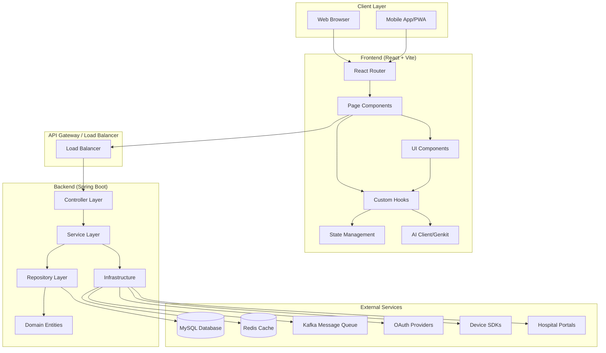

---

## 백엔드 컴포넌트 구조

### 1. 레이어별 컴포넌트 다이어그램

```mermaid
graph TB
    subgraph "Interface Layer (interfaces/)"
        AUTH_CTRL[AuthController]
        ONBOARD_CTRL[OnboardingController]
        REPORT_CTRL[ReportController]
        ACTION_CTRL[ActionController]
        FAMILY_CTRL[FamilyBoardController]
        INTEG_CTRL[IntegrationController]
        HEALTH_CTRL[HealthController]
        EXCEPTION[GlobalExceptionHandler]
        RESPONSE[ApiResponse/ErrorResponse]
    end
    
    subgraph "Domain Layer (domain/)"
        subgraph "User Domain"
            USER_SVC[AuthService]
            USER_REPO[UserRepository]
            USER_ENTITY[User/UserProfile]
        end
        
        subgraph "Onboarding Domain"
            ONBOARD_SVC[OnboardingService]
            ONBOARD_REPO[OnboardingSessionRepository]
            ONBOARD_ENTITY[OnboardingSession]
        end
        
        subgraph "Report Domain"
            REPORT_SVC[HealthReportService]
            REPORT_REPO[HealthReportRepository]
            REPORT_ENTITY[HealthReport]
            REPORT_CONV[ReportMetricsConverter]
        end
        
        subgraph "Action Domain"
            ACTION_SVC[ActionCardService]
            ACTION_SCHED[ActionScheduler]
            ACTION_REPO[ActionCardRepository]
            ACTION_ENTITY[ActionCard]
        end
        
        subgraph "Family Domain"
            FAMILY_SVC[FamilyBoardService]
            INVITE_SVC[InvitationService]
            PERM_SVC[PermissionService]
            FAMILY_REPO[FamilyBoardRepository]
            MEMBER_REPO[FamilyBoardMemberRepository]
            INVITE_REPO[BoardInvitationRepository]
            FAMILY_ENTITY[FamilyBoard/Member/Invitation]
        end
        
        subgraph "Integration Domain"
            DEVICE_SVC[DeviceLinkService]
            PORTAL_SVC[PortalConnectionService]
            CONSENT_SVC[ConsentService]
            DEVICE_REPO[DeviceLinkRepository]
            PORTAL_REPO[PortalConnectionRepository]
            CONSENT_REPO[ConsentRecordRepository]
            INTEG_ENTITY[DeviceLink/PortalConnection/ConsentRecord]
        end
    end
    
    subgraph "Infrastructure Layer (infrastructure/)"
        SECURITY[SecurityConfig/JwtTokenProvider]
        SCHEDULER[SyncScheduler]
        DEVICE_PROVIDER[DeviceProviderFactory]
        PORTAL_PROVIDER[PortalProviderFactory]
        MOCK_PROVIDER[MockDeviceProvider/MockPortalProvider]
    end
    
    AUTH_CTRL --> USER_SVC
    ONBOARD_CTRL --> ONBOARD_SVC
    REPORT_CTRL --> REPORT_SVC
    ACTION_CTRL --> ACTION_SVC
    FAMILY_CTRL --> FAMILY_SVC
    INTEG_CTRL --> DEVICE_SVC
    INTEG_CTRL --> PORTAL_SVC
    INTEG_CTRL --> CONSENT_SVC
    
    USER_SVC --> USER_REPO
    ONBOARD_SVC --> ONBOARD_REPO
    REPORT_SVC --> REPORT_REPO
    ACTION_SVC --> ACTION_REPO
    FAMILY_SVC --> FAMILY_REPO
    FAMILY_SVC --> MEMBER_REPO
    INVITE_SVC --> INVITE_REPO
    DEVICE_SVC --> DEVICE_REPO
    PORTAL_SVC --> PORTAL_REPO
    CONSENT_SVC --> CONSENT_REPO
    
    USER_REPO --> USER_ENTITY
    ONBOARD_REPO --> ONBOARD_ENTITY
    REPORT_REPO --> REPORT_ENTITY
    ACTION_REPO --> ACTION_ENTITY
    FAMILY_REPO --> FAMILY_ENTITY
    DEVICE_REPO --> INTEG_ENTITY
    
    DEVICE_SVC --> DEVICE_PROVIDER
    PORTAL_SVC --> PORTAL_PROVIDER
    SCHEDULER --> DEVICE_SVC
    SCHEDULER --> PORTAL_SVC
    
    SECURITY -.-> AUTH_CTRL
    SECURITY -.-> USER_SVC
```

---

## 프론트엔드 컴포넌트 구조

### 1. 페이지 및 라우팅 구조

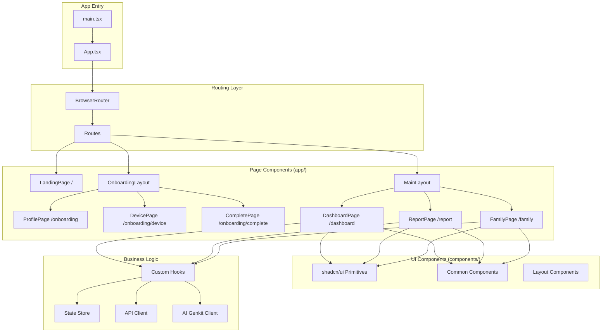

---

## 도메인별 컴포넌트 상세

### 1. 사용자 인증 도메인

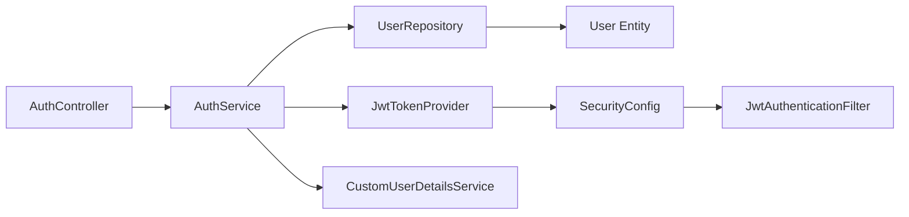

**주요 컴포넌트:**
- `AuthController`: 로그인, 회원가입, 토큰 갱신 API
- `AuthService`: 인증 비즈니스 로직
- `JwtTokenProvider`: JWT 토큰 생성/검증
- `CustomUserDetailsService`: 사용자 정보 로드
- `SecurityConfig`: Spring Security 설정

---

### 2. 온보딩 도메인

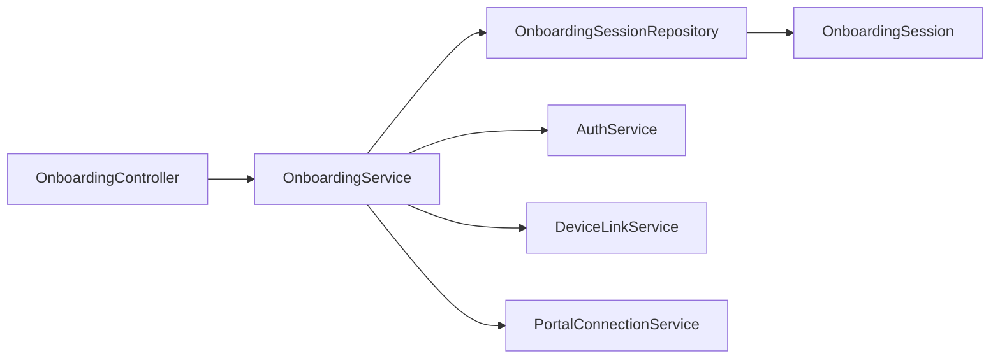

**주요 컴포넌트:**
- `OnboardingController`: 온보딩 단계별 API
- `OnboardingService`: 온보딩 플로우 관리
- `OnboardingSession`: 진행 상태 추적

---

### 3. 건강 리포트 도메인

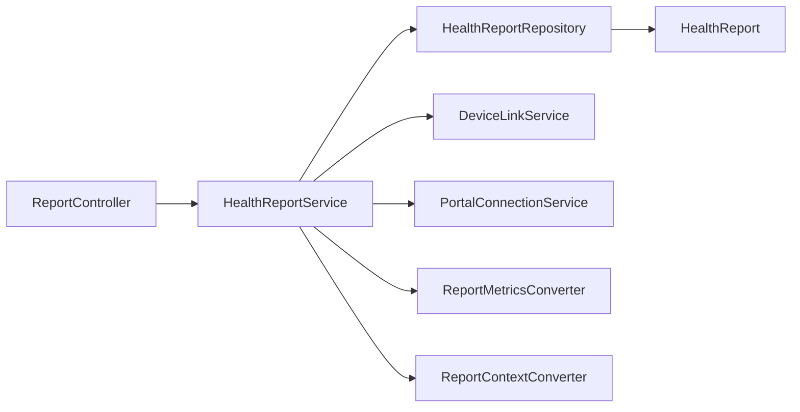

**주요 컴포넌트:**
- `ReportController`: 리포트 생성/조회 API
- `HealthReportService`: 리포트 생성 로직
- `ReportMetricsConverter`: 지표 데이터 변환
- `ReportContextConverter`: 맥락 정보 변환

---

### 4. 행동 코칭 도메인

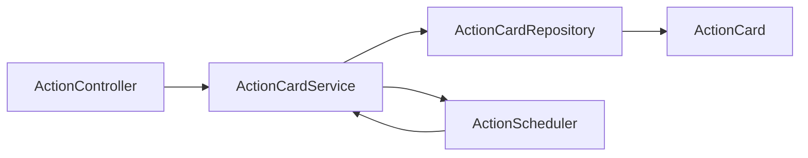

**주요 컴포넌트:**
- `ActionController`: 행동 카드 조회/완료 API
- `ActionCardService`: 행동 카드 생성/관리
- `ActionScheduler`: 일일 배치 스케줄러

---

### 5. 가족 보드 도메인

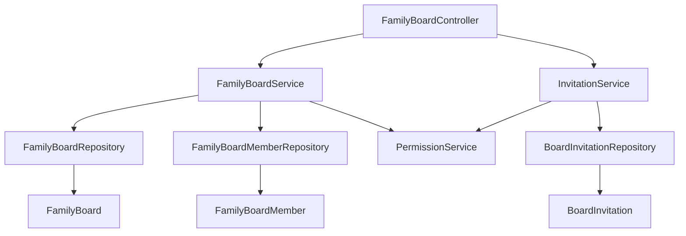

**주요 컴포넌트:**
- `FamilyBoardController`: 보드 조회/설정 API
- `FamilyBoardService`: 보드 관리 로직
- `InvitationService`: 초대 관리
- `PermissionService`: 권한 검증

---

### 6. 외부 연동 도메인

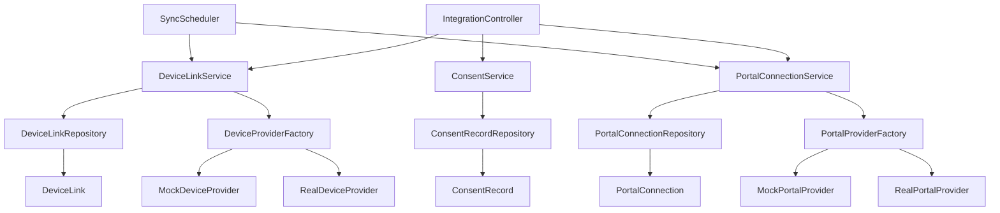

**주요 컴포넌트:**
- `IntegrationController`: 연동 관리 API
- `DeviceLinkService`: 디바이스 연동 관리
- `PortalConnectionService`: 포털 연동 관리
- `ConsentService`: 동의 기록 관리
- `DeviceProviderFactory`: 디바이스 제공자 팩토리
- `PortalProviderFactory`: 포털 제공자 팩토리
- `SyncScheduler`: 주기적 동기화 스케줄러

---

## 인프라스트럭처 컴포넌트

### 1. 보안 인프라

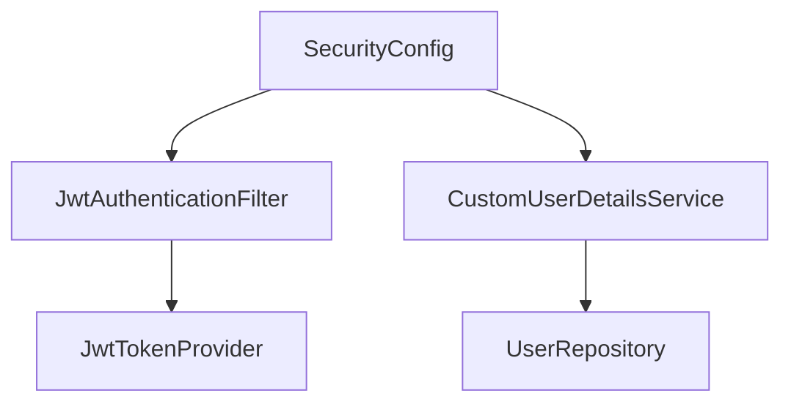

### 2. 스케줄러 인프라

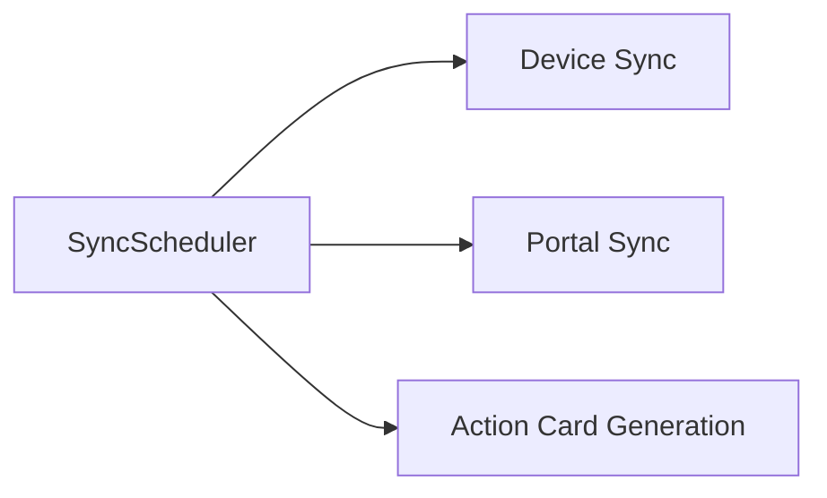

### 3. 외부 통신 인프라

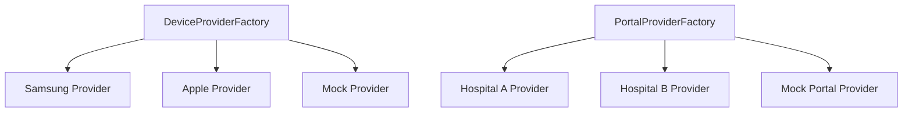

---

## 데이터 흐름 다이어그램

### 1. 온보딩 플로우

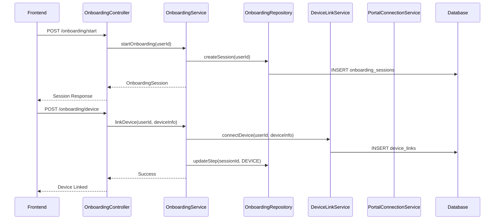

### 2. 리포트 생성 플로우

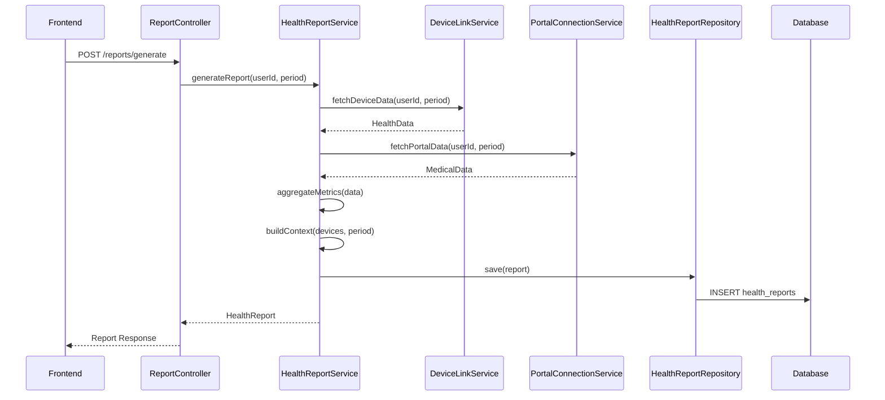

### 3. 행동 카드 생성 플로우

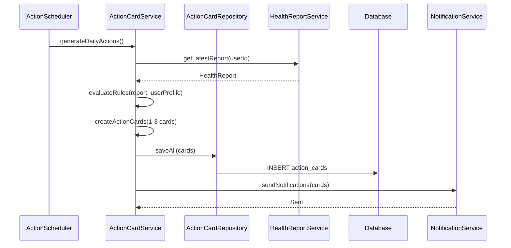

---

## 컴포넌트 의존성 규칙

### 1. 레이어 의존성 방향

```
Controller → Service → Repository → Entity
     ↓           ↓
  DTO/Response  Domain Logic
```

### 2. 허용되는 의존성

- ✅ Controller는 Service에만 의존
- ✅ Service는 Repository와 다른 Service에 의존 가능
- ✅ Repository는 Entity에만 의존
- ✅ Infrastructure는 모든 레이어에서 사용 가능

### 3. 금지되는 의존성

- ❌ Controller가 Repository에 직접 의존
- ❌ Service가 Controller에 의존
- ❌ Entity가 Service나 Repository에 의존
- ❌ Domain이 Infrastructure에 직접 의존 (인터페이스 통해서만)

---

## 컴포넌트 통신 방식

### 1. 동기 통신
- **REST API**: Frontend ↔ Backend
- **JPA Repository**: Service ↔ Database
- **Service Method Call**: Service ↔ Service

### 2. 비동기 통신
- **Kafka**: 서비스 간 이벤트 전달 (Post-MVP)
- **Scheduler**: 주기적 배치 작업
- **WebSocket**: 실시간 동기화 (Post-MVP)

### 3. 외부 통신
- **OAuth2/OIDC**: 소셜 로그인
- **Device SDK API**: 디바이스 데이터 수집
- **Hospital Portal API**: 병원 포털 연동

---

## 컴포넌트 확장 전략

### 1. 새로운 디바이스 추가
```
DeviceProviderFactory
    ├── SamsungProvider (기존)
    ├── AppleProvider (기존)
    └── NewDeviceProvider (추가) ← 구현만 추가
```

### 2. 새로운 포털 추가
```
PortalProviderFactory
    ├── HospitalAProvider (기존)
    ├── HospitalBProvider (기존)
    └── NewPortalProvider (추가) ← 구현만 추가
```

### 3. 새로운 도메인 추가
```
domain/
    ├── user/ (기존)
    ├── report/ (기존)
    └── new_domain/ (추가)
        ├── entity/
        ├── repository/
        ├── service/
        └── dto/
```

---

## 버전 정보

- **작성일**: 2025-01-27
- **버전**: 1.0
- **작성자**: AI Assistant
- **참고 문서**: 
  - `docs/01-component-structure-analysis.md`
  - `docs/04-function-call-hierarchy.md`
  - `docs/SRS/SRS_V0.3.md`
