# AS-Digt-HC Frontend & Backend Issue Dependency Graph (DAG)

## 개요

이 문서는 AS-Digt-HC 프로젝트의 **Frontend**와 **Backend** 완료된 Issue들 간의 의존성을 DAG(Directed Acyclic Graph) 형태로 표현하여, 전체 시스템의 실행 전략과 의존성 구조를 파악할 수 있도록 합니다.

---

## 1. Work Breakdown Structure (WBS)

### **EPIC 1: Backend 인프라 및 기반 구축**
- **Feature: 프로젝트 초기 설정**
  - `BE-ISSUE-01`: Spring Boot 프로젝트 초기 설정 및 환경 구축 ✅
- **Feature: 데이터 모델 설계**
  - `BE-ISSUE-02`: 통합 데이터 모델링 (ERD) 설계 ✅

### **EPIC 2: Backend 핵심 인증 및 사용자 관리**
- **Feature: 인증 시스템**
  - `BE-ISSUE-03`: 사용자 인증(Auth) 및 회원 도메인 구현 ✅

### **EPIC 3: Backend 사용자 온보딩 및 외부 연동**
- **Feature: 온보딩 프로세스**
  - `BE-ISSUE-04`: 3분 온보딩 프로세스 구현 ✅
- **Feature: 외부 시스템 연동**
  - `BE-ISSUE-08`: 외부 연동(Device & Portal) 및 동의 관리 ✅

### **EPIC 4: Backend 핵심 비즈니스 도메인**
- **Feature: 건강 리포트**
  - `BE-ISSUE-05`: 1장 요약 리포트(Health Report) 도메인 구현 ✅
- **Feature: 행동 카드 및 코칭**
  - `BE-ISSUE-06`: 행동 카드(Action Card) 및 코칭 도메인 구현 ✅
- **Feature: 가족 보드**
  - `BE-ISSUE-07`: 가족 보드(Family Board) 및 권한 관리 구현 ✅

### **EPIC 5: Frontend 개발 환경 구축**
- **Feature: 코드 품질 관리**
  - `FE-ISSUE-01`: ESLint & Prettier 설정 및 CI 연동 준비 ✅
- **Feature: 테스트 환경**
  - `FE-ISSUE-02`: Vitest 기반 단위 테스트 환경 구축 ✅

### **EPIC 6: Frontend 아키텍처 및 상태 관리**
- **Feature: 코드 분할 및 에러 처리**
  - `FE-ISSUE-03`: 라우트 기반 Code Splitting 적용 ✅
  - `FE-ISSUE-04`: Global Error Boundary 및 에러 처리 강화 ✅
- **Feature: 서버 상태 관리**
  - `FE-ISSUE-06`: TanStack Query 도입 및 서버 상태 관리 ✅
- **Feature: AI 서비스 추상화**
  - `FE-ISSUE-05`: AI Genkit 서비스 계층 추상화 ✅

---

## 2. 전체 시스템 Dependency Graph (DAG)

### **2.1 Backend & Frontend 통합 의존성 그래프**

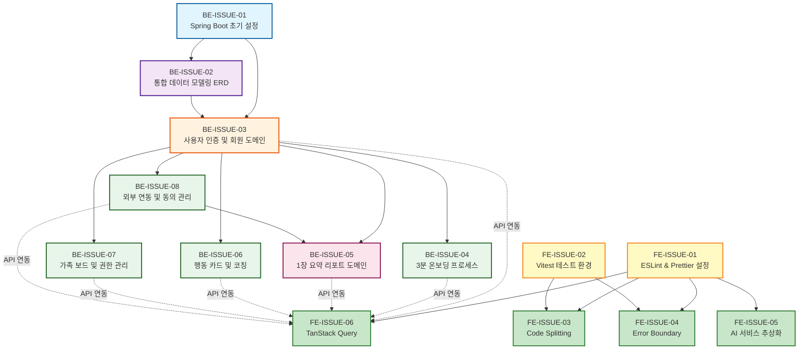

### **2.2 Backend 전용 의존성 그래프**

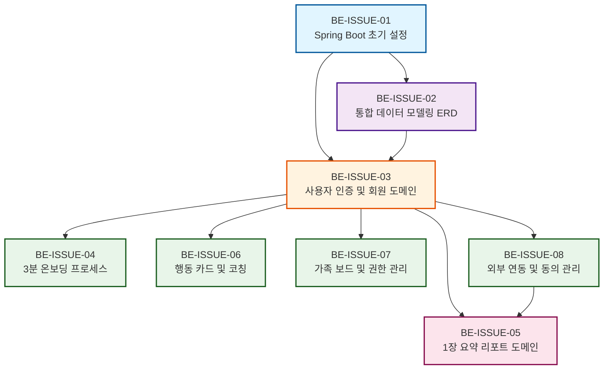

### **2.3 Frontend 전용 의존성 그래프**

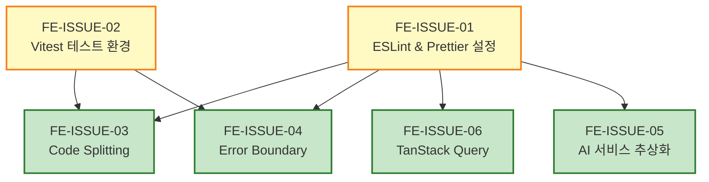

---

## 3. 단계별 실행 전략

### **3.1 Backend 실행 전략**

#### **Phase 1: 기반 구축 (순차 실행)**
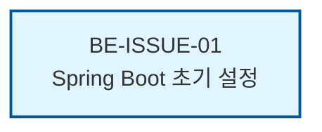

**설명**: 
- 모든 BE 이슈의 기반이 되는 프로젝트 초기 설정
- 단독 실행, 다른 이슈와 병렬 불가

---

#### **Phase 2: 데이터 모델 설계 (순차 실행)**
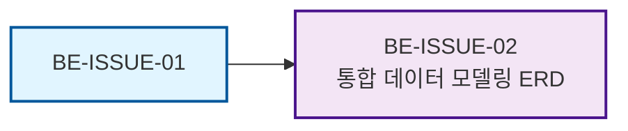

**설명**:
- BE-ISSUE-01 완료 후 실행 가능
- 모든 도메인 엔티티 설계의 기반

---

#### **Phase 3: 인증 시스템 (순차 실행)**
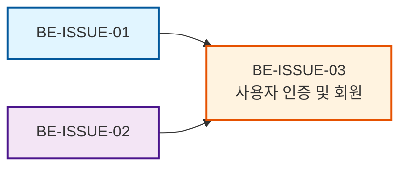

**설명**:
- BE-ISSUE-01, BE-ISSUE-02 완료 후 실행 가능
- 다른 모든 도메인 이슈의 인증 기반 제공

---

#### **Phase 4: 병렬 실행 가능한 도메인들 (병렬 실행)**
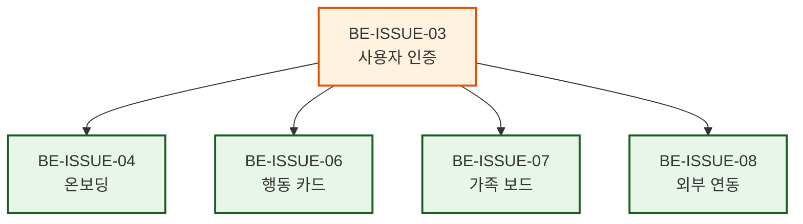

**설명**:
- BE-ISSUE-03 완료 후 **병렬 실행 가능**
- 각 도메인은 서로 독립적이며 동시에 개발 가능
- **병렬 실행 권장**: 생산성 극대화

---

#### **Phase 5: 리포트 도메인 (순차 실행)**
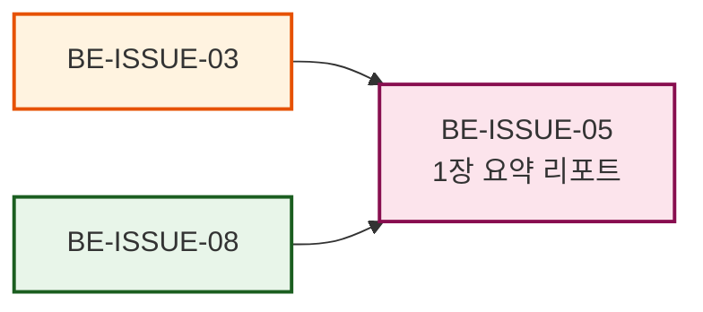

**설명**:
- BE-ISSUE-03, BE-ISSUE-08 완료 후 실행 가능
- 외부 연동 데이터(Device/Portal)를 활용하여 리포트 생성

---

### **3.2 Frontend 실행 전략**

#### **Phase 1: 개발 환경 구축 (병렬 실행)**
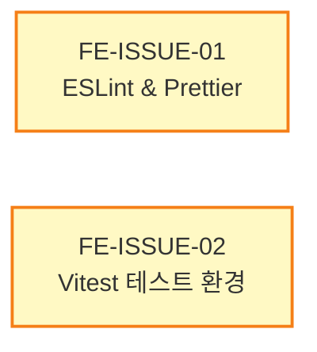

**설명**:
- FE-ISSUE-01과 FE-ISSUE-02는 서로 독립적이므로 **병렬 실행 가능**
- 개발 환경의 기반이 되는 설정

---

#### **Phase 2: 아키텍처 및 상태 관리 (병렬 실행)**
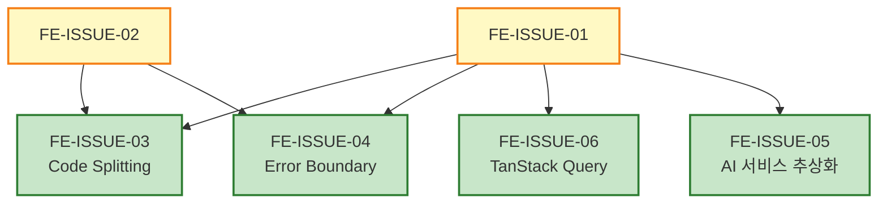

**설명**:
- FE-ISSUE-01, FE-ISSUE-02 완료 후 **병렬 실행 가능**
- FE-ISSUE-03, FE-ISSUE-04, FE-ISSUE-05, FE-ISSUE-06은 서로 독립적
- **병렬 실행 권장**: 생산성 극대화

---

### **3.3 FE-BE 연동 전략**

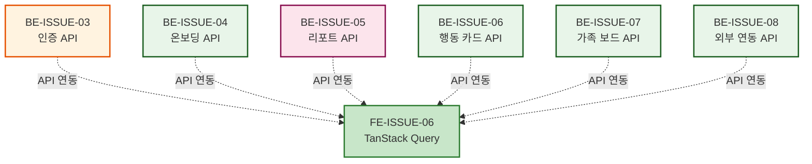

**설명**:
- FE-ISSUE-06 (TanStack Query) 완료 후 BE API와 연동 가능
- BE 각 도메인 API는 독립적으로 FE와 연동 가능
- **점진적 연동 권장**: API별로 순차적으로 연동하여 안정성 확보

---

## 4. 병렬 실행 전략

### **4.1 최적 병렬 실행 시나리오**

#### **시나리오 1: 최대 병렬화 (권장)**

**Backend**:
```
Phase 1: [BE-ISSUE-01] (단독)
    ↓
Phase 2: [BE-ISSUE-02] (단독)
    ↓
Phase 3: [BE-ISSUE-03] (단독)
    ↓
Phase 4: [BE-ISSUE-04] [BE-ISSUE-06] [BE-ISSUE-07] [BE-ISSUE-08] (병렬 실행)
    ↓
Phase 5: [BE-ISSUE-05] (단독)
```

**Frontend**:
```
Phase 1: [FE-ISSUE-01] [FE-ISSUE-02] (병렬 실행)
    ↓
Phase 2: [FE-ISSUE-03] [FE-ISSUE-04] [FE-ISSUE-05] [FE-ISSUE-06] (병렬 실행)
```

**예상 시간 단축**: 
- Backend 순차 실행: 8단계 → 병렬 실행: 5단계 (약 37.5% 시간 단축)
- Frontend 순차 실행: 6단계 → 병렬 실행: 2단계 (약 66.7% 시간 단축)

---

#### **시나리오 2: 부분 병렬화**

**Backend**:
```
Phase 1: [BE-ISSUE-01]
    ↓
Phase 2: [BE-ISSUE-02]
    ↓
Phase 3: [BE-ISSUE-03]
    ↓
Phase 4a: [BE-ISSUE-04] [BE-ISSUE-06] (병렬)
    ↓
Phase 4b: [BE-ISSUE-07] [BE-ISSUE-08] (병렬)
    ↓
Phase 5: [BE-ISSUE-05]
```

**Frontend**:
```
Phase 1: [FE-ISSUE-01] [FE-ISSUE-02] (병렬)
    ↓
Phase 2a: [FE-ISSUE-03] [FE-ISSUE-04] (병렬)
    ↓
Phase 2b: [FE-ISSUE-05] [FE-ISSUE-06] (병렬)
```

---

## 5. 의존성 상세 매트릭스

### **5.1 Backend 의존성 매트릭스**

| 이슈 ID | 이슈명 | 선행 이슈 | 후행 이슈 | 병렬 가능 여부 |
|:---:|:---|:---|:---|:---:|
| BE-ISSUE-01 | Spring Boot 초기 설정 | 없음 | BE-ISSUE-02, BE-ISSUE-03 | ❌ |
| BE-ISSUE-02 | 통합 데이터 모델링 ERD | BE-ISSUE-01 | BE-ISSUE-03 | ❌ |
| BE-ISSUE-03 | 사용자 인증 및 회원 | BE-ISSUE-01, BE-ISSUE-02 | BE-ISSUE-04, BE-ISSUE-05, BE-ISSUE-06, BE-ISSUE-07, BE-ISSUE-08 | ❌ |
| BE-ISSUE-04 | 3분 온보딩 프로세스 | BE-ISSUE-03 | 없음 | ✅ (BE-ISSUE-06, 07, 08과 병렬) |
| BE-ISSUE-05 | 1장 요약 리포트 | BE-ISSUE-03, BE-ISSUE-08 | 없음 | ❌ |
| BE-ISSUE-06 | 행동 카드 및 코칭 | BE-ISSUE-03 | 없음 | ✅ (BE-ISSUE-04, 07, 08과 병렬) |
| BE-ISSUE-07 | 가족 보드 및 권한 관리 | BE-ISSUE-03 | 없음 | ✅ (BE-ISSUE-04, 06, 08과 병렬) |
| BE-ISSUE-08 | 외부 연동 및 동의 관리 | BE-ISSUE-03 | BE-ISSUE-05 | ✅ (BE-ISSUE-04, 06, 07과 병렬) |

### **5.2 Frontend 의존성 매트릭스**

| 이슈 ID | 이슈명 | 선행 이슈 | 후행 이슈 | 병렬 가능 여부 |
|:---:|:---|:---|:---|:---:|
| FE-ISSUE-01 | ESLint & Prettier 설정 | 없음 | FE-ISSUE-03, FE-ISSUE-04, FE-ISSUE-05, FE-ISSUE-06 | ❌ |
| FE-ISSUE-02 | Vitest 테스트 환경 | 없음 | FE-ISSUE-03, FE-ISSUE-04 | ❌ |
| FE-ISSUE-03 | Code Splitting | FE-ISSUE-01, FE-ISSUE-02 | 없음 | ✅ (FE-ISSUE-04, 05, 06과 병렬) |
| FE-ISSUE-04 | Error Boundary | FE-ISSUE-01, FE-ISSUE-02 | 없음 | ✅ (FE-ISSUE-03, 05, 06과 병렬) |
| FE-ISSUE-05 | AI 서비스 추상화 | FE-ISSUE-01 | 없음 | ✅ (FE-ISSUE-03, 04, 06과 병렬) |
| FE-ISSUE-06 | TanStack Query | FE-ISSUE-01 | 없음 | ✅ (FE-ISSUE-03, 04, 05과 병렬) |

### **5.3 FE-BE 연동 의존성 매트릭스**

| FE 이슈 | BE 이슈 | 연동 타입 | 설명 |
|:---:|:---:|:---|:---|
| FE-ISSUE-06 | BE-ISSUE-03 | API 연동 | 인증 API (로그인, 회원가입, 토큰 갱신) |
| FE-ISSUE-06 | BE-ISSUE-04 | API 연동 | 온보딩 API (세션 시작, 단계 저장, 완료) |
| FE-ISSUE-06 | BE-ISSUE-05 | API 연동 | 리포트 API (리포트 생성, 조회) |
| FE-ISSUE-06 | BE-ISSUE-06 | API 연동 | 행동 카드 API (오늘의 카드 조회, 완료 처리) |
| FE-ISSUE-06 | BE-ISSUE-07 | API 연동 | 가족 보드 API (초대, 수락, 데이터 조회) |
| FE-ISSUE-06 | BE-ISSUE-08 | API 연동 | 외부 연동 API (디바이스 연동, 포털 연동) |

---

## 6. 실행 시나리오 예시

### **시나리오 A: 순차 실행 (비권장)**

**Backend**:
```
시간축: |--01--|--02--|--03--|--04--|--06--|--07--|--08--|--05--|
총 소요 시간: 8단계
```

**Frontend**:
```
시간축: |--01--|--02--|--03--|--04--|--05--|--06--|
총 소요 시간: 6단계
```

---

### **시나리오 B: 최대 병렬화 (권장)**

**Backend**:
```
시간축: |--01--|--02--|--03--|--04,06,07,08--|--05--|
총 소요 시간: 5단계 (약 37.5% 시간 단축)
```

**Frontend**:
```
시간축: |--01,02--|--03,04,05,06--|
총 소요 시간: 2단계 (약 66.7% 시간 단축)
```

---

### **시나리오 C: FE-BE 동시 진행 (권장)**

**타임라인**:
```
Backend:  |--01--|--02--|--03--|--04,06,07,08--|--05--|
Frontend: |--01,02--|--03,04,05,06--|
           ↑                        ↑
           FE-BE 연동 시작          FE-BE 연동 완료
```

**설명**:
- Backend와 Frontend는 독립적으로 병렬 진행 가능
- BE-ISSUE-03 완료 후 FE-BE 연동 시작 가능
- 각 BE 도메인 API 완료 시점에 FE에서 점진적 연동 가능

---

## 7. Agent 작업 가이드

### **7.1 병렬 실행 체크리스트**

Agent가 작업을 시작하기 전에 다음을 확인해야 합니다:

- [ ] **선행 이슈 완료 확인**
  - 의존성 그래프에서 선행 이슈가 완료되었는지 확인
  - 완료되지 않은 경우 대기 또는 선행 이슈 우선 처리

- [ ] **병렬 실행 가능 여부 확인**
  - Backend Phase 4의 이슈들(BE-ISSUE-04, 06, 07, 08)은 서로 독립적이므로 병렬 실행 가능
  - Frontend Phase 2의 이슈들(FE-ISSUE-03, 04, 05, 06)은 서로 독립적이므로 병렬 실행 가능

- [ ] **공통 리소스 충돌 방지**
  - 여러 Agent가 동시에 작업할 경우, 공통 파일(예: `application.yml`, `build.gradle`, `package.json`) 수정 시 충돌 가능
  - 가능한 경우 도메인별로 분리된 파일 구조 사용

- [ ] **FE-BE 연동 시점 확인**
  - FE-ISSUE-06 (TanStack Query) 완료 후 BE API 연동 가능
  - 각 BE 도메인 API는 독립적으로 연동 가능하므로 점진적 연동 권장

---

### **7.2 작업 우선순위 가이드**

#### **높은 우선순위 (Critical Path)**

**Backend**:
1. BE-ISSUE-01 → BE-ISSUE-02 → BE-ISSUE-03
   - 다른 모든 이슈의 기반이 되는 Critical Path
   - 최우선 처리 필요

**Frontend**:
1. FE-ISSUE-01, FE-ISSUE-02
   - 다른 모든 FE 이슈의 기반이 되는 개발 환경 구축
   - 병렬 실행 가능

---

#### **중간 우선순위 (병렬 실행 권장)**

**Backend**:
2. BE-ISSUE-04, BE-ISSUE-06, BE-ISSUE-07, BE-ISSUE-08
   - BE-ISSUE-03 완료 후 병렬 실행 가능
   - 생산성 극대화를 위해 동시 진행 권장

**Frontend**:
2. FE-ISSUE-03, FE-ISSUE-04, FE-ISSUE-05, FE-ISSUE-06
   - FE-ISSUE-01, FE-ISSUE-02 완료 후 병렬 실행 가능
   - 생산성 극대화를 위해 동시 진행 권장

---

#### **낮은 우선순위 (후순위)**

**Backend**:
3. BE-ISSUE-05
   - BE-ISSUE-08 완료 후 실행 가능
   - 외부 연동 데이터가 필요한 리포트 도메인

**Frontend**:
3. FE-BE 연동
   - FE-ISSUE-06 및 각 BE 도메인 API 완료 후 점진적 연동 가능

---

## 8. 참고 자료

### **Backend Issues**
- [BE] Issue-01: Spring Boot 프로젝트 초기 설정 (`Tasks/BE_issue/issue-01-be-setup.md`)
- [BE] Issue-02: 통합 데이터 모델링 (`Tasks/BE_issue/issue-02-db-design.md`)
- [BE] Issue-03: 사용자 인증 및 회원 (`Tasks/BE_issue/issue-03-auth-user.md`)
- [BE] Issue-04: 3분 온보딩 프로세스 (`Tasks/BE_issue/issue-04-onboarding.md`)
- [BE] Issue-05: 1장 요약 리포트 (`Tasks/BE_issue/issue-05-report-domain.md`)
- [BE] Issue-06: 행동 카드 및 코칭 (`Tasks/BE_issue/issue-06-action-domain.md`)
- [BE] Issue-07: 가족 보드 및 권한 관리 (`Tasks/BE_issue/issue-07-family-board.md`)
- [BE] Issue-08: 외부 연동 및 동의 관리 (`Tasks/BE_issue/issue-08-integration.md`)

### **Frontend Issues**
- [FE] Issue-01: ESLint & Prettier 설정 (`Practice/github-issue/completed/issue-01-lint-format.md`)
- [FE] Issue-02: Vitest 테스트 환경 (`Practice/github-issue/completed/issue-02-test-setup.md`)
- [FE] Issue-03: Code Splitting (`Practice/github-issue/completed/issue-03-code-splitting.md`)
- [FE] Issue-04: Error Boundary (`Practice/github-issue/completed/issue-04-error-handling.md`)
- [FE] Issue-05: AI 서비스 추상화 (`Practice/github-issue/completed/issue-05-ai-abstraction.md`)
- [FE] Issue-06: TanStack Query (`Practice/github-issue/completed/issue-06-tanstack-query.md`)

### **관련 문서**
- [BE Issue DAG](./BE_ISSUE_DAG.md)
- [Integrated WBS DAG](./INTEGRATED_WBS_DAG.md)

---

## 9. 업데이트 이력

- **2025-01-15**: 초기 FE-BE 통합 DAG 그래프 작성
  - BE 이슈 8개, FE 이슈 6개 의존성 분석 완료
  - FE-BE 연동 전략 수립
  - 병렬 실행 전략 수립

