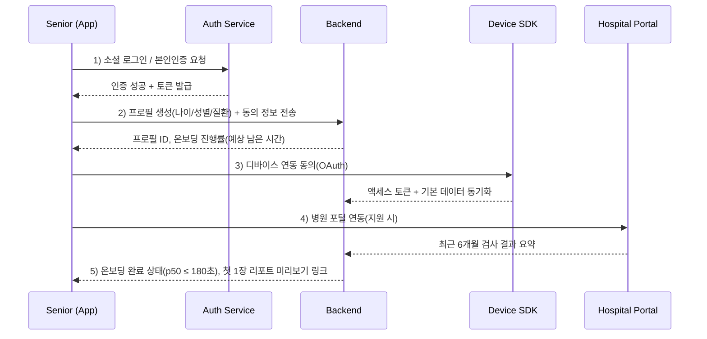
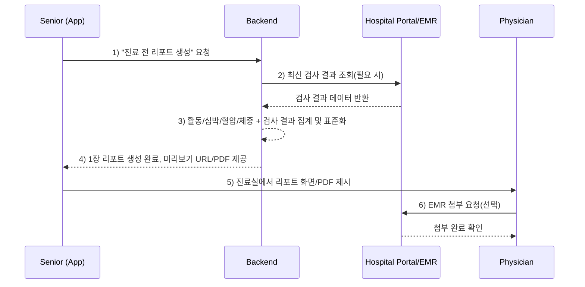
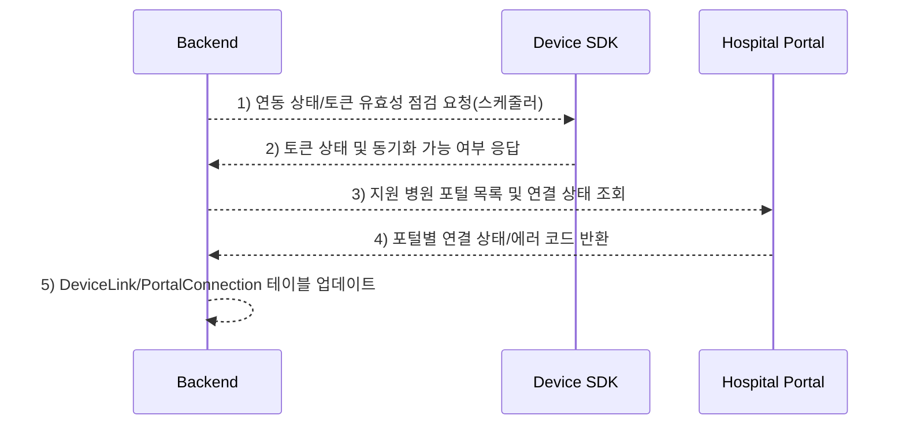
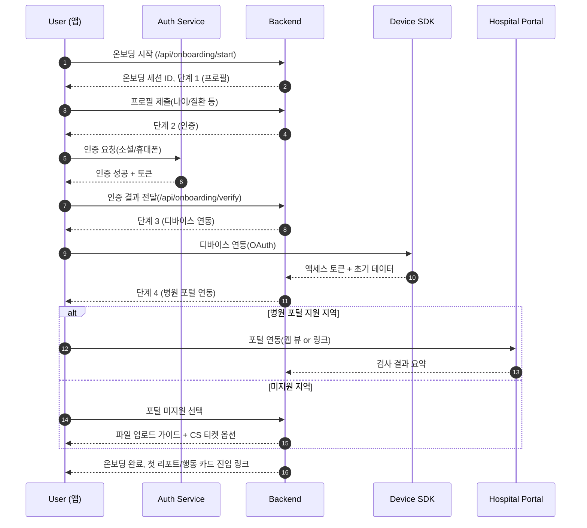
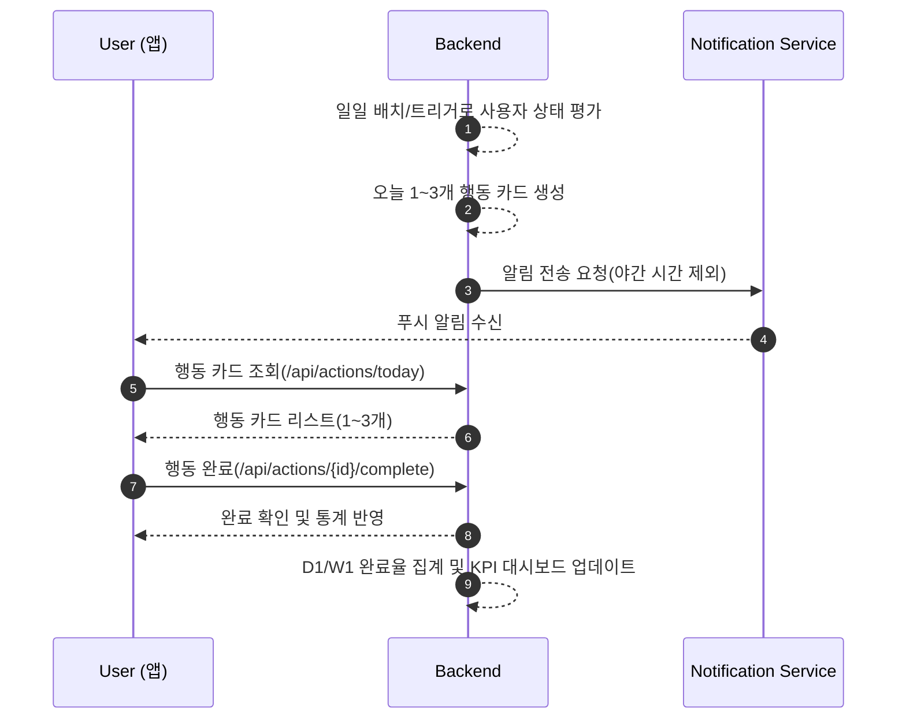

# Software Requirements Specification (SRS)

Document ID: SRS-001  
Revision: 0.3 (Draft)  
Date: 2025-11-18  
Standard: ISO/IEC/IEEE 29148:2018

-------------------------------------------------

## 1. Introduction

### 1.1 Purpose

이 Software Requirements Specification(SRS)는 `GPT-PRD/GPT-PRD.md`에서 정의된 제품 요구사항을 기반으로, 액티브 시니어 및 보호자를 위한 디지털 헬스케어 상호운용 허브 제품의 소프트웨어 요구사항을 명세한다.  
본 문서는 기능 요구사항, 비기능 요구사항, 인터페이스, 데이터 모델, 제약 및 가정을 ISO/IEC/IEEE 29148:2018 기준에 따라 완전하고 테스트 가능하며 추적 가능하도록 정의하는 것을 목적으로 한다.

제품 비전(출처: PRD 1. 목적 및 목표)은 다음과 같다.

> “시니어·보호자 이중 UX와 의료급 신뢰 포맷을 갖춘 상호운용 허브로, 3분 온보딩에서 시작해 의사용 1장 요약과 ‘오늘 3가지 행동’을 통해 진료 수용성과 일상 순응을 동시에 향상한다.”

### 1.2 Scope (In-Scope / Out-of-Scope)

#### 1.2.1 In-Scope

PRD 9. 범위 정의 및 기능 요구사항(MoSCoW 분류)에 근거하여, 본 SRS의 범위에 포함되는 기능 범위는 다음과 같다.

- **온보딩(3분 플로우)**  
  - 가입, 본인 인증, 권한 동의, 디바이스/병원 포털 연동을 3분 이내에 완료하는 End-to-End 온보딩 플로우(F1, Must).  
- **1장 의사용 요약 리포트 생성 및 제공**  
  - 최근 3~6개월 건강 데이터를 표준화된 의료급 포맷으로 집계하여 1장 리포트로 생성, PDF/인쇄 및 EMR 첨부를 지원(F2, Must).  
- **‘오늘 1~3개 행동’ 코칭 카드**  
  - 시니어의 일일 건강 상태에 기반하여 1~3개의 행동 카드를 생성·알림하고, 수행 여부를 추적(F3, Must).  
- **가족 공유 보드 및 대리 접근**  
  - 시니어·보호자·가족이 하나의 공유 보드에서 일정·복약·위험 알림을 함께 보고 역할/권한을 관리(F4, Should이지만 VPS 기준 MVP 기능으로 Must 수준으로 다룸).  
- **병원 포털/검진 1곳 연동**  
  - 최소 1개 병원/검진 포털과 데이터 연동을 구현하여 1장 리포트 및 행동 코칭에 사용할 수 있는 의료급 데이터를 수집(F5, Should이지만 VPS 기준 MVP 기능으로 Must 수준으로 다룸).  
- **의사 신뢰 포맷**  
  - 리포트에 측정 맥락(기간, 기기, 결측 태그)을 포함하는 메타데이터 스키마 제공(F7, Must).  
- **권한·프라이버시 단순화**  
  - 대리 접근, 역할, 세션 관리, 위험 기반 인증 등 권한 모델 단순화(F8, Should).  
- **접근성 퍼스트(A11y) 패키지**  
  - 대글자, 고대비, 스크린리더 레이블, 포커스 관리, 야간 침묵 등 Extreme 시니어를 기준으로 하는 접근성 기능(F10, Should이지만 MVP 핵심 축으로 Must 수준 요구사항 포함).  
- **멀티 디바이스 정합성(워치/혈압계 2종)**  
  - 최소 2종 디바이스(예: 워치, 혈압계) 간 측정값 정합성 확보(F6, Could).  
- **복약 누락 방지(톤다운/야간침묵)**  
  - 복약 알림을 행동 코칭과 통합하고 과다 알림을 방지(F9, Could).  

본 SRS는 위 기능을 지원하기 위한 서버 사이드 백엔드 서비스, 데이터 저장소, API, 기본적인 클라이언트 인터페이스 요구사항을 포함한다.

#### 1.2.2 Out-of-Scope

PRD 4. 기능 요구사항 및 9. 범위 정의에 근거하여, 초기 버전(본 SRS 범위)에서 제외되는 항목은 다음과 같다.

- 완전한 EMR 양방향 연동 (예: 모든 진료 기록/오더를 실시간 싱크)  
- 보험 청구/심사 기능 및 보험사 내부 시스템과의 심층 연동  
- 의료진용 대시보드의 상용 정식 출시 (파일럿용 간이 뷰/리포트는 연동 범위 내에서 허용 가능)  
- 고급 개인화 AI 코치(기본적인 행동 카드 추천 로직은 범위 내)  
- 글로벌(다국어/다지역) 배포 및 각 국가별 규제 최적화

### 1.3 Definitions, Acronyms, Abbreviations

본 절은 PRD 2. 사용자 시나리오 및 JTBD, 3. Pain/Needs 정의, 4. 기능 요구사항에서 사용되는 주요 용어를 정의한다.

- **Active Senior(액티브 시니어)**: 55~75세, 자립·예방·만성질환의 ‘내가 하는 관리’를 지향하며 스마트폰·웨어러블 사용 경험이 있는 사용자.
- **Caregiver(보호자)**: 부모/배우자 등 시니어의 건강 관리를 대신 챙기거나 보조하는 가족, 혹은 비공식/공식 케어 제공자.
- **One-page Doctor Summary(1장 의사용 요약 리포트)**: 최근 3~6개월 건강 데이터를 표준화된 지표(활동, 심박, 혈압, 체중 등)와 맥락(기간, 기기, 결측 등)을 포함하여 한 페이지 내에 요약한 리포트.
- **Action Card(행동 카드)**: 하루 기준 1~3개의 구체적인 행동 제안(예: 10분 걷기, 약 복용 확인)을 제공하는 UI 요소이자 데이터 모델.
- **Family Board(가족 보드)**: 시니어와 다수의 가족/보호자가 일정, 약, 알림을 공유하면서 역할·권한을 관리하는 공유 뷰.
- **3-Minute Onboarding(3분 온보딩)**: 신규 사용자가 설치 후 가입→인증→권한 부여→디바이스/병원 연동을 3분(p50) 이내에 완료하도록 설계된 온보딩 플로우.
- **AOS (Adjusted Opportunity Score)**: PRD에서 정의된 Outcome 기회 점수. Importance와 Satisfaction을 사용하여 산출되는 니즈 강도 지표. (정의: AOS = Importance × (1 − Satisfaction/5)).
- **DOS (Discovered Opportunity Score)**: TAM 비율을 반영하여 도출된 시장 파급력 기반 기회 점수. (정의: DOS = (Importance − Satisfaction) × TAM).
- **Q1 Triplet(Q1 트리플렛)**: AOS/DOS 매트릭스에서 High AOS, High DOS인 3가지 핵심 영역(3분 온보딩, 행동 코칭, 1장 요약 리포트).
- **KPI (Key Performance Indicator)**: PRD 1. 목적 및 목표에서 정의한 북극성 및 보조 성과 지표.
- **NFR (Non-Functional Requirement)**: 성능, 가용성, 보안, 비용, 운영 등 비기능 요구사항.
- **PRD**: Product Requirements Document, 본 SRS의 유일한 비즈니스/기능 요구의 원천.

### 1.4 References (REF-XX)

- **REF-01**: `GPT-PRD/GPT-PRD.md` – Product Requirement Document (v0)  
- **REF-02**: ISO/IEC/IEEE 29148:2018, Systems and software engineering — Life cycle processes — Requirements engineering  

### 1.5 Assumptions & Constraints

**(시스템 내부 - 언어 및 프레임워크)**  
- C-TEC-001: 모든 프론트엔드 서비스는 Vite 환경 기반의 React.js 프레임워크를 사용한다.  
- C-TEC-002: 모든 백엔드 서비스는 JVM 기반(Java 17 + Spring Boot 3.x)을 사용한다.  
- C-TEC-003: 데이터베이스는 MySQL 9.x InnoDB 엔진에서 유니코드 확장 문자 인코딩을 기본으로 사용한다.  
- C-TEC-004: 문서 자동생성 엔진은 Python 기반(LangChain + FastAPI)으로 구현하는 것을 목표로 한다. 단, MVP 단계에서는 Spring Boot 백엔드에서 OpenAI API를 직접 호출하는 템플릿/규칙 기반 리포트 생성만으로도 요구사항을 충족한 것으로 본다.  

**(시스템 외부 - 연결 및 통신 방식)**  
- C-TEC-005: LLM 호출은 OpenAI API 또는 사내 LLM Gateway를 사용한다.  
- C-TEC-006: MSA 서비스 간 통신은 REST(OpenAPI 3.x) API 또는 gRPC로 제한한다. 단, MVP 단계에서는 단일 모놀리식 Spring Boot 애플리케이션 내 REST API만 사용하여도 되며, 서비스 분리 및 gRPC 도입은 Post-MVP 선택 사항이다.  

### 1.6 MVP Phase Definition & Validation Scope (MVP 단계 정의 및 검증 범위)

본 문서는 전체 제품 생애주기를 포괄하는 요구사항을 포함하지만, `SRS_V0.3`에서는 특히 **MVP 단계에서 무엇을 반드시 증명해야 하고, 무엇은 가설/장기 목표로 남기는지, 무엇은 Dummy/축소 구현을 허용하는지**를 명시한다.

#### 1.6.1 MVP에서 반드시 증명해야 하는 요소

- **3분 온보딩 경험**: REQ-FUNC-001~006, 019 및 REQ-NF-001, 003, 008, 012에 따라 신규 사용자가 3분(p50) 이내에 가입→인증→동의→디바이스/포털(또는 업로드 채널) 연동을 완료하고 첫 가치(리포트 또는 행동 카드)에 도달할 수 있어야 한다.
- **1장 의사용 요약 리포트의 유용성**: REQ-FUNC-007~010 및 REQ-NF-002, 008, 011, 016에 따라 최근 3~6개월 데이터를 맥락 정보와 함께 한 페이지로 요약하여 진료실에서 실제로 활용 가능한 수준의 리포트를 제공해야 한다.
- **‘오늘 1~3개 행동’ 코칭 UX**: REQ-FUNC-011~014 및 REQ-NF-001, 005, 012, 015에 따라 피로도가 낮고 일관된 습관 형성을 돕는 행동 카드 경험(D1/W1 완료율 포함)을 제공해야 한다.
- **가족 보드 및 대리 접근 UX**: REQ-FUNC-015~017 및 REQ-NF-005, 006, 007, 013에 따라 가족 보드 기반의 일정/복약/위험 알림 공유와 역할/대리 접근 구조가 실제 사용에 무리가 없음을 검증해야 한다.

#### 1.6.2 MVP에서 직접 증명하기 어려운 요소(가설로 두는 요소)

- **장기 KPI 개선 수치**: REQ-NF-011~016(클리닉 채택률, 온보딩 완료율, 리포트/대리접근 사용률, 90일 유지율, 복약 순응도, 재내원/결정 시간 단축)은 **1년 차 Target**으로 간주하며, MVP 단계에서는 해당 KPI 정의 및 측정을 위한 이벤트/로그 수집 체계 구축을 필수 요구로 본다.
- **비용 효율성(REQ-NF-009)**: 사용자당 인프라/스토리지 단가 목표는 참고용 장기 Target으로 두고, MVP 단계에서는 비용 계측과 모니터링 지표 정의를 필수 요구사항으로 한다.
- **대규모 확장성 및 채널 수**: REQ-NF-017(10만 MAU 확장성)과 REQ-NF-019(기관 채널 3곳+, 커넥터 4종+)은 MVP 단계에서 직접 검증하기 어려운 가설이며, 아키텍처와 데이터 모델이 이를 방해하지 않는 수준으로 설계되는 것을 요구사항으로 한다.

#### 1.6.3 MVP에서 Dummy/축소 구현이 허용되는 요소

- **디바이스 연동(REQ-FUNC-003)**: “최소 2종 디바이스 연동” 요구는 전체 제품 기준이며, **MVP 단계에서는 최소 1종(예: 워치) 디바이스 연동만 구현해도 해당 요구사항을 충족한 것으로 간주**한다. 추가 디바이스 및 정합성 검증은 Post-MVP 과제로 둔다.
- **병원 포털 연동(REQ-FUNC-004, 019)**: 실제 병원/검진 포털 API 연동이 이상적이지만, **MVP 단계에서는 검사 결과 PDF/이미지/CSV 업로드 및 수기 입력 채널을 “연동”으로 인정**하며, CS 티켓 기능은 별도 시스템 연동 없이 관리자 이메일 발송 또는 로그 기록으로 대체할 수 있다.
- **위험 기반 추가 인증(REQ-FUNC-018, REQ-NF-007)**: 위치/행동 기반 리스크 엔진 및 자동 탐지는 Post-MVP 범위로 두고, **MVP 단계에서는 가족 보드 역할 변경 등 민감 행위에 대한 단순 2FA(OTP/이메일/SMS) 적용과 감사 로그 기록만으로 요구사항을 충족**한 것으로 본다.
- **가족 보드 실시간 동기화(REQ-FUNC-017, REQ-NF-005)**: WebSocket/푸시 기반 실시간 동기화는 Post-MVP 최적화 대상이며, **MVP에서는 60초 이하 주기의 서버 폴링 또는 화면 새로고침 기반 동기화로 p95 ≤ 60초 요구를 만족**해도 된다.
- **문서 자동생성 파이프라인(C-TEC-004, REQ-NF-002)**: LangChain 기반 복잡한 체인 구성은 후속 단계로 두고, **MVP에서는 템플릿/규칙 기반 리포트 생성 + OpenAI 단일 호출 수준으로도 “문서 자동생성 엔진” 요구를 충족**한 것으로 간주한다.
- **모니터링 및 온콜 알림(REQ-NF-010)**: 5분 이내 온콜 알림 및 실시간 대시보드는 전체 제품 목표이며, MVP 단계에서는 클라우드 기본 모니터링 대시보드 + 이메일/슬랙 알림 정도의 단순 구성을 허용한다.

## 2. Stakeholders

아래 표는 PRD의 페르소나 및 사용자 시나리오를 Stakeholder 역할로 재구성한 것이다.

| Stakeholder ID | Role (역할)                  | Responsibility (책임)                                                                 | Interest (관심사)                                                                                  |
|----------------|------------------------------|----------------------------------------------------------------------------------------|----------------------------------------------------------------------------------------------------|
| STK-01         | Active Senior (시니어)       | 자신의 건강 데이터를 기록·조회하고, 진료 전 의사용 요약 리포트 생성 및 행동 카드를 수행 | 설명 부담 감소, 진료 수용성 향상, 부담 없는 행동 코칭, 접근성(대글자/고대비/음성)               |
| STK-02         | Caregiver (보호자/가족)      | 가족 보드에서 시니어의 일정·복약·위험 알림을 관리하고 역할/권한을 조정                 | 돌봄 부담 분산, 대리 접근의 명확한 권한, 알림 과부하 방지                                         |
| STK-03         | Physician (의사)             | 외래 진료 시 1장 요약 리포트를 열람/첨부하여 의사결정에 활용                           | 짧은 진료 시간 내 상태 파악 효율, 신뢰 가능한 데이터 포맷, EMR 워크플로와의 호환성               |
| STK-04         | Hospital/Clinic Admin        | 병원 포털/EMR와의 연동 관리, 파일럿 운영 및 성과 측정                                  | 연동 안정성, 보안/규제 준수, 외래 효율 개선, 추가 매출/환자 만족도                               |
| STK-05         | Payer/Insurer (보험사)       | 행동 기반 디지털 헬스케어 성과를 보험 상품/프로그램에 활용 (초기 PoC 수준)            | 복약 순응도 및 재입원 감소에 따른 비용 절감, 성과 기반 리베이트 구조(장기)                       |
| STK-06         | System Operator/DevOps      | 서비스 배포·모니터링·장애 대응                                                         | SLA 준수, 오류율 관리, 인프라 비용 최적화                                                         |
| STK-07         | Product Owner / PM          | 기능 우선순위 관리, KPI 달성 여부 모니터링                                             | 북극성 KPI 달성, Q1 트리플렛 기능의 성공적 도입, 사용자 유지율                                   |

## 3. System Context and Interfaces

### 3.1 External Systems

본 시스템은 다음의 외부 시스템들과 상호 작용한다 (PRD 4. 기능 요구사항의 의존성/OAuth/기관 포털/디바이스 SDK/EMR 첨부 등 참조).

- **EX-01: Hospital Portal / EMR System**  
  - 역할: 검사 결과, 진료 요약 등의 의료 데이터를 제공하며, 1장 리포트 첨부 대상으로 사용됨.  
  - 인터페이스: REST API 또는 파일 업로드(초기), EMR 첨부 링크/ID.  

- **EX-02: Device Vendor SDKs (Wearable, BP monitor)**  
  - 역할: 워치, 혈압계 등에서 수집된 활동, 심박, 혈압, 체중 등의 데이터를 제공.  
  - 인터페이스: OAuth 기반 토큰 발급 및 데이터 조회 API.  

- **EX-03: Authentication Provider (IDP)**  
  - 역할: 소셜 로그인, 휴대폰 본인인증 등 온보딩 과정에서 사용되는 인증 수단.  
  - 인터페이스: OAuth/OIDC, SMS 인증 게이트웨이 등.  

- **EX-04: Notification Service**  
  - 역할: 모바일/웹 푸시 알림, SMS 등으로 행동 카드 및 알림을 전송.  
  - 인터페이스: 메시지 전송 API, 알림 상태 콜백(성공/실패) 수신.  

### 3.2 Client Applications

PRD는 구체적인 클라이언트 플랫폼을 명시하지 않으나, 요구사항 특성상 다음 두 종류를 전제로 한다.

- **CL-01: Mobile App (주요 클라이언트)**  
  - 시니어 및 보호자가 사용하는 모바일 애플리케이션(iOS/Android) 또는 모바일 웹(PWA). MVP 단계에서는 React/Vite 기반 반응형 웹/PWA 구현을 기본으로 하고, 네이티브 앱은 Post-MVP 옵션으로 둔다.  
  - 기능: 온보딩, 리포트 조회, 행동 카드, 가족 보드, 알림 수신, 접근성 모드.  

- **CL-02: Web Console (Optional/관리용)**  
  - 보호자 및 병원/운영자용 웹 콘솔.  
  - 기능: 가족 보드 관리, 리포트 확인, 일부 관리/설정.  

### 3.3 API Overview

아래 표는 시스템의 주요 백엔드 API 범주를 요약한다. 구체 엔드포인트는 Appendix 6.1에 상세 기술한다.

| API 그룹 ID | 이름                         | 주요 목적                                                            |
|-------------|------------------------------|-----------------------------------------------------------------------|
| API-G01     | Onboarding API               | 가입, 인증, 권한 동의, 디바이스/병원 연동 등 3분 온보딩 플로우 지원 |
| API-G02     | Report API                   | 1장 의사용 요약 리포트 생성/조회/다운로드                            |
| API-G03     | Action Coaching API          | 하루 1~3개 행동 카드 생성/조회/완료 처리                             |
| API-G04     | Family Board & Access API    | 가족 보드 조회, 초대, 동의, 역할/권한 관리                           |
| API-G05     | Device & Portal Connect API  | 워치/혈압계/병원 포털 연결 상태 조회 및 동기화                        |
| API-G06     | Auth & Consent API           | 로그인, 토큰 발급, 동의/위임 기록 조회/관리                          |

### 3.4 Interaction Sequences (핵심 시퀀스 다이어그램)

#### 3.4.1 핵심 온보딩 플로우 (3분 온보딩)

#### 3.4.2 진료 전 1장 리포트 생성 및 사용

#### 3.4.3 병원 포털/디바이스 연동 상태 동기화

## 4. Specific Requirements

### 4.1 Functional Requirements

아래 표는 PRD의 4개 User Story 및 F1~F10 기능을 REQ-FUNC-xxx 단위의 원자적 기능 요구사항으로 분해한 것이다.  
각 REQ에는 Source Story, 관련 Feature, Priority(MoSCoW), 주요 Acceptance Criteria(AC) 요약이 포함된다.

#### 4.1.1 REQ-FUNC 목록

| ID            | Title                                             | Description (요구사항 설명)                                                                                                                                     | Feature | Priority | Source Story |
|---------------|---------------------------------------------------|-----------------------------------------------------------------------------------------------------------------------------------------------------------------|---------|----------|--------------|
| REQ-FUNC-001  | 계정 생성 및 기본 프로필 등록                     | 시스템은 신규 사용자가 이름(선택), 나이, 성별, 주요 질환 1~2개를 포함한 기본 프로필을 생성할 수 있도록 해야 한다.                                              | F1      | Must     | Story 4      |
| REQ-FUNC-002  | 온보딩 인증 단계                                  | 시스템은 소셜 로그인 또는 휴대폰 본인인증을 통해 사용자를 인증하고, 인증 결과를 온보딩 세션과 연계해야 한다.                                                   | F1      | Must     | Story 4      |
| REQ-FUNC-003  | 디바이스 연동(워치/혈압계 최소 2종)               | 시스템은 최소 2종의 웨어러블/계측 디바이스에 대해 OAuth 기반 연동을 지원하고, 첫 온보딩 시 기본 데이터 동기화를 수행해야 한다.                               | F1,F6   | Must/Could | Story 4    |
| REQ-FUNC-004  | 병원 포털 연동(최소 1곳)                          | 시스템은 최소 1개의 병원/검진 포털과 연동하여 최근 6개월 검사 결과를 조회하고, 사용자 계정과 연계해야 한다.                                                    | F1,F5   | Must     | Story 4      |
| REQ-FUNC-005  | 온보딩 진행률 표시 및 중간 저장                   | 시스템은 온보딩 각 단계의 진행률과 예상 잔여 시간(ETA)을 표시하고, 단계별 데이터를 중간 저장하여 재시도 시 이어서 진행할 수 있도록 해야 한다.                | F1      | Must     | Story 4      |
| REQ-FUNC-006  | 온보딩 완료 조건 평가                             | 시스템은 가입·인증·권한·디바이스/병원 연동 중 필수 단계 완료 시 온보딩 완료로 판정하고, 첫 핵심 가치(리포트 또는 행동 카드)에 도달하도록 라우팅해야 한다.    | F1      | Must     | Story 4      |
| REQ-FUNC-007  | 1장 의사용 요약 리포트 생성                       | 시스템은 최근 3~6개월 데이터(활동, 심박, 혈압, 체중, 주요 검사 결과)를 집계하여 1장 리포트를 생성해야 한다.                                                   | F2      | Must     | Story 1      |
| REQ-FUNC-008  | 리포트 메타데이터(맥락/기기/기간/결측) 표기       | 시스템은 각 지표에 측정 기간, 사용 기기, 결측 여부를 메타데이터로 포함하고 리포트에 표기해야 한다.                                                             | F2,F7   | Must     | Story 1      |
| REQ-FUNC-009  | 리포트 PDF/인쇄/EMR 첨부                          | 시스템은 1장 리포트를 PDF로 생성하고, 인쇄 및 EMR 첨부(3클릭 이내)를 지원해야 한다.                                                                            | F2,F7   | Must     | Story 1      |
| REQ-FUNC-010  | 접근성 모드 리포트 뷰                             | 시스템은 접근성 모드에서 1장 리포트를 대글자/고대비/스크린리더 라벨이 완비된 형태로 제공해야 한다.                                                             | F2,F10  | Must     | Story 1      |
| REQ-FUNC-011  | 일일 행동 카드 생성                               | 시스템은 사용자의 최근 상태(데이터, 목표, 일정)에 따라 하루 1~3개의 행동 카드를 생성해야 한다.                                                                | F3      | Must     | Story 2      |
| REQ-FUNC-012  | 행동 카드 알림 및 야간 자동 침묵                  | 시스템은 행동 카드를 알림으로 전달하되, 야간(22~07시)에는 자동 침묵 모드를 적용해야 한다.                                                                    | F3,F9   | Must/Could | Story 2    |
| REQ-FUNC-013  | 행동 카드 완료 추적                               | 시스템은 사용자 행동 카드의 수락/완료 여부를 기록하고, D1/W1 기준으로 완료율을 산출할 수 있도록 해야 한다.                                                   | F3      | Must     | Story 2      |
| REQ-FUNC-014  | 행동 카드 오류/실패 처리                          | 시스템은 네트워크 오류 등으로 동기화 실패 시 재시도 및 오프라인 큐잉으로 데이터 유실을 방지해야 한다.                                                        | F3      | Must     | Story 2      |
| REQ-FUNC-015  | 가족 보드 생성 및 공유                            | 시스템은 시니어 계정 기준으로 가족 보드를 생성하고, 다수 보호자를 초대하여 동일 보드를 공유할 수 있도록 해야 한다.                                          | F4      | Must     | Story 3      |
| REQ-FUNC-016  | 초대→동의→역할부여 3단계 대리 접근 플로우        | 시스템은 초대 발송, 초대 수락(동의), 역할(Viewer/Editor/Admin) 부여의 3단계 플로우를 제공하고, 각 단계의 완료를 기록해야 한다.                              | F4,F8   | Must     | Story 3      |
| REQ-FUNC-017  | 가족 보드 일정/약/위험 알림 동기화                | 시스템은 가족 보드에서 일정·복약·위험 알림 변경 사항을 모든 구성원에게 60초 이내로 동기화해야 한다.                                                          | F4      | Must     | Story 3      |
| REQ-FUNC-018  | 위험 기반 추가 인증                               | 시스템은 민감정보 접근 또는 비정상 위치/시간 접근 탐지 시 OTP/바이오 등 추가 인증을 요구하고 실패 시 접근을 차단해야 한다.                                  | F8      | Should   | Story 3      |
| REQ-FUNC-019  | 온보딩 예외 처리(병원 포털 미지원 지역)          | 시스템은 병원 포털 연동이 불가한 지역에서 파일 업로드 등 대체 경로와 CS 티켓 생성 기능을 제공해야 한다.                                                      | F1,F5   | Should   | Story 4      |

#### 4.1.2 Acceptance Criteria 매핑 (요약)

각 REQ-FUNC는 PRD의 Story Acceptance Criteria(AC)를 기반으로 아래와 같이 테스트 가능해야 한다. (세부 테스트 케이스는 Traceability Matrix 및 별도 TC 문서에서 확장)

- **REQ-FUNC-001 ~ 006 (F1, Story 4)**  
  - AC1: p50 온보딩 완료 시간 ≤ 180초, 전체 성공률 ≥ 65%  
  - AC2: 단계별 이탈률 ≤ 15%, 되돌아가기/중간 저장 제공  
  - AC3: 온보딩 화면 접근성 – 스크린리더 라벨 완전성 100%, 포커스 트랩 없음, 오류 힌트 노출율 100%  
  - AC4: 병원 포털 미지원 지역에서 파일 업로드 대체 경로 및 CS 티켓 2클릭 이내 제공  

- **REQ-FUNC-007 ~ 010 (F2/F7/F10, Story 1)**  
  - AC1: 1장 리포트 생성 p95 ≤ 3초, 필드 완결성 ≥ 95%  
  - AC2: PDF/인쇄, EMR 첨부 3클릭 이내, 실패율 < 0.5%  
  - AC3: 접근성 모드에서 대글자/고대비/스크린리더 레이블 누락 0건, 문맥 설명 툴팁 커버리지 ≥ 90%  
  - AC4: 기간/기기/결측 태그 누락율 < 5%  

- **REQ-FUNC-011 ~ 014 (F3/F9, Story 2)**  
  - AC1: 일일 행동 카드 개수 1~3개, 야간 자동 침묵, 오경보율 < 2%  
  - AC2: D1 완료율 ≥ 25%, W1 주간 3일 이상 달성률 ≥ 50%  
  - AC3: 행동 카드 열람 p95 응답 ≤ 800ms, 실패율 < 0.5%  
  - AC4: 네트워크 장애 시 재시도 및 오프라인 큐잉으로 데이터 유실 0건  

- **REQ-FUNC-015 ~ 018 (F4/F8, Story 3)**  
  - AC1: 초대 수락 후 3단계 내 대리 접근·역할 설정 완료  
  - AC2: 보드 변경 전파 지연 ≤ 60초, 충돌 시 최신 기준 병합 및 감사 로그 기록  
  - AC3: 비정상 접근 탐지 시 추가 인증 요구, 실패 시 알림 및 접근 차단  
  - AC4: 초대 링크 만료 시 재요청 1클릭, 실패율 < 1%  

- **REQ-FUNC-019 (F1/F5, Story 4)**  
  - AC: 병원 포털 미지원 선택 시 대체 업로드 경로 안내 및 CS 티켓 생성 2클릭 이내, 실패율 < 1%  

### 4.2 Non-Functional Requirements

다음 표는 PRD의 KPI, NFR, Proof & Experiment를 기반으로 도출된 REQ-NF-xxx 요구사항 목록이다.

| ID           | Category         | Description (요구사항 설명)                                                                                         | Metric / Target                     | Source (PRD)         |
|--------------|------------------|----------------------------------------------------------------------------------------------------------------------|-------------------------------------|----------------------|
| REQ-NF-001   | 성능(Performance) | 앱 초기 로드 p95 ≤ 1.5초, 주요 화면 전환 p95 ≤ 800ms를 만족해야 한다.                                             | p95 초기 로드 ≤ 1.5s, 전환 ≤ 800ms  | NFR 섹션             |
| REQ-NF-002   | 성능(Reports)    | 1장 리포트 생성 p95 ≤ 3초, PDF 렌더링 p95 ≤ 2초를 만족해야 한다.                                                  | p95 리포트 ≤ 3s, PDF ≤ 2s           | NFR 섹션, Story 1    |
| REQ-NF-003   | 성능(Onboarding) | 온보딩 End-to-End p50 완료 시간 ≤ 180초, 전체 성공률 ≥ 65%를 달성해야 한다.                                       | p50 ≤ 180s, 성공률 ≥ 65%            | KPI, Story 4         |
| REQ-NF-004   | 가용성(Availability) | 월 가용성 ≥ 99.5%, 백엔드 오류율 < 0.5%를 유지해야 한다.                                                        | SLA 99.5%, 오류율 < 0.5%            | NFR 섹션             |
| REQ-NF-005   | 동기화(Sync)     | 가족 보드 및 알림 관련 데이터 동기화 지연 p95 ≤ 60초를 만족해야 한다.                                             | p95 동기화 지연 ≤ 60s               | NFR 섹션, Story 3    |
| REQ-NF-006   | 보안(Security)   | 데이터 전송/저장은 TLS1.2+ 및 AES-256 암호화를 사용해야 하며, 동의/위임/감사 로그를 전 항목 기록해야 한다.       | TLS1.2+, AES-256, 감사로그 100%     | NFR 섹션             |
| REQ-NF-007   | 보안(Auth)       | 위험 기반 인증을 적용하여 고위험 접근 시 2FA(OTP/바이오)를 요구해야 한다.                                         | 고위험 접근 시 2FA 비율 100%        | NFR 섹션, Story 3    |
| REQ-NF-008   | 접근성(A11y)     | 접근성 모드에서 스크린리더 라벨 누락 0건, 포커스 트랩 0건, 오류 힌트 노출율 100%를 달성해야 한다.                  | 라벨 누락 0, 포커스 트랩 0, 힌트 100% | Story 1, Story 4     |
| REQ-NF-009   | 비용(Cost)       | 유효 DAU 기준 사용자당 월 인프라 비용 ≤ $0.25, 데이터 저장 단가 ≤ $0.05/사용자를 유지해야 한다.                  | Infra ≤ $0.25/월, Storage ≤ $0.05/월 | NFR 섹션             |
| REQ-NF-010   | 모니터링(Monitoring) | 지연, 오류, 가용성, 비용 지표를 실시간 대시보드로 모니터링하고, 임계치 초과 시 5분 내 온콜 알림을 발송해야 한다. | 알림 TTF < 5분                       | NFR 섹션             |
| REQ-NF-011   | KPI(Clinic)      | 외래 현장 ‘의사용 1장’ 리포트 채택률을 파일럿 기준 10% → 40%+로 향상시켜야 한다.                                  | 채택률 ≥ 40%                         | 북극성 KPI           |
| REQ-NF-012   | KPI(Onboarding)  | 온보딩 완료율을 기준선 35% → 65%+로 향상시켜야 한다.                                                               | 완료율 ≥ 65%                         | 보조 KPI             |
| REQ-NF-013   | KPI(Usage)       | 월간 ‘의사용 1장’ 생성률을 20% → 50%+, 가족 대리접근 설정률을 20% → 50%+로 향상시켜야 한다.                       | 리포트 50%+, 대리접근 50%+          | 보조 KPI             |
| REQ-NF-014   | KPI(Retention)   | 90일 유지율을 20% → 35%+로 향상해야 한다.                                                                          | 90일 유지율 ≥ 35%                    | 보조 KPI             |
| REQ-NF-015   | KPI(Adherence)   | 복약 순응도를 기준선 대비 +15%p 향상해야 한다.                                                                     | +15%p                                | 보조 KPI             |
| REQ-NF-016   | KPI(Decision Time) | 재내원 계획/추가 검사 의사결정 시간을 기준선 대비 20% 단축해야 한다.                                             | -20%                                 | 보조 KPI             |
| REQ-NF-017   | 확장성(Scalability) | 시스템은 단일 리전에서 10만 MAU까지 성능 요구사항(REQ-NF-001~005)을 유지할 수 있도록 수평 확장이 가능해야 한다. | 10만 MAU 시 NFR 유지                 | 추론 (KPI 규모)      |
| REQ-NF-018   | 유지보수성(Maintainability) | 주요 기능 모듈(F1~F5, F10)은 독립 배포 가능하도록 서비스/모듈 경계를 설계해야 한다.                              | 모듈 단위 배포 가능                  | PRD 기능 분리 구조   |
| REQ-NF-019   | KPI(Go-to-Market) | 1년차 기준 기관 채널 3곳 이상과 MoU를 체결하고, 워치 2종·계측기 2종 이상 총 4종 커넥터를 활성 상태로 유지해야 한다. | 기관 채널 ≥ 3곳, 커넥터 ≥ 4종       | PRD KPI(파이프라인)  |

## 5. Traceability Matrix

아래 매트릭스는 PRD의 User Story, 본 SRS의 Functional Requirement, 추후 Test Case 간의 추적 관계를 보여준다.

| Story ID | Story Summary                                                                                                         | Requirement IDs                                           | Test Case IDs (예시)                  |
|----------|-----------------------------------------------------------------------------------------------------------------------|-----------------------------------------------------------|---------------------------------------|
| Story 1  | As a Senior, I want a one-page doctor summary so that I can present trustworthy, concise health information in clinic.| REQ-FUNC-007, 008, 009, 010; REQ-NF-002, 008, 011, 016    | TC-S1-01 ~ TC-S1-06                    |
| Story 2  | As a Senior, I want only 1–3 actionable nudges per day so that I can reduce fatigue and build consistent habits.     | REQ-FUNC-011, 012, 013, 014; REQ-NF-001, 005, 012, 015    | TC-S2-01 ~ TC-S2-06                    |
| Story 3  | As a Caregiver, I want a shared family board with delegated roles so that we can coordinate schedules, meds, risks.  | REQ-FUNC-015, 016, 017, 018; REQ-NF-005, 006, 007, 013    | TC-S3-01 ~ TC-S3-06                    |
| Story 4  | As a New user, I want to complete onboarding in under 3 minutes so that I can reach first value on day one.          | REQ-FUNC-001~006, 019; REQ-NF-001, 003, 008, 012          | TC-S4-01 ~ TC-S4-08                    |

각 Test Case는 별도 테스트 명세 문서에서 Given/When/Then 형식으로 정의되며, 여기서 정의된 ID를 통해 REQ-FUNC 및 REQ-NF와 양방향 추적 가능해야 한다.

## 6. Appendix

### 6.1 API Endpoint List

아래는 기능 요구사항을 지원하기 위한 주요 API 엔드포인트의 예시 목록이다. 실제 구현 시 세부 파라미터 및 응답 스키마는 이 요구사항을 만족하도록 설계되어야 한다.

| Endpoint                    | Method | Description                                                | Related Requirements                     |
|-----------------------------|--------|------------------------------------------------------------|------------------------------------------|
| `/api/onboarding/start`     | POST   | 온보딩 세션 생성, 기본 프로필 정보 등록                   | REQ-FUNC-001, 005                        |
| `/api/onboarding/verify`    | POST   | 인증 결과 수신 및 온보딩 세션과 연계                      | REQ-FUNC-002, 006                        |
| `/api/onboarding/devices`   | POST   | 디바이스 OAuth 콜백 처리 및 초기 데이터 동기화            | REQ-FUNC-003                             |
| `/api/onboarding/portal`    | POST   | 병원 포털 연동 설정 및 상태 조회                          | REQ-FUNC-004, 019                        |
| `/api/reports/generate`     | POST   | 1장 의사용 요약 리포트 생성                               | REQ-FUNC-007, 008                        |
| `/api/reports/{id}`         | GET    | 리포트 조회(PDF/HTML)                                     | REQ-FUNC-009, 010                        |
| `/api/actions/today`        | GET    | 오늘의 1~3개 행동 카드 조회                               | REQ-FUNC-011, 012                        |
| `/api/actions/{id}/complete`| POST   | 행동 카드 완료 처리                                       | REQ-FUNC-013, 014                        |
| `/api/family-board`         | GET    | 가족 보드 요약 조회                                       | REQ-FUNC-015, 017                        |
| `/api/family-board/invite`  | POST   | 가족/보호자 초대 발송                                     | REQ-FUNC-016                             |
| `/api/family-board/role`    | POST   | 역할/권한 설정 변경                                       | REQ-FUNC-016, 018                        |
| `/api/auth/login`           | POST   | 로그인/토큰 발급                                          | REQ-FUNC-002, REQ-NF-006, 007            |
| `/api/consent`              | POST   | 동의/위임 기록 생성                                       | REQ-FUNC-001, 002, 016; REQ-NF-006       |

### 6.2 Entity & Data Model

아래 데이터 모델은 PRD에서 요구하는 주요 엔터티를 나타낸다.

#### 6.2.1 User & Profile

| Field Name        | Type        | Description                                 | Constraints                          |
|-------------------|------------|---------------------------------------------|--------------------------------------|
| user_id           | UUID       | 사용자 고유 ID                              | PK, Required                         |
| role              | ENUM       | 'senior', 'caregiver', 'admin'              | Required                             |
| name              | String     | 이름                                        | Optional                             |
| age               | Integer    | 나이                                        | 0 < age < 120                        |
| gender            | ENUM       | 'male', 'female', 'other'                   | Optional                             |
| primary_conditions| String[]   | 주요 질환 목록                               | Optional                             |
| created_at        | Timestamp  | 생성 일시                                    | Required                             |

#### 6.2.2 OnboardingSession

| Field Name      | Type       | Description                                         | Constraints                              |
|-----------------|-----------|-----------------------------------------------------|------------------------------------------|
| session_id      | UUID      | 온보딩 세션 ID                                     | PK                                       |
| user_id         | UUID      | 연결된 사용자 ID                                   | FK -> User                               |
| status          | ENUM      | 'in_progress','completed','failed'                 | Required                                 |
| step_index      | Integer   | 현재 단계 인덱스                                    | 0 이상                                   |
| started_at      | Timestamp | 시작 시각                                           | Required                                 |
| completed_at    | Timestamp | 완료 시각                                           | Optional                                 |
| eta_seconds     | Integer   | 예상 남은 시간(초)                                  | Optional                                 |

#### 6.2.3 HealthReport

| Field Name      | Type       | Description                                             | Constraints                    |
|-----------------|-----------|---------------------------------------------------------|--------------------------------|
| report_id       | UUID      | 리포트 ID                                               | PK                             |
| user_id         | UUID      | 사용자 ID                                               | FK -> User                     |
| period_start    | Date      | 리포트 기간 시작                                        | Required                       |
| period_end      | Date      | 리포트 기간 종료                                        | Required                       |
| metrics         | JSON      | 활동/심박/혈압/체중 등 표준화된 지표                    | Required                       |
| context         | JSON      | 기기, 결측 태그, 측정 맥락                             | Required                       |
| generated_at    | Timestamp | 생성 시각                                               | Required                       |

#### 6.2.4 ActionCard

| Field Name      | Type       | Description                                       | Constraints                    |
|-----------------|-----------|---------------------------------------------------|--------------------------------|
| action_id       | UUID      | 행동 카드 ID                                      | PK                             |
| user_id         | UUID      | 대상 사용자 ID                                    | FK -> User                     |
| date            | Date      | 해당 날짜                                         | Required                       |
| title           | String    | 행동 제목                                         | Required                       |
| description     | String    | 상세 설명                                         | Optional                       |
| status          | ENUM      | 'pending','completed','skipped'                   | Required                       |
| created_at      | Timestamp | 생성 시각                                         | Required                       |
| completed_at    | Timestamp | 완료 시각                                         | Optional                       |

#### 6.2.5 FamilyBoard & AccessRole

| Field Name      | Type       | Description                                       | Constraints                    |
|-----------------|-----------|---------------------------------------------------|--------------------------------|
| board_id        | UUID      | 가족 보드 ID                                      | PK                             |
| senior_id       | UUID      | 시니어 사용자 ID                                  | FK -> User                     |
| member_id       | UUID      | 가족/보호자 사용자 ID                             | FK -> User                     |
| role            | ENUM      | 'viewer','editor','admin'                         | Required                       |
| invited_at      | Timestamp | 초대 시각                                         | Optional                       |
| accepted_at     | Timestamp | 동의/수락 시각                                     | Optional                       |

#### 6.2.6 ConsentRecord

| Field Name      | Type       | Description                                       | Constraints                                |
|-----------------|-----------|---------------------------------------------------|--------------------------------------------|
| consent_id      | UUID      | 동의/위임 기록 ID                                | PK                                         |
| user_id         | UUID      | 동의를 제공한 사용자 ID                          | FK -> User                                 |
| subject_type    | ENUM      | 'device','portal','family_board'                 | Required                                   |
| subject_id      | UUID      | 대상 엔터티 ID(DeviceLink, PortalConnection 등) | Optional (subject_type에 따라 필수)        |
| consent_scope   | JSON      | 동의 범위(데이터 종류, 기간 등)                  | Required                                   |
| created_at      | Timestamp | 동의 생성 시각                                   | Required                                   |
| revoked_at      | Timestamp | 동의 철회 시각                                   | Optional                                   |

#### 6.2.7 AuditLog

| Field Name      | Type       | Description                                       | Constraints                    |
|-----------------|-----------|---------------------------------------------------|--------------------------------|
| log_id          | UUID      | 감사 로그 ID                                      | PK                             |
| user_id         | UUID      | 대상 사용자 ID                                    | Optional                       |
| actor_id        | UUID      | 행위를 수행한 주체 ID(사용자/시스템)             | Optional                       |
| action_type     | String    | 수행된 행위 타입(예: 'LOGIN','VIEW_REPORT')       | Required                       |
| resource_type   | String    | 대상 리소스 타입(예: 'REPORT','FAMILY_BOARD')     | Required                       |
| resource_id     | UUID      | 대상 리소스 ID                                    | Optional                       |
| created_at      | Timestamp | 로그 생성 시각                                    | Required                       |
| metadata        | JSON      | 상세 메타데이터(IP, 위치, 디바이스 정보 등)       | Optional                       |

#### 6.2.8 DeviceLink

| Field Name      | Type       | Description                                       | Constraints                    |
|-----------------|-----------|---------------------------------------------------|--------------------------------|
| device_link_id  | UUID      | 디바이스 링크 ID                                  | PK                             |
| user_id         | UUID      | 사용자 ID                                         | FK -> User                     |
| vendor          | String    | 디바이스 벤더(예: 'samsung','apple')             | Required                       |
| device_type     | String    | 디바이스 타입(예: 'watch','bp_monitor')          | Required                       |
| access_token    | String    | 액세스 토큰(암호화 저장)                          | Required                       |
| status          | ENUM      | 'active','revoked','expired'                      | Required                       |
| created_at      | Timestamp | 연동 시작 시각                                    | Required                       |
| updated_at      | Timestamp | 상태 변경 시각                                    | Optional                       |

#### 6.2.9 PortalConnection

| Field Name      | Type       | Description                                       | Constraints                    |
|-----------------|-----------|---------------------------------------------------|--------------------------------|
| portal_conn_id  | UUID      | 병원 포털 연결 ID                                 | PK                             |
| user_id         | UUID      | 사용자 ID                                         | FK -> User                     |
| portal_id       | String    | 병원/검진 포털 식별자                             | Required                       |
| status          | ENUM      | 'active','pending','failed','unsupported_region'  | Required                       |
| last_sync_at    | Timestamp | 마지막 동기화 시각                                | Optional                       |
| created_at      | Timestamp | 연결 생성 시각                                    | Required                       |
| error_code      | String    | 최근 오류 코드(있을 경우)                        | Optional                       |

### 6.3 Detailed Interaction Models

#### 6.3.1 상세 온보딩 플로우 (단계별)

#### 6.3.2 행동 카드 생성 및 완료 플로우

