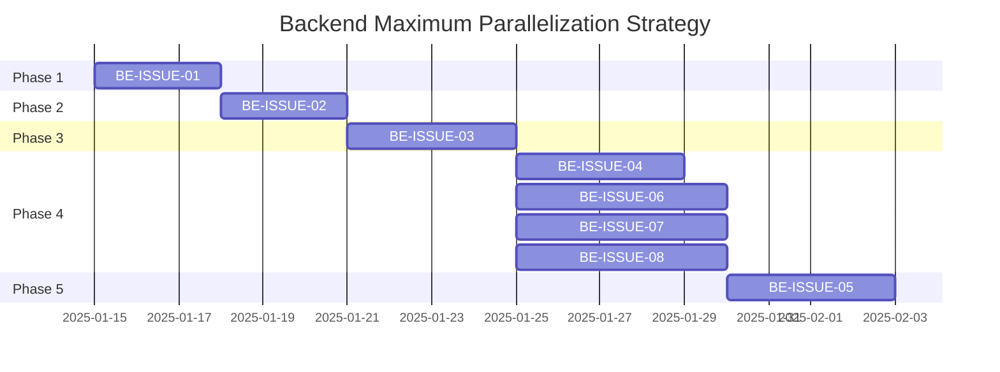
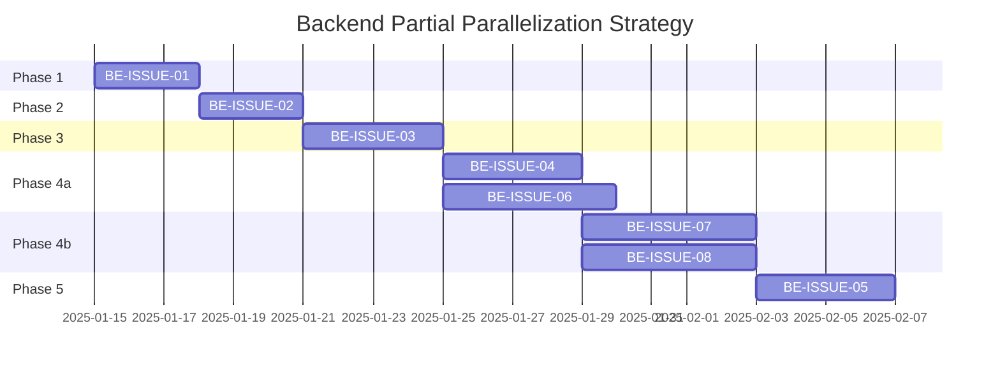
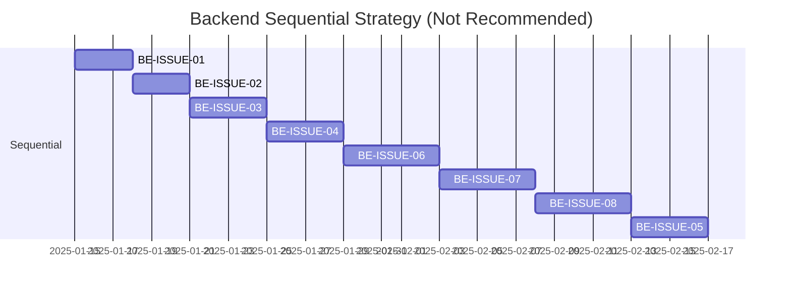

# 프로젝트 일정표 (Gantt Chart)

## 개요
BE_ISSUE_DAG.md의 DAG 구조에 기반한 병렬 작업 가능한 일정을 Gantt 차트로 작성한 문서입니다.

**참고 문서**: [BE_ISSUE_DAG.md](./BE_ISSUE_DAG.md)

---

## Strategy 1: Maximum Parallelization (최대 병렬화 - 권장)

**목표**: 최단 기간 내 Backend 개발 완료 (팀 리소스 충분 시)

**전략**: Phase 4의 4개 이슈(BE-ISSUE-04, 06, 07, 08)를 병렬 실행하여 총 5단계로 완료

### 작업 상세

#### Phase 1: 기반 구축
- **BE-ISSUE-01 (Spring Boot 초기 설정)**: 2025-01-15 시작, 3일 소요
  - 프로젝트 초기 설정 및 환경 구축
  - 모든 이슈의 기반이 되는 Critical Path

#### Phase 2: 데이터 모델 설계
- **BE-ISSUE-02 (통합 데이터 모델링 ERD)**: BE-ISSUE-01 완료 후 시작, 3일 소요
  - 모든 도메인 엔티티 설계의 기반
  - BE-ISSUE-01 완료 후 실행 가능

#### Phase 3: 인증 시스템
- **BE-ISSUE-03 (사용자 인증 및 회원 도메인)**: BE-ISSUE-02 완료 후 시작, 4일 소요
  - BE-ISSUE-01, BE-ISSUE-02 완료 후 실행 가능
  - 다른 모든 도메인 이슈의 인증 기반 제공
  - Critical Path의 마지막 단계

#### Phase 4: 병렬 실행 도메인 (병렬 실행 권장)
- **BE-ISSUE-04 (3분 온보딩 프로세스)**: BE-ISSUE-03 완료 후 시작, 4일 소요
- **BE-ISSUE-06 (행동 카드 및 코칭)**: BE-ISSUE-03 완료 후 시작, 5일 소요
- **BE-ISSUE-07 (가족 보드 및 권한 관리)**: BE-ISSUE-03 완료 후 시작, 5일 소요
- **BE-ISSUE-08 (외부 연동 및 동의 관리)**: BE-ISSUE-03 완료 후 시작, 5일 소요

**병렬 실행 특징**:
- BE-ISSUE-03 완료 후 **동시에 시작 가능**
- 각 도메인은 서로 독립적이며 동시에 개발 가능
- **생산성 극대화를 위해 병렬 실행 권장**
- 최대 병렬화 시 약 37.5% 시간 단축 (8단계 → 5단계)

#### Phase 5: 리포트 도메인
- **BE-ISSUE-05 (1장 요약 리포트 도메인)**: BE-ISSUE-03, BE-ISSUE-08 완료 후 시작, 4일 소요
  - 외부 연동 데이터(Device/Portal)를 활용하여 리포트 생성
  - BE-ISSUE-08의 외부 연동 데이터가 필요

---

## Strategy 2: 부분 병렬화

**목표**: 리소스 제약 시 단계적 병렬 실행

### 작업 상세

#### Phase 4a: 첫 번째 병렬 그룹
- **BE-ISSUE-04 (3분 온보딩 프로세스)**: BE-ISSUE-03 완료 후 시작, 4일 소요
- **BE-ISSUE-06 (행동 카드 및 코칭)**: BE-ISSUE-03 완료 후 시작, 5일 소요

#### Phase 4b: 두 번째 병렬 그룹
- **BE-ISSUE-07 (가족 보드 및 권한 관리)**: BE-ISSUE-04 완료 후 시작, 5일 소요
- **BE-ISSUE-08 (외부 연동 및 동의 관리)**: BE-ISSUE-04 완료 후 시작, 5일 소요

**참고**: 리소스가 제한적인 경우 이 전략을 사용하여 단계적으로 병렬 실행

---

## Strategy 3: 순차 실행 (비권장)

**목표**: 리소스가 매우 제한적인 경우

**총 소요 시간**: 8단계 (약 33일)
**비권장 이유**: 병렬 실행 시 5단계로 단축 가능하므로 비효율적

---

## 의존성 매트릭스

| 이슈 ID | 이슈명 | 선행 이슈 | 후행 이슈 | 병렬 가능 여부 |
|:---:|:---|:---|:---|:---:|
| BE-ISSUE-01 | Spring Boot 초기 설정 | 없음 | BE-ISSUE-02, BE-ISSUE-03 | ❌ |
| BE-ISSUE-02 | 통합 데이터 모델링 ERD | BE-ISSUE-01 | BE-ISSUE-03 | ❌ |
| BE-ISSUE-03 | 사용자 인증 및 회원 | BE-ISSUE-01, BE-ISSUE-02 | BE-ISSUE-04, BE-ISSUE-05, BE-ISSUE-06, BE-ISSUE-07, BE-ISSUE-08 | ❌ |
| BE-ISSUE-04 | 3분 온보딩 프로세스 | BE-ISSUE-03 | 없음 | ✅ (BE-ISSUE-06, 07, 08과 병렬) |
| BE-ISSUE-05 | 1장 요약 리포트 | BE-ISSUE-03, BE-ISSUE-08 | 없음 | ❌ |
| BE-ISSUE-06 | 행동 카드 및 코칭 | BE-ISSUE-03 | 없음 | ✅ (BE-ISSUE-04, 07, 08과 병렬) |
| BE-ISSUE-07 | 가족 보드 및 권한 관리 | BE-ISSUE-03 | 없음 | ✅ (BE-ISSUE-04, 06, 08과 병렬) |
| BE-ISSUE-08 | 외부 연동 및 동의 관리 | BE-ISSUE-03 | BE-ISSUE-05 | ✅ (BE-ISSUE-04, 06, 07과 병렬) |

---

## Critical Path (중요 경로)

**Critical Path**: BE-ISSUE-01 → BE-ISSUE-02 → BE-ISSUE-03 → BE-ISSUE-08 → BE-ISSUE-05

이 경로의 작업들은 순차적으로 진행되어야 하며, 지연 시 전체 프로젝트 일정에 영향을 미칩니다.

---

## 참고사항

- **FE 프로토타이핑에서 얼마나 생산성이 극대화 되었는지 확인 필요**
- 모든 날짜는 시작일 기준이며, 작업 기간은 일(day) 단위입니다
- `after` 의존성은 선행 작업 완료 후 시작을 의미합니다
- 병렬 작업 가능한 작업들은 동일 시작일을 가집니다
- **Phase 4의 4개 이슈는 서로 독립적이므로 병렬 실행 권장**
- 공통 리소스(예: `application.yml`, `build.gradle`) 수정 시 충돌 주의

---

## 관련 문서

- [BE_ISSUE_DAG.md](./BE_ISSUE_DAG.md): Backend 이슈 의존성 그래프 상세
- [BE] Issue-01: Spring Boot 프로젝트 초기 설정 (`Tasks/BE_issue/issue-01-be-setup.md`)
- [BE] Issue-02: 통합 데이터 모델링 (`Tasks/BE_issue/issue-02-db-design.md`)
- [BE] Issue-03: 사용자 인증 및 회원 (`Tasks/BE_issue/issue-03-auth-user.md`)
- [BE] Issue-04: 3분 온보딩 프로세스 (`Tasks/BE_issue/issue-04-onboarding.md`)
- [BE] Issue-05: 1장 요약 리포트 (`Tasks/BE_issue/issue-05-report-domain.md`)
- [BE] Issue-06: 행동 카드 및 코칭 (`Tasks/BE_issue/issue-06-action-domain.md`)
- [BE] Issue-07: 가족 보드 및 권한 관리 (`Tasks/BE_issue/issue-07-family-board.md`)
- [BE] Issue-08: 외부 연동 및 동의 관리 (`Tasks/BE_issue/issue-08-integration.md`)

---

## 업데이트 이력

- 2025-01-15: BE_ISSUE_DAG.md 구조에 맞춰 일정표 재작성
- 2025-11-27: 초기 일정표 작성
