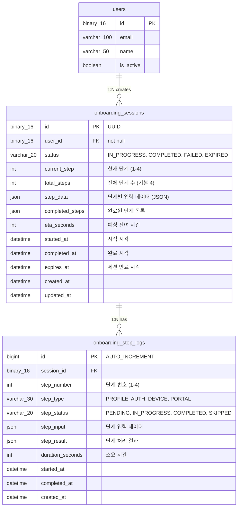
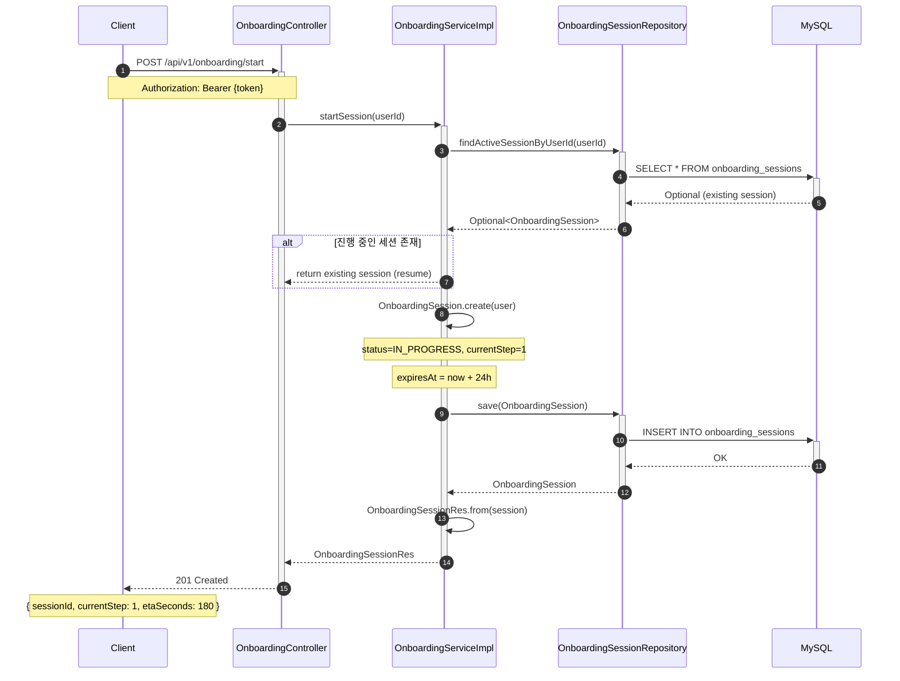
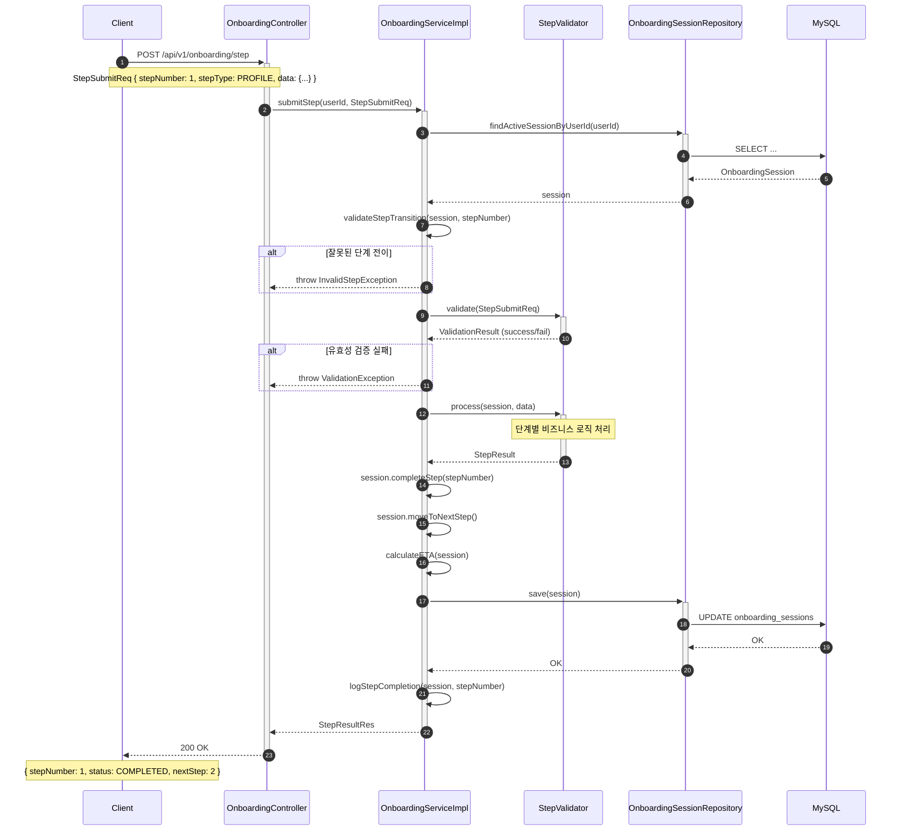
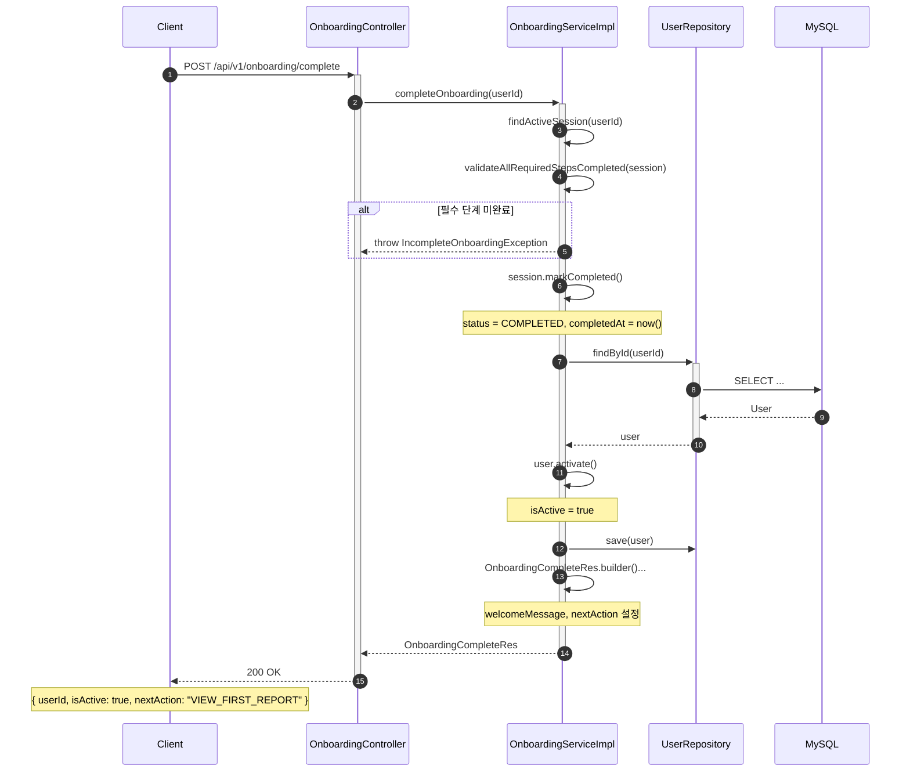

# [BE] Issue-04: 3분 온보딩 프로세스 구현

## 1. 개요
**SRS 3.4.1 핵심 온보딩 플로우** 및 **REQ-FUNC-005, 006**에 따라 단계별 온보딩 상태 관리 및 완료 처리를 구현합니다.

## 2. 작업 워크플로우 (설계 및 구현)

| 단계 | 입력(Input) | 도구(Tool) | 출력(Output) |
| --- | --- | --- | --- |
| **Plan** | REQ-FUNC-005~006 | Cursor | 온보딩 상태머신 다이어그램 |
| **Data Schema Design** | OnboardingSession | Mermaid.js | ERD 확인 |
| **Interaction Design** | State Flow | Cursor | **Onboarding Service & Controller** |
| **Review** | API Test | Postman/TestCode | 단계별 상태 전이 검증 |

## 3. 상세 요구사항 (To-Do)

- [ ] **Domain: OnboardingSession**
    - `OnboardingSession` Entity 구현 (Current Step, Status 관리)
    - 세션 생성/조회 로직
- [ ] **Step Management API**
    - `/api/onboarding/start`: 세션 시작
    - `/api/onboarding/step`: 단계별 데이터 저장 및 진행률(ETA) 계산 반환
    - `/api/onboarding/complete`: 최종 완료 처리 및 User 활성화
- [ ] **Exception Handling**
    - 병원 포털 미지원 지역 예외 처리 로직 (REQ-FUNC-019)
    - 이탈 후 재진입 시 마지막 단계 복원 로직

---

## 4. 3-Tier Architecture 데이터 흐름

### 4.1 온보딩 플로우 개요

```
┌─────────────────────────────────────────────────────────────────────────┐
│                      3분 온보딩 데이터 흐름                              │
├─────────────────────────────────────────────────────────────────────────┤
│                                                                         │
│  [Step 1] 프로필 입력                                                   │
│           Client → Controller → Service → Repository                    │
│           (이름, 나이, 성별, 주요 질환)                                  │
│                                                                         │
│  [Step 2] 인증 완료                                                     │
│           Auth Service → OnboardingService                              │
│           (소셜 로그인 / 휴대폰 본인인증)                                │
│                                                                         │
│  [Step 3] 디바이스 연동                                                 │
│           Device SDK → OnboardingService → DeviceLinkRepository         │
│           (워치/혈압계 OAuth 연동)                                       │
│                                                                         │
│  [Step 4] 병원 포털 연동                                                │
│           Portal API → OnboardingService → PortalConnectionRepository   │
│           (검진 결과 연동 or 수동 업로드)                                │
│                                                                         │
│  [Complete] 온보딩 완료                                                 │
│             User 활성화 → 첫 리포트/행동카드 진입                        │
│                                                                         │
└─────────────────────────────────────────────────────────────────────────┘
```

### 4.2 온보딩 상태 머신

```
┌─────────────┐      ┌─────────────┐      ┌─────────────┐      ┌─────────────┐
│   STEP_1    │ ──→  │   STEP_2    │ ──→  │   STEP_3    │ ──→  │   STEP_4    │
│  (프로필)   │      │   (인증)    │      │ (디바이스)  │      │  (포털)     │
└─────────────┘      └─────────────┘      └─────────────┘      └──────┬──────┘
       │                    │                    │                     │
       │                    │                    │                     ▼
       │                    │                    │              ┌─────────────┐
       └────────────────────┴────────────────────┴─────────────→│  COMPLETED  │
                          (Skip 가능한 단계)                     └─────────────┘
       │                                                               ▲
       ▼                                                               │
┌─────────────┐                                                        │
│   EXPIRED   │ ←── 세션 타임아웃 (24시간)                             │
└─────────────┘                                                        │
       │                                                               │
       ▼                                                               │
┌─────────────┐                                                        │
│   FAILED    │ ←── 필수 단계 실패 / 시스템 오류                       │
└─────────────┘                                                        │
```

### 4.3 구현 순서 (Repository → Service → Controller)

| 순서 | 계층 | 주요 작업 |
|------|------|----------|
| **1** | **Entity/Repository** | OnboardingSession Entity + Repository |
| **2** | **Service** | OnboardingService (단계 관리, 상태 전이) |
| **3** | **Controller** | OnboardingController (REST API) |

---

## 5. ERD (Entity Relationship Diagram)

> **온보딩 도메인 데이터베이스 관점**: 세션 및 단계별 데이터 구조

### 5.1 Onboarding Domain ERD



### 5.2 테이블 상세 설계

#### onboarding_sessions 테이블

| 컬럼 | 타입 | 제약조건 | 설명 |
|------|------|----------|------|
| `id` | BINARY(16) | PK | UUID |
| `user_id` | BINARY(16) | FK, NOT NULL | 사용자 참조 |
| `status` | VARCHAR(20) | NOT NULL | 세션 상태 |
| `current_step` | INT | NOT NULL, DEFAULT 1 | 현재 진행 단계 |
| `total_steps` | INT | NOT NULL, DEFAULT 4 | 전체 단계 수 |
| `step_data` | JSON | NULL | 각 단계에서 수집한 데이터 |
| `completed_steps` | JSON | NULL | 완료된 단계 목록 [1, 2, 3] |
| `eta_seconds` | INT | NULL | 예상 남은 시간 (초) |
| `started_at` | DATETIME | NOT NULL | 온보딩 시작 시각 |
| `completed_at` | DATETIME | NULL | 온보딩 완료 시각 |
| `expires_at` | DATETIME | NOT NULL | 세션 만료 시각 (24시간) |

#### step_data JSON 구조 예시

```json
{
  "step1_profile": {
    "name": "홍길동",
    "birthYear": 1960,
    "gender": "MALE",
    "primaryConditions": ["고혈압", "당뇨"]
  },
  "step2_auth": {
    "authMethod": "KAKAO",
    "verifiedAt": "2025-01-15T10:30:00"
  },
  "step3_device": {
    "devices": [
      { "vendor": "samsung", "type": "watch", "linked": true }
    ]
  },
  "step4_portal": {
    "portalId": "nhis_checkup",
    "status": "CONNECTED"
  }
}
```

#### 인덱스 설계

```sql
-- Primary & Foreign Key
ALTER TABLE onboarding_sessions ADD PRIMARY KEY (id);
ALTER TABLE onboarding_sessions ADD FOREIGN KEY (user_id) REFERENCES users(id);

-- Search Indexes
CREATE INDEX idx_onboarding_user_status ON onboarding_sessions(user_id, status);
CREATE INDEX idx_onboarding_expires ON onboarding_sessions(expires_at);
CREATE INDEX idx_onboarding_status ON onboarding_sessions(status);

-- Step Logs Indexes
CREATE INDEX idx_step_logs_session ON onboarding_step_logs(session_id);
CREATE INDEX idx_step_logs_type ON onboarding_step_logs(step_type, step_status);
```

---

## 6. CLD (Class/Component Logic Diagram)

> **온보딩 도메인 백엔드 서버 관점**: 상태 관리 및 단계별 처리 로직

### 6.1 Onboarding 도메인 클래스 다이어그램

```mermaid
classDiagram
    %% =========================================================
    %% 1. PRESENTATION LAYER (Controller)
    %% =========================================================
    
    class OnboardingController {
        <<@RestController>>
        <<@RequestMapping /api/v1/onboarding>>
        -OnboardingService onboardingService
        +start(@AuthUser UUID userId) ResponseEntity~ApiResponse~
        +getSession(@AuthUser UUID userId) ResponseEntity~ApiResponse~
        +submitStep(@AuthUser UUID userId, @Valid StepSubmitReq) ResponseEntity~ApiResponse~
        +skipStep(@AuthUser UUID userId, int stepNumber) ResponseEntity~ApiResponse~
        +complete(@AuthUser UUID userId) ResponseEntity~ApiResponse~
        +resume(@AuthUser UUID userId) ResponseEntity~ApiResponse~
    }

    %% =========================================================
    %% 2. APPLICATION LAYER (Service)
    %% =========================================================
    
    class OnboardingService {
        <<interface>>
        +startSession(UUID userId) OnboardingSessionRes
        +getSession(UUID userId) OnboardingSessionRes
        +submitStep(UUID userId, StepSubmitReq req) StepResultRes
        +skipStep(UUID userId, int stepNumber) StepResultRes
        +completeOnboarding(UUID userId) OnboardingCompleteRes
        +resumeSession(UUID userId) OnboardingSessionRes
    }

    class OnboardingServiceImpl {
        <<@Service>>
        <<@Transactional>>
        -OnboardingSessionRepository sessionRepository
        -OnboardingStepLogRepository stepLogRepository
        -UserRepository userRepository
        -DeviceLinkRepository deviceLinkRepository
        -PortalConnectionRepository portalRepository
        -StepValidatorFactory stepValidatorFactory
        +startSession(UUID userId) OnboardingSessionRes
        +getSession(UUID userId) OnboardingSessionRes
        +submitStep(UUID userId, StepSubmitReq req) StepResultRes
        +skipStep(UUID userId, int stepNumber) StepResultRes
        +completeOnboarding(UUID userId) OnboardingCompleteRes
        +resumeSession(UUID userId) OnboardingSessionRes
        -validateStepTransition(session, stepNumber) void
        -processStep(session, stepNumber, data) StepResult
        -calculateETA(session) int
        -activateUser(User user) void
    }

    %% =========================================================
    %% 3. DOMAIN LAYER (Entity)
    %% =========================================================
    
    class OnboardingSession {
        <<@Entity>>
        -UUID id
        -User user
        -OnboardingStatus status
        -int currentStep
        -int totalSteps
        -String stepData
        -String completedSteps
        -int etaSeconds
        -LocalDateTime startedAt
        -LocalDateTime completedAt
        -LocalDateTime expiresAt
        +static create(User user) OnboardingSession
        +moveToNextStep() void
        +completeStep(int stepNumber) void
        +skipStep(int stepNumber) void
        +markCompleted() void
        +markFailed(String reason) void
        +isExpired() boolean
        +canProceedToStep(int step) boolean
    }

    class OnboardingStepLog {
        <<@Entity>>
        -Long id
        -OnboardingSession session
        -int stepNumber
        -StepType stepType
        -StepStatus stepStatus
        -String stepInput
        -String stepResult
        -int durationSeconds
        -LocalDateTime startedAt
        -LocalDateTime completedAt
        +static create(session, stepNumber, type) OnboardingStepLog
        +start() void
        +complete(result) void
        +skip() void
        +fail(reason) void
    }

    class OnboardingStatus {
        <<enumeration>>
        IN_PROGRESS
        COMPLETED
        FAILED
        EXPIRED
    }

    class StepType {
        <<enumeration>>
        PROFILE
        AUTH
        DEVICE
        PORTAL
    }

    class StepStatus {
        <<enumeration>>
        PENDING
        IN_PROGRESS
        COMPLETED
        SKIPPED
        FAILED
    }

    %% =========================================================
    %% 4. INFRASTRUCTURE LAYER (Repository)
    %% =========================================================
    
    class OnboardingSessionRepository {
        <<@Repository>>
        +findByUserId(UUID userId) Optional~OnboardingSession~
        +findByUserIdAndStatus(UUID userId, status) Optional~OnboardingSession~
        +findActiveSessionByUserId(UUID userId) Optional~OnboardingSession~
        +findExpiredSessions(LocalDateTime now) List~OnboardingSession~
    }

    class OnboardingStepLogRepository {
        <<@Repository>>
        +findBySessionId(UUID sessionId) List~OnboardingStepLog~
        +findBySessionIdAndStepNumber(UUID sessionId, int step) Optional~OnboardingStepLog~
    }

    %% =========================================================
    %% 5. STEP VALIDATORS (Strategy Pattern)
    %% =========================================================

    class StepValidatorFactory {
        <<@Component>>
        -Map~StepType, StepValidator~ validators
        +getValidator(StepType type) StepValidator
    }

    class StepValidator {
        <<interface>>
        +validate(StepSubmitReq req) ValidationResult
        +process(session, data) StepResult
        +canSkip() boolean
    }

    class ProfileStepValidator {
        <<@Component>>
        +validate(StepSubmitReq req) ValidationResult
        +process(session, data) StepResult
        +canSkip() boolean
    }

    class DeviceStepValidator {
        <<@Component>>
        -DeviceLinkRepository deviceLinkRepository
        +validate(StepSubmitReq req) ValidationResult
        +process(session, data) StepResult
        +canSkip() boolean
    }

    class PortalStepValidator {
        <<@Component>>
        -PortalConnectionRepository portalRepository
        +validate(StepSubmitReq req) ValidationResult
        +process(session, data) StepResult
        +canSkip() boolean
    }

    %% =========================================================
    %% 6. DTOs
    %% =========================================================
    
    class StepSubmitReq {
        <<Request DTO>>
        -int stepNumber
        -StepType stepType
        -Map~String, Object~ stepData
    }

    class OnboardingSessionRes {
        <<Response DTO>>
        -UUID sessionId
        -OnboardingStatus status
        -int currentStep
        -int totalSteps
        -List~StepInfo~ steps
        -int etaSeconds
        -int progressPercent
        +static from(OnboardingSession) OnboardingSessionRes
    }

    class StepResultRes {
        <<Response DTO>>
        -int stepNumber
        -StepStatus status
        -boolean canProceed
        -int nextStep
        -String message
    }

    class OnboardingCompleteRes {
        <<Response DTO>>
        -UUID userId
        -boolean isActive
        -String welcomeMessage
        -String nextAction
    }

    %% =========================================================
    %% RELATIONSHIPS
    %% =========================================================
    
    OnboardingController --> OnboardingService : uses
    OnboardingServiceImpl ..|> OnboardingService : implements
    OnboardingServiceImpl --> OnboardingSessionRepository : uses
    OnboardingServiceImpl --> OnboardingStepLogRepository : uses
    OnboardingServiceImpl --> StepValidatorFactory : uses
    
    StepValidatorFactory --> StepValidator : creates
    ProfileStepValidator ..|> StepValidator : implements
    DeviceStepValidator ..|> StepValidator : implements
    PortalStepValidator ..|> StepValidator : implements
    
    OnboardingSessionRepository ..> OnboardingSession : manages
    OnboardingStepLogRepository ..> OnboardingStepLog : manages
    
    OnboardingSession "1" -- "0..*" OnboardingStepLog : has
    OnboardingSession --> OnboardingStatus : uses
    OnboardingStepLog --> StepType : uses
    OnboardingStepLog --> StepStatus : uses
    
    OnboardingController ..> StepSubmitReq : receives
    OnboardingController ..> OnboardingSessionRes : returns
```



### 6.2 온보딩 시퀀스 다이어그램

#### 6.2.1 온보딩 시작 플로우



#### 6.2.2 단계 제출 플로우



#### 6.2.3 온보딩 완료 플로우



---

## 7. ORM 예제코드 (Onboarding Domain)

> **온보딩 도메인 연결 관점**: Entity, Repository, Service 구현

### 7.1 OnboardingSession Entity

```java
package com.pollosseum.domain.onboarding.entity;

import com.pollosseum.domain.common.BaseTimeEntity;
import com.pollosseum.domain.user.entity.User;
import jakarta.persistence.*;
import lombok.*;
import org.hibernate.annotations.JdbcTypeCode;
import org.hibernate.type.SqlTypes;

import java.time.LocalDateTime;
import java.util.*;

/**
 * 온보딩 세션 Entity
 * - 3분 온보딩 진행 상태 관리
 * - 단계별 데이터 저장 (JSON)
 */
@Entity
@Table(name = "onboarding_sessions",
    indexes = {
        @Index(name = "idx_onboarding_user_status", columnList = "user_id, status"),
        @Index(name = "idx_onboarding_expires", columnList = "expires_at")
    }
)
@Getter
@NoArgsConstructor(access = AccessLevel.PROTECTED)
public class OnboardingSession extends BaseTimeEntity {

    private static final int DEFAULT_TOTAL_STEPS = 4;
    private static final int SESSION_VALIDITY_HOURS = 24;

    @Id
    @GeneratedValue(strategy = GenerationType.UUID)
    @Column(columnDefinition = "BINARY(16)")
    private UUID id;

    @ManyToOne(fetch = FetchType.LAZY)
    @JoinColumn(name = "user_id", nullable = false)
    private User user;

    @Enumerated(EnumType.STRING)
    @Column(nullable = false, length = 20)
    private OnboardingStatus status;

    @Column(name = "current_step", nullable = false)
    private int currentStep;

    @Column(name = "total_steps", nullable = false)
    private int totalSteps;

    @JdbcTypeCode(SqlTypes.JSON)
    @Column(name = "step_data", columnDefinition = "JSON")
    private Map<String, Object> stepData;

    @JdbcTypeCode(SqlTypes.JSON)
    @Column(name = "completed_steps", columnDefinition = "JSON")
    private List<Integer> completedSteps;

    @Column(name = "eta_seconds")
    private Integer etaSeconds;

    @Column(name = "started_at", nullable = false)
    private LocalDateTime startedAt;

    @Column(name = "completed_at")
    private LocalDateTime completedAt;

    @Column(name = "expires_at", nullable = false)
    private LocalDateTime expiresAt;

    @OneToMany(mappedBy = "session", cascade = CascadeType.ALL, orphanRemoval = true)
    private List<OnboardingStepLog> stepLogs = new ArrayList<>();

    // ========================================
    // Builder
    // ========================================
    @Builder
    private OnboardingSession(User user, int totalSteps) {
        this.user = user;
        this.status = OnboardingStatus.IN_PROGRESS;
        this.currentStep = 1;
        this.totalSteps = totalSteps;
        this.stepData = new HashMap<>();
        this.completedSteps = new ArrayList<>();
        this.etaSeconds = calculateInitialETA();
        this.startedAt = LocalDateTime.now();
        this.expiresAt = LocalDateTime.now().plusHours(SESSION_VALIDITY_HOURS);
    }

    // ========================================
    // Factory Method
    // ========================================
    public static OnboardingSession create(User user) {
        return OnboardingSession.builder()
                .user(user)
                .totalSteps(DEFAULT_TOTAL_STEPS)
                .build();
    }

    // ========================================
    // Business Methods
    // ========================================

    /**
     * 다음 단계로 이동
     */
    public void moveToNextStep() {
        if (currentStep < totalSteps) {
            this.currentStep++;
            updateETA();
        }
    }

    /**
     * 특정 단계 완료 처리
     */
    public void completeStep(int stepNumber, Map<String, Object> data) {
        if (!completedSteps.contains(stepNumber)) {
            completedSteps.add(stepNumber);
            stepData.put("step" + stepNumber, data);
            updateETA();
        }
    }

    /**
     * 단계 스킵 처리
     */
    public void skipStep(int stepNumber) {
        if (canSkipStep(stepNumber) && !completedSteps.contains(stepNumber)) {
            completedSteps.add(stepNumber);
            stepData.put("step" + stepNumber + "_skipped", true);
            moveToNextStep();
        }
    }

    /**
     * 온보딩 완료 처리
     */
    public void markCompleted() {
        this.status = OnboardingStatus.COMPLETED;
        this.completedAt = LocalDateTime.now();
        this.etaSeconds = 0;
    }

    /**
     * 온보딩 실패 처리
     */
    public void markFailed(String reason) {
        this.status = OnboardingStatus.FAILED;
        this.stepData.put("failureReason", reason);
    }

    /**
     * 세션 만료 여부 확인
     */
    public boolean isExpired() {
        return LocalDateTime.now().isAfter(expiresAt) || 
               status == OnboardingStatus.EXPIRED;
    }

    /**
     * 세션 활성 상태 확인
     */
    public boolean isActive() {
        return status == OnboardingStatus.IN_PROGRESS && !isExpired();
    }

    /**
     * 특정 단계로 진행 가능 여부
     */
    public boolean canProceedToStep(int stepNumber) {
        if (stepNumber <= 0 || stepNumber > totalSteps) {
            return false;
        }
        // 이전 단계가 완료되었거나 스킵되어야 함
        for (int i = 1; i < stepNumber; i++) {
            if (!completedSteps.contains(i) && !canSkipStep(i)) {
                return false;
            }
        }
        return true;
    }

    /**
     * 모든 필수 단계 완료 여부
     */
    public boolean areAllRequiredStepsCompleted() {
        // Step 1(프로필), Step 2(인증)는 필수
        return completedSteps.contains(1) && completedSteps.contains(2);
    }

    /**
     * 진행률 계산 (%)
     */
    public int getProgressPercent() {
        return (completedSteps.size() * 100) / totalSteps;
    }

    // ========================================
    // Private Methods
    // ========================================

    private boolean canSkipStep(int stepNumber) {
        // Step 3(디바이스), Step 4(포털)는 스킵 가능
        return stepNumber == 3 || stepNumber == 4;
    }

    private int calculateInitialETA() {
        // 초기 예상 시간: 180초 (3분)
        return 180;
    }

    private void updateETA() {
        // 단계당 평균 45초 기준
        int remainingSteps = totalSteps - completedSteps.size();
        this.etaSeconds = remainingSteps * 45;
    }
}
```

### 7.2 OnboardingStepLog Entity

```java
package com.pollosseum.domain.onboarding.entity;

import com.pollosseum.domain.common.BaseTimeEntity;
import jakarta.persistence.*;
import lombok.*;
import org.hibernate.annotations.JdbcTypeCode;
import org.hibernate.type.SqlTypes;

import java.time.Duration;
import java.time.LocalDateTime;
import java.util.Map;

/**
 * 온보딩 단계 로그 Entity
 * - 각 단계의 진행 이력 기록
 * - p50 온보딩 시간 측정용
 */
@Entity
@Table(name = "onboarding_step_logs",
    indexes = {
        @Index(name = "idx_step_logs_session", columnList = "session_id"),
        @Index(name = "idx_step_logs_type", columnList = "step_type, step_status")
    }
)
@Getter
@NoArgsConstructor(access = AccessLevel.PROTECTED)
public class OnboardingStepLog extends BaseTimeEntity {

    @Id
    @GeneratedValue(strategy = GenerationType.IDENTITY)
    private Long id;

    @ManyToOne(fetch = FetchType.LAZY)
    @JoinColumn(name = "session_id", nullable = false)
    private OnboardingSession session;

    @Column(name = "step_number", nullable = false)
    private int stepNumber;

    @Enumerated(EnumType.STRING)
    @Column(name = "step_type", nullable = false, length = 30)
    private StepType stepType;

    @Enumerated(EnumType.STRING)
    @Column(name = "step_status", nullable = false, length = 20)
    private StepStatus stepStatus;

    @JdbcTypeCode(SqlTypes.JSON)
    @Column(name = "step_input", columnDefinition = "JSON")
    private Map<String, Object> stepInput;

    @JdbcTypeCode(SqlTypes.JSON)
    @Column(name = "step_result", columnDefinition = "JSON")
    private Map<String, Object> stepResult;

    @Column(name = "duration_seconds")
    private Integer durationSeconds;

    @Column(name = "started_at")
    private LocalDateTime startedAt;

    @Column(name = "completed_at")
    private LocalDateTime completedAt;

    // ========================================
    // Builder
    // ========================================
    @Builder
    private OnboardingStepLog(OnboardingSession session, int stepNumber, StepType stepType) {
        this.session = session;
        this.stepNumber = stepNumber;
        this.stepType = stepType;
        this.stepStatus = StepStatus.PENDING;
    }

    // ========================================
    // Factory Method
    // ========================================
    public static OnboardingStepLog create(OnboardingSession session, 
                                            int stepNumber, 
                                            StepType stepType) {
        return OnboardingStepLog.builder()
                .session(session)
                .stepNumber(stepNumber)
                .stepType(stepType)
                .build();
    }

    // ========================================
    // Business Methods
    // ========================================

    /**
     * 단계 시작
     */
    public void start(Map<String, Object> input) {
        this.stepStatus = StepStatus.IN_PROGRESS;
        this.stepInput = input;
        this.startedAt = LocalDateTime.now();
    }

    /**
     * 단계 완료
     */
    public void complete(Map<String, Object> result) {
        this.stepStatus = StepStatus.COMPLETED;
        this.stepResult = result;
        this.completedAt = LocalDateTime.now();
        calculateDuration();
    }

    /**
     * 단계 스킵
     */
    public void skip() {
        this.stepStatus = StepStatus.SKIPPED;
        this.completedAt = LocalDateTime.now();
        calculateDuration();
    }

    /**
     * 단계 실패
     */
    public void fail(String reason) {
        this.stepStatus = StepStatus.FAILED;
        this.stepResult = Map.of("error", reason);
        this.completedAt = LocalDateTime.now();
        calculateDuration();
    }

    private void calculateDuration() {
        if (startedAt != null && completedAt != null) {
            this.durationSeconds = (int) Duration.between(startedAt, completedAt).toSeconds();
        }
    }
}
```

### 7.3 Enum 정의

```java
// OnboardingStatus.java
package com.pollosseum.domain.onboarding.entity;

public enum OnboardingStatus {
    IN_PROGRESS,  // 진행 중
    COMPLETED,    // 완료
    FAILED,       // 실패
    EXPIRED       // 만료
}

// StepType.java
package com.pollosseum.domain.onboarding.entity;

public enum StepType {
    PROFILE,  // Step 1: 프로필 입력
    AUTH,     // Step 2: 인증
    DEVICE,   // Step 3: 디바이스 연동
    PORTAL    // Step 4: 병원 포털 연동
}

// StepStatus.java
package com.pollosseum.domain.onboarding.entity;

public enum StepStatus {
    PENDING,      // 대기
    IN_PROGRESS,  // 진행 중
    COMPLETED,    // 완료
    SKIPPED,      // 스킵
    FAILED        // 실패
}
```

### 7.4 Repository 인터페이스

```java
// ========================================
// OnboardingSessionRepository.java
// ========================================
package com.pollosseum.infrastructure.repository;

import com.pollosseum.domain.onboarding.entity.OnboardingSession;
import com.pollosseum.domain.onboarding.entity.OnboardingStatus;
import org.springframework.data.jpa.repository.JpaRepository;
import org.springframework.data.jpa.repository.Query;
import org.springframework.data.repository.query.Param;
import org.springframework.stereotype.Repository;

import java.time.LocalDateTime;
import java.util.List;
import java.util.Optional;
import java.util.UUID;

@Repository
public interface OnboardingSessionRepository extends JpaRepository<OnboardingSession, UUID> {

    /**
     * 사용자의 온보딩 세션 조회
     */
    Optional<OnboardingSession> findByUserId(UUID userId);

    /**
     * 사용자의 특정 상태 세션 조회
     */
    Optional<OnboardingSession> findByUserIdAndStatus(UUID userId, OnboardingStatus status);

    /**
     * 사용자의 활성 세션 조회 (진행 중 + 미만료)
     */
    @Query("SELECT os FROM OnboardingSession os " +
           "WHERE os.user.id = :userId " +
           "AND os.status = 'IN_PROGRESS' " +
           "AND os.expiresAt > :now")
    Optional<OnboardingSession> findActiveSessionByUserId(
            @Param("userId") UUID userId,
            @Param("now") LocalDateTime now);

    /**
     * 만료된 세션 목록 조회 (배치 처리용)
     */
    @Query("SELECT os FROM OnboardingSession os " +
           "WHERE os.status = 'IN_PROGRESS' " +
           "AND os.expiresAt < :now")
    List<OnboardingSession> findExpiredSessions(@Param("now") LocalDateTime now);

    /**
     * 최근 완료된 온보딩 세션 조회 (통계용)
     */
    @Query("SELECT os FROM OnboardingSession os " +
           "WHERE os.status = 'COMPLETED' " +
           "AND os.completedAt BETWEEN :start AND :end")
    List<OnboardingSession> findCompletedSessionsBetween(
            @Param("start") LocalDateTime start,
            @Param("end") LocalDateTime end);
}

// ========================================
// OnboardingStepLogRepository.java
// ========================================
package com.pollosseum.infrastructure.repository;

import com.pollosseum.domain.onboarding.entity.OnboardingStepLog;
import com.pollosseum.domain.onboarding.entity.StepType;
import org.springframework.data.jpa.repository.JpaRepository;
import org.springframework.data.jpa.repository.Query;
import org.springframework.data.repository.query.Param;
import org.springframework.stereotype.Repository;

import java.util.List;
import java.util.Optional;
import java.util.UUID;

@Repository
public interface OnboardingStepLogRepository extends JpaRepository<OnboardingStepLog, Long> {

    /**
     * 세션의 모든 단계 로그 조회
     */
    List<OnboardingStepLog> findBySessionIdOrderByStepNumber(UUID sessionId);

    /**
     * 세션의 특정 단계 로그 조회
     */
    Optional<OnboardingStepLog> findBySessionIdAndStepNumber(UUID sessionId, int stepNumber);

    /**
     * 단계별 평균 소요 시간 조회 (통계용)
     */
    @Query("SELECT osl.stepType, AVG(osl.durationSeconds) " +
           "FROM OnboardingStepLog osl " +
           "WHERE osl.stepStatus = 'COMPLETED' " +
           "GROUP BY osl.stepType")
    List<Object[]> findAverageDurationByStepType();
}
```

### 7.5 OnboardingService 구현

```java
package com.pollosseum.application.service;

import com.pollosseum.domain.onboarding.entity.*;
import com.pollosseum.domain.user.entity.User;
import com.pollosseum.infrastructure.repository.*;
import com.pollosseum.interfaces.api.dto.request.StepSubmitReq;
import com.pollosseum.interfaces.api.dto.response.*;
import lombok.RequiredArgsConstructor;
import org.springframework.stereotype.Service;
import org.springframework.transaction.annotation.Transactional;

import java.time.LocalDateTime;
import java.util.UUID;

/**
 * 온보딩 서비스 구현체
 */
@Service
@RequiredArgsConstructor
@Transactional(readOnly = true)
public class OnboardingServiceImpl implements OnboardingService {

    private final OnboardingSessionRepository sessionRepository;
    private final OnboardingStepLogRepository stepLogRepository;
    private final UserRepository userRepository;

    /**
     * 온보딩 세션 시작
     */
    @Override
    @Transactional
    public OnboardingSessionRes startSession(UUID userId) {
        // 1. 기존 활성 세션 확인
        sessionRepository.findActiveSessionByUserId(userId, LocalDateTime.now())
                .ifPresent(session -> {
                    throw new OnboardingSessionAlreadyExistsException(
                            "진행 중인 온보딩 세션이 있습니다. sessionId: " + session.getId());
                });

        // 2. 사용자 조회
        User user = userRepository.findById(userId)
                .orElseThrow(() -> new UserNotFoundException("사용자를 찾을 수 없습니다."));

        // 3. 새 세션 생성
        OnboardingSession session = OnboardingSession.create(user);
        OnboardingSession savedSession = sessionRepository.save(session);

        // 4. 첫 번째 단계 로그 생성
        OnboardingStepLog firstStepLog = OnboardingStepLog.create(
                savedSession, 1, StepType.PROFILE);
        stepLogRepository.save(firstStepLog);

        return OnboardingSessionRes.from(savedSession);
    }

    /**
     * 현재 온보딩 세션 조회
     */
    @Override
    public OnboardingSessionRes getSession(UUID userId) {
        OnboardingSession session = findActiveSession(userId);
        return OnboardingSessionRes.from(session);
    }

    /**
     * 단계 제출 처리
     */
    @Override
    @Transactional
    public StepResultRes submitStep(UUID userId, StepSubmitReq request) {
        OnboardingSession session = findActiveSession(userId);

        // 1. 단계 전이 유효성 검증
        validateStepTransition(session, request.getStepNumber());

        // 2. 단계 로그 조회 또는 생성
        OnboardingStepLog stepLog = stepLogRepository
                .findBySessionIdAndStepNumber(session.getId(), request.getStepNumber())
                .orElseGet(() -> OnboardingStepLog.create(
                        session, request.getStepNumber(), request.getStepType()));

        // 3. 단계 시작 기록
        stepLog.start(request.getStepData());

        // 4. 단계별 처리 로직 실행
        processStep(session, request);

        // 5. 단계 완료 처리
        stepLog.complete(request.getStepData());
        session.completeStep(request.getStepNumber(), request.getStepData());

        // 6. 다음 단계가 있으면 이동
        if (request.getStepNumber() < session.getTotalSteps()) {
            session.moveToNextStep();
            
            // 다음 단계 로그 생성
            StepType nextStepType = StepType.values()[request.getStepNumber()];
            OnboardingStepLog nextStepLog = OnboardingStepLog.create(
                    session, session.getCurrentStep(), nextStepType);
            stepLogRepository.save(nextStepLog);
        }

        stepLogRepository.save(stepLog);
        sessionRepository.save(session);

        return StepResultRes.builder()
                .stepNumber(request.getStepNumber())
                .status(StepStatus.COMPLETED)
                .canProceed(true)
                .nextStep(session.getCurrentStep())
                .message("단계가 완료되었습니다.")
                .build();
    }

    /**
     * 단계 스킵
     */
    @Override
    @Transactional
    public StepResultRes skipStep(UUID userId, int stepNumber) {
        OnboardingSession session = findActiveSession(userId);

        // 스킵 가능 여부 확인 (Step 3, 4만 스킵 가능)
        if (stepNumber != 3 && stepNumber != 4) {
            throw new StepCannotBeSkippedException("해당 단계는 스킵할 수 없습니다.");
        }

        session.skipStep(stepNumber);
        sessionRepository.save(session);

        return StepResultRes.builder()
                .stepNumber(stepNumber)
                .status(StepStatus.SKIPPED)
                .canProceed(true)
                .nextStep(session.getCurrentStep())
                .message("단계를 건너뛰었습니다.")
                .build();
    }

    /**
     * 온보딩 완료
     */
    @Override
    @Transactional
    public OnboardingCompleteRes completeOnboarding(UUID userId) {
        OnboardingSession session = findActiveSession(userId);

        // 필수 단계 완료 여부 확인
        if (!session.areAllRequiredStepsCompleted()) {
            throw new IncompleteOnboardingException("필수 단계를 모두 완료해야 합니다.");
        }

        // 온보딩 완료 처리
        session.markCompleted();
        sessionRepository.save(session);

        // 사용자 활성화
        User user = session.getUser();
        user.activate();
        userRepository.save(user);

        return OnboardingCompleteRes.builder()
                .userId(userId)
                .isActive(true)
                .welcomeMessage("환영합니다! 온보딩이 완료되었습니다.")
                .nextAction("VIEW_FIRST_REPORT")
                .build();
    }

    /**
     * 세션 재개 (이탈 후 재진입)
     */
    @Override
    public OnboardingSessionRes resumeSession(UUID userId) {
        OnboardingSession session = findActiveSession(userId);
        return OnboardingSessionRes.from(session);
    }

    // ========================================
    // Private Methods
    // ========================================

    private OnboardingSession findActiveSession(UUID userId) {
        return sessionRepository.findActiveSessionByUserId(userId, LocalDateTime.now())
                .orElseThrow(() -> new OnboardingSessionNotFoundException(
                        "활성 온보딩 세션을 찾을 수 없습니다."));
    }

    private void validateStepTransition(OnboardingSession session, int targetStep) {
        if (!session.canProceedToStep(targetStep)) {
            throw new InvalidStepTransitionException(
                    "단계 " + targetStep + "로 진행할 수 없습니다. 이전 단계를 완료해주세요.");
        }
    }

    private void processStep(OnboardingSession session, StepSubmitReq request) {
        // 단계별 비즈니스 로직 처리
        // 실제 구현 시 StepValidator/StepProcessor 패턴 적용 권장
        switch (request.getStepType()) {
            case PROFILE -> processProfileStep(session, request.getStepData());
            case AUTH -> processAuthStep(session, request.getStepData());
            case DEVICE -> processDeviceStep(session, request.getStepData());
            case PORTAL -> processPortalStep(session, request.getStepData());
        }
    }

    private void processProfileStep(OnboardingSession session, java.util.Map<String, Object> data) {
        // 프로필 정보 저장 로직
    }

    private void processAuthStep(OnboardingSession session, java.util.Map<String, Object> data) {
        // 인증 완료 처리 로직
    }

    private void processDeviceStep(OnboardingSession session, java.util.Map<String, Object> data) {
        // 디바이스 연동 처리 로직
    }

    private void processPortalStep(OnboardingSession session, java.util.Map<String, Object> data) {
        // 병원 포털 연동 처리 로직
    }
}
```

---

## 8. 패키지 구조

```
src/main/java/com/pollosseum/
├── domain/
│   └── onboarding/
│       └── entity/
│           ├── OnboardingSession.java
│           ├── OnboardingStepLog.java
│           ├── OnboardingStatus.java
│           ├── StepType.java
│           └── StepStatus.java
│
├── application/
│   └── service/
│       ├── OnboardingService.java
│       └── OnboardingServiceImpl.java
│
├── infrastructure/
│   └── repository/
│       ├── OnboardingSessionRepository.java
│       └── OnboardingStepLogRepository.java
│
└── interfaces/
    ├── api/
    │   └── OnboardingController.java
    │
    └── dto/
        ├── request/
        │   └── StepSubmitReq.java
        │
        └── response/
            ├── OnboardingSessionRes.java
            ├── StepResultRes.java
            └── OnboardingCompleteRes.java
```

---

## 9. API 명세 요약

| Method | Endpoint | 설명 | Auth |
|--------|----------|------|------|
| `POST` | `/api/v1/onboarding/start` | 온보딩 시작 | ○ |
| `GET` | `/api/v1/onboarding/session` | 현재 세션 조회 | ○ |
| `POST` | `/api/v1/onboarding/step` | 단계 제출 | ○ |
| `POST` | `/api/v1/onboarding/step/{stepNumber}/skip` | 단계 스킵 | ○ |
| `POST` | `/api/v1/onboarding/complete` | 온보딩 완료 | ○ |
| `GET` | `/api/v1/onboarding/resume` | 세션 재개 | ○ |

---

## 10. 구현 체크포인트

### 10.1 Entity 체크리스트

- [ ] OnboardingSession - UUID PK, JSON 컬럼, 상태 관리
- [ ] OnboardingStepLog - 단계별 이력 기록, 소요 시간 측정
- [ ] Enum - OnboardingStatus, StepType, StepStatus

### 10.2 Service 체크리스트

- [ ] 세션 시작 - 중복 세션 검사, 만료 시간 설정
- [ ] 단계 제출 - 유효성 검증, 상태 전이 처리
- [ ] 단계 스킵 - 스킵 가능 단계 검증
- [ ] 온보딩 완료 - 필수 단계 완료 검증, 사용자 활성화

### 10.3 예외 처리 체크리스트

- [ ] OnboardingSessionAlreadyExistsException
- [ ] OnboardingSessionNotFoundException
- [ ] InvalidStepTransitionException
- [ ] StepCannotBeSkippedException
- [ ] IncompleteOnboardingException

---

## 11. 참고 자료

- SRS 3.4.1 핵심 온보딩 플로우
- SRS 6.2.2 OnboardingSession
- REQ-NF-003 (p50 시간 측정용 로그 적재 고려)
- `studio/Tasks/BE_issue/issue-01-be-setup.md`
