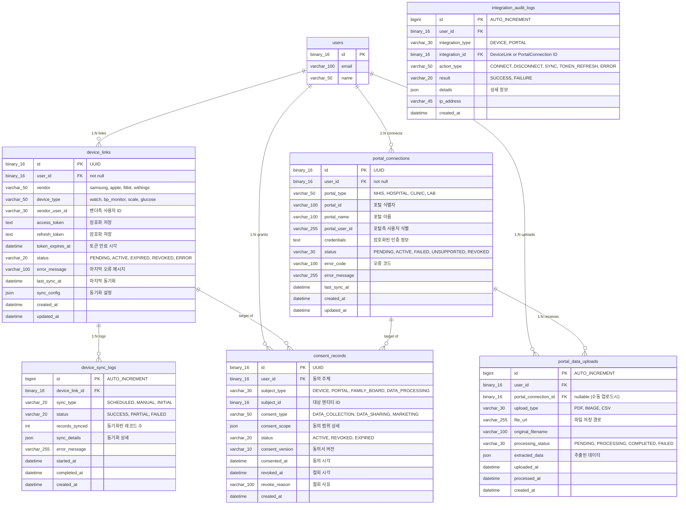

# [BE] Issue-08: 외부 연동 (Device & Portal) 및 동의 관리

## 1. 개요
**SRS REQ-FUNC-003, 004** 및 **동의(Consent)** 관리를 위해 외부 시스템과의 인터페이스 및 데이터 연동 구조를 구현합니다. MVP 단계에서는 Mocking 또는 인터페이스 위주로 구현합니다.

## 2. 작업 워크플로우 (설계 및 구현)

| 단계 | 입력(Input) | 도구(Tool) | 출력(Output) |
| --- | --- | --- | --- |
| **Plan** | REQ-FUNC-003, 004 | Cursor | 외부 시스템 인터페이스 정의 |
| **Data Schema Design** | DeviceLink, PortalConn | Mermaid.js | 연동 테이블 설계 |
| **Interaction Design** | OAuth/Mock | Cursor | **Integration Service** |
| **Review** | Integration Test | JUnit | Mock 데이터 연동 확인 |

## 3. 상세 요구사항 (To-Do)

- [ ] **Domain: Consent & Link**
    - `ConsentRecord` Entity 구현 (동의 이력 관리)
    - `DeviceLink`, `PortalConnection` Entity 구현 (토큰 및 상태 관리)
- [ ] **Interface Definition**
    - `DeviceDataProvider` 인터페이스 정의 (getHealthData)
    - `PortalDataProvider` 인터페이스 정의 (getMedicalRecords)
- [ ] **Mock Implementation**
    - 테스트용 Mock Provider 구현 (랜덤 데이터 반환)
- [ ] **Sync API**
    - 연동 상태 조회 및 수동 동기화 트리거 API

---

## 4. 3-Tier Architecture 데이터 흐름

### 4.1 외부 연동 플로우 개요

```
┌─────────────────────────────────────────────────────────────────────────┐
│                         외부 연동 데이터 흐름                            │
├─────────────────────────────────────────────────────────────────────────┤
│                                                                         │
│  [디바이스 연동] DeviceLinkService                                      │
│  ├─ OAuth 인증 플로우 (Samsung/Apple/Fitbit)                           │
│  ├─ Access Token 저장 및 갱신                                           │
│  ├─ 건강 데이터 동기화 (걸음수, 심박, 수면 등)                          │
│  └─ 연동 상태 모니터링                                                  │
│                                                                         │
│  [병원 포털 연동] PortalConnectionService                               │
│  ├─ 포털 계정 연결 (인증서/공동인증서)                                  │
│  ├─ 검진 결과 조회                                                      │
│  ├─ 진료 기록 동기화                                                    │
│  └─ 미지원 지역 대체 경로 (파일 업로드)                                 │
│                                                                         │
│  [동의 관리] ConsentService                                             │
│  ├─ 데이터 수집 동의 기록                                               │
│  ├─ 동의 범위 관리 (어떤 데이터, 어느 기간)                             │
│  ├─ 동의 철회 처리                                                      │
│  └─ 동의 이력 감사 로그                                                 │
│                                                                         │
│  [데이터 동기화] SyncScheduler                                          │
│  ├─ 주기적 데이터 동기화 (1시간/6시간)                                  │
│  ├─ 토큰 갱신 체크                                                      │
│  └─ 연동 오류 알림                                                      │
│                                                                         │
└─────────────────────────────────────────────────────────────────────────┘
```

### 4.2 디바이스 연동 플로우

```
┌─────────────────┐     ┌─────────────────┐     ┌─────────────────┐
│   사용자 앱     │ ──→ │   백엔드 서버   │ ──→ │  디바이스 SDK   │
│  (연동 요청)    │     │ (토큰 저장)     │     │  (OAuth)        │
└─────────────────┘     └─────────────────┘     └─────────────────┘
         │                      │                       │
         │                      ▼                       │
         │              ┌─────────────────┐             │
         │              │   DeviceLink    │             │
         │              │   - accessToken │             │
         │              │   - refreshToken│             │
         │              │   - status      │             │
         │              └─────────────────┘             │
         │                      │                       │
         │                      ▼                       │
         │              ┌─────────────────┐             │
         │              │ ConsentRecord   │             │
         │              │ - subjectType   │             │
         │              │ - consentScope  │             │
         │              └─────────────────┘             │
         │                      │                       │
         ▼                      ▼                       ▼
┌─────────────────────────────────────────────────────────────────┐
│                    HealthDataDaily (동기화된 데이터)             │
└─────────────────────────────────────────────────────────────────┘
```

### 4.3 연동 상태 머신

```
                    ┌─────────────────┐
           ┌──────→ │    PENDING      │ ←── 최초 연동 시작
           │        │  (연결 대기)    │
           │        └────────┬────────┘
           │                 │ OAuth 성공
           │                 ▼
           │        ┌─────────────────┐
           │        │     ACTIVE      │ ←── 정상 연동 상태
           │        │   (연동 중)     │
           │        └────────┬────────┘
           │                 │
           │     ┌───────────┼───────────┐
           │     │           │           │
           │     ▼           ▼           ▼
    ┌──────┴─────────┐ ┌───────────┐ ┌───────────────┐
    │    REVOKED     │ │  EXPIRED  │ │     ERROR     │
    │  (연동 해제)   │ │ (토큰 만료)│ │   (오류)      │
    └────────────────┘ └─────┬─────┘ └───────┬───────┘
                             │               │
                             └───────┬───────┘
                                     ▼
                            ┌─────────────────┐
                            │   재연동 필요    │
                            └─────────────────┘
```

### 4.4 구현 순서 (Repository → Service → Controller)

| 순서 | 계층 | 주요 작업 |
|------|------|----------|
| **1** | **Entity/Repository** | DeviceLink, PortalConnection, ConsentRecord Entity + Repository |
| **2** | **Interface** | DeviceDataProvider, PortalDataProvider 인터페이스 |
| **3** | **Service** | DeviceLinkService, PortalConnectionService, ConsentService |
| **4** | **Mock** | MockDeviceProvider, MockPortalProvider |
| **5** | **Controller** | IntegrationController (REST API) |
| **6** | **Scheduler** | SyncScheduler (주기적 동기화) |

---

## 5. ERD (Entity Relationship Diagram)

> **외부 연동 도메인 데이터베이스 관점**: 연동 및 동의 데이터 구조

### 5.1 Integration Domain ERD



### 5.2 테이블 상세 설계

#### device_links 테이블

| 컬럼 | 타입 | 제약조건 | 설명 |
|------|------|----------|------|
| `id` | BINARY(16) | PK | UUID |
| `user_id` | BINARY(16) | FK, NOT NULL | 사용자 참조 |
| `vendor` | VARCHAR(50) | NOT NULL | 벤더명 (samsung, apple, fitbit) |
| `device_type` | VARCHAR(50) | NOT NULL | 디바이스 유형 |
| `access_token` | TEXT | NOT NULL | 액세스 토큰 (암호화) |
| `refresh_token` | TEXT | NULL | 리프레시 토큰 (암호화) |
| `token_expires_at` | DATETIME | NOT NULL | 토큰 만료 시각 |
| `status` | VARCHAR(20) | NOT NULL | 연동 상태 |
| `last_sync_at` | DATETIME | NULL | 마지막 동기화 시각 |

#### consent_scope JSON 구조

```json
{
  "dataTypes": ["steps", "heartRate", "sleep", "bloodPressure"],
  "frequency": "realtime",
  "retentionPeriod": "2years",
  "sharingAllowed": {
    "familyBoard": true,
    "healthReport": true,
    "research": false
  },
  "period": {
    "startDate": "2024-01-01",
    "endDate": null
  }
}
```

#### sync_config JSON 구조

```json
{
  "syncFrequency": "hourly",
  "dataTypes": ["steps", "heartRate", "sleep"],
  "syncWindow": {
    "startHour": 6,
    "endHour": 23
  },
  "batchSize": 1000,
  "retryPolicy": {
    "maxRetries": 3,
    "retryDelay": 300
  }
}
```

#### 인덱스 설계

```sql
-- Device Links Indexes
CREATE INDEX idx_device_links_user ON device_links(user_id);
CREATE INDEX idx_device_links_user_vendor ON device_links(user_id, vendor);
CREATE INDEX idx_device_links_status ON device_links(status);
CREATE INDEX idx_device_links_expires ON device_links(token_expires_at);

-- Portal Connections Indexes
CREATE INDEX idx_portal_conn_user ON portal_connections(user_id);
CREATE INDEX idx_portal_conn_user_type ON portal_connections(user_id, portal_type);
CREATE INDEX idx_portal_conn_status ON portal_connections(status);

-- Consent Records Indexes
CREATE INDEX idx_consent_user ON consent_records(user_id);
CREATE INDEX idx_consent_subject ON consent_records(subject_type, subject_id);
CREATE INDEX idx_consent_status ON consent_records(status);

-- Sync Logs Indexes
CREATE INDEX idx_sync_logs_device ON device_sync_logs(device_link_id);
CREATE INDEX idx_sync_logs_created ON device_sync_logs(created_at);

-- Audit Logs Indexes
CREATE INDEX idx_audit_user ON integration_audit_logs(user_id);
CREATE INDEX idx_audit_integration ON integration_audit_logs(integration_type, integration_id);
CREATE INDEX idx_audit_created ON integration_audit_logs(created_at);
```

---

## 6. CLD (Class/Component Logic Diagram)

> **외부 연동 도메인 백엔드 서버 관점**: 연동 및 동의 로직 구조

### 6.1 Integration 도메인 클래스 다이어그램


### 6.2 디바이스 연동 시퀀스 다이어그램


### 6.3 동의 철회 시퀀스 다이어그램


---

## 7. ORM 예제코드 (Integration Domain)

> **외부 연동 도메인 연결 관점**: Entity, Repository, Service 구현

### 7.1 DeviceLink Entity

```java
package com.pollosseum.domain.integration.entity;

import com.pollosseum.domain.common.BaseTimeEntity;
import com.pollosseum.domain.user.entity.User;
import jakarta.persistence.*;
import lombok.*;
import org.hibernate.annotations.JdbcTypeCode;
import org.hibernate.type.SqlTypes;

import java.time.LocalDateTime;
import java.util.Map;
import java.util.UUID;

/**
 * 디바이스 연동 Entity
 * - 워치, 혈압계 등 외부 디바이스 OAuth 연동 정보
 */
@Entity
@Table(name = "device_links",
    indexes = {
        @Index(name = "idx_device_links_user", columnList = "user_id"),
        @Index(name = "idx_device_links_user_vendor", columnList = "user_id, vendor"),
        @Index(name = "idx_device_links_status", columnList = "status"),
        @Index(name = "idx_device_links_expires", columnList = "token_expires_at")
    }
)
@Getter
@NoArgsConstructor(access = AccessLevel.PROTECTED)
public class DeviceLink extends BaseTimeEntity {

    @Id
    @GeneratedValue(strategy = GenerationType.UUID)
    @Column(columnDefinition = "BINARY(16)")
    private UUID id;

    @ManyToOne(fetch = FetchType.LAZY)
    @JoinColumn(name = "user_id", nullable = false)
    private User user;

    @Column(nullable = false, length = 50)
    private String vendor;

    @Column(name = "device_type", nullable = false, length = 50)
    private String deviceType;

    @Column(name = "vendor_user_id", length = 30)
    private String vendorUserId;

    @Column(name = "access_token", columnDefinition = "TEXT", nullable = false)
    private String accessToken;

    @Column(name = "refresh_token", columnDefinition = "TEXT")
    private String refreshToken;

    @Column(name = "token_expires_at", nullable = false)
    private LocalDateTime tokenExpiresAt;

    @Enumerated(EnumType.STRING)
    @Column(nullable = false, length = 20)
    private DeviceStatus status;

    @Column(name = "error_message", length = 100)
    private String errorMessage;

    @Column(name = "last_sync_at")
    private LocalDateTime lastSyncAt;

    @JdbcTypeCode(SqlTypes.JSON)
    @Column(name = "sync_config", columnDefinition = "JSON")
    private Map<String, Object> syncConfig;

    // ========================================
    // Builder
    // ========================================
    @Builder
    private DeviceLink(User user, String vendor, String deviceType, String vendorUserId) {
        this.user = user;
        this.vendor = vendor;
        this.deviceType = deviceType;
        this.vendorUserId = vendorUserId;
        this.status = DeviceStatus.PENDING;
        this.syncConfig = getDefaultSyncConfig();
    }

    // ========================================
    // Factory Method
    // ========================================
    public static DeviceLink create(User user, String vendor, String deviceType) {
        return DeviceLink.builder()
                .user(user)
                .vendor(vendor)
                .deviceType(deviceType)
                .build();
    }

    // ========================================
    // Business Methods
    // ========================================

    /**
     * 토큰 설정 및 활성화
     */
    public void setTokens(String accessToken, String refreshToken, LocalDateTime expiresAt) {
        this.accessToken = accessToken;
        this.refreshToken = refreshToken;
        this.tokenExpiresAt = expiresAt;
        this.status = DeviceStatus.ACTIVE;
        this.errorMessage = null;
    }

    /**
     * 토큰 갱신
     */
    public void refreshTokens(String newAccessToken, String newRefreshToken, LocalDateTime expiresAt) {
        this.accessToken = newAccessToken;
        if (newRefreshToken != null) {
            this.refreshToken = newRefreshToken;
        }
        this.tokenExpiresAt = expiresAt;
        this.status = DeviceStatus.ACTIVE;
        this.errorMessage = null;
    }

    /**
     * 동기화 완료 표시
     */
    public void markSynced() {
        this.lastSyncAt = LocalDateTime.now();
        this.status = DeviceStatus.ACTIVE;
        this.errorMessage = null;
    }

    /**
     * 오류 상태 설정
     */
    public void markError(String message) {
        this.status = DeviceStatus.ERROR;
        this.errorMessage = message;
    }

    /**
     * 토큰 만료 상태 설정
     */
    public void markExpired() {
        this.status = DeviceStatus.EXPIRED;
    }

    /**
     * 연동 해제
     */
    public void revoke() {
        this.status = DeviceStatus.REVOKED;
        this.accessToken = null;
        this.refreshToken = null;
    }

    /**
     * 토큰 만료 여부
     */
    public boolean isTokenExpired() {
        return LocalDateTime.now().isAfter(tokenExpiresAt);
    }

    /**
     * 토큰 갱신 필요 여부 (만료 1시간 전)
     */
    public boolean needsTokenRefresh() {
        return LocalDateTime.now().plusHours(1).isAfter(tokenExpiresAt);
    }

    /**
     * 동기화 가능 여부
     */
    public boolean canSync() {
        return status == DeviceStatus.ACTIVE && !isTokenExpired();
    }

    /**
     * 벤더 사용자 ID 설정
     */
    public void setVendorUserId(String vendorUserId) {
        this.vendorUserId = vendorUserId;
    }

    // ========================================
    // Private Methods
    // ========================================

    private Map<String, Object> getDefaultSyncConfig() {
        return Map.of(
            "syncFrequency", "hourly",
            "dataTypes", java.util.List.of("steps", "heartRate", "sleep"),
            "batchSize", 1000
        );
    }
}
```

### 7.2 ConsentRecord Entity

```java
package com.pollosseum.domain.integration.entity;

import com.pollosseum.domain.common.BaseTimeEntity;
import com.pollosseum.domain.user.entity.User;
import jakarta.persistence.*;
import lombok.*;
import org.hibernate.annotations.JdbcTypeCode;
import org.hibernate.type.SqlTypes;

import java.time.LocalDateTime;
import java.util.Map;
import java.util.UUID;

/**
 * 동의 기록 Entity
 * - 데이터 수집/공유 동의 관리
 */
@Entity
@Table(name = "consent_records",
    indexes = {
        @Index(name = "idx_consent_user", columnList = "user_id"),
        @Index(name = "idx_consent_subject", columnList = "subject_type, subject_id"),
        @Index(name = "idx_consent_status", columnList = "status")
    }
)
@Getter
@NoArgsConstructor(access = AccessLevel.PROTECTED)
public class ConsentRecord extends BaseTimeEntity {

    @Id
    @GeneratedValue(strategy = GenerationType.UUID)
    @Column(columnDefinition = "BINARY(16)")
    private UUID id;

    @ManyToOne(fetch = FetchType.LAZY)
    @JoinColumn(name = "user_id", nullable = false)
    private User user;

    @Enumerated(EnumType.STRING)
    @Column(name = "subject_type", nullable = false, length = 30)
    private ConsentSubjectType subjectType;

    @Column(name = "subject_id", columnDefinition = "BINARY(16)")
    private UUID subjectId;

    @Enumerated(EnumType.STRING)
    @Column(name = "consent_type", nullable = false, length = 50)
    private ConsentType consentType;

    @JdbcTypeCode(SqlTypes.JSON)
    @Column(name = "consent_scope", columnDefinition = "JSON")
    private Map<String, Object> consentScope;

    @Enumerated(EnumType.STRING)
    @Column(nullable = false, length = 20)
    private ConsentStatus status;

    @Column(name = "consent_version", length = 10)
    private String consentVersion;

    @Column(name = "consented_at", nullable = false)
    private LocalDateTime consentedAt;

    @Column(name = "revoked_at")
    private LocalDateTime revokedAt;

    @Column(name = "revoke_reason", length = 100)
    private String revokeReason;

    // ========================================
    // Builder
    // ========================================
    @Builder
    private ConsentRecord(User user, ConsentSubjectType subjectType, UUID subjectId,
                          ConsentType consentType, Map<String, Object> consentScope,
                          String consentVersion) {
        this.user = user;
        this.subjectType = subjectType;
        this.subjectId = subjectId;
        this.consentType = consentType;
        this.consentScope = consentScope;
        this.consentVersion = consentVersion;
        this.status = ConsentStatus.ACTIVE;
        this.consentedAt = LocalDateTime.now();
    }

    // ========================================
    // Factory Method
    // ========================================

    /**
     * 디바이스 연동 동의 생성
     */
    public static ConsentRecord grantDeviceConsent(User user, UUID deviceId,
                                                    Map<String, Object> scope) {
        return ConsentRecord.builder()
                .user(user)
                .subjectType(ConsentSubjectType.DEVICE)
                .subjectId(deviceId)
                .consentType(ConsentType.DATA_COLLECTION)
                .consentScope(scope)
                .consentVersion("1.0")
                .build();
    }

    /**
     * 포털 연동 동의 생성
     */
    public static ConsentRecord grantPortalConsent(User user, UUID portalId,
                                                    Map<String, Object> scope) {
        return ConsentRecord.builder()
                .user(user)
                .subjectType(ConsentSubjectType.PORTAL)
                .subjectId(portalId)
                .consentType(ConsentType.DATA_COLLECTION)
                .consentScope(scope)
                .consentVersion("1.0")
                .build();
    }

    /**
     * 가족 보드 공유 동의 생성
     */
    public static ConsentRecord grantFamilyBoardConsent(User user, UUID boardId,
                                                         Map<String, Object> scope) {
        return ConsentRecord.builder()
                .user(user)
                .subjectType(ConsentSubjectType.FAMILY_BOARD)
                .subjectId(boardId)
                .consentType(ConsentType.DATA_SHARING)
                .consentScope(scope)
                .consentVersion("1.0")
                .build();
    }

    // ========================================
    // Business Methods
    // ========================================

    /**
     * 동의 철회
     */
    public void revoke(String reason) {
        if (status != ConsentStatus.ACTIVE) {
            throw new IllegalStateException("활성 상태의 동의만 철회할 수 있습니다.");
        }
        this.status = ConsentStatus.REVOKED;
        this.revokedAt = LocalDateTime.now();
        this.revokeReason = reason;
    }

    /**
     * 동의 만료 처리
     */
    public void expire() {
        if (status == ConsentStatus.ACTIVE) {
            this.status = ConsentStatus.EXPIRED;
        }
    }

    /**
     * 활성 동의 여부
     */
    public boolean isActive() {
        return status == ConsentStatus.ACTIVE;
    }

    /**
     * 동의 범위 내 특정 데이터 타입 허용 여부
     */
    @SuppressWarnings("unchecked")
    public boolean allowsDataType(String dataType) {
        if (consentScope == null) return false;
        var dataTypes = (java.util.List<String>) consentScope.get("dataTypes");
        return dataTypes != null && dataTypes.contains(dataType);
    }
}
```

### 7.3 Enum 정의

```java
// DeviceStatus.java
package com.pollosseum.domain.integration.entity;

public enum DeviceStatus {
    PENDING,  // 연결 대기
    ACTIVE,   // 활성 (정상 연동)
    EXPIRED,  // 토큰 만료
    REVOKED,  // 연동 해제됨
    ERROR     // 오류
}

// PortalStatus.java
package com.pollosseum.domain.integration.entity;

public enum PortalStatus {
    PENDING,      // 연결 대기
    ACTIVE,       // 활성
    FAILED,       // 연결 실패
    UNSUPPORTED,  // 미지원 지역/포털
    REVOKED       // 연동 해제됨
}

// ConsentSubjectType.java
package com.pollosseum.domain.integration.entity;

public enum ConsentSubjectType {
    DEVICE,          // 디바이스 연동
    PORTAL,          // 병원 포털 연동
    FAMILY_BOARD,    // 가족 보드 공유
    DATA_PROCESSING  // 데이터 처리 (일반)
}

// ConsentType.java
package com.pollosseum.domain.integration.entity;

public enum ConsentType {
    DATA_COLLECTION, // 데이터 수집 동의
    DATA_SHARING,    // 데이터 공유 동의
    MARKETING        // 마케팅 수신 동의
}

// ConsentStatus.java
package com.pollosseum.domain.integration.entity;

public enum ConsentStatus {
    ACTIVE,   // 활성
    REVOKED,  // 철회됨
    EXPIRED   // 만료됨
}
```

### 7.4 Repository 인터페이스

```java
// ========================================
// DeviceLinkRepository.java
// ========================================
package com.pollosseum.infrastructure.repository;

import com.pollosseum.domain.integration.entity.DeviceLink;
import com.pollosseum.domain.integration.entity.DeviceStatus;
import org.springframework.data.jpa.repository.JpaRepository;
import org.springframework.data.jpa.repository.Query;
import org.springframework.data.repository.query.Param;
import org.springframework.stereotype.Repository;

import java.time.LocalDateTime;
import java.util.List;
import java.util.Optional;
import java.util.UUID;

@Repository
public interface DeviceLinkRepository extends JpaRepository<DeviceLink, UUID> {

    /**
     * 사용자의 특정 디바이스 조회
     */
    Optional<DeviceLink> findByUserIdAndId(UUID userId, UUID id);

    /**
     * 사용자의 모든 디바이스 조회
     */
    List<DeviceLink> findAllByUserId(UUID userId);

    /**
     * 사용자의 특정 벤더 디바이스 조회
     */
    Optional<DeviceLink> findByUserIdAndVendor(UUID userId, String vendor);

    /**
     * 사용자의 활성 디바이스 조회
     */
    @Query("SELECT dl FROM DeviceLink dl WHERE dl.user.id = :userId AND dl.status = 'ACTIVE'")
    List<DeviceLink> findActiveDevices(@Param("userId") UUID userId);

    /**
     * 토큰 갱신이 필요한 디바이스 조회
     */
    @Query("SELECT dl FROM DeviceLink dl WHERE dl.status = 'ACTIVE' " +
           "AND dl.tokenExpiresAt < :threshold")
    List<DeviceLink> findDevicesNeedingTokenRefresh(@Param("threshold") LocalDateTime threshold);

    /**
     * 동기화 대상 디바이스 조회
     */
    @Query("SELECT dl FROM DeviceLink dl WHERE dl.status = 'ACTIVE' " +
           "AND (dl.lastSyncAt IS NULL OR dl.lastSyncAt < :since)")
    List<DeviceLink> findDevicesNeedingSync(@Param("since") LocalDateTime since);
}

// ========================================
// ConsentRecordRepository.java
// ========================================
package com.pollosseum.infrastructure.repository;

import com.pollosseum.domain.integration.entity.ConsentRecord;
import com.pollosseum.domain.integration.entity.ConsentSubjectType;
import com.pollosseum.domain.integration.entity.ConsentStatus;
import org.springframework.data.jpa.repository.JpaRepository;
import org.springframework.data.jpa.repository.Query;
import org.springframework.data.repository.query.Param;
import org.springframework.stereotype.Repository;

import java.util.List;
import java.util.Optional;
import java.util.UUID;

@Repository
public interface ConsentRecordRepository extends JpaRepository<ConsentRecord, UUID> {

    /**
     * 사용자의 모든 동의 기록 조회
     */
    List<ConsentRecord> findByUserIdOrderByConsentedAtDesc(UUID userId);

    /**
     * 사용자의 특정 대상에 대한 동의 조회
     */
    Optional<ConsentRecord> findByUserIdAndSubjectTypeAndSubjectId(
            UUID userId, ConsentSubjectType subjectType, UUID subjectId);

    /**
     * 사용자의 활성 동의 조회
     */
    @Query("SELECT cr FROM ConsentRecord cr " +
           "WHERE cr.user.id = :userId " +
           "AND cr.subjectType = :subjectType " +
           "AND cr.subjectId = :subjectId " +
           "AND cr.status = 'ACTIVE'")
    Optional<ConsentRecord> findActiveConsent(
            @Param("userId") UUID userId,
            @Param("subjectType") ConsentSubjectType subjectType,
            @Param("subjectId") UUID subjectId);

    /**
     * 활성 동의 존재 여부
     */
    @Query("SELECT COUNT(cr) > 0 FROM ConsentRecord cr " +
           "WHERE cr.user.id = :userId " +
           "AND cr.subjectType = :subjectType " +
           "AND cr.subjectId = :subjectId " +
           "AND cr.status = 'ACTIVE'")
    boolean existsActiveConsent(
            @Param("userId") UUID userId,
            @Param("subjectType") ConsentSubjectType subjectType,
            @Param("subjectId") UUID subjectId);

    /**
     * 사용자의 활성 동의 목록
     */
    List<ConsentRecord> findByUserIdAndStatus(UUID userId, ConsentStatus status);
}
```

### 7.5 DeviceDataProvider 인터페이스

```java
package com.pollosseum.infrastructure.integration;

import java.time.LocalDate;
import java.util.List;

/**
 * 디바이스 데이터 제공자 인터페이스
 * - 각 벤더별 구현체가 이 인터페이스를 구현
 */
public interface DeviceDataProvider {

    /**
     * OAuth 인증 코드로 토큰 교환
     */
    TokenResponse authorize(String authCode, String redirectUri);

    /**
     * 토큰 갱신
     */
    TokenResponse refreshToken(String refreshToken);

    /**
     * 건강 데이터 조회
     */
    List<HealthDataDto> getHealthData(String accessToken, LocalDate startDate, LocalDate endDate);

    /**
     * 연동 해제
     */
    void revokeAccess(String accessToken);

    /**
     * 벤더 식별자
     */
    String getVendor();

    /**
     * 지원하는 데이터 타입
     */
    List<String> getSupportedDataTypes();
}

// TokenResponse.java
public record TokenResponse(
    String accessToken,
    String refreshToken,
    long expiresIn,
    String tokenType
) {}

// HealthDataDto.java
public record HealthDataDto(
    LocalDate recordDate,
    String metricType,
    Map<String, Object> dataValue,
    LocalDateTime measuredAt
) {}
```

### 7.6 MockDeviceProvider 구현

```java
package com.pollosseum.infrastructure.integration.mock;

import com.pollosseum.infrastructure.integration.*;
import org.springframework.context.annotation.Profile;
import org.springframework.stereotype.Component;

import java.time.LocalDate;
import java.time.LocalDateTime;
import java.util.*;
import java.util.concurrent.ThreadLocalRandom;

/**
 * 테스트용 Mock 디바이스 데이터 제공자
 */
@Component
@Profile({"local", "test"})
public class MockDeviceProvider implements DeviceDataProvider {

    private static final String VENDOR = "mock";

    @Override
    public TokenResponse authorize(String authCode, String redirectUri) {
        return new TokenResponse(
            "mock_access_token_" + UUID.randomUUID(),
            "mock_refresh_token_" + UUID.randomUUID(),
            3600L,
            "Bearer"
        );
    }

    @Override
    public TokenResponse refreshToken(String refreshToken) {
        return new TokenResponse(
            "mock_access_token_" + UUID.randomUUID(),
            refreshToken,
            3600L,
            "Bearer"
        );
    }

    @Override
    public List<HealthDataDto> getHealthData(String accessToken, 
                                              LocalDate startDate, 
                                              LocalDate endDate) {
        List<HealthDataDto> data = new ArrayList<>();
        
        LocalDate current = startDate;
        while (!current.isAfter(endDate)) {
            // 걸음수 데이터
            data.add(new HealthDataDto(
                current,
                "STEPS",
                Map.of("steps", randomInt(3000, 12000)),
                current.atStartOfDay()
            ));
            
            // 심박수 데이터
            data.add(new HealthDataDto(
                current,
                "HEART_RATE",
                Map.of(
                    "resting", randomInt(55, 75),
                    "average", randomInt(65, 85),
                    "max", randomInt(100, 150)
                ),
                current.atStartOfDay()
            ));
            
            // 수면 데이터
            data.add(new HealthDataDto(
                current,
                "SLEEP",
                Map.of(
                    "duration", randomDouble(5.0, 9.0),
                    "quality", randomInt(60, 95)
                ),
                current.atStartOfDay()
            ));
            
            current = current.plusDays(1);
        }
        
        return data;
    }

    @Override
    public void revokeAccess(String accessToken) {
        // Mock: 아무 작업 없음
    }

    @Override
    public String getVendor() {
        return VENDOR;
    }

    @Override
    public List<String> getSupportedDataTypes() {
        return List.of("STEPS", "HEART_RATE", "SLEEP");
    }

    // ========================================
    // Private Methods
    // ========================================

    private int randomInt(int min, int max) {
        return ThreadLocalRandom.current().nextInt(min, max + 1);
    }

    private double randomDouble(double min, double max) {
        return Math.round(ThreadLocalRandom.current().nextDouble(min, max) * 10) / 10.0;
    }
}
```

### 7.7 SyncScheduler

```java
package com.pollosseum.infrastructure.scheduler;

import com.pollosseum.application.service.DeviceLinkService;
import com.pollosseum.domain.integration.entity.DeviceLink;
import com.pollosseum.infrastructure.repository.DeviceLinkRepository;
import lombok.RequiredArgsConstructor;
import lombok.extern.slf4j.Slf4j;
import org.springframework.scheduling.annotation.Scheduled;
import org.springframework.stereotype.Component;

import java.time.LocalDateTime;
import java.util.List;

/**
 * 데이터 동기화 스케줄러
 */
@Slf4j
@Component
@RequiredArgsConstructor
public class SyncScheduler {

    private final DeviceLinkRepository deviceRepository;
    private final DeviceLinkService deviceService;

    /**
     * 활성 디바이스 데이터 동기화 (매 시간)
     */
    @Scheduled(cron = "0 0 * * * *")
    public void syncActiveDevices() {
        log.info("디바이스 데이터 동기화 시작");
        
        try {
            LocalDateTime oneHourAgo = LocalDateTime.now().minusHours(1);
            List<DeviceLink> devices = deviceRepository.findDevicesNeedingSync(oneHourAgo);
            
            int successCount = 0;
            int failCount = 0;
            
            for (DeviceLink device : devices) {
                try {
                    deviceService.syncDevice(device.getUser().getId(), device.getId());
                    successCount++;
                } catch (Exception e) {
                    log.error("디바이스 동기화 실패: deviceId={}", device.getId(), e);
                    failCount++;
                }
            }
            
            log.info("디바이스 데이터 동기화 완료: 성공={}, 실패={}", successCount, failCount);
        } catch (Exception e) {
            log.error("디바이스 데이터 동기화 배치 오류", e);
        }
    }

    /**
     * 토큰 갱신 체크 (30분마다)
     */
    @Scheduled(cron = "0 */30 * * * *")
    public void refreshExpiredTokens() {
        log.info("토큰 갱신 체크 시작");
        
        try {
            LocalDateTime threshold = LocalDateTime.now().plusHours(1);
            List<DeviceLink> devices = deviceRepository.findDevicesNeedingTokenRefresh(threshold);
            
            for (DeviceLink device : devices) {
                try {
                    deviceService.refreshToken(device.getId());
                    log.debug("토큰 갱신 완료: deviceId={}", device.getId());
                } catch (Exception e) {
                    log.error("토큰 갱신 실패: deviceId={}", device.getId(), e);
                }
            }
            
            log.info("토큰 갱신 체크 완료: {}개 디바이스 처리", devices.size());
        } catch (Exception e) {
            log.error("토큰 갱신 배치 오류", e);
        }
    }
}
```

---

## 8. 패키지 구조

```
src/main/java/com/pollosseum/
├── domain/
│   └── integration/
│       └── entity/
│           ├── DeviceLink.java
│           ├── PortalConnection.java
│           ├── ConsentRecord.java
│           ├── DeviceStatus.java
│           ├── PortalStatus.java
│           ├── ConsentSubjectType.java
│           ├── ConsentType.java
│           └── ConsentStatus.java
│
├── application/
│   └── service/
│       ├── DeviceLinkService.java
│       ├── DeviceLinkServiceImpl.java
│       ├── PortalConnectionService.java
│       ├── PortalConnectionServiceImpl.java
│       ├── ConsentService.java
│       └── ConsentServiceImpl.java
│
├── infrastructure/
│   ├── repository/
│   │   ├── DeviceLinkRepository.java
│   │   ├── PortalConnectionRepository.java
│   │   └── ConsentRecordRepository.java
│   │
│   ├── integration/
│   │   ├── DeviceDataProvider.java
│   │   ├── PortalDataProvider.java
│   │   ├── DeviceProviderFactory.java
│   │   ├── PortalProviderFactory.java
│   │   └── mock/
│   │       ├── MockDeviceProvider.java
│   │       └── MockPortalProvider.java
│   │
│   └── scheduler/
│       └── SyncScheduler.java
│
└── interfaces/
    ├── api/
    │   └── IntegrationController.java
    │
    └── dto/
        ├── request/
        │   ├── DeviceConnectReq.java
        │   ├── PortalConnectReq.java
        │   └── ConsentGrantReq.java
        │
        └── response/
            ├── DeviceLinkRes.java
            ├── PortalConnectionRes.java
            ├── ConsentRes.java
            └── SyncResultRes.java
```

---

## 9. API 명세 요약

| Method | Endpoint | 설명 | Auth |
|--------|----------|------|------|
| `GET` | `/api/v1/integration/devices` | 연동 디바이스 목록 | ○ |
| `POST` | `/api/v1/integration/devices` | 디바이스 연동 | ○ |
| `DELETE` | `/api/v1/integration/devices/{id}` | 디바이스 연동 해제 | ○ |
| `POST` | `/api/v1/integration/devices/{id}/sync` | 수동 동기화 | ○ |
| `GET` | `/api/v1/integration/portals` | 연동 포털 목록 | ○ |
| `POST` | `/api/v1/integration/portals` | 포털 연동 | ○ |
| `POST` | `/api/v1/integration/portals/upload` | 파일 업로드 | ○ |
| `GET` | `/api/v1/integration/consents` | 동의 목록 | ○ |
| `DELETE` | `/api/v1/integration/consents/{id}` | 동의 철회 | ○ |

---

## 10. 구현 체크포인트

### 10.1 Entity 체크리스트

- [ ] DeviceLink - OAuth 토큰 관리, 상태 머신
- [ ] PortalConnection - 포털 인증 정보, 상태 관리
- [ ] ConsentRecord - 동의 범위, 철회 처리

### 10.2 Provider Interface 체크리스트

- [ ] DeviceDataProvider 인터페이스 정의
- [ ] PortalDataProvider 인터페이스 정의
- [ ] MockDeviceProvider 구현 (테스트용)
- [ ] MockPortalProvider 구현 (테스트용)

### 10.3 Scheduler 체크리스트

- [ ] 주기적 데이터 동기화 (매 시간)
- [ ] 토큰 갱신 체크 (30분마다)
- [ ] 연동 오류 모니터링

### 10.4 보안 체크리스트

- [ ] 토큰 암호화 저장 (AES-256)
- [ ] 동의 기록 감사 로그
- [ ] 토큰 갱신 실패 시 알림

---

## 11. 참고 자료

- SRS 6.2.6 ~ 6.2.9 (Consent, DeviceLink, PortalConnection)
- SRS 3.4.3 병원 포털/디바이스 연동 상태 동기화
- `studio/Tasks/BE_issue/issue-01-be-setup.md`
