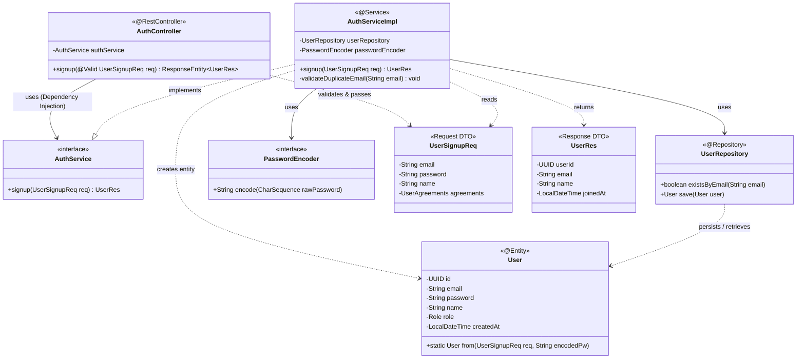

이전에 정의한 API 명세와 ERD를 바탕으로 설계된 **Spring Boot Class Diagram**입니다.

**Layered Architecture** 패턴을 따르며, 각 계층(Controller, Service, Repository)과 DTO 간의 의존 관계를 명확히 표현했습니다.

### 🧩 Class Diagram (Spring Boot Architecture)

### 🔍 구조 설명

1.  **AuthController (`@RestController`)**
    *   클라이언트의 JSON 요청을 `UserSignupReq` DTO로 매핑합니다.
    *   `@Valid`를 통해 DTO의 필드 유효성(이메일 형식, 비밀번호 길이 등)을 1차 검증합니다.
    *   검증에 통과하면 `AuthService`를 호출합니다.

2.  **AuthService (`@Service`)**
    *   **Interface(`AuthService`)**와 **Implementation(`AuthServiceImpl`)**을 분리하여 결합도를 낮춥니다.
    *   `@Transactional`: 회원 정보 저장과 프로필 생성 등이 하나의 트랜잭션으로 묶입니다.
    *   **주요 로직**:
        1.  `userRepository.existsByEmail()`로 중복 검사.
        2.  `passwordEncoder.encode()`로 비밀번호 암호화.
        3.  `User` 엔티티 생성 및 저장.
        4.  결과를 `UserRes` DTO로 변환하여 반환.

3.  **UserRepository (`@Repository`)**
    *   Spring Data JPA를 상속받아 기본적인 CRUD 메서드를 제공받습니다.
    *   이메일 중복 확인을 위한 `existsByEmail` 쿼리 메서드를 정의합니다.

4.  **DTO (`UserSignupReq`, `UserRes`)**
    *   **Request**: 비밀번호와 같은 민감 정보를 담고 있으며, Controller까지 도달합니다.
    *   **Response**: 클라이언트에게 필요한 최소한의 정보(ID, 이름, 가입일 등)만 담아 반환하며, 비밀번호는 절대 포함하지 않습니다.